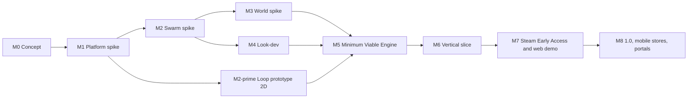

# Roadmap

The roadmap is ordered by **risk, not by subsystem**. The first milestones are spikes that try to kill the riskiest assumptions cheaply. A throwaway prototype of the game loop runs in parallel, so the design is validated before the engine is built for it.

Each milestone has measurable exit criteria. The numbers live in [BUDGETS.md](BUDGETS.md); the decisions each milestone validates are in [DECISIONS.md](DECISIONS.md).

**About the durations below.** They are indicative only. They assume **2–3 engineers + 1 artist**, with AI-assisted development. A solo developer should roughly double them. Scope, not dates, is the contract.

---

## Milestones

| Milestone | Goal | Indicative duration | Validates |
|---|---|---|---|
| **M0 Concept** | This doc set | Done | — |
| **M1 Platform spike** | Prove WebGPU-in-worker + shared memory on every target | ≤ 3 weeks | ADR-003, 004, 005, 007, 008, 009, 020 |
| **M2 Swarm spike** | Prove the GPU swarm at the ceiling caps, deterministically | 4–6 weeks | ADR-011, 012 (partly), 013 |
| **M2′ Loop prototype** | Prove the game loop is fun, in throwaway 2D | 3–4 weeks, in parallel with M2 | ADR-022, 023, pacing |
| **M3 World spike** | Prove voxels, collapse, navigation and generation within budget | 4–6 weeks | ADR-014, 015, 017 |
| **M4 Look-dev** | Lock the pixel-art look and the projection | 3–4 weeks, overlapping M3 | ADR-016, 018 |
| **M5 Minimum Viable Engine** | Integrate everything the slice needs | 6–8 weeks | ADR-010, 012 |
| **M6 Vertical slice** | Shippable-quality slice of the game | 8–12 weeks | Gates in BUDGETS |
| **M7 Steam Early Access + web demo** | Public launch on Steam with a web demo funnel | 3–5 months | ADR-021 |
| **M8 1.0 + mobile + portals** | Full content, iOS/Android store launch, portal builds | 4–6 months | ADR-005 (shipping) |

### M0 Concept

- **Deliverable:** the concept doc set: README, BUDGETS, GLOSSARY, DECISIONS, ROADMAP, VERTICAL-SLICE, 10 engine docs and 4 game docs.
- **Exit:** user approval of the direction.

### M1 Platform spike

- **Scope.** This is a throwaway harness, not the engine. It contains:
  - A boot page that runs the capability probes ([08](engine/08-platforms.md#tier-detection)).
  - An engine worker that renders with WebGPU through an OffscreenCanvas.
  - A shared heap plus job workers.
  - Both FrameDriver modes (worker rAF and main-thread ping).
  - A readback ring.
  - A device-loss test.
  - Asynchronous pipeline warm-up for about 50 representative pipelines.
  - An Electron shell (protocol + headers + switches).
  - An iOS host with the localhost server.
  - An Android TWA.
  - An Android WebView host.
- **Exit criteria:**
  - The [platform matrix](engine/08-platforms.md#platform-matrix) is filled in for every target row, on the [reference devices](BUDGETS.md#reference-devices).
  - Readback p95 is within the [latency targets](BUDGETS.md#latency-targets).
  - Device-loss recovery is demonstrated on desktop and iOS.
  - Pipeline warm-up is within [target](BUDGETS.md#download--load-targets).
  - `crossOriginIsolated === true` is confirmed in Electron, on iOS via localhost, and in the Android TWA.
- **Kill/pivot trigger:** iOS cannot become cross-origin isolated at all. We would ship iOS in the `transfer` tier and re-budget `mobile` accordingly.

### M2 Swarm spike

- **Scope:**
  - The GPU swarm v0: fodder, projectiles, pickups and the full pass chain ([05](engine/05-gpu-swarm.md#pass-chain)).
  - A static flow field.
  - CPU fire commands and area effects.
  - Counters, events and the readback ring.
  - The JS reference implementation.
  - Stress scenes.
- **Exit criteria:**
  - The [stress-ceiling targets](BUDGETS.md#stress-ceiling-scene-m2-exit) are met.
  - **Zero** event-buffer overflow.
  - GC p99 stays within [budget](BUDGETS.md#other-cpu-memory) over 10 minutes.
  - WGSL state hashes match the JS reference at small scale (L1).
- **Kill/pivot trigger:** mobile misses its target by more than 2×. We would cut the `mobile` caps and make the half-rate swarm the default.

### M2′ Loop prototype (throwaway)

- **Scope.** A Canvas2D, top-down 2D prototype of the SCRAPWAKE loop, built with no engine code. It covers:
  - roaming with ring spawns
  - the Forge and assaults
  - the Breacher Prime
  - Recall
  - six towers placed as blueprint ghosts
  - banked level-ups
  - scrap as both XP and currency
  - Shatter
- **Exit criteria:** at least 10 external playtesters, and:
  - Forge-time share within the KPI range ([GDD KPIs](game/01-gdd.md#kpis)).
  - At least 60 % of testers choose "one more run".
  - No dominant "turtle at the Forge" or "ignore the towers" strategy.
- **Kill/pivot trigger:** two failed iterations. We would rework the assault cadence, for example making assaults event-driven rather than timed.

### M3 World spike

- **Scope:**
  - Voxel storage.
  - Binary greedy meshing in workers.
  - Edits and damage.
  - Structural graphs, collapse and kinematic debris.
  - The base and player flow fields.
  - Procedural generation v0 for one district theme (Rust Docks).
- **Exit criteria:**
  - District generation, collapse end-to-end and the full field solve are within the [job budgets](BUDGETS.md#job-workers-asynchronous-work).
  - The heap stays within the [arena budgets](BUDGETS.md#shared-heap).
  - Generation is deterministic (a hash per seed).
- **Kill/pivot trigger:** collapse cannot be made reliable with structural graphs. We would limit destruction to non-structural carving plus scripted set-piece collapses.

### M4 Look-dev

- **Scope:**
  - The pixel pipeline v1 ([04](engine/04-pixel-art-pipeline.md)), comparing both projection candidates.
  - Snapping, outlines, toon shading, LUT, bloom and fog.
  - Occlusion handling.
  - The brickmap raymarch spike.
- **Exit criteria:**
  - Zero-crawl golden images on camera pans ([look-dev tests](engine/04-pixel-art-pipeline.md#look-dev-tests)).
  - Mobile post-processing within [budget](BUDGETS.md#stress-ceiling-scene-m2-exit).
  - Art sign-off: PATCH is readable at its target size, and 3–5k swarm units are readable.
  - The projection is decided (ADR-018 moves to Accepted), and so is the mesher (ADR-016).

### M5 Minimum Viable Engine

- **Scope:** everything listed in [VERTICAL-SLICE: Minimum Viable Engine](VERTICAL-SLICE.md#minimum-viable-engine), integrated and running on the web and in Electron.
- **Exit criteria:**
  - 10-minute replay hashes match: L1 in CI, and L2 on the device lab ([quality gates](BUDGETS.md#quality-gates)).
  - All three threading tiers work.
  - Boot and input-latency targets are met.
  - No long tasks during combat.
- **Pivot trigger:** cross-GPU (L2) determinism fails. We would switch co-op to plan B, host-authoritative ([09](engine/09-determinism-coop.md#co-op-model)).

### M6 Vertical slice

- **Scope:** the [slice content](VERTICAL-SLICE.md#content-scope) at shippable quality.
- **Exit criteria:**
  - The frame-time, crash-free and memory [quality gates](BUDGETS.md#quality-gates) are met on every reference device.
  - An external playtest with at least 30 players meets the [KPIs](game/01-gdd.md#kpis).
  - A private web demo build is available.
  - There is a technical proof on the iOS host and the Android TWA.

### M7 Steam Early Access + web demo

- **Scope:**
  - Content expansion toward 1.0: roughly 3 districts and 2 chassis.
  - Steam achievements, cloud saves and Deck Verified submission.
  - A public web demo (first district) on our site and itch.io.
  - A Steam Next Fest demo.
- **Exit:** EA launch, with the quality gates met.

### M8 1.0 + mobile + portals

- **Scope:**
  - The full 1.0 content ([GDD](game/01-gdd.md), [content](game/02-content.md)).
  - Localization.
  - iOS App Store and Google Play (TWA) launches.
  - Portal builds.
- **Exit:** 1.0 launch on every storefront, with the crash-free gate at the M8 level.

---

## Risk register

Likelihood and impact are rated **H**igh, **M**edium or **L**ow.

| ID | Risk | L | I | Mitigation | Proven or killed in | Exit metric / trigger |
|---|---|---|---|---|---|---|
| R1 | WebGPU-in-worker or shared memory is missing on some target (Safari rAF, iOS isolation, Android WebView) | M | H | FrameDriver ping; iOS localhost server; TWA; `transfer` tier | M1 | Platform matrix complete |
| R2 | The GPU swarm misses its budget on mobile | M | H | Packed SoA, half-rate swarm, per-tier caps, design load far below the ceiling | M2 | [Stress-ceiling targets](BUDGETS.md#stress-ceiling-scene-m2-exit) |
| R3 | Cross-GPU bit-exact determinism proves infeasible | M | M | Integer-only kernels, JS reference, hash matrix; co-op plan B | M5 | L2 hash matrix |
| R4 | Roaming vs defending isn't fun (turtling, or ignored towers) | M | H | Dome Keeper-style tension, Breacher Prime, Forge shield; the M2′ prototype | M2′ | [KPIs](game/01-gdd.md#kpis) |
| R5 | Destruction plus navigation blows the CPU budget | M | H | Structural graphs, bucketed wall costs, capped re-solve rate, remesh caps | M3 | [Job budgets](BUDGETS.md#job-workers-asynchronous-work) |
| R6 | Pixel crawl or poor readability of the 3D city | M | M | Pixel-exact projection, occlusion handling, no outlines on fodder | M4 | Crawl tests + art sign-off |
| R7 | Mobile thermal throttling or battery drain | H | M | Tiers, 30 fps mode, half-rate swarm, dynamic step-down | M1, M6 | Soak tests on reference phones |
| R8 | DOM UI jank during combat | M | M | [Combat HUD rules](engine/07-ui.md#combat-hud-rules), long-task watchdog, perf tests | M5 | Zero long tasks in combat |
| R9 | Electron GPU issues on Linux or Steam Deck | M | H | Per-OS switches, fallback switch set, pinned versions | M1, M7 | Deck Verified |
| R10 | Steam integration or overlay is fragile | M | L | FFI shim, overlay optional, Auto-Cloud without API calls | M7 | Achievements and cloud working on every OS |
| R11 | The JS CPU ceiling for actors is hit | L | M | Profile-driven parallelism; WASM SIMD kernels on the same heap | M5 | Sim tick within [budget](BUDGETS.md#engine-worker-per-frame) |
| R12 | Scope creep: engine + game from scratch | H | H | Vertical-slice discipline, game-driven engine work, cut list | Every milestone | Milestone exit on time ±25 % |
| R13 | Voxel content production is too slow | M | M | Prefab kits + procedural generation reuse, palette-locked MagicaVoxel pipeline | M3, M6 | Kit count per district |
| R14 | Store policy rejection (App Store 2.5.2, Play TWA) | L | H | Bundle all JS; verified TWA domain; early pre-submission review | M1, M8 | Accepted TestFlight / internal track build |
| R15 | A browser or Electron regression breaks a shipped build | M | M | Pinned versions, smoke tests after OS and browser updates, staged rollout | Ongoing | Smoke suite green |
| R16 | Web portals lack COOP/COEP (Safari gets no shared memory even on itch.io), have small payload caps (Poki's target is under 8 MB) or reject WebGPU-only games | H | L | `transfer` tier, a slim portal payload built on procedural assets, own site + itch.io as the main web channels | M1, M8 | Portal matrix and payload caps |
| R17 | Market saturation: Steam made "Bullet Heaven" an official tag in May 2026 | M | M | Differentiate on the unclaimed combination: destruction + in-run base/towers + body-as-loadout; test with the demo funnel | M6, M7 | Wishlist conversion from the demo |
| R18 | Console demand: most survivors-like hits sell heavily on consoles, but our web stack can't run there | M | M | Keep the simulation and rendering code free of DOM and browser assumptions outside `platform/` and `ui/`. Evaluate a native host (JS runtime + Dawn + native UI) only after 1.0 revenue data. | Post-1.0 | Go/no-go decision after 1.0 |

## Cut list

If a milestone slips, cut in this order. The first items hurt least.

1. Brickmap raymarch spike (keep the mesher).
2. Android WebView fallback host (TWA only).
3. Music stems reduced from 4 to 2 layers.
4. Heat tiers and daily seed moved to post-EA.
5. Hive Queen boss and the Blackout event moved to 1.0.
6. Mortar terrain damage limited to non-structural carving.
7. Portal builds (keep our site and itch.io).

Never cut:
- the Forge + assault loop
- body-as-loadout
- destruction as a resource
- the combat HUD rules
- determinism tests

## Open questions

- Team size and budget. These change the durations, not the order.
- Is a publisher or an Early Access-first launch preferable? This affects the M7 scope.
- Is a console port ever in scope? It would need a native UI and GPU backend (see [ADR-006](DECISIONS.md#adr-006-real-htmlcss-ui)), so it is post-1.0 at the earliest.
