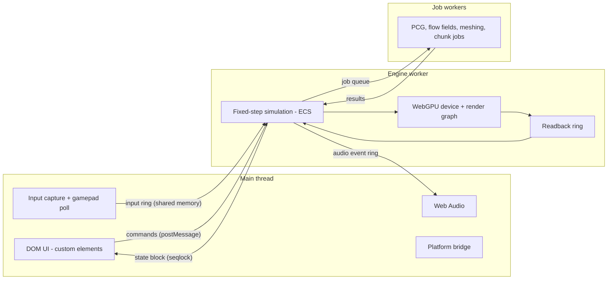
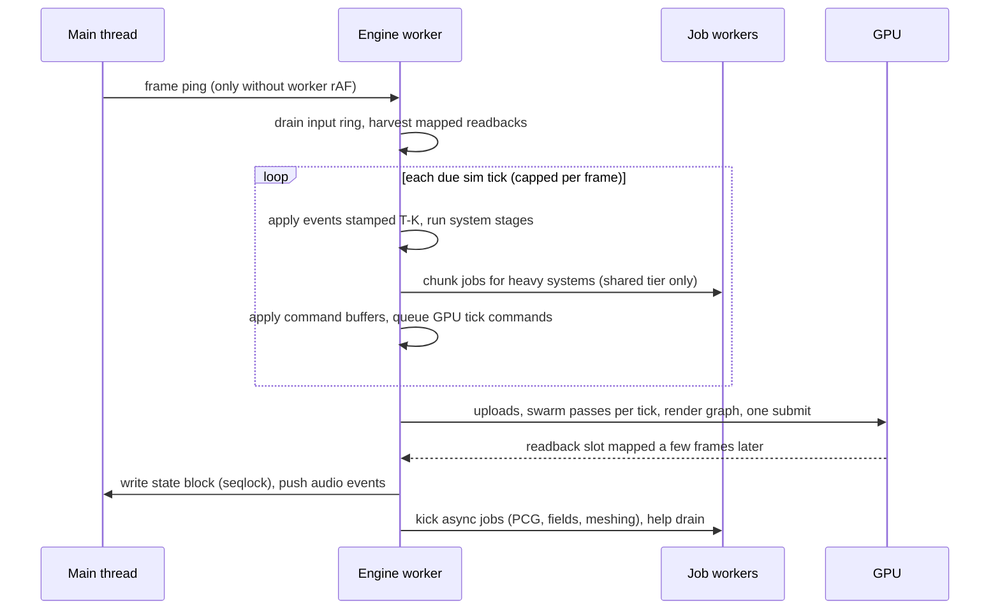

# Prophet Engine: Overview

Prophet is a from-scratch 3D game engine written in **pure, class-based JavaScript**. It runs on **WebGPU**, uses **Web Workers** for multithreading, and draws its UI with **real HTML/CSS**. One web build ships to desktop browsers and, through Electron, to Windows, macOS, Linux and the Steam Deck. The first game built on it is **SCRAPWAKE** ([GDD](../game/01-gdd.md)).

The other engine docs cover one subsystem each:

| Doc | Topic |
|---|---|
| [02-core-ecs-jobs](02-core-ecs-jobs.md) | Heap, ECS, scheduler, job system, threading tiers |
| [03-rendering](03-rendering.md) | WebGPU device, render graph, GPU-driven rendering, lighting, readbacks |
| [04-pixel-art-pipeline](04-pixel-art-pipeline.md) | Projection, resolution, snapping, outlines, grading |
| [05-gpu-swarm](05-gpu-swarm.md) | The GPU-resident swarm and the CPU↔GPU contract |
| [06-world](06-world.md) | Voxels, destruction, collision, navigation, procedural generation |
| [07-ui](07-ui.md) | DOM UI architecture, state bridge, CSS system, input, accessibility |
| [08-platforms](08-platforms.md) | Web, Electron, Steam, saves, tier detection |
| [09-determinism-coop](09-determinism-coop.md) | Integer simulation, RNG, replays, co-op model |
| [10-tooling-testing](10-tooling-testing.md) | Dev server, build, asset pipeline, dev tools, tests, CI |

All numbers live in [BUDGETS.md](../BUDGETS.md). Decisions and their rationale live in [DECISIONS.md](../DECISIONS.md). Terms are defined in the [GLOSSARY](../GLOSSARY.md).

---

## Goals

1. **Performance first.** Work that is massively parallel runs as WebGPU compute. CPU work is data-oriented, and it is multithreaded wherever that measurably pays off.
2. **One build, every platform.** The web platform is the portability layer, covering desktop browsers and Electron ([ADR-004](../DECISIONS.md#adr-004-one-web-build-electron-for-desktop), [ADR-024](../DECISIONS.md#adr-024-desktop-and-web-only)).
3. **Own the stack.** Zero runtime dependencies ([ADR-002](../DECISIONS.md#adr-002-zero-runtime-dependencies)).
4. **Fast iteration.** No build step in development. WGSL, CSS and data hot-reload, and every UI is real HTML/CSS in the browser DevTools.
5. **Deterministic by construction.** The simulation is integer-only, so replays, bug reproduction and future co-op all work ([ADR-012](../DECISIONS.md#adr-012-integer-deterministic-simulation)).

## Non-goals (for now)

- A general-purpose editor à la Unity or Godot. In-game dev tools and data files are enough for one game.
- A WebGL fallback, consoles or VR ([ADR-003](../DECISIONS.md#adr-003-webgpu-only)).
- Mobile: iOS and Android apps, mobile browsers and touch UI wait until after 1.0 ([ADR-024](../DECISIONS.md#adr-024-desktop-and-web-only)).
- Photorealistic PBR, skeletal skinning or cloth. Characters are rigid voxel parts with procedural animation.
- Networking. The design is co-op-*ready* ([09-determinism-coop](09-determinism-coop.md)), but no netcode ships in v1.
- A scripting language. Game code is plain JS modules.

## Game requirements served

Each engine feature exists because SCRAPWAKE needs it. When a feature has no row in this table, it waits.

| Game need | Engine feature | Doc |
|---|---|---|
| Thousands of on-screen enemies, projectiles and pickups | GPU swarm with a tick-stamped CPU↔GPU contract | [05](05-gpu-swarm.md) |
| Fully destructible neon city | Voxel world, structural graphs, kinematic debris, voxel particles | [06](06-world.md) |
| Base building and tower defence | Flow fields with wall costs, build grid, towers as actors, targeting on the GPU | [05](05-gpu-swarm.md), [06](06-world.md) |
| Robot that visibly assembles itself | Part-socket rendering, procedural animation, 16-direction facing | [03](03-rendering.md), [04](04-pixel-art-pipeline.md) |
| Stylized 3D pixel art with neon | Pixel-exact projection, toon ramps, outlines, LUT, clustered lights, pixel bloom | [04](04-pixel-art-pipeline.md), [03](03-rendering.md) |
| Modern neon UI on every device | DOM UI with custom elements, seqlocked state bridge, keyboard, mouse and gamepad input | [07](07-ui.md) |
| Sell on Steam, with a web demo and portals | Platform layer, tier detection, saves, Steam shim | [08](08-platforms.md) |
| Procedural roguelite districts | Seeded, deterministic, worker-parallel generation | [06](06-world.md#procedural-generation) |
| Co-op later without a rewrite | Integer lockstep-capable simulation, command-driven input | [09](09-determinism-coop.md) |

## Principles

1. **Classes for structure, typed arrays for data.** Engine services, systems, render passes and UI elements are classes. Hot state lives in structure-of-arrays (SoA) columns in one shared heap, never in per-entity objects.
2. **The GPU does the heavy lifting.** If something happens to 10,000 things per tick, it is a compute pass.
3. **Threads only where they pay.** The scheduler *can* parallelize anything; it *does* so only when profiling says so ([ADR-010](../DECISIONS.md#adr-010-archetype-ecs-with-profile-driven-parallelism)).
4. **Budgets over hopes.** Every subsystem has a per-frame CPU, GPU and memory budget in [BUDGETS.md](../BUDGETS.md), and CI measures it.
5. **Game-driven engine development.** Features are built when the vertical slice needs them ([VERTICAL-SLICE.md](../VERTICAL-SLICE.md)).
6. **Determinism by construction.** The simulation is integers-only; floats are for pixels.
7. **Fail soft, degrade gracefully.** Every capability has a fallback: threading tiers, optional GPU features, device-loss recovery.

---

## Runtime topology



| Thread | Owns | Never does | Talks via |
|---|---|---|---|
| **Main** | DOM, CSS, input events, Gamepad API polling, `AudioContext`, platform bridge (Electron preload) | Simulation, WebGPU calls, blocking waits | Input ring and state block (shared memory), `postMessage` for commands and events |
| **Engine worker** | Fixed-step sim, ECS, voxel authority, the WebGPU device (via OffscreenCanvas), render graph, readback ring | Blocking waits. It helps drain jobs, then yields to its event loop. | Everything above, plus the job queue |
| **Job workers** | Stateless kernels over heap regions or transferred buffers | DOM, WebGPU, owning state | Shared-memory job queue with `Atomics.wait/notify`, or transferables in the `transfer` tier |

**FrameDriver.**
- Where a worker has `requestAnimationFrame` (Chrome, Firefox), the engine worker drives itself.
- Otherwise (Safari), the main thread's rAF pings the engine through `Atomics.notify` on a shared word, which the engine awaits with `Atomics.waitAsync`. Without shared memory it falls back to a `postMessage` ping.

**Fallbacks.**
- If WebGPU is unavailable in workers, the same engine classes run on the main thread (the "main-thread host"). UI and sim then share a thread, and the combat HUD rules become mandatory rather than advisory.
- Threading tiers (`shared`, `transfer`, `inline`) are chosen at startup ([02-core-ecs-jobs](02-core-ecs-jobs.md#threading-tiers)).

## Frame pipeline

The engine worker runs one iteration of this pipeline per rendered frame:



1. **Drive.** The FrameDriver fires, and the engine accumulates real time.
2. **Input.** Drain the input ring into *input commands* stamped with the tick they apply to (see [09](09-determinism-coop.md#input-as-commands)).
3. **Harvest.** Collect readback slots whose `mapAsync` resolved. Queue their events by tick.
4. **Simulate.** Run each due fixed tick, up to the per-frame cap in [BUDGETS.md](../BUDGETS.md#simulation-constants). Each tick does four things:
   1. Apply the GPU events stamped *T−K*, stalling if they are late.
   2. Run the system stages.
   3. Apply the command buffers.
   4. Append the tick's *GPU commands* (spawns, area effects, fire commands, actor proxies) to the upload staging.
5. **Extract.** Compute the interpolation alpha. Write actor render instances, then the UI state block (seqlock), then audio events.
6. **Encode and submit.** One command encoder per frame:
   1. uploads
   2. swarm passes for each simulated tick
   3. culling
   4. light binning
   5. shadow map
   6. scene
   7. particles
   8. post-processing
   9. upscale
   10. world-space UI
   11. copies into the readback slot, one block per simulated tick

   Then one `queue.submit`, followed by `mapAsync` on the slot.
7. **Background.** Kick async jobs, help drain the job queue until the frame budget is spent, then yield.

**Frames in flight.** The engine never runs more than [two frames](../BUDGETS.md#simulation-constants) of GPU work ahead. `queue.onSubmittedWorkDone()` counts finished frames; a frame that finds two still in flight does no ticks and no GPU work. On a slow GPU the game slows down instead of queueing work without bound, and readback latency stays bounded.

When the frame budget is exceeded, the engine first drops optional work in this order: async job help, then particle emission, then remeshes (it defers them). Only after that does it reduce simulation ticks, which slows game time down; it never skips ticks.

---

## Repository layout (proposed)

The layout that M1 started to fill. Directories for later milestones are still proposals.

```
prophet/
├── engine/                 # Prophet: pure JS ES modules, zero runtime deps
│   ├── core/               # heap + arenas, fixed-point math, float render math, RNG, pools, log, FrameDriver
│   ├── ecs/                # World, Component, System, archetypes, queries, scheduler, command buffers
│   ├── jobs/               # worker pool, shared job queue, transfer-tier dispatcher, kernels registry
│   ├── gpu/                # device, limits/features, render graph, pipeline cache, WGSL preprocessor, readback ring
│   ├── render/             # passes: voxel, mesh, swarm draw, particles, lights, shadow, post, world-UI
│   ├── swarm/              # GPU swarm orchestration + WGSL kernels
│   ├── world/              # voxel storage, edits, structural graphs, debris, collision
│   ├── nav/                # nav grid, flow fields
│   ├── pcg/                # generator framework, noise, grammars, prefab assembly
│   ├── audio/              # buses, voices, music stems (main-thread side + event ring)
│   ├── input/              # action maps, devices
│   ├── ui/                 # UI runtime: signals, UiElement base class, state-block reader, bridge
│   ├── assets/             # manifest, loaders, .vox parser, hot reload
│   ├── platform/           # web / electron adapters (probes, tiers, worker URLs, storage, lifecycle)
│   └── app/                # hosts: main-thread host, engine-worker host, headless SimCore
├── game/                   # SCRAPWAKE
│   ├── app/                # the only entry points: main, engine worker, job worker
│   ├── components/         # component classes (static schemas)
│   ├── systems/sim/        # deterministic simulation systems (integer-only, linted)
│   ├── systems/view/       # render/extract-only systems (floats allowed)
│   ├── shaders/sim/        # WGSL simulation kernels (integer-only, linted)
│   ├── shaders/render/     # WGSL render and post shaders
│   └── pcg/  data/  ui/  assets/
├── platforms/
│   └── electron/           # main.js, preload.cjs, app:// protocol, GPU switches, builder config, Steam shim
├── tools/                  # dev server, sim lint, build, generators, asset cooker
├── tests/                  # unit (node:test), browser (Playwright), electron, perf, replay hashes
└── docs/
```

**The engine/game boundary.**
- `engine/` never imports from `game/`.
- The game registers its components, systems, passes, UI elements and data through the engine's public classes.
- A second game should need no engine changes to start.

---

## JavaScript conventions

- **Modules:** ES modules only. Every file starts with `// @ts-check`, and public APIs carry JSDoc types. Development loads the modules natively, workers included; release builds bundle one file per role ([ADR-025](../DECISIONS.md#adr-025-worker-build-scheme-and-tool-pins)).
- **Files and classes:** one primary class per file, with the file named after the class in kebab-case.
- **Naming:**
  - `PascalCase` for classes.
  - `camelCase` for members.
  - `SCREAMING_SNAKE` for constants.
  - `#private` for private fields.
- **Classes:** composition over inheritance. Inheritance is reserved for a handful of engine base classes (`Component`, `System`, `RenderPass`, `Job`, `UiElement`). Lifecycle methods are `init(ctx)`, `run(...)` / `update(...)` and `dispose()`.
- **Assertions:** dev builds assert invariants with `DEV && assert(...)`. esbuild `define`s `DEV` to `false` in release, which strips the checks.
- **Errors:** a subsystem failure surfaces as a typed event, such as `device-lost`, `heap-arena-exhausted` or `job-failed`. Each typed event has a documented recovery path. Nothing is swallowed silently.

A system, as it will look in practice:

```js
// @ts-check
import { System } from '../../engine/ecs/system.js';
import { Position, Velocity } from '../components/motion.js';

/** Integrates velocity into position. Q10 fixed-point, integers only. */
export class MoveSystem extends System {
  static reads = [Velocity];
  static writes = [Position];

  /** @param {import('../../engine/ecs/chunk-view.js').ChunkView} c */
  run(c) {
    const I32 = this.heap.i32;                 // global view, created once per thread
    const px = c.col(Position.x), py = c.col(Position.y);
    const vx = c.col(Velocity.x), vy = c.col(Velocity.y);
    for (let i = 0, n = c.count; i < n; i++) {
      I32[px + i] = (I32[px + i] + I32[vx + i]) | 0;
      I32[py + i] = (I32[py + i] + I32[vy + i]) | 0;
    }
  }
}
```

### Hot-path rules

These rules apply to per-tick and per-frame code. Code review checks them, and a lint rule enforces them wherever it can.

1. **No allocation.** Hot paths may not use:
   - object or array literals
   - closures
   - spread
   - iterator protocols such as `for...of` over arrays
   - `map`, `filter` or `forEach`
   - string building

   Use preallocated typed arrays, pools and scratch registers instead.
2. **Monomorphic shapes.** Initialize every field in the constructor, in the same order, and never `delete`. Inner loops switch on small integer kinds rather than calling methods polymorphically.
3. **Integer math in the simulation.** Use `| 0`, `>>> 0`, `Math.imul`, and the fixed-point helpers from `engine/core/fixed.js`. `Math.sin`, `Math.pow` and friends are banned in sim code ([09](09-determinism-coop.md)); they are fine in rendering.
4. **Offsets, not views.** Index into the global heap views (`heap.i32`, `heap.f32`, `heap.u8`) with computed offsets. Never create `subarray` views per frame.
5. **WebGPU hygiene:**
   - Reuse descriptor objects.
   - Cache bind groups.
   - Call `writeBuffer` with offsets.
   - Create every pipeline asynchronously at load time.
   - Never create GPU resources mid-run, except from pools.
6. **Measure everything.** Every system, job and pass has a named timer, shown in the perf overlay and asserted in CI ([10](10-tooling-testing.md)).

---

## Dependency policy

([ADR-002](../DECISIONS.md#adr-002-zero-runtime-dependencies))

| Category | Allowed | Examples |
|---|---|---|
| Engine and game runtime | **Nothing external** | — |
| Dev tooling | Small and replaceable; versions pinned in [ADR-025](../DECISIONS.md#adr-025-worker-build-scheme-and-tool-pins) | `esbuild` (bundling/minifying), `typescript` (checkJs only), `@webgpu/types` (type declarations), `@playwright/test` |
| Packaging | Per platform | `electron`, `electron-builder` |
| Platform edge (`platforms/`) | Isolated behind an interface | Steam FFI shim |
| Content tools | External apps, not code | MagicaVoxel for voxel models, a DAW for audio, font tools |

Adding anything to the runtime requires a new ADR.

## Open questions

- Should the engine expose a tiny plugin API for platform features (rumble, achievements), or keep one adapter class per platform? This is decided in M5.
- How much of the "main-thread host" fallback do we keep once the M1 matrix shows where it is actually needed?
