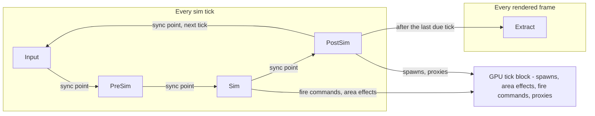
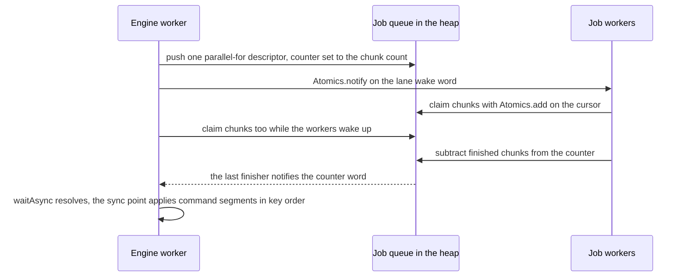

# Core: Heap, ECS, Scheduler, Jobs

Prophet's CPU core has four parts that share one rule: **hot data lives in one fixed-size heap and is addressed by integer offsets**. The heap is carved into arenas at boot. The archetype ECS keeps its components there in SoA chunks. A stage scheduler runs systems in a deterministic order, on the sim thread by default and chunk-parallel only where profiling says it pays. A job system runs pure kernels over heap regions, with or without shared memory. The GPU half of the simulation is in [05-gpu-swarm](05-gpu-swarm.md). The arithmetic and ordering rules that make both halves reproducible are in [09-determinism-coop](09-determinism-coop.md).

## Goals

1. **Zero steady-state allocation.** All hot state lives in the heap, and per-tick code allocates nothing, so GC pauses stay within [budget](../BUDGETS.md#other-cpu-memory).
2. **One ECS API, two execution modes.** A system runs serially on the engine worker or split into chunk jobs, with bit-identical results ([ADR-010](../DECISIONS.md#adr-010-archetype-ecs-with-profile-driven-parallelism)).
3. **The engine worker never blocks.** Heavy asynchronous work (PCG, flow fields, meshing, connectivity) runs on job workers.
4. **One kernel, every tier.** The same job kernel runs in the `shared`, `transfer` and `inline` threading tiers ([ADR-008](../DECISIONS.md#adr-008-threading-tiers)).
5. **Fail loudly, recover predictably.** Every arena has an exhaustion policy, and every failure is a typed event ([conventions](01-overview.md#javascript-conventions)).

## Non-goals

- A general-purpose ECS. There are no runtime-defined schemas, no reflection queries, no relationship graphs beyond `entity`-typed fields, and no transform hierarchy.
- Work stealing, fibers or preemption. Jobs run to completion, and long work is sliced.
- Growing memory at runtime ([ADR-009](../DECISIONS.md#adr-009-fixed-size-shared-heap)).
- Parallel by default. Most systems stay serial on purpose.
- Floats in simulation components ([ADR-012](../DECISIONS.md#adr-012-integer-deterministic-simulation)).

## Game requirements served

| Game need | Core feature |
|---|---|
| PATCH, towers, specialists, bosses, caches and the director update every tick within budget | Archetype SoA chunks; serial by default, chunk jobs past the threshold |
| A new district is ready moments after the player picks a Cycle; walls reshape paths; buildings collapse | PCG, flow-field and connectivity kernels on job workers, committed at fixed ticks |
| No hitches during a whole Cycle | Fixed heap, arena allocators, no per-frame garbage |
| Replays, bug reproduction, co-op later | Deterministic system order and command application; integer schemas |
| Web portals without cross-origin isolation (e.g. Safari on itch.io) have no shared memory | The `transfer` tier runs the same kernels on copies |

---

## Memory: heap and arenas

### One fixed heap

- The heap is one `WebAssembly.Memory`, created at boot with `initial` = `maximum` (in 64 KiB pages) and sized per performance tier ([BUDGETS: shared heap](../BUDGETS.md#shared-heap)). It is **never grown** ([ADR-009](../DECISIONS.md#adr-009-fixed-size-shared-heap)): growing detaches non-shared views and leaves stale-length views in other workers, and large `maximum` reservations can fail on memory-constrained devices.
- It is `shared: true` only when the page is cross-origin isolated (the `shared` tier); otherwise it is private to the engine worker. A `WebAssembly.Memory`, rather than a bare `SharedArrayBuffer`, lets WASM SIMD kernels later run on the same bytes with no copies.
- Offset 0 holds the **heap header**: a magic number and layout version, the manifest hash, the arena table (offset, size and allocator kind per arena), the layout epoch, and a few global atomic words (current tick, lane wake words).

### Arenas and allocators

| Arena ([sizes](../BUDGETS.md#shared-heap)) | Allocator | Holds | When exhausted |
|---|---|---|---|
| ECS | Fixed-size **pool + free list** for ECS chunks; **slabs** for the entity location table and the layout table | Component data, entity index, archetype and column tables | Sized for the [ECS entity capacity](../BUDGETS.md#entity-caps) plus fragmentation headroom; a `spawn` beyond the capacity is refused at apply time. If a structural command still needs a chunk that doesn't exist, it fails with `heap-arena-exhausted`. Dev builds assert. |
| Voxel world | **Pool + free list** of dense voxel-chunk slots; an append log for deltas | Chunk table, dense voxel chunks, delta log | The policy belongs to [06-world](06-world.md#voxel-storage); the allocator only reports the event. |
| Navigation | **Static layout**, sized from the district at run start | Cost grid, the two double-buffered fields | Cannot run out |
| Jobs, command buffers, event rings, state blocks | **Rings**: job lanes, event channels, per-thread command buffers (drained at every sync point), the input ring and the audio ring. **Slabs** for the state block and completion counters. | Everything that crosses threads | A full command or event ring takes a spill page from the reserve and logs a perf warning. A full job lane makes the producer help drain it. |
| Procedural-generation scratch | **Bump (linear)** per job slice; reset after each slice and wholesale after generation | Noise, grammar and prefab-assembly temporaries | The slice fails with `job-failed`. Scratch is sized for the largest slice, so this is a bug (dev assert). |
| Asset staging | **Ring** of decode and upload buffers | Decoded assets waiting for `writeBuffer` | The producer waits, asynchronously, until the GPU queue frees space |
| Reserve | **Pages**, handed out on demand | Spill pages; headroom for re-tuning arena sizes between milestones | Every use is logged. A scripted CI run that touches the reserve fails. |

### Views, offsets and alignment

- Every thread creates the global views once: `heap.i32`, `heap.u32`, `heap.f32`, `heap.u8` and `heap.u16`, all over the same buffer.
- References are **byte offsets stored as integers**. Code converts an offset once per ECS chunk (for example `off >> 2` for 32-bit fields) and indexes the global view. Hot paths never call `subarray()`, never use `DataView`, and never create per-entity objects ([hot-path rules](01-overview.md#hot-path-rules)).
- Arenas start on 64-byte boundaries (one cache line), and atomic words written by different threads sit on separate lines, to avoid false sharing. ECS columns are 16-byte aligned, ready for SIMD kernels.

### Layout table and epoch

- The **layout table** lives in the ECS arena. It holds one record per archetype (signature bitset, component list, row size, row capacity, column offsets), every ECS chunk header, and each archetype's ordered chunk list.
- Only the engine worker writes it, and only at a sync point, when no job is running. Every change increments the **layout epoch** with `Atomics.add`.
- Job workers keep JS-side caches: query → archetype lists, and column offset tables. At the start of a job they compare their cached epoch with the heap's and rebuild the caches if it moved. Layout changes happen only between jobs, so a job never sees a half-written table.

### Component manifest

- `tools/gen-manifest.js` ([asset pipeline](10-tooling-testing.md#asset-pipeline)) collects every component class, sorts the classes by their explicit `static key` string, assigns IDs in that order, and hashes the keys together with each canonical schema. It never uses `Class.name`, which minification renames ([ADR-025](../DECISIONS.md#adr-025-worker-build-scheme-and-tool-pins)). The same generator numbers systems, event types, kernels and RNG streams.
- The engine worker writes the manifest hash into the heap header. Each job worker compares it with the manifest it imported, and **refuses to run on a mismatch** (`manifest-mismatch`). The usual cause is a stale cached worker bundle.
- IDs are stable within one build only. Saves serialize components by key, and replays carry the build hash ([09](09-determinism-coop.md#replays-and-hashes)), so raw IDs never leave the process.

---

## ECS

### Entities

An entity is a `u32` handle: an index in the low bits and a generation in the high bits. The index width follows the ECS entity capacity in [BUDGETS](../BUDGETS.md#entity-caps); e.g. at a capacity of 65,536, bits 0–15 are the index and bits 16–31 the generation.

- The **entity location table** (SoA, in the ECS arena) stores per index: generation, archetype ID, ECS chunk slot and row.
- Handle 0 is null, because generations start at 1. A handle is alive only while its generation matches the table.
- Despawning bumps the generation and appends the index to a FIFO free list. Indices are only handed out while command buffers are applied, in a deterministic order ([below](#command-buffers-and-events)), so the same run always produces the same handles.

### Components

| Kind | Declared with | Storage | Rules |
|---|---|---|---|
| Data | `static schema = { field: type }` | One SoA column per field | Types: `i32`, `u32`, `u16`, `u8`, `entity` (a `u32` handle) |
| Tag | An empty `schema` | None; it only sets an archetype bit | — |
| Render-only | `static renderOnly = true` | Column | The only place `f32` is allowed. Sim systems may not declare it in `reads` or `writes`; the scheduler rejects them at boot. |
| Managed | `static managed = true` | A plain JS object per entity, in a JS array on the engine worker | Sim thread only; any system that touches one is forced serial. It must implement `serialize()`, which feeds checkpoints and state hashes, and hold only integers and strings. |

```js
// @ts-check
import { Component } from '../../engine/ecs/component.js';

/** Sim data: integers only. HP in Q8 fixed point. */
export class Health extends Component {
  static schema = { hp: 'i32', max: 'i32' };
}

/** Tag: no fields, only archetype membership. */
export class Hostile extends Component {
  static schema = {};
}

/** Render-only: f32 is allowed because no sim system may read it. */
export class HitFlash extends Component {
  static schema = { t: 'f32' };
  static renderOnly = true;
}

/** Managed: one plain object per entity, sim thread only, never chunk-parallel. */
export class LoadoutSheet extends Component {
  static managed = true;
  /** @param {object} sheet @param {import('../../engine/core/writer.js').Writer} w */
  static serialize(sheet, w) { /* integers and strings only */ }
}
```

At startup the registry installs **field handles** such as `Health.hp` from the manifest. A field handle is a small integer that encodes the component ID and the field index. The manifest generator also emits JSDoc declarations for them, so `tsc --checkJs` knows they exist.

### Archetype chunks

- An **ECS chunk** is a fixed-size block from the ECS pool (for example 16 KiB, tuned in M5). Every entity in it has the same archetype.
- Row capacity per archetype is `floor((chunkBytes - headerBytes) / rowBytes)`. The columns follow the header, one per field, each 16-byte aligned.
- The header is self-describing, so a kernel needs only the chunk's offset:

| Header field | Type | Purpose |
|---|---|---|
| Archetype ID | `u16` | Which layout this chunk uses |
| Count, capacity | `u16`, `u16` | Live rows and maximum rows |
| Sequence | `u32` | Creation order within the archetype; this is the deterministic iteration key |
| Column offsets | `u32` per column | Byte offset of each column from the chunk base |
| Change ticks | `u32` per column | The last tick on which a system with write access visited this column |

- Adding or removing a component moves the row into a chunk of another archetype. This happens only at a sync point. Removal swaps the last row into the hole and patches the moved entity's location.
- An empty ECS chunk goes back to the pool. The archetype's chunk list keeps the order of the remaining chunks.

### Queries

- A query is `{ all, none, any, changed }` over component classes. It is compiled into bitset signatures over component IDs.
- Each query caches its matching archetypes. Archetypes are never destroyed, so when the epoch changes the cache only appends new matches.
- **Change detection** works per ECS chunk and per column. `changed: [Health]` skips a chunk whose `Health` change tick is not newer than the system's last run. Visiting a chunk with write access bumps the tick whether or not a row actually changed, which is cheap and conservative.
- **Iteration order** is fixed: archetype ID, then chunk sequence, then row. It never follows pool slots or addresses ([09](09-determinism-coop.md#rules-for-sim-code)).

A system with a query, and spawning through the command buffer:

```js
// @ts-check
import { System } from '../../engine/ecs/system.js';
import { Health, Hostile, Transform, Wreck } from '../components/index.js';
import { DamageApplySystem } from './damage-apply-system.js';

/** Despawns dead enemies and leaves a wreck. Runs serially or chunk-parallel, unchanged. */
export class DeathSystem extends System {
  static stage = 'PostSim';
  static reads = [Health, Transform];
  static writes = [];                      // structural changes go through the command buffer
  static after = [DamageApplySystem];
  static query = { all: [Health, Transform, Hostile], changed: [Health] };

  /**
   * @param {import('../../engine/ecs/chunk-view.js').ChunkView} c
   * @param {import('../../engine/ecs/command-buffer.js').CommandBuffer} cmd  this job's segment
   */
  run(c, cmd) {
    const I32 = this.heap.i32;
    const hp = c.col(Health.hp), x = c.col(Transform.x), y = c.col(Transform.y);
    for (let i = 0, n = c.count; i < n; i++) {
      if (I32[hp + i] > 0) continue;
      cmd.despawn(c.entity(i));
      const w = cmd.spawn(Wreck.archetype);  // provisional handle; the real one is assigned at apply time
      cmd.setI32(w, Transform.x, I32[x + i]);
      cmd.setI32(w, Transform.y, I32[y + i]);
    }
  }
}
```

Creating the world on the engine worker:

```js
// @ts-check
import { Heap } from '../../engine/core/heap.js';
import { World } from '../../engine/ecs/world.js';
import { Scheduler } from '../../engine/ecs/scheduler.js';
import { MANIFEST } from '../generated/manifest.js';

/** Engine-worker bootstrap (excerpt). */
export class SimBoot {
  /** @param {import('../../engine/platform/tiers.js').TierInfo} tier */
  static async start(tier) {
    const heap = Heap.create(tier.heapProfile, tier.threading);  // fixed Memory; arenas carved once
    const world = new World(heap, MANIFEST);         // writes the manifest hash into the heap header
    const scheduler = new Scheduler(world, tier);    // stages and DAG from static declarations
    scheduler.addAll(MANIFEST.systems);              // in system-ID order
    await scheduler.startWorkers(tier.jobWorkers);   // every worker verifies the manifest hash
    return scheduler;
  }
}
```

---

## Scheduler

Systems are grouped into stages. `Input`, `PreSim`, `Sim` and `PostSim` run once per sim tick. `Extract` runs once per rendered frame, after the last due tick ([frame pipeline](01-overview.md#frame-pipeline)).

| Stage | Typical work |
|---|---|
| `Input` | Apply this tick's input commands; decode the swarm block stamped *T−K* into event channels ([05](05-gpu-swarm.md#k-latency-and-stalls)); commit the async results due this tick ([09](09-determinism-coop.md#async-results-at-fixed-ticks)) |
| `PreSim` | Director, AI intents, cooldowns, level-up offers |
| `Sim` | Actor movement and collision, weapons and towers (fire commands, area effects), building, damage |
| `PostSim` | Deaths, economy, voxel edits, actor proxies for the GPU, checkpoint bookkeeping |
| `Extract` | Render instances, the UI state block, audio events. Render-only data; floats are allowed. |

**Declarations.** A system class declares static fields: `stage`; `reads` and `writes` (component classes it reads, or writes in place on the current row only); `readsEvents` and `writesEvents`; `after` and `before` (explicit ordering); `query`; and `parallel`, which is `'auto'` (the default), `'serial'` or `'chunks'` ([policy](#parallelism-policy)).

**Building the DAG.** This happens once at boot, per stage:
1. Add every explicit `after` and `before` edge. A cycle is a boot error that names the systems involved.
2. The **serial order** is a topological sort that always takes the ready system with the **lowest system ID** (Kahn's algorithm with a min-heap). System IDs come from the manifest, so the order is identical on every machine.
3. Two systems **conflict** when one writes a component or event type that the other reads or writes. Every conflicting pair gets an edge in serial order. Because that order is total, these edges can't create a cycle, and any concurrent schedule that respects them matches the serial run. Dev builds warn about conflicting pairs that have no explicit order, so authors make the intent explicit.

**Sync points.** Between stages, the engine worker applies the command buffers, sorts multi-writer event channels, and bumps the layout epoch if archetypes or chunk lists changed.



**Serial and parallel runs give identical results**, because:
- a system writes in place only to the current row of the ECS chunk it is iterating, and only to components in `writes`;
- every other write (to other entities, or a structural change) goes through a command buffer or an event channel, and both are merged in a fixed key order ([below](#command-buffers-and-events));
- the DAG guarantees that systems running at the same time never conflict;
- systems keep no mutable state in their instances, apart from per-thread scratch.

The execution mode changes *where* code runs, never *what* it computes. Tests hold the scheduler to this ([Testing](#testing)).

## Parallelism policy

The scheduler *can* split any system that iterates ECS chunks. It *does* so only where it pays ([ADR-010](../DECISIONS.md#adr-010-archetype-ecs-with-profile-driven-parallelism)).

| Work | Where it runs |
|---|---|
| A system under the [parallelism threshold](../BUDGETS.md#engine-worker-per-frame) | Serially on the engine worker (the sim thread). This is the default. |
| A system over the threshold, in the `shared` tier | Split into ECS chunk jobs on the frame-critical lane. The engine worker claims chunks too. |
| A system that touches managed components, is flagged `parallel = 'serial'`, or runs in the `transfer` or `inline` tier | Always serial |
| Async work: PCG, flow fields, meshing, connectivity | Always on job workers (in every tier except `inline`). Results that affect the sim commit at fixed ticks ([09](09-determinism-coop.md#async-results-at-fixed-ticks)). |

**Why serial is the default:**
- Waking a sleeping thread costs tens to hundreds of µs ([ADR-010](../DECISIONS.md#adr-010-archetype-ecs-with-profile-driven-parallelism)). Fork/join around a system that takes, e.g., 0.1 ms is a net loss.
- CPU actor counts are small, because fodder, projectiles and pickups live on the GPU ([ADR-011](../DECISIONS.md#adr-011-two-tier-simulation)). Most systems iterate a few hundred rows.

**How a system becomes parallel:**
1. Dev builds time every system (a moving average per performance tier) and show the numbers in the perf overlay.
2. A system that stays over the threshold, and spans enough ECS chunks to feed the workers, gets a suggestion in the overlay and in a per-tier **profile table**, a dev artifact checked into the repo.
3. Release builds read the profile table at boot. `parallel = 'serial'` or `'chunks'` on the class overrides it.

**The engine worker helps.** It claims ECS chunks from the same atomic cursor as the job workers. If every worker is still asleep, the engine worker simply processes all the chunks itself. A split system therefore costs at most the descriptor overhead more than a serial one.

## Job system

### Queue layout

The job queue lives in the jobs arena as two bounded **multi-producer, multi-consumer (MPMC) rings**, one per priority lane. Each ring cell holds a 64-byte **job descriptor**, one cache line:

| Offset | Fields | Type | Notes |
|---|---|---|---|
| 0 | `seq` | `u32` | Cell sequence number for the bounded-MPMC protocol (`Atomics.compareExchange` on head and tail) |
| 4 | `kernel`, `flags` | `u16`, `u16` | Kernel ID from the manifest; parallel-for, idempotent, frame-critical |
| 8 | `args[0..5]` | `u32` × 6 | Byte offsets of input and output regions, or immediate values |
| 32 | `begin`, `end`, `grain` | `u32` × 3 | Item range (ECS chunks, voxel chunks or rows) and items claimed per atomic step |
| 44 | `cursor`, `counter`, `status` | `u32` × 3 | Offsets of the atomic claim cursor, the completion counter, and the status word (ok or failed, plus the worker ID) |
| 56 | `tick` | `u32` | Tick that requested the job, for commit rules and tracing; 4 bytes reserved after it |

### Workers and waiting

- **Job workers** loop: pop from the frame-critical lane, else from the background lane, else `Atomics.wait` on the lane's wake word. Producers `Atomics.add` to the wake word and `Atomics.notify` as many workers as they pushed jobs.
- **The engine worker never blocks.** It pushes jobs, helps drain the frame-critical lane, and awaits a counter with `Atomics.waitAsync`, yielding to its event loop in the meantime. Readback callbacks, FrameDriver pings and messages keep flowing. Where `Atomics.waitAsync` is missing, the last finisher also posts a message ([tiers](#threading-tiers)).
- Worker counts per performance tier: [BUDGETS: job workers](../BUDGETS.md#job-workers-asynchronous-work).

### Parallel-for and completion counters

- A parallel-for is **one** descriptor, not one per ECS chunk. Every participant claims `grain` items at a time with `Atomics.add` on the cursor. This balances load dynamically: a worker that wakes late simply claims less.
- After its last claim, a participant subtracts the number of items it finished from the completion counter. The participant that brings the counter to zero calls `Atomics.notify` on it.
- Chunk indices are positions in the query's chunk list as it was at the start of the stage. Command-buffer keys therefore don't depend on who processed a chunk.



A participant's loop is short: `begin = Atomics.add(cursor, grain)`; stop when `begin >= end`; run the kernel on `[begin, min(begin + grain, end))`; finally, if `Atomics.sub(counter, done)` returns `done`, it was the last finisher and calls `Atomics.notify`.

### Priority lanes and slicing

| Lane | Contents | Who drains it |
|---|---|---|
| Frame-critical | ECS chunk jobs of the current tick; async results due within the next few ticks | Job workers first; the engine worker helps |
| Background | PCG, flow-field solves that are not yet due, connectivity, meshing, asset decode | Job workers; the engine worker only in the frame's tail ([frame pipeline](01-overview.md#frame-pipeline)) |

- There is no preemption, so **long jobs are sliced**. District generation runs one slice per voxel chunk (or per column of voxel chunks). A slice may enqueue its follow-up slices, for example the next PCG stage once all slices of a region are done.
- A slice should finish well within a frame (e.g. ≤ 1 ms), so a frame-critical job never waits long behind it. Sequential solves, such as a flow field, are single jobs sized by their [budgets](../BUDGETS.md#job-workers-asynchronous-work).

### Kernels

- A kernel is a class with a static `id` from the manifest and a `run(heap, desc, begin, end)` method.
- Kernels are **pure functions over heap regions**. They read the input regions and write the output regions named by offsets in the descriptor. They touch no globals, allocate nothing, and never assume absolute addresses. That makes them rebasable, which the `transfer` tier depends on.
- Async kernels are also **idempotent**: their outputs never overlap their inputs, so a failed or orphaned job can simply be re-run. In-place ECS chunk kernels are not idempotent, which shapes the [failure policy](#fallbacks--failure-modes).

## Threading tiers

The threading tier is chosen once at boot from capability probes ([08: tier detection](08-platforms.md#tier-detection)). It is independent of the performance tier ([BUDGETS](../BUDGETS.md#quality-tiers)).

| | `shared` | `transfer` | `inline` |
|---|---|---|---|
| Chosen when | `crossOriginIsolated`, `SharedArrayBuffer` and workers are all available | Workers exist, but shared memory doesn't: most [web portals](08-platforms.md#web), e.g. Safari on itch.io | Tests only (`node:test`, reference runs). Never shipped. |
| Heap | Shared `WebAssembly.Memory`, visible to every worker | Private to the engine worker | Private |
| ECS systems | Serial or chunk-parallel | Serial only | Serial only |
| Async jobs | Descriptors in the heap; kernels run in place | Regions copied into transferable `ArrayBuffer`s | Run synchronously when submitted |
| Input ring, state block | Shared memory ([07](07-ui.md#state-bridge)) | `postMessage` copies | Not used |
| Sim-relevant results | Commit at fixed ticks | Commit at the same fixed ticks | Commit at the same fixed ticks |

The last row is the point. Because results that affect the sim commit at fixed ticks ([09](09-determinism-coop.md#async-results-at-fixed-ticks)), all three tiers produce the same simulation. The slower tiers just stall more often.

| Probe | If it fails |
|---|---|
| `crossOriginIsolated` and `SharedArrayBuffer` | `transfer` tier |
| `Atomics.waitAsync` (Firefox support to verify in M1) | The last finisher of a counter posts a message to the engine worker; background counters are polled at frame start |
| Module workers | Release builds use bundled classic worker entry files |
| WebGPU in a worker | Main-thread host ([runtime topology](01-overview.md#runtime-topology)). The job system is unchanged. |
| Nested workers (support to verify in M1) | The main thread spawns the job workers and connects them to the engine worker with `MessageChannel`s |

**The `transfer` path.** The dispatcher on the engine worker copies each input region into a pooled `ArrayBuffer` (the heap's own buffer belongs to the `WebAssembly.Memory` and can't be transferred) and posts the descriptor with that buffer in the transfer list, offsets rebased. The worker runs the same kernel over views of the buffer and transfers it back. At or before the commit tick, the dispatcher copies the output regions into the heap and returns the buffer to the pool. The copies make this tier fit only coarse jobs; there is no chunk-parallel ECS in `transfer` ([ADR-008](../DECISIONS.md#adr-008-threading-tiers)).

## Command buffers and events

### Command buffers

Structural changes, and writes to *other* entities, never happen in place during iteration. They are recorded into **command buffers** and applied at the next sync point.

- **Per thread, per chunk visit.** Each participant records into its own command ring in the jobs arena, which the sync point drains completely. Every chunk visit, in serial and parallel runs alike, opens a **segment** tagged with `(system ID, chunk index)`; systems that don't iterate chunks use chunk index 0.
- **Binary records** made of 32-bit words:

| Op | Payload | Semantics at apply time |
|---|---|---|
| `spawn` | Archetype ID, provisional handle | Take an index from the free list, create the row, and map the provisional handle to the real one |
| `despawn` | Entity | No-op if the generation no longer matches |
| `add` | Entity, component ID, initial values | Move the row to the new archetype; overwrite the values if the component is already present |
| `remove` | Entity, component ID | Move the row to the new archetype; no-op if the component is absent |
| `set` | Entity, field handle, value | Plain write; no-op on a dead entity |

- **Provisional handles.** `spawn` returns a handle that is local to its segment. Later records in the same segment may use it, and the applier patches them. Real indices are assigned only during apply, in apply order, which keeps entity handles deterministic.
- **Deterministic apply order.** Segments are applied sorted by `(system ID, chunk index)`. Inside a segment, records are already in row and sequence order, because a job walks its rows in order. The effective order is therefore **(system ID, chunk index, row, sequence)**, whichever worker produced the records and whenever it finished.
- Serial and parallel runs therefore produce the same segments with the same keys, and apply identically.
- Conflicts resolve by that order: a later `set` wins, and after a `despawn` every later command on that entity is a no-op.
- **GPU tick commands** (spawns, area effects, fire commands) go through the same segment mechanism, so their upload order is deterministic too ([05](05-gpu-swarm.md#cpu-gpu-contract)). Per-tick caps are applied after the merge, in key order.

### Event channels

Events let systems talk across entities without write conflicts.

- An **event type** is a class with a `static schema`, like a component. Each type has a **SoA ring** in the jobs arena.
- A writer reserves a slot with `Atomics.add` on the channel's cursor, then writes the fields and a 64-bit order key: (system ID, chunk index, row, sequence).
- Readers declare `readsEvents`, and the scheduler places them in a later stage than every writer. Events written in stage *S* can be read from stage *S+1* until the end of the tick.
- At the sync point, a channel that had more than one writer thread is sorted by its order key (a radix sort over a few hundred records). Channels with a single writer are already in order.
- **GPU events** enter the same way. At tick *T+K* the `Input` stage decodes the swarm's event block for tick *T* into channels such as `SwarmHitEvent` and `VoxelDamageEvent`, sorted by record ([05](05-gpu-swarm.md#k-latency-and-stalls)).
- A full channel is a bug. Dev builds assert. Release builds drop the record, raise `event-channel-overflow`, and mark the run as tainted for replays ([09](09-determinism-coop.md#replays-and-hashes)), because which records survive can depend on thread timing.

---

## Thread ownership

| Data | Writer | Readers |
|---|---|---|
| Heap header and arena table (at boot); layout table, epoch and entity location table (at sync points only) | Engine worker | Every thread, read-only while jobs run |
| ECS chunk columns | Engine worker; job workers only inside the chunks they claimed, and only `writes` columns | Systems, as the DAG allows |
| Managed components | Engine worker | Engine worker only |
| Command segments, event records | The thread that recorded them | Engine worker at sync points; later-stage readers |
| Job queue (MPMC); PCG scratch (per slice) | Engine worker and job workers; the owning slice | — |
| Input ring ([07: input](07-ui.md#input)) | Main thread | Engine worker |
| State block (seqlocked, [07](07-ui.md#state-bridge)), audio ring | Engine worker | Main thread |

## Budgets

- One sim tick, applying readback events, extract, and the **parallelism threshold**: [BUDGETS: engine worker](../BUDGETS.md#engine-worker-per-frame).
- Heap and arena sizes per tier: [BUDGETS: shared heap](../BUDGETS.md#shared-heap). JS heap and GC pauses: [other CPU memory](../BUDGETS.md#other-cpu-memory).
- Job worker counts and async job budgets: [BUDGETS: job workers](../BUDGETS.md#job-workers-asynchronous-work).
- ECS entity capacity: [BUDGETS: entity caps](../BUDGETS.md#entity-caps).

## Fallbacks & failure modes

| Situation | Behavior |
|---|---|
| The heap can't be allocated at boot (low-memory device) | `high` and `std` share one heap size ([BUDGETS](../BUDGETS.md#shared-heap)), so there is no smaller profile to retry: show the unsupported-device screen. |
| An arena is exhausted | The per-arena policy in the [arena table](#arenas-and-allocators); always a typed `heap-arena-exhausted` event; dev builds assert |
| Manifest hash mismatch in a worker | The worker refuses to start. The engine reloads the worker bundle once with a cache-busting URL, then shows an update prompt. |
| A kernel throws, or a worker hangs or dies | The worker loop catches exceptions and marks the job failed; a stale heartbeat word gets the worker terminated and respawned. Idempotent async jobs are re-run once, then escalate to `job-failed`. |
| A worker dies inside an in-place ECS chunk job | The tick can't be repaired exactly. The engine finishes the unclaimed chunks serially, forces that system serial for the rest of the run, raises `job-failed`, and marks the run tainted for replays. |
| No shared memory, no `Atomics.waitAsync`, or no module workers | `transfer` tier; completion by `postMessage`; bundled classic worker entries ([probes](#threading-tiers)) |
| A command or event ring is full | Spill page from the reserve, logged. If the reserve runs out: `heap-arena-exhausted`. |

## Testing

Everything here runs in Node: `node:test` with `worker_threads` and a shared `WebAssembly.Memory` exercises the real job system and scheduler, not a mock ([testing strategy](10-tooling-testing.md#testing-strategy)).

- **Allocators and queue:** pool, bump, ring and slab invariants, and exhaustion events; many producers and consumers with random delays, where every job runs exactly once and no wake-up is lost.
- **Parallel-for:** every item is processed exactly once, for any worker count and grain, including zero workers (engine worker only).
- **Serial vs parallel:** sample worlds run many ticks serially and chunk-parallel, with one to the maximum number of workers and random scheduling jitter. State hashes must match on every tick.
- **Tier equivalence:** the same kernels in `shared`, `transfer` and `inline` produce byte-identical outputs.
- **Command-buffer fuzzing:** random op sequences (provisional handles, despawn then set, add/remove churn) are applied both by the ECS and by a naive reference ECS built on `Map`s. The final states must match, and the result must not depend on the order in which segments arrive.
- **ECS and manifest:** archetype moves, swap-remove patching, change ticks, cache rebuilds on epoch changes; a deliberately mismatched worker bundle is refused.

## Open questions

- ECS chunk size (the initial value is in [BUDGETS](../BUDGETS.md#simulation-constants); 32 KiB is the alternative) and change-tick granularity (per chunk vs per row): decide in M5 with real archetypes.
- Should the runtime switch a system between serial and chunk-parallel on the fly, with hysteresis? It is safe for determinism; the concern is frame-time jitter.
- Should job workers spin briefly before sleeping during a tick? Lower wake-up latency, but more battery drain on laptops and the Steam Deck.
- Do we need system-level parallelism in v1 (two independent systems on different workers at once), or only chunk-level?
- Should there be an integer `inc` command for accumulators (damage from many sources), instead of events?
- When do the first WASM SIMD kernels pay off ([ADR-001](../DECISIONS.md#adr-001-pure-class-based-javascript))?
