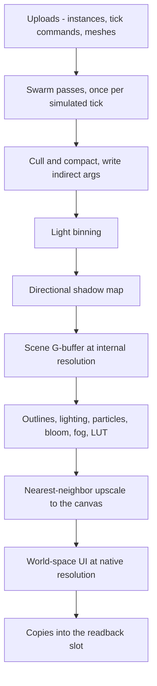

# Rendering (WebGPU)

This doc covers how Prophet drives WebGPU: device setup, the render graph, the limits policy every shader obeys, GPU-driven drawing, voxel chunks, lighting, particles, world-space UI, the readback ring and device-loss recovery. The pixel-art look built on top of it (projection, internal resolution, post chain) is in [04-pixel-art-pipeline](04-pixel-art-pipeline.md). The swarm's compute passes are in [05-gpu-swarm](05-gpu-swarm.md). Every number lives in [BUDGETS.md](../BUDGETS.md).

## Goals

1. **Runs on every minimum-spec device.** Core feature level, default limits, and optional features only with a fallback ([ADR-003](../DECISIONS.md#adr-003-webgpu-only), [ADR-020](../DECISIONS.md#adr-020-minimum-spec)).
2. **GPU-driven.** The CPU encodes a small, fixed set of passes. Instance counts and draw arguments come from compute passes.
3. **One command encoder and one `queue.submit` per frame.** Nothing is allocated per frame beyond the objects the WebGPU API itself returns.
4. **The CPU never waits for the GPU.** Readbacks are asynchronous and harvested a few frames later.
5. **Recoverable.** A lost device is rebuilt from CPU state without ending the run.

## Non-goals

- A WebGL2 or compatibility-mode path ([ADR-003](../DECISIONS.md#adr-003-webgpu-only)).
- PBR, skeletal skinning, MSAA/TAA/FXAA. The look is hard-edged pixel art ([04](04-pixel-art-pipeline.md)).
- Sorted alpha blending or general order-independent transparency.
- Requesting limits above the WebGPU defaults, or depending on any non-core feature.
- Global illumination, reflections, ray tracing.

## Game requirements served

| Game need | Rendering feature |
|---|---|
| Thousands of enemies, projectiles and pickups on screen | GPU-written instances, compute culling and compaction, indirect draws |
| A fully destructible voxel city | Packed-quad chunk meshes in a paged mesh pool, cheap re-upload |
| PATCH visibly assembled from parts | One instance per part on its socket, geometry mega-buffers |
| Neon city at night | Binned point/spot lights, emissive materials, pixel bloom ([04](04-pixel-art-pipeline.md#shading-and-color-grading)) |
| Readable chaos | ID buffer for outlines, x-ray silhouettes, world-space UI |
| Instant hit feedback | Flashes, damage numbers and sparks spawned on the GPU |
| Director, economy and audio react to the swarm | Readback ring: counters, events, density maps |
| A run survives a driver reset or GPU-process crash | Device-loss recovery |

## Device and features

Startup runs on the engine worker, which owns the device for its whole life:

1. `navigator.gpu.requestAdapter({ powerPreference: 'high-performance' })`. `featureLevel` stays at its default, `'core'`; we never ask for compatibility mode ([ADR-003](../DECISIONS.md#adr-003-webgpu-only)). Some platforms ignore `powerPreference` (to verify in M1).
2. Read `adapter.info` (vendor, architecture, description) and `adapter.limits`. Both feed [tier detection](08-platforms.md#tier-detection) with the micro-benchmark ([BUDGETS](../BUDGETS.md#quality-tiers)). Limits are *read*, never requested.
3. `adapter.requestDevice({ requiredFeatures })` with only the table's features that the adapter reports, and **no `requiredLimits`**. The device runs at default limits even on a high-end GPU, so a limit bug that would hit a low-end GPU also hits the dev machine.
4. Configure the OffscreenCanvas context with `navigator.gpu.getPreferredCanvasFormat()` and `alphaMode: 'opaque'`. The browser composites the DOM UI above the canvas.
5. Install the `device.lost` and `uncapturederror` handlers ([Device loss](#device-loss)).

| Optional feature | What we use it for | Fallback when absent |
|---|---|---|
| `subgroups` | Prefix scans in swarm binning and culling compaction; reductions in light binning | Workgroup-memory scans. Integer results are identical, only slower. |
| `shader-f16` | Render-only math; packed particle and instance attributes | `f32`. Never used in simulation kernels. |
| `timestamp-query` | Per-pass GPU timings ([Profiling](#profiling)) | CPU timers plus `onSubmittedWorkDone` |
| `texture-compression-bc` | Large non-palette textures | Uncompressed `rgba8unorm` |

Rules for optional features:
- **Defines.** Each feature maps to a WGSL preprocessor define (`SUBGROUPS`, `F16`). The define set is part of the pipeline-cache key.
- **Subgroup size.** Kernels never assume one; the reported range varies per GPU (to verify in M1).
- **Determinism.** Simulation kernels use subgroups only for exact integer operations (scans, sums). The `SUBGROUPS` variant and its fallback therefore produce bit-identical results ([ADR-012](../DECISIONS.md#adr-012-integer-deterministic-simulation)).
- **Compression.** Palette-exact textures (micro-textures, ramps, fonts, the LUT) are never block-compressed, because lossy compression shifts palette colors ([04](04-pixel-art-pipeline.md#shading-and-color-grading)). Compression is a memory lever for large non-palette textures only.

## Render graph

A render graph declares the GPU passes and the resources they touch, and compiles them into one command submission ([GLOSSARY](../GLOSSARY.md)). Passes are classes with two methods:

- **`setup(builder)`** declares reads and writes of named resources. It creates transient textures by descriptor (a format plus a size class: `internal`, `native`, `shadow` or fixed) and imports persistent ones (swarm buffers, mesh-pool pages, readback slots).
- **`execute(encoder, resources)`** records the pass's GPU work. It may not allocate, create GPU objects or change the graph.

**Compile.** This runs on resize, on a tier change and on view toggles (photo mode, debug views), never per frame:
1. Call every `setup`.
2. Cull passes whose outputs nobody reads, unless the pass is flagged `sideEffect` (readback copies, timestamp resolves).
3. Validate hazards in declaration order: every read must follow its write.
4. Compute transient lifetimes, and alias textures from a pool keyed by descriptor. The G-buffer and the bloom chain can then share memory.
5. Create the bind groups and render-pass descriptors, once.

**Run.** Every frame: one `GPUCommandEncoder`, every pass's `execute` in order, one `queue.submit`. The only per-frame patch is the canvas texture view (WebGPU hands out a new one each frame), written into the cached descriptor. The v0 renderer (`engine/render/renderer.js`) already works this way: it builds its scene pass (with the internal target's views) on resize, and patches the canvas view into its upscale pass each frame.



This refines the encode order in [01-overview](01-overview.md#frame-pipeline). The post chain is detailed in [04](04-pixel-art-pipeline.md#post-chain).

```js
// @ts-check
/** Base class for every GPU pass: declare resources in setup(), record work in execute(). */
export class RenderPass {
  /** @param {string} name */
  constructor(name) { this.name = name; this.sideEffect = false; }
  /** @param {import('./graph-builder.js').GraphBuilder} b */
  setup(b) {}
  /** @param {GPUCommandEncoder} enc @param {import('./graph-resources.js').GraphResources} res */
  execute(enc, res) {}
}

/** Nearest-neighbor upscale with the sub-pixel camera offset (see 04). */
export class UpscalePass extends RenderPass {
  constructor() { super('upscale'); }
  setup(b) { b.read('graded'); b.write('canvas'); }   // internal-res graded image -> swap chain
  execute(enc, res) {
    const p = enc.beginRenderPass(res.passDesc(this)); // descriptor built at compile time
    p.setPipeline(res.pipeline(this));
    p.setBindGroup(0, res.frameGroup);                 // camera offset, k, border
    p.setBindGroup(1, res.passGroup(this));            // the graded texture
    p.draw(3);                                         // one full-screen triangle
    p.end();
  }
}

export class RenderGraph {
  /** @type {RenderPass[]} */ #order = [];
  /** @type {GPUCommandBuffer[]} */ #submit = [];     // length 1, reused every frame
  /** Resize, tier change or view toggle only. */
  compile(passes, config) { /* setup, cull, hazard check, lifetimes, aliasing, bind groups */ }
  /** @param {GPUDevice} device @param {import('./graph-resources.js').GraphResources} res */
  run(device, res) {
    const enc = device.createCommandEncoder();
    for (let i = 0; i < this.#order.length; i++) this.#order[i].execute(enc, res);
    this.#submit[0] = enc.finish();
    device.queue.submit(this.#submit);
  }
}
```

## Renderer v0

The M1–M2 tech demo draws with a fixed two-pass renderer (`engine/render/renderer.js`). The render graph above replaces it in M3. It already follows the pixel rules of [04](04-pixel-art-pipeline.md): oblique projection, integer scale, camera snapping and the sub-pixel upscale.

**Scene pass**, into an `rgba8unorm` texture at the internal size with a `depth24plus` buffer:
1. **Ground.** A full-screen triangle. The fragment shader turns its pixel back into a world position at z = 0 and draws a two-tone checker in world space, the arena edge line, and a darker outside. It writes no depth.
2. **Boxes, drawn by vertex pulling.** One pipeline (`cubes.wgsl`) with an override `SOURCE` handles three instance streams:
   - swarm units, read straight from the swarm's `U` buffer;
   - shots, from `P`;
   - actors, from a small buffer the game fills each frame.

   Each instance draws 12 vertices: the top face and the camera-facing front face as two quads. The ±x walls are edge-on, and the back is hidden.
   - The box is snapped to whole internal pixels, with the ground axis (y) and the height (z) rounded separately, so depth stays exact.
   - Dead slots and instances outside the view collapse to a clipped point.
   - Three toon bands: the top, the front, and a shadow band on the bottom third of the front.

**Upscale pass.** A full-screen triangle into the canvas, nearest-neighbour (`textureLoad`) by *k*. It crops the border and the overscan, and adds the camera remainder as a whole-output-pixel offset.

**The game supplies the look** through `GameModule.render` (`engine/render/render-style.js`):
- palette tokens;
- box sizes in internal pixels for each swarm type, each actor style and shots;
- an `actors(sim, out)` extract of `ACTOR_WORDS` records.

The renderer loads the palette from the game's CSS file (`game/ui/palette.css`) through the shader loader. The `--c-*` tokens therefore stay the only place hex values are written ([game/03](../game/03-art-audio.md#palette)).

**Interpolation.** Everything draws between the last two ticks, at `pos − vel · (1 − α)` with α = accumulator / tick. The camera follows the first actor record, lifted by `style.lift`.

**Engine messages.**
- `resize`: the main thread's `CanvasMeter` measures the canvas in exact device pixels (`devicePixelContentBoxSize`, with CSS size × DPR as the fallback). The engine then resizes the `OffscreenCanvas` and reallocates the internal targets.
- `capture`: copies the internal image of the last frame back to the main thread, exposed as `window.__px.capture()`. Tests use it to check pixels exactly.

## WebGPU limits policy

We request no limits, so the WebGPU defaults are hard ceilings for every shader and buffer ([ADR-003](../DECISIONS.md#adr-003-webgpu-only)). The values in parentheses are the spec defaults as we read them; we re-check them against each browser in M1.

| Limit (default) | Our rule |
|---|---|
| `maxStorageBuffersPerShaderStage` (8) | At most 8 per stage. SoA fields are packed into 1–2 buffers and addressed through an offset table in a uniform ([05](05-gpu-swarm.md#data-layout)). |
| `maxBindGroups` (4) | A fixed convention (below). |
| `maxComputeInvocationsPerWorkgroup` (256), `maxComputeWorkgroupStorageSize` (16 KiB) | `@workgroup_size(64)` everywhere, and at most 16 KiB of `var<workgroup>`. 64 is a multiple of every common subgroup size. |
| `maxComputeWorkgroupsPerDimension` (65,535) | Large dispatches fold into a 2D grid. |
| `maxStorageBufferBindingSize` (128 MiB), `maxBufferSize` (256 MiB) | No binding may exceed the default binding size. Mega-buffers and the mesh pool are split into pages below it ([BUDGETS](../BUDGETS.md#gpu-memory)). |
| `minUniformBufferOffsetAlignment` (256 B) | Per-draw dynamic records use a 256-byte stride. |
| Storage access in the vertex stage | Read-only (`var<storage, read>`). WebGPU forbids writable storage in vertex shaders. |

Features we deliberately do **not** depend on:
- **`indirect-first-instance` and multi-draw-indirect.**
  - Each (pipeline × mesh bucket) pair owns one fixed indirect-args slot, and `firstInstance` stays 0.
  - The draw's base offset into its compacted instance list comes from a dynamic uniform offset (group 3).
- **Float atomics.** WGSL only has `i32`/`u32` atomics, and the simulation is `i32` anyway ([ADR-012](../DECISIONS.md#adr-012-integer-deterministic-simulation)).
- **`float32-filterable`.** Render targets are `rgba8unorm`, `rgba16float`, `r32uint` and depth. 32-bit float textures are only read with `textureLoad`.
- **`bgra8unorm-storage`.** The canvas is only ever a render attachment.

**Bind-group convention.**

| Group | Holds | Changes |
|---|---|---|
| 0: frame | Camera and projection, frame and tick counters, tier constants, samplers | Once per frame |
| 1: pass | Pass inputs: G-buffer views, light-bin masks, the shadow map | Per pass |
| 2: material/instance | Mesh-pool or geometry page, instance page, material table, atlases | Per page or material batch |
| 3: per-draw | A 256-byte record, selected by dynamic offset: base instance, chunk origin, bucket | Per draw |

**Pipelines and bind groups.**
- **Async, at load.** Every pipeline is created with `createRenderPipelineAsync` or `createComputePipelineAsync` at load, from a build-time manifest of all variants. None is created mid-run. Warm-up target: [BUDGETS](../BUDGETS.md#download--load-targets).
- **Cache key:** (WGSL source hash, define set, pipeline layout, target formats and state).
- **Explicit layouts.** Layouts are explicit `GPUPipelineLayout`s, never `layout: 'auto'`, so one bind group works with every pipeline that shares the layout.
- **Caching.** Bind groups are created when the graph compiles, then cached. Pass and draw descriptors are reused ([hot-path rules](01-overview.md#hot-path-rules)).

## GPU-driven rendering

**Geometry.** Every mesh is a voxel model meshed into the same packed-quad format as world chunks ([Voxel rendering](#voxel-rendering)). That covers robot parts, towers, specialists, props, swarm meshes and debris bodies. Meshes live in paged geometry mega-buffers, and a mesh is just (page, first quad, quad count). There are no vertex buffers: the vertex shader pulls the quad by `vertex_index` and expands it without an index buffer, six vertices per quad.

**Instances.**
- **Actors.** The extract phase ([01](01-overview.md#frame-pipeline)) writes one instance record per visible part into heap staging (PATCH's parts on their sockets, towers, specialists, bosses, props, debris bodies), then issues one `writeBuffer` per instance page. Socket transforms are composed on the CPU, in render floats.
- **Swarm.** The GPU animation pass writes instance records directly ([05](05-gpu-swarm.md#pass-chain)). The CPU never sees them.

**Cull and compact.** One compute pass handles actors and swarm alike:
1. Test each instance's bounding sphere against the view volume. The oblique or orthographic view volume is a parallelepiped: four side planes, with the district bounds standing in for near and far.
2. Append the survivors to their bucket's compacted index list, using `atomicAdd` on the bucket counter. The order inside a bucket does not matter, because opaque draws are depth-tested and transparency is dithered or additive.
3. Write each bucket's `instanceCount` into its fixed indirect slot.

A second list is built the same way for shadow casters.

**Buckets are size classes.** A bucket is a (pipeline × mesh size class) pair, with size classes in powers of two, e.g. 64 to 1,024 quads.
- A draw emits `6 × classQuads` vertices per instance. An instance with fewer quads emits degenerate triangles for the rest.
- This caps the waste at 2× vertex work.
- The number of indirect draws stays small and fixed, however far the part catalog grows.

```wgsl
struct Frame { viewProj: mat4x4f, snap: vec4f }
struct Instance { pos: vec3f, facing: u32, quadBase: u32, quadCount: u32, tint: u32, objectId: u32 }
struct Draw { listBase: u32, pageBase: u32, pad0: u32, pad1: u32 }

@group(0) @binding(0) var<uniform> frame: Frame;
@group(2) @binding(0) var<storage, read> quads: array<vec2u>;       // packed quads, 8 B each
@group(2) @binding(1) var<storage, read> instances: array<Instance>;
@group(2) @binding(2) var<storage, read> visible: array<u32>;       // compacted, per bucket
@group(3) @binding(0) var<uniform> draw: Draw;                      // dynamic offset per draw

struct VsOut {
  @builtin(position) pos: vec4f,
  @location(0) @interpolate(flat) mat: u32,
  @location(1) @interpolate(flat) id: u32,
}

@vertex fn vs(@builtin(vertex_index) vi: u32, @builtin(instance_index) ii: u32) -> VsOut {
  var o: VsOut;
  let inst = instances[visible[draw.listBase + ii]];
  let qi = vi / 6u;
  if (qi >= inst.quadCount) {                 // size-class padding: degenerate, clipped
    o.pos = vec4f(0.0, 0.0, 2.0, 1.0);
    return o;
  }
  let q = quads[draw.pageBase + inst.quadBase + qi];
  let corner = quadCorner(q.x, vi % 6u);      // helper (elided): unpack xyz, face, size
  let world = inst.pos + rotateFacing(corner, inst.facing); // 16 facings, table lookup
  o.pos = frame.viewProj * vec4f(world, 1.0);
  o.mat = q.y & 0x3Fu;
  o.id = inst.objectId;
  return o;
}
```

## Voxel rendering

**Meshing.** World chunks are meshed on the CPU by binary greedy meshing in job workers ([ADR-016](../DECISIONS.md#adr-016-cpu-binary-greedy-meshing)). Storage, dirty flags and the remesh queue are in [06](06-world.md#edits-and-damage).
- The mesher reads a one-voxel border from the neighbor chunks, so faces between chunks are culled correctly.
- The merge key is (face, material, damage stage, corner AO), so a quad never spans two materials.
- The fragment shader derives micro-texture coordinates from world position, so merged quads texture seamlessly ([04](04-pixel-art-pipeline.md#projection)).

**Packed quad (8 bytes).**

| Word | Bits | Field |
|---|---|---|
| 0 | 0–14 | x, y, z inside the chunk, 5 bits each |
| 0 | 15–17 | Face: +x, −x, +y, −y, +z, −z |
| 0 | 18–27 | Width − 1 and height − 1 in voxels, 5 bits each |
| 0 | 28–31 | Flags (e.g. emissive) |
| 1 | 0–7 | The voxel byte: material (6 bits) and damage stage (2 bits) |
| 1 | 8–15 | AO, 2 bits per corner |
| 1 | 16–31 | Reserved for look-dev (e.g. a peel group) |

**Mesh pool.** The pool is a set of GPU pages, each below the binding limit.
- A CPU-side page allocator on the engine worker hands out runs of fixed-size blocks. A chunk's mesh is one run inside one page.
- Uploads are `writeBuffer` calls straight from the job result: from the heap in the `shared` tier, or from a transferred buffer in the `transfer` tier.
- WebGPU orders `writeBuffer` after all earlier submits, so a freed run can be reused on the next frame without fences.
- Stale job results are discarded by chunk version.
- Pool size: [BUDGETS](../BUDGETS.md#gpu-memory).

**Face groups.** Quads are stored sorted by face. Under the oblique projection only tops and camera-facing walls rasterize ([04](04-pixel-art-pipeline.md#projection)). Per-face sub-ranges therefore let the scene pass skip the hidden faces, while the shadow pass draws the faces that see the light. This is worth measuring in M4.

**Draws.** The top-down view shows few chunks, so the CPU culls chunk AABBs against the view volume (skipping uniform chunks) and issues one `drawIndirect` per visible non-empty chunk.
- **Args.** Each chunk has its own args slot.
  - `vertexCount = 6 × quads` is written when its mesh is uploaded.
  - `instanceCount` is 1, or 0 when the GPU cull pass drops the chunk, for example because it is peeled ([04](04-pixel-art-pipeline.md#occlusion-handling)).
- **Per-draw record.** The chunk origin and page base come from the group 3 dynamic record.
- **Draw count estimate**, e.g. default zoom on 1080p:
  - The view covers about 60 × 34 m of ground plus the full district height: a few hundred chunk slots, of which typically 100–250 are non-empty.
  - That means 100–250 scene draws, plus a similar number for the shadow map. The far zoom roughly doubles it.
  - That is cheap for WebGPU. A candidate optimization is to record chunk draws into a `GPURenderBundle`, rebuilt only when the visible set or a mesh allocation changes.

**Alternative.** A brickmap compute raymarch at internal resolution is spiked in look-dev ([04](04-pixel-art-pipeline.md#look-dev-tests)). It is compared on cost, memory and edit-to-visible latency.

## Lighting and shadows

**Sources.**
- **Point and spot lights:** neon signs, street lamps, muzzle flashes, explosions.
  - Each has a position, radius, color, intensity and an optional cone.
  - Caps per tier: [BUDGETS](../BUDGETS.md#entity-caps) (clustered lights). PCG places sign lights within them ([06](06-world.md#procedural-generation)).
- **Emissive materials** (neon tubes, screens, eyes, Halcyon trim) light only themselves and feed bloom. Only listed lights illuminate other surfaces.

**Tiled binning (compute).** The view is top-down and orthographic, so depth slices matter little.
- **Bins** are internal-resolution screen tiles (e.g. 16 × 16 px) times a few height ranges. Under the oblique projection, each bin is a slanted prism in world space.
- **One 64-thread workgroup per tile** tests every light's bounding sphere against the tile's prisms. It builds a **bitmask** (one bit per light) in workgroup memory with `atomicOr`, then stores it.
- **Why bitmasks:** they need no global atomics or lists, use fixed memory and give deterministic output.
- **Cost:** [BUDGETS](../BUDGETS.md#at-design-load).

**Resolve.** Lighting runs at internal resolution on the thin G-buffer ([04](04-pixel-art-pipeline.md#shading-and-color-grading)).
- Each pixel walks the set bits of its bin.
- Each light's contribution is quantized into the toon bands before it is accumulated, so colored neon tints stay banded.

**Directional shadow.** There is one shadow map, for the key light:
- **Coverage:** orthographic from the light, covering the view volume plus a margin.
- **Texel-snapped:** the light-space origin moves in whole shadow texels, so shadow edges never crawl while the camera scrolls.
- **Hard edges:** one depth compare, no PCF. It matches the pixel look and is cheaper.
- **Format:** `depth32float`, read with `textureLoad` or a nearest comparison sampler. Size per tier: [BUDGETS](../BUDGETS.md#gpu-memory).
- **Casters:** voxel chunks (their light-facing face groups), actors and debris bodies. Fodder draws a 1–2 px blob shadow instead of entering the shadow map, for readability and cost (see [Open questions](#open-questions)).
- **Other lights:** point and spot lights cast no shadows.

## Particles and transparency

GPU particles are cosmetic: they never feed back into the simulation, so they may use floats and are left out of replay hashes ([09](09-determinism-coop.md#replays-and-hashes)).
- **Storage:** SoA buffers (position, velocity, life, size, palette color, flags) with a fixed capacity per tier ([BUDGETS](../BUDGETS.md#entity-caps)) and a free list driven by an atomic counter.
- **Emitters:** CPU emitter commands uploaded with the tick commands (explosions, collapse dust), plus GPU events. The swarm hit pass appends emit records itself, so sparks appear in the frame of the hit.
- **Passes:** emit, simulate, compact, draw. Debris voxel particles collide with the world's GPU height and occupancy mirrors ([06](06-world.md#debris)), then bounce, settle and fade. Each particle is one vertex-pulled quad sized in whole internal pixels.
- **Overflow:** emits beyond capacity are dropped, lowest priority first (ambient dust, then sparks, then debris).

Transparency needs no sorting:

| Case | Technique | Why |
|---|---|---|
| Glass, holograms, cutaways ([04](04-pixel-art-pipeline.md#occlusion-handling)) | Dithered screen-door: `discard` against a 4 × 4 Bayer threshold at internal resolution | Opaque for depth, ID, outlines and fog; reads as pixel-art translucency |
| Emissive particles, muzzle flashes, beams | Additive into the HDR lit target, after lighting and before bloom | Commutative, so order-independent; it blooms |

No other blend mode exists in the world. Alpha blending only returns in world-space UI, which draws in a fixed layer order.

## World-space UI

World-anchored UI is drawn in WebGPU, never in the DOM ([ADR-006](../DECISIONS.md#adr-006-real-htmlcss-ui), [07](07-ui.md#combat-hud-rules)). It is drawn **after the upscale, at native resolution** ([04](04-pixel-art-pipeline.md#post-chain)).

| Element | Source | Notes |
|---|---|---|
| Health bars | Actor instances from extract | Towers, specialists, elites, bosses, the Forge |
| Damage numbers | A GPU ring appended by the swarm hit pass; the CPU for actor hits | Pixel-font atlas; can be switched off ([07](07-ui.md#accessibility)) |
| Tower ranges | Build mode, selection | Pixel rings |
| Blueprint ghosts | Build mode | Tower meshes in a flat hologram style; parts behind geometry are dithered, not hidden |
| Threat arrows | Director and actors | Off-screen indicators clamped to the edge of the view ([04](04-pixel-art-pipeline.md#resolution-and-scaling)) |

- One UI pixel is k × k output pixels, so bars and glyphs match the world's pixel size. They are anchored with the exact, unsnapped camera, so they track the world smoothly.
- Where occlusion matters, world-space UI reads the internal-resolution depth buffer with `textureLoad`.
- Counts are bounded by fixed rings and drawn through indirect args. Budget: [BUDGETS](../BUDGETS.md#at-design-load).

## Readback ring

The GPU → CPU half of the [CPU-GPU contract](05-gpu-swarm.md#cpu-gpu-contract) travels through a ring of `MAP_READ` staging buffers. Each **slot** holds the outbound blocks of the ticks simulated in one frame, **one block per tick**. Blocks are never merged per frame, because how many ticks a frame covers differs between machines, and merging would break determinism. Each tick's block carries the tick's **counters** (exact kills, scrap and other GPU-side counters), its tick-stamped **event buffer**, and the low-resolution **density and threat maps** the director reads. The slot also carries timestamp results when available.

- **Depth ≥ K + 1 slots**, with K per tier from [BUDGETS](../BUDGETS.md#simulation-constants): one slot being written plus up to K in flight (e.g. K = 4 needs at least 5 slots).
- **Size:** one per-tick block (the events-per-tick cap, counters and maps) × the max ticks per frame. The whole ring fits the readback budget in [BUDGETS](../BUDGETS.md#gpu-memory).
- **Write:** the frame's encoder ends with `copyBufferToBuffer` into the slot. After `queue.submit` the engine calls `mapAsync` and **never awaits it on the frame path**; resolution only flips a flag. A frame that simulates no tick copies nothing.
- **Harvest:** at the start of a later frame, mapped slots are copied **strictly in submission order** into heap event queues keyed by tick, then unmapped.
- **Late:** if the slot carrying tick *T* is not harvested when the simulation reaches *T + K*, or no slot is free, the simulation stalls. That policy belongs to [05-gpu-swarm](05-gpu-swarm.md#k-latency-and-stalls). Latency target: [BUDGETS](../BUDGETS.md#latency-targets).

```js
// @ts-check
const FREE = 0, PENDING = 1, MAPPED = 2;

/** GPU -> CPU staging ring. mapAsync is never awaited on the frame path. */
export class ReadbackRing {
  /** @param {GPUDevice} device @param {number} depth at least K + 1 @param {number} slotBytes */
  constructor(device, depth, slotBytes) {
    const usage = GPUBufferUsage.MAP_READ | GPUBufferUsage.COPY_DST;
    this.depth = depth; this.head = 0; this.tail = 0;
    this.state = new Uint8Array(depth);
    this.firstTick = new Uint32Array(depth);
    /** @type {GPUBuffer[]} */ this.buf = [];
    /** @type {(() => void)[]} */ this.onMapped = [];        // bound once: no per-frame closures
    for (let i = 0; i < depth; i++) {
      this.buf.push(device.createBuffer({ size: slotBytes, usage }));
      this.onMapped.push(() => { this.state[i] = MAPPED; });
    }
  }
  /** Slot for this frame's copies, or -1 when the ring is full (the sim stalls, see 05). */
  acquire(firstTick) {
    const s = this.head;
    if (this.state[s] !== FREE) return -1;
    this.firstTick[s] = firstTick; this.head = (s + 1) % this.depth;
    return s;
  }
  /** Called right after queue.submit. */
  map(s) { this.state[s] = PENDING; this.buf[s].mapAsync(GPUMapMode.READ).then(this.onMapped[s], ReadbackRing.onLost); }
  /** Frame start: consume mapped slots strictly in submission order. */
  harvest(sink) {
    for (let s = this.tail; this.state[s] === MAPPED; s = this.tail) {
      sink.consume(this.buf[s].getMappedRange(), this.firstTick[s]); // copy into heap event queues
      this.buf[s].unmap(); this.state[s] = FREE; this.tail = (s + 1) % this.depth;
    }
  }
  static onLost() { /* rejected on device loss; the device-loss path owns recovery */ }
}
```

The `mapAsync` promise and the `getMappedRange()` buffer are the only per-frame allocations here, and the WebGPU API forces them.

The implementation is `engine/gpu/readback-ring.js`. By default it has `max(6, K + 2)` slots; spare slots absorb latency spikes before the sim has to stall. It samples the submit → harvest latency, and the HUD shows the p95. A rejected `mapAsync` (device loss) is recorded, and the device-loss path owns recovery.

**What harvest copies (M2).**
- The ring hands the consumer the **mapped range itself** and unmaps it right after. Slots keep their tick lists and bound map callbacks.
- The swarm (`engine/swarm/block-ring.js`) copies each tick's block out of that range into a **pooled block**. It copies the words before the event records, plus only the records present.
- A block from `take(tick)` stays valid until the next `take`, which returns it to the pool.

Before this, harvest copied the whole slot every frame: K blocks of ~140 KB at `high` caps, mostly the empty event area. That was ~33 MB/s of `ArrayBuffer` garbage at 60 fps, which drove minor and major GCs on the engine worker. The soak run measures the result ([10](10-tooling-testing.md#testing-strategy)).

## Device loss

`device.lost` resolves after a driver reset, a GPU-process crash (Chromium, Electron), or `device.destroy()` in tests. The engine emits a typed `device-lost` event ([01](01-overview.md#javascript-conventions)) and recovers:

1. **Freeze** the simulation at the current tick; no tick runs without a device. The DOM shows a "reconnecting" state.
2. **Drop** in-flight readback slots. In single-player, the lost ticks' events count as empty. In co-op, a device loss forces a resync ([09](09-determinism-coop.md#co-op-model)).
3. **Recreate** the adapter and device with the same feature selection. If the adapter changed (e.g. a GPU switch), re-run the tier checks.
4. **Rebuild pipelines** asynchronously from the variant manifest ([BUDGETS](../BUDGETS.md#download--load-targets)).
5. **Re-upload** static resources (atlases, LUT, fonts, geometry pages) from the asset cache.
6. **Remesh** every non-empty chunk from the CPU voxel authority, visible chunks first ([06](06-world.md#voxel-storage)). Re-upload the world height and occupancy mirrors and the flow fields.
7. **Actors** come back with the next extract.
8. **Swarm:** fodder, projectiles and particles are gone, and the director respawns fodder at the spawn edges ([ADR-019](../DECISIONS.md#adr-019-fodder-is-not-saved)). Uncollected pickups are not lost: their total value is known exactly from the counters, and it is respawned as merged gems near PATCH ([05: resets and device loss](05-gpu-swarm.md#resets-and-device-loss)).
9. **Resume** once the visible chunks are meshed.

**Today** (`EngineHost.recover`):
- The frame loop freezes, and a running frame is allowed to finish.
- The engine then builds a new device on the same canvas, a new GPU swarm from the kept layout, tables and seed, and a new renderer.
- It logs a swarm reset on the next tick, and reports `device` messages to the main thread (`window.__px.device`, plus a line in the boot panel).
- More than 3 losses within a minute is a persistent failure.
- `device.destroy()`, like a real loss, unmaps every buffer before `device.lost` resolves. A frame in between can therefore find a readback slot marked ready whose mapping is gone. `ReadbackRing.harvest` treats that as a lost ring, like a rejected `mapAsync`: the sim stalls until the recovery replaces the swarm, and nothing throws out of the frame.
- In dev builds, `window.__px.loseDevice()` calls `device.destroy()`. `tests/browser/device-loss.spec.js` uses it mid-run, checks that the run continues with a respawned, rendered swarm, and replays the exported log (reset included) in Node.

**Hidden or suspended.** While the tab is hidden, the window is minimized or the Steam Deck sleeps, the engine pauses and stops submitting ([08: lifecycle](08-platforms.md#lifecycle)). A loss on return is expected and recovered as above.

Repeated losses in a short window drop one performance tier. A persistent failure shows an error screen with a report.

## Profiling

- **With `timestamp-query`:** every pass gets `timestampWrites`. The query set is resolved into a buffer that rides along in the readback slot, and per-pass times feed the perf overlay ([10](10-tooling-testing.md#dev-tools)) and CI. Browsers may quantize timestamps (to verify in M1), so we average over many frames.
- **Without it:** CPU timers around encode and submit, plus `queue.onSubmittedWorkDone()` for an approximate GPU frame time, with no per-pass split.

**Today (M1), the swarm is timed.** `engine/gpu/gpu-timer.js` owns the query set and a resolve buffer. The swarm's timing mode is set with `?timing=`:
- **`tick`** (the default): each tick's compute pass writes one timestamp pair.
- **`pass`**: every step of the pass chain runs in its own timed compute pass. The results are bit-identical (`swarm.spec.js` checks it against the reference), at a small cost.
- **`off`**: no timestamps.

Timing works like this:
- At `endFrame` the frame resolves the pairs it wrote and copies them behind its outbound blocks in the readback slot. Timings come back with the blocks, in order, and never stall.
- The engine keeps the GPU ms per tick in a 256-sample ring.
- Every 30 frames it posts the p50 and p95 (and in `pass` mode, the mean per step) to `window.__px.perf`. The HUD's debug row shows `gpu95` next to `rb95`, the readback latency p95.

**Pipeline warm-up.** The renderer's pipelines build while the sim boots and the swarm compiles its kernels. The engine's ready info reports `warmup: { ms, swarmMs, renderMs, pipelines }` in `__px.engine`. On SwiftShader that is 36 pipelines in about 1.1 s; the budget is [< 2 s](../BUDGETS.md#download--load-targets).

## Thread ownership

| Thread | Rendering role |
|---|---|
| Engine worker | Owns the `GPUDevice`, the OffscreenCanvas context, the render graph, pipeline cache, mesh-pool allocator and readback ring. It is the only thread that calls WebGPU. |
| Job workers | Produce CPU data only (packed quads, PCG light lists). They never touch WebGPU. |
| Main thread | Transfers the canvas to the engine worker once at boot; measures size and DPR ([04](04-pixel-art-pipeline.md#resolution-and-scaling)); forwards visibility and lifecycle events. |
| Main-thread host | Runs the same classes on the main thread when WebGPU is unavailable in workers ([01](01-overview.md#runtime-topology)). |

Presentation timing on Safari, which has no worker rAF, is to verify in M1.

## Budgets

- GPU time per pass group, at design load and in the stress scene: [BUDGETS](../BUDGETS.md#gpu-frame-budgets).
- GPU memory pools, shadow-map sizes and the binding rule: [BUDGETS](../BUDGETS.md#gpu-memory).
- CPU cost of extract, uploads, encode and submit: [BUDGETS](../BUDGETS.md#engine-worker-per-frame).
- Instance, particle and light caps: [BUDGETS](../BUDGETS.md#entity-caps).
- Readback latency: [BUDGETS](../BUDGETS.md#latency-targets). Pipeline warm-up: [BUDGETS](../BUDGETS.md#download--load-targets).

## Fallbacks & failure modes

| Situation | Response |
|---|---|
| No WebGPU at all | Unsupported screen listing the requirements ([ADR-020](../DECISIONS.md#adr-020-minimum-spec)) |
| No WebGPU in workers | Main-thread host ([01](01-overview.md#runtime-topology)) |
| Optional feature missing | Fallback variant from the [feature table](#device-and-features) |
| Pipeline fails to compile | Typed error; retry the variant without optional features; otherwise an error screen with a report |
| Out-of-memory error scope on a pool allocation | Drop one performance tier and rebuild the pools |
| Mesh pool full | Evict meshes of off-screen chunks, least recently visible first; remesh when they return |
| Readback slot late, or ring full | Simulation stall ([05](05-gpu-swarm.md#k-latency-and-stalls)) |
| GPU frame over budget for many frames | Degrade in the order from [01](01-overview.md#frame-pipeline), then suggest a lower tier |
| Device lost | [Device loss](#device-loss) |

## Testing

- **Golden images:** Playwright + Chromium with WebGPU renders fixed scenes (seed, camera, tick) and compares them pixel-exactly, on GPU runners and on SwiftShader ([10](10-tooling-testing.md#testing-strategy)).
  - Today, `tests/browser/render.spec.js` checks captures of the internal image for exact palette colors:
    - PATCH's orange at the screen center;
    - the Sweep's cyan;
    - the ground checker;
    - the camera following PATCH;
    - *k* and the internal size after a resize, for both swarm backends.
  - It attaches the captures and a canvas screenshot to the report.
- **Shader compile tests:** every variant in the pipeline manifest compiles without `getCompilationInfo()` errors, including on SwiftShader. Running at default limits there also catches accidental reliance on higher limits.
- **Render-graph unit tests** (`node:test`, mock device): culling, hazard detection, aliasing, and zero allocation in `run`.
- **Readback ring tests** with injected map latency: in-order harvest, stalls, no leaked slots.
- **Device-loss tests:** `device.destroy()` mid-run, after which the run must continue (an M1 exit criterion, [ROADMAP](../ROADMAP.md#milestones)).
- **Perf tests** on the reference devices against the GPU budgets ([10](10-tooling-testing.md#continuous-integration)).

## Open questions

- What are the exact G-buffer formats? Do object ID, face code and class bits fit one `r32uint` (see [04](04-pixel-art-pipeline.md#outlines))?
- Index-less six-vertex quads, or four vertices plus a shared static index buffer? Measure vertex cost on the Steam Deck.
- Are render bundles for chunk draws worth it once draw counts are measured?
- Should fodder cast shadow-map shadows instead of blob shadows?
- Should the shadow map split static and dynamic casters, re-rendering voxels only when the camera moves a texel?
- Should we adopt multi-draw-indirect or `indirect-first-instance` if they become universal?
