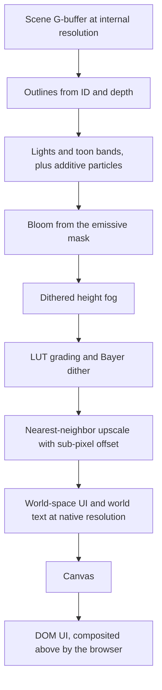

# 3D pixel-art pipeline

This doc explains how Prophet turns a 3D voxel scene into stable, pixel-exact pixel art. It covers the projection, internal resolution and integer scaling, camera snapping, character rules, outlines, toon shading and color grading, occlusion handling, the post chain, and the look-dev tests that settle the open hypotheses in M4.

Related docs:
- GPU plumbing (render graph, G-buffer, light binning): [03-rendering](03-rendering.md).
- Art direction (palette, proportions, lighting mood): [game/03-art-audio](../game/03-art-audio.md).
- Every number: [BUDGETS.md](../BUDGETS.md#pixel--camera-constants).

## Goals

1. **Pixel-exact voxels.** Every visible face of a world voxel covers the same whole number of pixels, and every character voxel covers exactly one ([BUDGETS](../BUDGETS.md#pixel--camera-constants)).
2. **Zero crawl.** When the camera pans, static pixels only move by whole output pixels. Nothing shimmers or "boils".
3. **Readable hordes** at the design on-screen load ([BUDGETS](../BUDGETS.md#entity-caps)): orange reads as the player, cyan as the Sweep.
4. **Neon that stays pixel-y.** Glow is chunky, and colors stay on the palette.
5. **Cheap.** The whole post chain fits its GPU budget on every tier, the Steam Deck included.

## Non-goals

- A free-orbit camera. An optional photo mode may orbit freely and accepts crawl ([ADR-018](../DECISIONS.md#adr-018-pixel-exact-projection)).
- Smooth sub-pixel rotation of characters. Facing is quantized.
- Anti-aliasing of any kind (MSAA, TAA, FXAA). Hard pixels are the style.
- Perspective projection, or continuous zoom.

## Game requirements served

| Game need | Pipeline feature |
|---|---|
| Stylized 3D pixel art | Pixel-exact projection, integer scale, nearest-neighbor upscale |
| PATCH readable at its small on-screen size, and visibly built from parts | Pixel-sized character voxels, sockets on the pixel grid, quantized facings, outlines |
| Orange vs cyan readability ([palette](../game/03-art-audio.md#palette)) | Palette LUT, no outlines on fodder, x-ray silhouettes |
| Neon city at night | Emissive materials, quantized lights, pixel bloom |
| Destructible buildings that can hide the action | Roof peel, x-ray, dithered cutaways, threat arrows |
| The same look from a Steam Deck to 4K | Integer scale *k*, internal height per zoom level |

## Projection

**Default hypothesis** ([ADR-018](../DECISIONS.md#adr-018-pixel-exact-projection), Proposed until M4): a 3/4 **oblique projection** with a constant pixel density *ppm* (pixels per meter) on every axis ([BUDGETS](../BUDGETS.md#pixel--camera-constants)).

The axes are x to the right, y away from the camera along the ground, and z up. At yaw 0, in internal pixels with v pointing up:

| Screen quantity | Formula |
|---|---|
| u (right) | x · ppm |
| v (up) | (y + z) · ppm |
| Depth (larger = farther) | Proportional to y − z |

What follows from these formulas:
- **Exact voxels.** A world voxel's width (x), top depth (y) and wall height (z) all map to the same whole number of pixels. Tops and walls are therefore the same whole-pixel square (e.g. 2 × 2 px with the [BUDGETS](../BUDGETS.md#pixel--camera-constants) values), and a character voxel is a single pixel.
- **Tops and fronts only.** Only +z tops and camera-facing walls are visible. Walls facing ±x are edge-on and have zero area; walls facing away are hidden. This is the classic 3/4 top-down look.
- **Equivalent camera.** It equals an orthographic camera pitched 45° down, with its vertical screen axis stretched by √2.
  - At 45°, the orthographic camera gives v = (y + z) / √2.
  - Multiplying by √2 gives tops and walls the same pixel scale.
- **Occlusion.** A building of height h at y₀ covers the ground from y₀ to y₀ + h, so it hides a ground strip 1× its height deep ([Occlusion handling](#occlusion-handling)).
- **Yaw.** Camera yaw snaps in 90° steps.
  - Each step swaps and negates the ground axes ((x, y) → (y, −x)), so the mapping stays integer and voxels still land on whole pixels.
  - Meshes are yaw-independent; only the projection matrix changes.
- **Depth.** Depth is the affine value y − z, normalized over the district's range. A standard depth buffer resolves visibility, because every view ray runs along (0, 1, −1).
- **Micro-texturing.** World faces carry a world-space micro-texture at the pixel density, so one texel is exactly one pixel.
  - The fragment shader reads it with `textureLoad` at integer coordinates derived from world position. There is no filtering and no mips, and merged greedy quads texture seamlessly ([03](03-rendering.md#voxel-rendering)).
  - A world-voxel face shows only a few texels (e.g. 4 on a 2 × 2 px face), so patterns such as panel seams and rust streaks span several voxels.
  - The voxel's damage stage selects a crack overlay ([06](06-world.md#voxel-storage)).

**Alternative candidate: orthographic at a 40–50° pitch, with texel snapping.** Pitch is the angle of the view direction below the horizon.

| | Oblique (default) | Orthographic, 40–50° |
|---|---|---|
| Voxel size on screen | Exact whole pixels ([BUDGETS](../BUDGETS.md#pixel--camera-constants)) | Non-integer vertically: tops scale by sin(pitch), walls by cos(pitch), e.g. ~0.71 px per character voxel at 45° |
| Crawl while panning | None, with camera snapping | None for static scenes with texel snapping; uneven rows on moving and rotating objects |
| Ground hidden behind a building | 1× its height | cot(pitch) × its height, about 0.84–1.19× |
| Camera math | Custom oblique matrix | Standard |

**Why a 30° pitch was rejected.** Take a character voxel, which is one pixel wide at the pixel density ([BUDGETS](../BUDGETS.md#pixel--camera-constants)):
- Its wall projects to ~0.87 px (cos 30°) and its top to 0.5 px (sin 30°). Rows become uneven, and characters "boil" as they move and rotate.
- Buildings would hide cot 30° ≈ 1.73× their height of ground behind them.

M4 takes the decision, using the [look-dev tests](#look-dev-tests).

## Resolution and scaling

The scene renders at a low **internal resolution**, then an **integer factor *k*** upscales it with nearest-neighbor sampling. The formulas, the zoom heights and worked examples (1080p, 1440p, 4K, Steam Deck) are in [BUDGETS](../BUDGETS.md#pixel--camera-constants).

- ***k*** comes from the canvas height and the zoom level's internal height, and is never below 1.
- **Zoom** changes the internal height, and therefore *k*. It never changes the pixel density: the world is always drawn at the same px/m in internal pixels. Zooming out shows more world, with fewer output pixels per world pixel.
- **Internal size** is the canvas size divided by *k*, rounded up, plus a **border on each side** (width in [BUDGETS](../BUDGETS.md#pixel--camera-constants); `BORDER` below).
  - One pixel of the border absorbs the sub-pixel camera shift ([Camera snapping](#camera-snapping)).
  - The rest gives the outline and bloom kernels valid neighbors at the edges.
  - The upscale crops the border.
- **Overscan.** Rounding up means the upscaled image can exceed the canvas by less than *k* pixels. The excess is cropped evenly on both sides, so the screen center stays on the camera target.

```js
// @ts-check
/** Integer scale and internal render size. Render-side code, so floats are fine. */
export class PixelViewport {
  static BORDER = 2; // px per side, see BUDGETS pixel & camera constants

  /** @param {number} devW @param {number} devH canvas in device px @param {number} zoomH zoom level's internal height */
  resize(devW, devH, zoomH) {
    this.k = Math.max(1, Math.round(devH / zoomH));
    this.viewW = Math.ceil(devW / this.k);
    this.viewH = Math.ceil(devH / this.k);
    this.internalW = this.viewW + 2 * PixelViewport.BORDER;
    this.internalH = this.viewH + 2 * PixelViewport.BORDER;
    this.cropX = (this.viewW * this.k - devW) >> 1;  // overscan < k px, split evenly
    this.cropY = (this.viewH * this.k - devH) >> 1;
  }
}

/** Main thread: exact device-pixel size of the canvas element (resize only, not a hot path). */
export class CanvasMeter {
  /** @param {ResizeObserverEntry} e @returns {[number, number]} */
  static measure(e) {
    const dp = e.devicePixelContentBoxSize;          // exact where supported
    if (dp && dp.length) return [dp[0].inlineSize, dp[0].blockSize];
    const cs = e.contentBoxSize[0], dpr = globalThis.devicePixelRatio;
    return [Math.round(cs.inlineSize * dpr), Math.round(cs.blockSize * dpr)]; // Safari path
  }
}
```

The implementation is `engine/render/pixel-viewport.js`, `engine/render/oblique-camera.js` and `engine/render/canvas-meter.js` (the main thread's meter; its `observe()` watches the `device-pixel-content-box`). The renderer that uses them is described in [03](03-rendering.md#renderer-v0).

**Canvas sizing.**
- A `ResizeObserver` on the main thread measures the canvas. It prefers `devicePixelContentBoxSize`, which gives exact device pixels. Safari lacks it (to verify in M1), so there the CSS size × `devicePixelRatio` is rounded manually.
- The main thread posts the size to the engine worker. The worker sets the OffscreenCanvas `width` and `height` and recompiles the render graph ([03](03-rendering.md#render-graph)).
- The backing store must match device pixels exactly. Otherwise the browser resamples the canvas, which destroys pixel exactness. Fractional DPRs (1.25, 2.625…) are the usual culprits.
- The canvas also gets `image-rendering: pixelated`, as a safety net for page zoom.

**Letterboxing and cropping.**
- **Normal aspect ratios:** no letterboxing. The internal size follows the screen aspect.
- **Ultrawide:** the visible world width is clamped to a maximum aspect (a tuning value, e.g. 21:9), so wide screens gain neither a tactical advantage nor extra GPU cost. Beyond it, the DOM draws decorated pillarbox bars.
- **Small screens:** a screen shorter than the zoom height gets *k* = 1 and simply shows less world.

## Camera snapping

This is the technique popularized by t3ssel8r. The camera renders snapped to the world-pixel grid, and the leftover sub-pixel offset is applied during the upscale:

1. The camera follows PATCH with render-side smoothing, at display rate, in floats.
2. Its position is expressed in internal pixels on the screen plane: (U, V) = (x · ppm, (y + z) · ppm) in the rotated frame.
3. The scene renders with the **snapped** camera, (⌊U⌋, ⌊V⌋). Static geometry therefore lands on identical pixels every frame, translated only by whole internal pixels.
4. The remainder r = (U − ⌊U⌋, V − ⌊V⌋) is applied during the nearest-neighbor upscale, as an offset of round(r × *k*) **output** pixels.

The result: scrolling is smooth at output resolution, in steps of 1/*k* internal pixel, and nothing crawls. In static regions, every output frame is an exact integer translation of the previous one.

**Objects.** Actors, swarm units and particles are interpolated at display rate, then snapped to whole internal pixels in camera space. The ground axis and the height are rounded separately, so the depth of a snapped box stays exact.
- Their voxel patterns never shift by a fraction of a pixel, so they don't shimmer. They move over the world in 1-pixel steps.
- PATCH is snapped too, so it wobbles by less than one internal pixel around the screen center while the world scrolls smoothly. We accept this until look-dev says otherwise.

**Shake** is quantized to whole internal pixels, never sub-pixel. Reduced motion scales it down or turns it off ([07](07-ui.md#accessibility)).

**Yaw and zoom changes** are instant cuts, optionally hidden by a short dithered wipe. An interpolated rotation would crawl.

```wgsl
struct Upscale { offset: vec2f, crop: vec2f, k: f32, border: f32, pad: vec2f }
@group(0) @binding(0) var<uniform> up: Upscale;    // offset = round(r * k) / k, in internal px
@group(1) @binding(0) var graded: texture_2d<f32>;  // internal resolution, border included

@fragment fn fs(@builtin(position) frag: vec4f) -> @location(0) vec4f {
  // frag.xy is an output pixel center: pick the internal texel under it (nearest-neighbor).
  let p = (frag.xy + up.crop) / up.k + vec2f(up.border) + up.offset;
  return textureLoad(graded, vec2i(floor(p)), 0);
}
```

## Characters

- **Facing.** Characters face one of a fixed number of quantized directions ([BUDGETS](../BUDGETS.md#pixel--camera-constants)). The facing comes from the simulation heading, with a little hysteresis so it doesn't flicker between neighbors.
- **Poses** are evaluated procedurally (walk cycle, recoil, part wobble), but sampled and held at the pose rate. Movement itself is interpolated at display rate and pixel-snapped.
- **Why this is stable.** A voxel model at a fixed (facing, pose) pair always rasterizes to the same pixel pattern, as long as it sits on whole pixels.
  - It behaves like a sprite frame generated on the fly.
  - Rotated-voxel aliasing is frozen per frame, so artists review it per facing instead of watching it boil.
- **Scale.** PATCH's height and the enemy height range are in [BUDGETS](../BUDGETS.md#pixel--camera-constants). Proportions are in [game/03-art-audio](../game/03-art-audio.md#scale-and-proportions).
- **Part sockets.** Each Chassis defines sockets (HEAD, ARM L, ARM R, BACK, LEGS, plating mounts) as positions in character-voxel units plus an orientation ([body as loadout](../game/01-gdd.md#body-as-loadout)).
  - Parts snap to the character-voxel grid in model space.
  - The CPU composes socket transforms into part instances each frame ([03](03-rendering.md#gpu-driven-rendering)).
- **Hit flash** is a tint flag held for a frame or two. The GPU hit pass sets it for swarm units; events set it for actors.

## Outlines

Outlines are drawn from the **object-ID buffer** plus depth, at the width set in [BUDGETS](../BUDGETS.md#pixel--camera-constants).

**ID buffer** (`r32uint`, written by the scene pass at internal resolution):

| Bits | Field |
|---|---|
| 0–23 | Object or instance ID (a building ID for world voxels) |
| 24–26 | Face code: the model-space face (0–5), or 7 for none |
| 27–28 | Class: world, actor, fodder, effect |
| 29 | No-outline flag |
| 30 | X-ray eligible |
| 31 | Reserved |

**Rules.** Each internal pixel p is tested against its four neighbors q:
- **Dark outer silhouette:** q has a different ID and lies farther away than p (beyond a small depth epsilon). The line is drawn on p, the nearer object's own edge pixel, so silhouettes never grow.
- **Light inner crease (optional):** q has the same ID but a different face code, and lies farther away (a convex edge). Then p is drawn one ramp step lighter. Look-dev decides whether creases stay.
- **Color:** a "selective outline", not black. Dark lines use the darkest step of the object's own palette ramp, so orange stays orange and cyan stays cyan after grading.
- **Fodder** (class flag) gets no outlines. Hordes read as masses rather than a mesh of lines, and the pass skips most swarm pixels. Specialists, elites, bosses, PATCH and towers are outlined.
- **World voxels** are outlined only where the ID changes (a building against the street, a prop against a wall), never at every voxel edge.

## Shading and color grading

Lighting is deferred, on a thin G-buffer at internal resolution: albedo and material flags, the ID buffer, depth and emissive. At internal resolution the G-buffer is tiny ([03](03-rendering.md#lighting-and-shadows)).

**Lighting.**
- **Toon bands.** Diffuse N·L goes through a per-material ramp texture with the band count set in [BUDGETS](../BUDGETS.md#pixel--camera-constants). Voxel faces have axis-aligned normals, so each face gets one flat band per light, which suits pixel art.
- **Key light.** The directional light's band is multiplied by the hard shadow term ([03](03-rendering.md#lighting-and-shadows)).
- **Binned lights.** Each point or spot light's contribution (falloff × N·L) is quantized into the same bands *before* it is accumulated. Pools of neon light therefore have stepped edges.
- **Emissive** materials write color × intensity into the HDR target, unlit, and into the bloom mask.
- **Tone curve.** A fixed curve compresses the HDR lit color into the LUT's input range.

**Color grading.** A 3D color-grading LUT (size in [BUDGETS](../BUDGETS.md#pixel--camera-constants)) pulls every color toward the [palette](../game/03-art-audio.md#palette).
- **Generation.** The asset cooker builds it offline ([10](10-tooling-testing.md#asset-pipeline)). Each cell's color is converted to OKLab and matched to its nearest palette colors, blended with a smoothing falloff. Gradients land on the palette without harsh posterization.
- **Fixed points.** Palette colors map exactly to themselves.
- **Storage.** An `rgba8unorm` 3D texture, sampled trilinearly.
- **Bayer dithering (optional).** A 4 × 4 ordered dither is added before the LUT lookup on flagged regions (light falloff, sky gradients, fog). Gradients become stepped, palette-true dither patterns.

**Bloom.**
1. Take the emissive mask (emissive materials plus additive particles).
2. Run a bilinear downsample-and-blur chain at internal resolution (e.g. ½, ¼, ⅛), then upsample and add.
3. Composite the result into the lit image **before** the nearest-neighbor upscale, so halos become chunky pixels.

Halo intensity may also be quantized into a few steps; look-dev decides.

**Height fog.** The fog factor comes from world height and view depth. It is Bayer-dithered instead of smooth. Color and height come from the district's [lighting mood](../game/03-art-audio.md#lighting-mood).

## Post chain



- **Internal resolution.** Everything before the upscale runs at internal resolution. That keeps it cheap and keeps every effect on the pixel grid.
- **World text** uses a pixel font drawn at *k*× ([03](03-rendering.md#world-space-ui)). It matches the world's pixel size and stays crisp.
- **X-ray silhouettes** ([Occlusion handling](#occlusion-handling)) are written into the G-buffer as unlit, flat palette colors with their own class. Outlines skip them, and the LUT leaves them unchanged.
- **Budget:** the post-processing + upscale and world-space UI rows in [BUDGETS](../BUDGETS.md#at-design-load).

## Occlusion handling

The oblique view hides the ground behind a building for 1× its height, and buildings can collapse onto the action. Four tools keep the player oriented.

**Roof peel.** Used when PATCH is inside or under a building, or right behind one. The upper voxel chunks of that building near PATCH are hidden by a height clip around the player:
- Chunks entirely above the clip height, inside the peel radius, get `instanceCount = 0` in the GPU cull pass ([03](03-rendering.md#voxel-rendering)).
- Chunks that straddle the clip discard fragments above it. The clip sits on voxel boundaries, so the cut is pixel-clean.
- Cut solids are capped by drawing their back faces in a flat "cut" color, so walls read as solid rather than hollow.
- The peel fades in and out with a dither.

**X-ray silhouettes.** PATCH, towers and elites behind occluders stay visible:
- X-ray-eligible instances (ID flag) are drawn a second time with the depth test inverted (`depthCompare: 'greater'`) and no depth write.
- They use a flat color: orange for PATCH and towers, and the enemy color code for elites.

**Off-screen threat arrows.** Used for an incoming assault, an elite, the Prime Breacher, or the Forge under attack.
- They are world-space UI at the edge of the view ([03](03-rendering.md#world-space-ui)).
- They are shape-coded, so color is never the only cue ([accessibility](../game/01-gdd.md#accessibility)).

**Dithered cutaway.** Used for a prop between the camera and PATCH:
- The CPU extract flags props that are nearer than PATCH and whose screen rectangle overlaps PATCH's.
- Flagged props draw with a Bayer screen-door ([03](03-rendering.md#particles-and-transparency)).

Procedural generation helps too: tall buildings are kept away from the Forge plaza ([06](06-world.md#procedural-generation)).

## Look-dev tests

M4 decides the projection ([ADR-018](../DECISIONS.md#adr-018-pixel-exact-projection)) and the mesher-vs-raymarch question ([ADR-016](../DECISIONS.md#adr-016-cpu-binary-greedy-meshing)). The milestone's exit criteria are in [ROADMAP](../ROADMAP.md#milestones).

| Test | Method | Pass criterion |
|---|---|---|
| **Crawl test** | Golden-image camera pans over fixed scenes at sub-pixel speeds (e.g. 0.1, 0.37 and 1.5 internal px per frame), at all four yaws | In static regions every output frame is an exact integer translation of the previous one: zero differing pixels |
| **Oblique vs orthographic** | The same scenes and pans in both projections | Crawl count, per-frame pixel churn on rotating characters, hidden-ground area, a readability panel |
| **Brickmap raymarch spike** | Compute raymarch at internal resolution vs meshed rendering, on the same scenes | GPU time on `std`, memory, edit-to-visible latency, golden-image parity |
| **Readability** | Playtest panels at the design on-screen swarm load ([BUDGETS](../BUDGETS.md#entity-caps)), plus colorblind simulations | Players spot PATCH, elites and the Breacher within a set time, in normal and colorblind views ([accessibility](../game/01-gdd.md#accessibility)) |

The crawl test's integer-translation check needs no reference image. Given the known camera path, frame N shifted by the expected whole-pixel delta must equal frame N−1 wherever the static mask is set. That makes it cheap to run on every commit in CI.

## Thread ownership

| Thread | Role |
|---|---|
| Engine worker | Every runtime pass: projection, snapping, post chain, world-space UI |
| Main thread | Measures the canvas (size, DPR) and posts it to the engine worker; the DOM UI sits above the canvas |
| Job workers | Nothing at runtime |
| Asset cooker (offline) | LUT, ramp textures, micro-texture atlases, pixel-font atlas ([10](10-tooling-testing.md#asset-pipeline)) |

## Budgets

- Pixel density, zoom heights, *k* formula, border, facings, pose rate, bands, LUT size, character heights: [BUDGETS](../BUDGETS.md#pixel--camera-constants).
- GPU time for post-processing + upscale and for world-space UI: [BUDGETS](../BUDGETS.md#at-design-load).
- Render targets, textures, the LUT and fonts: [BUDGETS](../BUDGETS.md#gpu-memory).
- Light caps that bound the toon resolve: [BUDGETS](../BUDGETS.md#entity-caps).

## Fallbacks & failure modes

| Situation | Response |
|---|---|
| Post chain over budget on `std` | Drop in this order: crease lines, bloom levels, dithered fog (flat fog instead), Bayer dither. Outlines stay, because they carry readability. |
| Backing store not device-pixel exact (page zoom, odd DPR) | `image-rendering: pixelated` keeps the browser's resampling nearest-neighbor; dev builds warn |
| Very small window | *k* = 1, and less world is visible |
| M4 rejects the oblique projection | Switch to the orthographic variant: the same chain with a different matrix plus texel snapping. ADR-018 is superseded. |
| Photo mode | Free camera; crawl is accepted |
| Reduced motion or flash limiter active ([07](07-ui.md#accessibility)) | No camera shake, no bloom flicker |

## Testing

All image tests run as Playwright + Chromium WebGPU golden images ([10](10-tooling-testing.md#testing-strategy)).
- **Crawl tests** (see [Look-dev tests](#look-dev-tests)) run in CI on every commit that touches rendering.
- **Projection unit tests** (`node:test`): voxel corners land on integer pixels at all four yaws, and the hidden ground strip equals the building height.
- **LUT tests:** palette colors are fixed points, the OKLab conversion matches reference values, and no cell is NaN or out of range.
- **Viewport tests:** the worked examples in [BUDGETS](../BUDGETS.md#pixel--camera-constants) reproduce exactly. The DPR matrix is 1, 1.25, 1.5, 2, 2.625 and 3.
- **Outline goldens:** synthetic scenes with touching objects, fodder, creases and x-ray.
- **Colorblind review:** deuteranopia, protanopia and tritanopia simulations of the readability scenes, every milestone.

## Open questions

- Oblique or orthographic? Decided in M4.
- Crease lines on actors only, or not at all?
- One global LUT plus a per-district fog color, or one LUT per district theme?
- World-space UI on the *k*× grid, or native-resolution text for large-text accessibility?
- Yaw changes: hard cut or a dithered wipe?
- Is PATCH's sub-pixel wobble noticeable? If so, should the camera follow PATCH's snapped position instead?
- How many steps of bloom-intensity quantization, if any?
