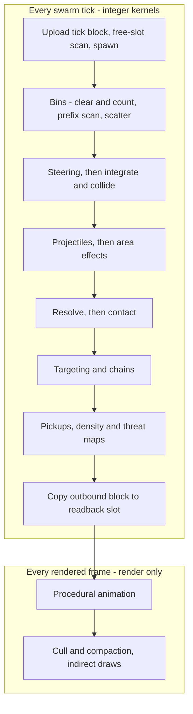
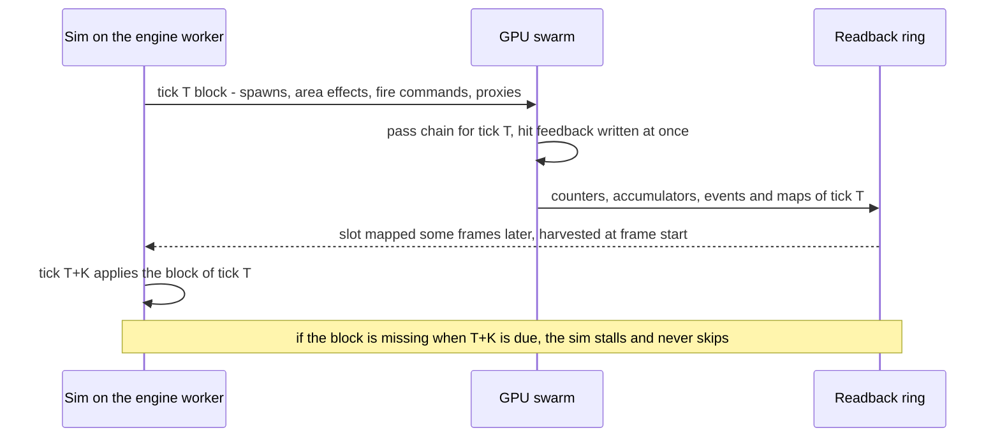

# GPU Swarm

SCRAPWAKE's hordes, bullets and scrap live on the GPU. The swarm is a chain of **integer compute passes** over packed SoA buffers. It runs once per swarm tick, talks to the CPU through a fixed, tick-stamped contract, and must reproduce a pure-JS reference bit for bit. This doc covers the data layout, the pass chain, the CPU↔GPU contract, latency, status effects, overflow, resets and testing. How the swarm is drawn is in [03-rendering](03-rendering.md#gpu-driven-rendering). The arithmetic rules every kernel follows are in [09-determinism-coop](09-determinism-coop.md#rules-for-sim-code).

> **The contract: the CPU decides *when* and *what*; the GPU decides *who* and *where*.** ([ADR-011](../DECISIONS.md#adr-011-two-tier-simulation))

## Goals

1. Sustain the [ceilings](../BUDGETS.md#entity-caps) within the [stress-scene targets](../BUDGETS.md#stress-ceiling-scene-m2-exit), and the design load within the [frame budget](../BUDGETS.md#at-design-load).
2. Deterministic, integer-only kernels: bit-identical to the JS reference, and across GPUs (the L2 target in [09](09-determinism-coop.md#determinism-levels)).
3. No CPU round trip on the hot path. Targeting, hits and hit feedback happen on the GPU, in the same tick.
4. An exact economy. Kills and scrap are counters, and counters can't be lost.
5. Stay inside the WebGPU default limits ([03: limits policy](03-rendering.md#webgpu-limits-policy)).

## Non-goals

- Per-unit scripts or per-unit pathfinding. Swarm units have a fixed behavior vocabulary, a type table and flow fields.
- Rigid-body physics, and swarm units that block PATCH.
- Saving swarm state ([ADR-019](../DECISIONS.md#adr-019-fodder-is-not-saved)).
- Determinism for particles, debris voxel particles, VFX and procedural animation.
- Float math in simulation kernels.

## Game requirements served

| Game need | Swarm feature |
|---|---|
| Vampire Survivors-scale hordes, thousands on screen | GPU-resident swarm units; the [design load](../BUDGETS.md#entity-caps) sits far below the ceilings |
| Towers and weapons never shoot at stale positions, and hits feel instant | GPU-side targeting driven by CPU fire commands; flashes, damage numbers and death VFX spawned on the GPU |
| Scrap is both XP and currency, and is never lost ([ADR-022](../DECISIONS.md#adr-022-scrap-is-both-xp-and-currency)) | Exact counters; gems merge at the cap |
| Walls reshape the horde's path, but PATCH is never trapped by a crowd | Flow-field steering by target mode ([06: navigation](06-world.md#navigation)); soft push, never body-blocking |
| Status-driven builds (Flame Vent, Arc Pylon, EMP Spire, chips) | A fixed status vocabulary |
| Director pacing, camera and audio intensity | Density and threat maps |
| Co-op later | Integer kernels, deterministic slots, a JS reference |

## Two-tier simulation

| | CPU actors | GPU swarm units |
|---|---|---|
| Who | PATCH, towers and wall segments, specialists, bosses, caches, the Forge, the director. Few ([ECS capacity](../BUDGETS.md#entity-caps)). | Fodder, projectiles, pickups; particles and debris voxel particles (render-only). Up to the [ceilings](../BUDGETS.md#entity-caps). |
| Logic | Any JS system ([02: ECS](02-core-ecs-jobs.md#ecs)) | Fixed kernels, a type table and the status vocabulary |
| Seen by the other tier as | Actor proxies, uploaded every tick | Counters, accumulators, events and maps, applied at *T+K* |
| Deterministic | Yes | Yes, except particles, VFX and procedural animation |
| In checkpoints | Yes | No ([ADR-019](../DECISIONS.md#adr-019-fodder-is-not-saved)) |

Reading the contract, with examples:
- **When and what (CPU).** The director decides that, e.g., 40 Scrubbers arrive on a ring around PATCH at tick *T*. A Rivet Turret decides to fire its pattern now, with the policy `strongest`. A Mortar decides a shell lands at a tile.
- **Who and where (GPU).** The spawn pass picks exact positions and slots. Targeting picks which unit is strongest in range *this* tick, and where the projectile goes. The projectile pass decides who gets hit.

---

## Data layout

### Buffers

| Binding | Contents | Access |
|---|---|---|
| `U` units | Persistent unit SoA ([below](#unit-record)) | read_write |
| `A` accumulators | Per-unit, per-tick atomics (damage, impulse, status, kill credit); bin counts, bin offsets and the bin index list; free lists; spawn-request lists | read_write, atomics |
| `P` shots | Projectile SoA and pickup SoA, each with its own offset table | read_write |
| `G` grids | Base and player flow fields, the blocked grid and height map ([06: collision](06-world.md#collision)), density and threat maps | read (maps read_write) |
| `I` inbound | This tick's block: header, spawn groups, area effects, fire commands, actor proxies | read |
| `O` outbound | This tick's counters, per-proxy accumulators, fire results, events and overflow flags | read_write, atomics |
| `T` tables | Sine table, type table, pattern table, status table | read |
| uniform | Per-pass constants and the **offset table** of every packed buffer | uniform |

- The unit SoA spans exactly **two** storage buffers (`U` and `A`). Each field is a contiguous array inside its buffer, and a uniform offset table says where. Adding a field or changing a capacity is a data change, not a binding change. A pass declares `A` as `array<atomic<i32>>` or as plain `array<u32>`, whichever it needs; it is the same buffer.
- No pass binds more than the default limit of 8 storage buffers per stage ([03](03-rendering.md#webgpu-limits-policy)).
- Pools are sized per performance tier from the [caps](../BUDGETS.md#entity-caps), and together they fit the swarm pool in [BUDGETS: GPU memory](../BUDGETS.md#gpu-memory). No binding comes close to the per-binding size limit.
- Dispatch sizes follow each pool's **high-water mark**, using indirect dispatch arguments written by the spawn pass, not the pool capacity. ([v0](#v0-scope) still dispatches over the capacity.)

### Unit record

```wgsl
// Offset table (uniform): element offset of each SoA field inside U and A.
struct UnitLayout {
  cap: u32,
  posX: u32, posY: u32,   // U: i32, Q10 m
  vel: u32,               // U: 2 x i16, Q10 m per tick
  altGen: u32,            // U: u16 altitude Q10 | u16 generation << 16
  hp: u32,                // U: i32, Q8
  info: u32,              // U: u8 type | u8 flags << 8 | u8 target mode << 16 | u8 anim phase << 24
  st0: u32, st1: u32,     // U: 8 x u8 status timers
  dmg: u32, impX: u32, impY: u32, stApply: u32, killer: u32,  // A: cleared by resolve
}
@group(0) @binding(0) var<uniform> L: UnitLayout;
@group(0) @binding(1) var<storage, read_write> U: array<u32>;
@group(0) @binding(2) var<storage, read_write> A: array<atomic<i32>>;

fn statusTimer(i: u32, s: u32) -> u32 {
  let w = U[select(L.st0, L.st1, s >= 4u) + i];
  return (w >> ((s & 3u) * 8u)) & 0xFFu;
}
fn addDamage(i: u32, q8: i32) { atomicAdd(&A[L.dmg + i], q8); }
fn applyStatus(i: u32, s: u32, tier: u32) {   // unary tier code: OR gives the max, in any order
  atomicOr(&A[L.stApply + i], i32(((1u << tier) - 1u) << (s * 3u)));
}
```

| Buffer | Field | Type | Bytes |
|---|---|---|---|
| `U` | Position x, y | `i32` Q10 | 8 |
| `U` | Velocity x, y | 2 × `i16` Q10 per tick | 4 |
| `U` | Altitude (flyers), generation | `u16` Q10 + `u16` | 4 |
| `U` | HP | `i32` Q8 | 4 |
| `U` | Type, flags (alive, flyer, elite…), target mode, anim phase | 4 × `u8` | 4 |
| `U` | Status timers | 8 × `u8` in 2 × `u32` | 8 |
| | **Persistent state** | | **32** |
| `A` | Damage accumulator | `atomic<i32>` Q8 | 4 |
| `A` | Impulse x, y | 2 × `atomic<i32>` Q10 per tick | 8 |
| `A` | Status application | `atomic<i32>` bit field: 8 statuses × 3-bit unary tier | 4 |
| `A` | Kill credit | `atomic<i32>` for `atomicMax`: largest hit (15 bits), then source index (16 bits) | 4 |
| `A` | Bin index entry | `u32` (plain view) | 4 |
| | **Total per unit slot** | | **56** |

For example, at the `high` ceiling this is about 5.6 MB for units. Rendering interpolates with `pos − vel × (1 − α)`, so no previous-position copy is stored. The anim phase is a sim-owned integer cycle (attack cadence, gait seed); the render-only animation pass reads it.

### Projectiles, pickups and tables

| Record | Fields | Bytes |
|---|---|---|
| Projectile | Position x, y (`i32` Q10); velocity (2 × `i16` Q10 per tick); damage (`i32` Q8); lifetime `u16`, pierce left `u8`, status and tier `u8`; pattern `u16`, team and flags `u8`, bounces `u8`; last hit (`u32` slot); source (`u32` index into the tick's command block) | 32 |
| Pickup | Position x, y (`i32` Q10); value (`u32` scrap units; merged gems carry the sum); kind `u8`, flags `u8`, age `u16` | 16 |

Fodder that shoots (e.g. Hover Wasps) uses the same projectile pool, with the team bit set.

The **type table** is uploaded from game data at load ([content: enemies](../game/02-content.md#enemies)), with up to 256 types:

| Fields | Used by |
|---|---|
| Speed (`i32` Q10 per tick), radius (`i32` Q10) | Steering, separation, hits, contact |
| Max HP, contact damage, armor (`i32` Q8); attack interval (`u8` ticks); knockback resistance (`u8`) | Spawn, contact, resolve |
| Behavior flags (`u32`: flyer, ranged, explodes on contact, splits on death…); status immunities (`u8` bitmask) | Steering, contact, resolve, status application |
| Threat weight (`u16`); drop chance (`u16` Q16) and drop value (`u16`) | Threat map, pickup drops |
| Mesh bucket, palette, anim set (`u16` each) | Rendering only |

The **pattern table** (projectile kind, count, spread, speed, lifetime, impulse, VFX) and the **status table** (duration per tier, damage per step) come from game data the same way.

### Deterministic slot allocation

1. **Free-slot scan.** Every tick, an exclusive prefix scan over each pool's dead flags writes that pool's free slots in **ascending order**. The same scan compacts the units that died last tick, which yields the drop and split requests in slot order.
2. **Requests in a fixed order.** CPU spawn groups arrive in upload order, which is already deterministic ([contract](#cpu-gpu-contract)). GPU-originated requests (pickup drops, projectiles from targeting, splits, detonations) come from the previous tick and are ordered by producer index through count → scan passes.
3. **Assignment.** Each spawn group carries its **request prefix**: the index of its first request, an exclusive prefix sum over the groups' counts computed on the CPU. Expanding the groups therefore needs no GPU scan. Request *j* takes free slot *j*. Requests beyond the free count are rejected in order and counted.
4. **Generations.** Reusing a slot increments its generation. Anything that references a unit (a homing projectile, a chain's hit mask) stores slot + generation and drops stale references.

The slot index is therefore a deterministic ID, and every tie-break uses it.

---

## Pass chain



| Pass | What it does | Why it is deterministic |
|---|---|---|
| Upload | `writeBuffer` of the tick's inbound block, plus field and collision-grid updates committed this tick | The CPU fixes the content |
| Free-slot scan | Ascending free lists; compacts last tick's drop, split and detonation requests | Prefix sums are exact |
| Spawn | Expands spawn groups. Positions come from `rand(seed, SPAWN, tick, j)` on the requested ring or edge, nudged off blocked cells | Ordered requests, stateless RNG |
| Bin clear and count | Clears the counts. Each live unit `atomicAdd`s its cell ([bin size](../BUDGETS.md#world-constants)); actor proxies are binned the same way into their own small bin set | Counts commute |
| Prefix scan | Cell start offsets. Uses subgroup ops when present, a workgroup shared-memory scan otherwise | Integer sums: identical on every path |
| Scatter | Writes slot IDs into each cell's range | Order inside a cell is **not** deterministic; see below |
| Steering | Flow-field sample by target mode, separation, proxy avoidance, soft push from PATCH. Flyers seek directly and ignore walls | Integer sums over order-independent inputs |
| Integrate and collide | Fixed-point integration. Ground units slide against the blocked grid (x then y); flyers stay above the height map | Per unit, nothing shared |
| Projectiles | Move; hit test through the bins, taking the nearest by (distance, slot); pierce; damage, status and impulse into accumulators; hits on actor proxies and on voxels | Min with a slot tie-break; atomics commute |
| Area effects | One workgroup per effect: shape vs bins → damage, status and impulse accumulators | Atomics commute |
| Resolve | Applies the accumulators; ticks status timers; deaths set the dead flag, bump per-type kill counters and kill credit; drop decisions from `rand(seed, DROP, tick, slot)`; death VFX and damage numbers | Per unit; counters commute |
| Contact | Per-proxy contact damage from adjacent hostile units, at each type's attack cadence | `atomicAdd` per proxy |
| Targeting and chains | Fire commands pick targets by policy, request projectiles or apply beams, and write turret yaw | Min/max with slot tie-breaks, in command order |
| Pickups | Magnet toward the nearest PATCH within its radius; collection into exact scrap counters; merging at the cap | Counters commute; nearest by (distance, player index) |
| Density and threat maps | Reductions onto a coarse grid | Counts commute |
| Outbound copy | Copies the outbound block into the frame's slot of the readback ring | — |

**Order independence.** Scatter uses the value returned by `atomicAdd` as a position, so the order of slots inside a cell changes from run to run. Every consumer of the bins must therefore be order-independent: commutative integer sums, or min/max with a slot tie-break. There are no "first N neighbors" loops and no early exits on the first hit. Sorting inside cells was rejected: it costs a segmented sort every tick and buys nothing once every consumer is order-independent.

**Separation stays O(1) in dense crowds.** A unit applies pairwise linear repulsion against the members of its 3×3 bin neighbourhood, but only in cells whose *count* is at or below the [pairwise cap](../BUDGETS.md#simulation-constants). Denser cells contribute two O(1) terms instead: an expansion away from the cell's centroid (its exact integer position sum divided by its count) and a density-gradient pressure from the nine bin counts. All of these are order-independent integer sums, so none depends on scatter order.

**Target modes.** Chase follows the player field; Assault follows the base field toward the Forge; Seek steers straight at a proxy (flyers, final approach); Scatter moves away from an effect center (EMP). PATCH's proxy pushes units away softly as they overlap. PATCH's own movement ignores the swarm, so crowds part but never block ([ADR-017](../DECISIONS.md#adr-017-25d-navigation-with-flow-fields) covers flyers and walls).

**Targeting policies.** `nearest` minimizes (distance², slot); `strongest` maximizes current HP, ties to the lower slot; `first` minimizes the base-field distance to the Forge, then distance, then slot; `chain` picks like `nearest`, then bounces (below); `aimed` fires along the command's angle (aim override). Candidates include enemy actor proxies (specialists, bosses) as well as swarm units. Each fire command gets one workgroup, whose invocations split the candidate cells and combine results with an order-independent reduction.

**Chain lightning** is one dispatch per bounce. Each active chain finds the nearest unit to its last target within the bounce range, skipping its **hit mask** (slot + generation of every unit it has already struck), then deals its damage.

**One-tick lags, fixed everywhere.** Projectiles requested by targeting at tick *T* appear in the spawn pass of *T+1*. Muzzle flashes and turret yaw are immediate, so the lag is invisible. Beam and chain damage lands in the accumulators after this tick's resolve, so it is applied by the next tick's resolve.

**Gems merge past the cap.** When the pickup pool reaches its cap, the merge rule in [BUDGETS](../BUDGETS.md#entity-caps) applies. A deterministic selection of gems near PATCH (a distance band, ties by slot) folds into one gem whose value is the `atomicAdd` sum of theirs. Drops that found no free slot add their value to it too, so no scrap is ever lost.

**Walls are actors.** Player walls are tower segments with proxies ([caps](../BUDGETS.md#entity-caps)), so a crowd chewing on a wall produces exact per-proxy damage, not thousands of events. The CPU then removes the wall's voxels ([06](06-world.md#edits-and-damage)).

Steering and integration, reduced to the flow-field term:

```wgsl
struct Params {
  count: u32, posX: u32, posY: u32, vel: u32, info: u32,  // SoA offsets in U
  sinLut: u32, speed: u32,                                // offsets in T
  baseOff: u32, baseW: u32, baseShift: u32,               // base field in G: 1 m cells
  playerOff: u32, playerW: u32, playerShift: u32,         // player field in G: 2 m cells
}
const NO_PATH = 0xFFFFu; const MODE_ASSAULT = 1u;
@group(0) @binding(0) var<uniform> P: Params;
@group(0) @binding(1) var<storage, read_write> U: array<u32>;
@group(0) @binding(2) var<storage, read> G: array<u32>;   // per cell: distance << 16 | binary angle
@group(0) @binding(3) var<storage, read> T: array<i32>;
fn sinB(a: u32) -> i32 { return T[P.sinLut + ((a >> 4u) & 4095u)]; }  // Q14
fn cosB(a: u32) -> i32 { return sinB(a + 16384u); }

@compute @workgroup_size(256)
fn steerIntegrate(@builtin(global_invocation_id) gid: vec3<u32>) {
  let i = gid.x;
  if (i >= P.count) { return; }
  let info = U[P.info + i];
  if ((info & 0x100u) == 0u) { return; }            // flags bit 0: alive
  let x = bitcast<i32>(U[P.posX + i]); let y = bitcast<i32>(U[P.posY + i]);
  let v = U[P.vel + i];
  var vx = bitcast<i32>(v << 16u) >> 16u;           // sign-extend the i16 halves
  var vy = bitcast<i32>(v) >> 16u;
  let assault = ((info >> 16u) & 0xFFu) == MODE_ASSAULT;
  let off = select(P.playerOff, P.baseOff, assault);
  let w = select(P.playerW, P.baseW, assault);
  let sh = select(P.playerShift, P.baseShift, assault);
  let cx = u32(clamp(x >> sh, 0, i32(w) - 1));       // fields are square
  let cy = u32(clamp(y >> sh, 0, i32(w) - 1));
  let cell = G[off + cy * w + cx];
  if ((cell >> 16u) != NO_PATH) {
    let spd = T[P.speed + (info & 0xFFu)];          // Q10 per tick, below 2^10
    vx += (((spd * cosB(cell & 0xFFFFu)) >> 14u) - vx) >> 2u;  // product below 2^24
    vy += (((spd * sinB(cell & 0xFFFFu)) >> 14u) - vy) >> 2u;
  }
  U[P.vel + i] = (u32(vy) << 16u) | (u32(vx) & 0xFFFFu);
  U[P.posX + i] = bitcast<u32>(x + vx);             // wall collision follows
  U[P.posY + i] = bitcast<u32>(y + vy);
}
```

The kernel assumes a packed field cell (distance to the goal and a direction angle). The authoritative field format is in [06: navigation](06-world.md#navigation).

### v0 scope

The first implementation (M2) runs a subset of the chain, with the same determinism rules:

| | Passes and features |
|---|---|
| **In v0** | Free-slot scan, shot spawn (projectiles), unit spawn, bins, steering, integrate, projectiles, resolve, contact, targeting (`nearest` only), outbound copy |
| **Later** | Subgroup scans (v0 uses the workgroup-memory scan), area effects, statuses, pickups, events and flow fields; also the other target policies, chains, and the density and threat maps |

- v0 dispatches over each pool's **capacity**. Indirect dispatch by high-water mark ([buffers](#buffers)) comes later.
- Spawn groups already carry their CPU-computed request prefix ([slot allocation](#deterministic-slot-allocation)).

## CPU-GPU contract

### Inbound, every tick (CPU → GPU)

| Stream | Record | Cap | Ordering rule |
|---|---|---|---|
| Header | 16 B: tick; spawn, effect, fire and proxy counts; flags (swarm reset, field swap) | 1 | — |
| Spawn groups | 32 B: type, target mode, shape (point, ring, edge), flags, count, request prefix (computed on the CPU), HP scale, center x/y, radii | Bounded by free slots | Command-buffer key order; the request prefix follows it |
| Area effects | 32 B: shape (circle, cone, capsule, ring), team, status and tier, center x/y, size and angle, damage Q8, impulse Q10, source | [Per tick](../BUDGETS.md#entity-caps) | Command-buffer key order; cap applied after the merge |
| Fire commands | 32 B: source entity, source proxy, pattern, policy, pierce, status and tier, flags, aim angle, bounces, range Q10, damage Q8, origin x/y | [Per tick](../BUDGETS.md#entity-caps) | Command-buffer key order; cap applied after the merge |
| Actor proxies | 24 B: entity, x/y, radius, aux (magnet radius for collectors), team, kind, flags (targetable, blocks units, collector, marked), HP Q8 | [Per tick](../BUDGETS.md#entity-caps) | Ascending entity handle |

- Every inbound list except proxies is written through command-buffer segments and merged in (system ID, chunk index, row, sequence) order ([02](02-core-ecs-jobs.md#command-buffers-and-events)). Records beyond a cap are dropped in that order and reported as "not fired" at *T+K*, exactly like a no-target result.
- One `PostSim` system writes the proxies in ascending entity order, so proxy indices are deterministic. It also fills in each fire command's source proxy index. The CPU keeps each tick's proxy and command tables until *T+K* to map indices back to entities, and ignores entities that died in the meantime.

### Outbound, every tick (GPU → CPU)

| Part | Content | Exact? | Consumer at *T+K* |
|---|---|---|---|
| Header | Tick, overflow bit per event class, event count, optional swarm state hash | — | The engine asserts that ticks arrive in sequence |
| Counters | Kills per unit type; kills per source; scrap collected per player; scrap dropped; spawns rejected | Yes (integer atomics) | Economy, XP, director, stats |
| Per-proxy accumulators | Damage taken by each player-team proxy (contact, enemy shots); damage dealt to specialist and boss proxies | Yes | Health systems |
| Fire results | 1 bit per fire command: fired, or no target | Yes | Cooldown refunds |
| Events | 16 B each: kind, flags, aux, target (proxy entity or packed voxel coordinates), source, value. Classes: voxel damage; specialist and boss hit detail (statuses, crits, on-hit effects); stats | Capped ([per tick](../BUDGETS.md#entity-caps)), with priorities | World edits, on-hit effects, stats |
| Maps | Density and threat per coarse cell | Yes (reductions) | Director at *T+K*; camera and audio whenever they like |

- Counters, accumulators and maps are order-free by construction. Events are sorted on the CPU by their full record before they enter the event channels, so identical records are interchangeable and the apply order is deterministic.
- Every block carries its tick.

The CPU side of a fire command, deciding when and what, but never who:

```js
// @ts-check
import { System } from '../../engine/ecs/system.js';
import { Transform, Turret } from '../components/index.js';

/** Decides WHEN a turret fires and WHAT it fires. The GPU decides WHO gets hit. */
export class TurretFireSystem extends System {
  static stage = 'Sim';
  static reads = [Transform];
  static writes = [Turret];
  static query = { all: [Turret, Transform] };

  /**
   * @param {import('../../engine/ecs/chunk-view.js').ChunkView} c
   * @param {import('../../engine/ecs/command-buffer.js').CommandBuffer} cmd  this job's segment
   */
  run(c, cmd) {
    const I32 = this.heap.i32, fire = cmd.swarm;   // fire-command writer, same segment keys
    const cd = c.col(Turret.cooldown), every = c.col(Turret.interval);
    const pat = c.col(Turret.pattern), pol = c.col(Turret.policy);
    const dmg = c.col(Turret.damageQ8), range = c.col(Turret.rangeQ10);
    const x = c.col(Transform.x), y = c.col(Transform.y);
    for (let i = 0, n = c.count; i < n; i++) {
      if (I32[cd + i] > 0) { I32[cd + i] = (I32[cd + i] - 1) | 0; continue; }
      // No target test: the GPU picks one, or reports "not fired" at T+K,
      // and TurretRefundSystem gives the cooldown back then.
      fire.push(c.entity(i), I32[pat + i], I32[pol + i],
                I32[x + i], I32[y + i], I32[range + i], I32[dmg + i]);
      I32[cd + i] = I32[every + i];
    }
  }
}
```

## K-latency and stalls



- Each frame copies the outbound blocks of the ticks it simulated into one slot of the [readback ring](03-rendering.md#readback-ring), then maps it. At the start of later frames, the engine harvests mapped slots ([frame pipeline](01-overview.md#frame-pipeline)): it copies each block into a pending-block ring in the heap and unmaps the slot at once. The ring's depth rule lives in [03](03-rendering.md#readback-ring). Blocks are **per tick**, never merged per frame: a frame may carry several ticks, and the grouping differs between machines. The M1 spike measures submit-to-harvest latency against the [readback target](../BUDGETS.md#latency-targets).
- The block of tick *T* is applied at the start of tick *T+K* ([K](../BUDGETS.md#simulation-constants)). Never earlier, never later. The delay counts ticks, not frames, so it doesn't depend on the frame rate, and every peer applies a block on the same tick.
- If the block hasn't been harvested when *T+K* is due, **the sim stalls**: that tick doesn't run this frame. Rendering, UI and audio carry on; interpolation clamps at the last tick, so the world holds still for a frame. Events are never skipped and never applied late. Stalls are counted in the perf overlay and asserted in perf CI.
- **Feedback never waits for *K*.** Hit flashes, damage numbers ([world-space UI](03-rendering.md#world-space-ui)), death VFX, turret yaw and even PATCH's own hurt flash (from the proxy accumulators) are written by the GPU in the same tick. Only gameplay consequences (HP, scrap, on-hit effects) wait for *T+K*.
- **Half-rate swarm (reserve, unused in v1).** If the `std` profile ever needs it ([rate](../BUDGETS.md#simulation-constants)), the swarm passes run on every second sim tick and rendering interpolates. CPU commands stamped on an off tick run in the next swarm tick, in order, and *K* still counts sim ticks. The rate belongs to the [sim profile](../BUDGETS.md#sim-profiles), so it never changes mid-run.

## Status effects

Each swarm unit carries one timer per status, up to the [status limit](../BUDGETS.md#simulation-constants). The vocabulary is fixed:

| # | Status | What the kernels do | Example sources |
|---|---|---|---|
| 0 | **Burning** | Damage on every timer step, in resolve | Flame Vent |
| 1 | **Shocked** | Chains prefer shocked units and bounce farther; small damage per step | Arc Pylon, chain weapons |
| 2 | **Slowed** | Steering speed scaled down | Parts and chips |
| 3 | **Stunned (EMP)** | No steering, no contact damage, no shooting; flyers sink to the height map | EMP Spire |
| 4 | **Marked** | Takes extra damage; fire commands flagged "prefer marked" target it first | Spotter parts and chips |
| 5 | **Corroded** | Ignores the type's armor; small damage per step | Acid weapons |
| 6 | **Magnetized** | Pulled toward the nearest proxy flagged as a magnet, as an impulse per step | Magnet parts, Harvester |
| 7 | **Overheated** | Detonates on death: a GPU-originated area effect in the next tick | Fire and overclock synergies |

Tuning (durations per tier, damage per step, multipliers) lives in game data ([content: parts](../game/02-content.md#parts), [towers](../game/02-content.md#towers)).

- **Timers** are `u8` counts of timer steps ([step size](../BUDGETS.md#simulation-constants)), packed four to a `u32`. Resolve decrements every nonzero timer once per step.
- **Application is order-independent.** A hit or an area effect carries (status, tier), with tier 1–3. It ORs the status's 3-bit field in the unit's `stApply` accumulator with a unary code (`001`, `011`, `111`). The OR of unary codes is the highest tier, in any order. Resolve turns the tier into a duration from the status table and sets `timer = max(timer, duration)`, unless the type's immunity bitmask blocks that status.
- **Knockback** is not a status. Hits and effects `atomicAdd` an impulse (Q10 per tick) into `impX` and `impY`. Resolve scales it by the type's knockback resistance and adds it to the velocity; stunned or anchored types ignore it.

## Overflow policy

| Buffer | Capacity | On overflow |
|---|---|---|
| Unit, projectile and pickup pools | [Ceilings](../BUDGETS.md#entity-caps) per tier | Requests beyond the free slots are rejected in request order and counted in `spawnsRejected`; the director throttles. Pickups merge instead ([above](#pass-chain)). Deterministic. |
| Counters, per-proxy accumulators | 32-bit, reset every tick | Sized so a single tick can't overflow them. For example, every unit in the pool hitting one proxy with the largest contact damage in the type table must still fit in `i32`; the asset cooker checks this for the current data. |
| Inbound area effects and fire commands | [Per-tick caps](../BUDGETS.md#entity-caps) | Applied after the merge, in key order. The excess reads as "not fired" at *T+K*. Dev builds assert. |
| Events | [GPU→CPU events per tick](../BUDGETS.md#entity-caps) | Two watermarks. **Stats** events stop at a soft watermark below the cap; gameplay classes (voxel damage, specialist and boss hits) may use the rest. Any drop sets that class's overflow bit. |
| Bins | One entry per live unit | Cannot overflow |

- **The economy never rides on events.** Kills and scrap are counters, and damage totals on actors are per-proxy accumulators. An overflow can lose *detail* (an on-hit effect, a stat line, a damage number), never a total.
- **Overflow is not deterministic**: which records win the race for the atomic cursor depends on the GPU. An overflow bit therefore taints the run for replays and co-op ([09](09-determinism-coop.md#replays-and-hashes)), dev builds assert, and the M2 exit requires **zero** overflow in stress scenes ([ROADMAP](../ROADMAP.md#milestones)).

## Resets and device loss

- On [device loss](03-rendering.md#device-loss), the renderer rebuilds the device, pipelines and buffers. Static swarm data (tables, sine table, fields, collision grids) is uploaded again from the CPU copies.
- Swarm state is gone: fodder, projectiles and the pickups lying on the ground. So are the outbound blocks of the ticks still in flight.
- The engine turns this into a **swarm reset** command at tick *R*, carried in that tick's inbound header and recorded in the command log. The command names the first discarded tick. All pools are cleared at *R*, blocks from the discarded ticks count as empty, and the director respawns fodder at the district's spawn edges ([ADR-019](../DECISIONS.md#adr-019-fodder-is-not-saved)).
- Scrap on the ground is known exactly: scrap dropped minus scrap collected, both counters. After a reset, the economy re-spawns the outstanding value near PATCH as merged gems, so no scrap is lost.
- Because the reset is a logged command, a replay reproduces it on the same tick, and co-op peers apply it together ([09](09-determinism-coop.md#co-op-model)). Resuming from a checkpoint uses the same path.

## Reference implementation

- `engine/swarm/reference/` holds one JS class per kernel, with the same names and the same integer operations (`Math.imul`, `| 0`, the [fixed-point helpers](09-determinism-coop.md#fixed-point-formats)). It works on typed arrays with **the same packed layout** as the GPU buffers, and runs one swarm tick at small scale (e.g. a few thousand units): it exists for correctness, not speed.
- **Canonical state hash:** xxhash32-style over the persistent pools (by slot), the counters, the per-proxy accumulators, the fire results and the sorted event list. Bins, accumulator scratch and render-only data are excluded, because their order or content may legitimately differ.
- **Shuffle mode:** the reference can randomize the order inside each bin, and the order of its atomic operations, to prove that every consumer is order-independent. The hash must not change.
- **Where it runs.** In CI, the same inbound command streams go through the reference and through the WGSL kernels on SwiftShader in headless Chromium ([10: testing](10-tooling-testing.md#testing-strategy)), and hashes must be bit-identical on every tick (L1). On the device lab, the same scenes run on every reference GPU (L2, [09](09-determinism-coop.md#determinism-levels)). After a mismatch, a pass-by-pass run diffs the buffers after each pass and names the first divergent kernel.
- **Debug views** ([dev tools](10-tooling-testing.md#dev-tools)): a bin heatmap, flow vectors, unit slot and generation labels, the per-class event log with overflow bits, counter graphs, status overlays, and per-pass GPU timings (with `timestamp-query` where available).
- **Command-stream capture and replay:** record a run's inbound blocks plus the initial pool state, then replay them into the swarm alone, without the CPU sim. This isolates kernel regressions and performance work on exactly the load that caused a problem.

---

## Thread ownership

| Resource | Owner | Notes |
|---|---|---|
| Swarm buffers, pipelines, pass encoding | Engine worker | The only thread with the WebGPU device |
| Inbound block | Engine worker | Merged from every thread's segments at the sync point |
| Readback harvest, pending blocks, apply at *T+K* | Engine worker | |
| Flow fields, collision grids | Built by job workers ([06](06-world.md#navigation)); uploaded by the engine worker at their commit ticks | |
| Swarm state; debug views | GPU (authoritative for swarm units); the engine worker draws debug views, main-thread dev tools toggle them | |

## Budgets

- GPU time for all swarm passes: [BUDGETS: GPU frame budgets](../BUDGETS.md#gpu-frame-budgets), both [at design load](../BUDGETS.md#at-design-load) and in the [stress-ceiling scene](../BUDGETS.md#stress-ceiling-scene-m2-exit).
- Pool sizes, per-tick inbound caps and event caps: [BUDGETS: entity caps](../BUDGETS.md#entity-caps).
- Swarm GPU memory and readback rings: [BUDGETS: GPU memory](../BUDGETS.md#gpu-memory).
- CPU cost of applying blocks: [BUDGETS: engine worker](../BUDGETS.md#engine-worker-per-frame).
- *K*, the swarm rate and the status limits: [BUDGETS: simulation constants](../BUDGETS.md#simulation-constants). Bin size: [world constants](../BUDGETS.md#world-constants). Readback latency: [latency targets](../BUDGETS.md#latency-targets).

## Fallbacks & failure modes

| Situation | Behavior |
|---|---|
| Readback block late at *T+K* | The sim stalls; rendering continues; nothing is skipped |
| Event overflow | Stats dropped first; overflow bit set; run tainted; dev builds assert |
| A pool is full | Deterministic rejection and a counter; the director throttles; gems merge |
| `subgroups` feature missing | Workgroup shared-memory scans and reductions, with identical results |
| `timestamp-query` missing | No per-pass GPU timings; the overlay shows CPU-side frame timing only |
| `std` over budget | The render-only step-down ([08](08-platforms.md#tier-detection)). Caps and the swarm rate change only between runs. |
| Device loss | Swarm reset ([above](#resets-and-device-loss)) |
| WGSL hash differs from the reference in CI | The build fails; the per-pass diff names the kernel |

## Testing

- **Reference equivalence** in CI (L1) and on the device lab (L2), as [above](#reference-implementation).
- **Scene tests per pass:** two units separating; a projectile with pierce 2 through a line of units; chain bounces respecting the hit mask; area-effect edges; status tiers combining by OR; kill-credit ties; spawn-rejection order; gem merging (the sum of values is unchanged).
- **Order independence:** shuffle mode in the reference; on the GPU, the same scene with different workgroup sizes and dispatch splits must give the same hash.
- **Timing independence:** random readback delays (a [dev tool](10-tooling-testing.md#dev-tools)) change only wall time. The state hashes must equal those of a run without delays.
- **Overflow:** tiny caps force overflows. Bits get set, stats go first, and counters stay exact.
- **Device loss:** `device.destroy()` mid-run triggers the reset path, and a replay of that run reproduces the reset.
- **Performance:** stress scenes against the [stress targets](../BUDGETS.md#stress-ceiling-scene-m2-exit), with zero overflow ([ROADMAP](../ROADMAP.md#milestones)).

## Open questions

- Subgroup availability on the reference devices (to verify in M1). Is a second code path worth it?
- Should voxel-hit events be pre-aggregated per coarse cell (e.g. 1 m) on the GPU, to cut event volume when many shots hit one wall?
- Is the initial density/threat map cell ([BUDGETS](../BUDGETS.md#simulation-constants), one cell per voxel-chunk column) fine enough for the director and the camera? Validate in M2.
- Long-range targeting: a hierarchical search over the coarse map, or brute force over bins with early ring termination?
- Dispatch count on the Steam Deck: about 16 small dispatches per swarm tick, times the ticks run per frame. Which passes should be fused?
- Atomic contention in extreme crowds (thousands of units in one cell), especially on integrated GPUs.
- Should flyers get their own pool and passes, instead of a flag?
- Is "largest single hit gets the kill" the right credit rule for on-kill effects? A design question for the GDD.
