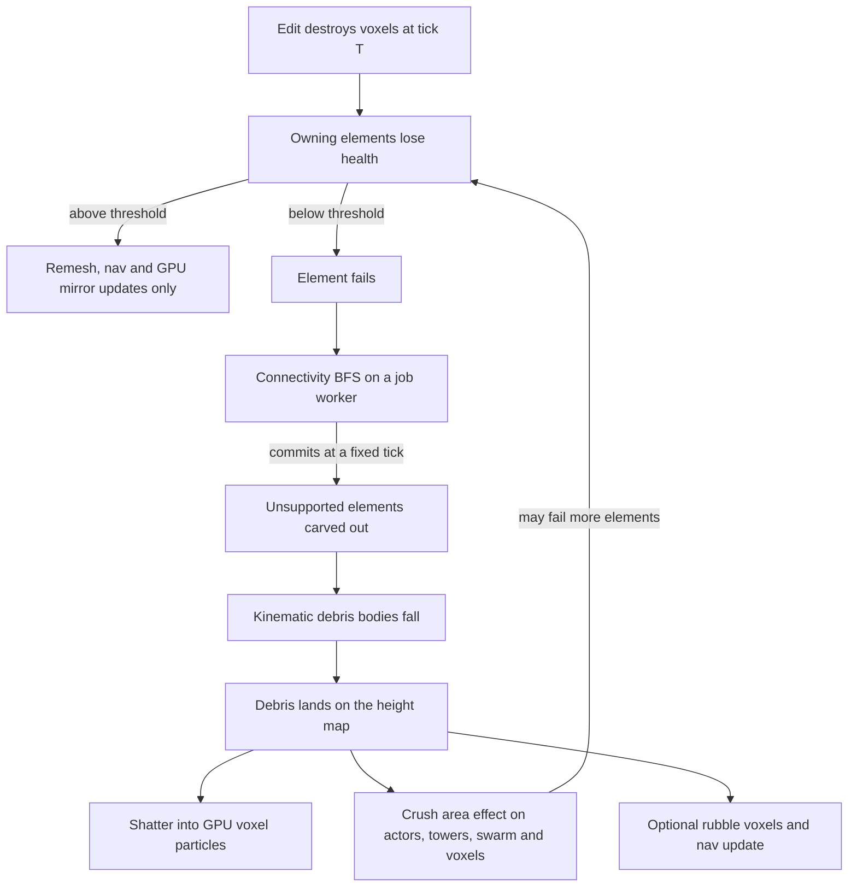
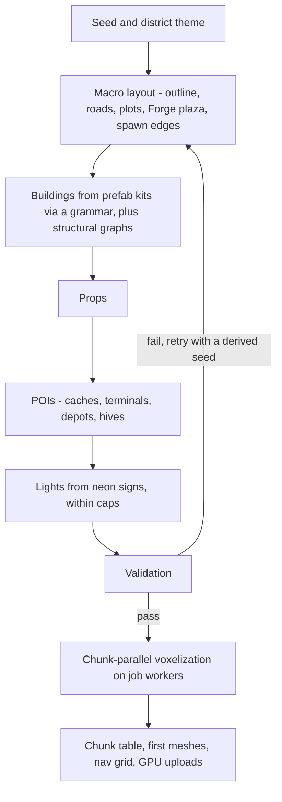

# World: voxels, destruction, collision, navigation, generation

The world of one Cycle is a bounded, fully destructible voxel district. The engine worker owns it as the single **voxel authority**. Job workers mesh it, generate it and solve flow fields over it.

This doc covers voxel storage, edits and damage, structural collapse, kinematic debris, collision, 2.5D navigation and seeded procedural generation. Related docs:
- Rendering the meshes: [03](03-rendering.md#voxel-rendering).
- The swarm's side of world collision: [05](05-gpu-swarm.md).
- Every number: [BUDGETS.md](../BUDGETS.md#world-constants).

## Goals

1. **Everything breaks.** Every voxel except the reinforced foundation is destructible, and buildings collapse when their supports go ([ADR-015](../DECISIONS.md#adr-015-structural-graphs-for-collapse)).
2. **Fixed memory.** Storage fits the voxel arena of the fixed heap ([BUDGETS](../BUDGETS.md#shared-heap)). Caps are enforced when a district is generated, not discovered at runtime.
3. **Deterministic.** Edits, collapse, collision, navigation and generation are integer-only and ordered, and async results commit at fixed ticks ([ADR-012](../DECISIONS.md#adr-012-integer-deterministic-simulation), [09](09-determinism-coop.md#async-results-at-fixed-ticks)).
4. **Responsive.** Remeshing, field re-solves and collapses stay inside their worker budgets ([BUDGETS](../BUDGETS.md#job-workers-asynchronous-work)).
5. **Cheap saves.** Untouched chunks regenerate from the seed, so saves store only deltas ([ADR-014](../DECISIONS.md#adr-014-voxel-world-format-and-district-size)).

## Non-goals

- Rigid-body physics, joints or realistic stress analysis. Debris is kinematic.
- More than one walkable layer, or multi-storey interiors ([ADR-017](../DECISIONS.md#adr-017-25d-navigation-with-flow-fields)).
- Fluids, fire spread, per-voxel light propagation.
- Streaming or unbounded worlds. A district has a fixed size.
- Freeform player sculpting. Players build towers and walls on the build grid ([GDD](../game/01-gdd.md#base-and-towers)).

## Game requirements served

| Game need | World feature |
|---|---|
| "Everything breaks" | 1-byte voxels with damage stages, a materials table, the carve/place/damage API |
| Buildings fall on enemies, and on your own towers | Structural-graph collapse, kinematic debris, crush area effects |
| Walls reshape enemy paths | A u8 cost grid with HP buckets; the base field re-solves on bucket crossings |
| Breachers dig toward the Forge | Wall costs, the minimum breach width, voxel-damage events from the GPU |
| The swarm doesn't walk through buildings | A GPU height map and blocked grid ([05](05-gpu-swarm.md)) |
| Towers and snipers need line of sight | Voxel DDA raycasts with a blocks-sight flag |
| A new district every Cycle | Seeded PCG from prefab kits, validated, chunk-parallel |
| Mid-run checkpoints | A delta log; untouched chunks regenerate |

## Voxel storage

A district is a 3D grid of voxel chunks. The voxel size, chunk size, district dimensions, chunk count and the dense-chunk cap are in [BUDGETS](../BUDGETS.md#world-constants). Every tier uses the same district size.

**Voxel byte.** `material = v & 0x3F` and `stage = v >> 6`. Material 0 is air. Stages run from 0 (intact) to 3 (critical); see [Edits and damage](#edits-and-damage).

**Chunk table.** One fixed 32-byte entry per chunk, in the voxel arena ([BUDGETS](../BUDGETS.md#shared-heap)):

| Offset | Field | Type | Notes |
|---|---|---|---|
| 0 | `state` | u8 | 0 = air, 1 = uniform solid, 2 = dense |
| 1 | `uniformVoxel` | u8 | The voxel byte of a uniform chunk |
| 2 | `dirty` | u16 | MESH, GPU_WORLD, NAV, STRUCT, DELTA flags |
| 4 | `denseSlot` | u32 | Slot in the dense pool, or `0xFFFFFFFF` |
| 8 | `version` | u32 | Bumped by every applied edit batch. Job results carry it, and stale results are discarded. |
| 12 | `meshHandle` | u32 | Mesh-pool allocation ([03](03-rendering.md#voxel-rendering)) |
| 16 | `quadCount` | u32 | For the chunk's indirect args |
| 20 | `elemRefStart` | u32 | First entry in the element-ref table |
| 24 | `elemRefCount` | u16 | Structural elements overlapping this chunk |
| 26 | `solidCount` | u16 | Non-air voxels, for cheap uniform detection |
| 28 | `flags` | u32 | Touched-since-generation, has-emissive, peelable… |

**Dense pool.** Fixed-size slots, each holding one dense chunk's voxel bytes; the slot count is the dense-chunk cap. The voxel index inside a chunk is `x | y << 5 | z << 10`.
- An edit on a uniform chunk allocates a slot and fills it with the uniform byte.
- A dense chunk that becomes all air, or all one byte value, returns to uniform at the end of the tick and frees its slot.
- Every other chunk must stay uniform. That is what makes the cap hold ([Procedural generation](#procedural-generation)).

**GPU mirrors** are never authoritative: a column height map and a 2D blocked grid. They are updated from dirty flags and read by the swarm ([05](05-gpu-swarm.md#data-layout)) and by debris particles ([03](03-rendering.md#particles-and-transparency)).

**Materials table.** One entry per material ID, loaded from game data:

| Column | Type | Use |
|---|---|---|
| HP per stage | Q8 | Damage needed to advance one stage |
| Resistance per damage type | Q8 multiplier | E.g. kinetic, explosive, thermal, arc |
| Scrap yield | Integer | Per destroyed voxel, before diminishing returns |
| Debris color | Palette token | GPU voxel particles |
| Sound class | Enum | Hit, break and collapse sounds |
| Emissive | Color + intensity | Neon, screens |
| Flags | Bits | `BLOCKS_NAV`, `BLOCKS_SIGHT`, `INDESTRUCTIBLE`, `STRUCTURAL`, `RUBBLE` |

Example materials. Tuning values live in the game data ([GDD destruction](../game/01-gdd.md#destruction)); colors are [palette tokens](../game/03-art-audio.md#palette).

| Material | HP per stage | Resistances | Scrap | Debris color | Notes |
|---|---|---|---|---|---|
| Concrete | Medium | Weak to explosive | Low | Concrete | Default walls |
| Rebar concrete | High | Resists kinetic | Low | Concrete | Pillars and slabs |
| Sheet steel | Medium | Resists thermal | Medium | Steel | Shutters, containers |
| Glass | Very low | — | None | Holo white | Blocks movement, not sight |
| Neon tube | Very low | — | Low | Sodium orange or Halcyon cyan | Emissive; its attached light dies with it |
| Rusted metal | Low | Weak to kinetic | Medium | Rust | Docks, scrap piles |
| Dirt | Low | Weak to explosive | None | Rust | Ground; craters |
| Rubble | Very low | — | None | Concrete | Created by debris, so it never seals a path for long |
| Reinforced foundation | — | — | None | Night | `INDESTRUCTIBLE`: the district floor and the Forge pad |

## Edits and damage

Game systems never write voxel bytes. They queue edits, and the engine worker applies them in a deterministic order at a sync point at the end of each tick. The consequences (meshes, nav, structure) are visible from the next tick.

| Call | Effect |
|---|---|
| `carve(shape)` | Removes every voxel inside the shape (sphere, box or capsule) |
| `place(shape, material)` | Fills the shape's air voxels: walls, rubble |
| `damage(pos, amount, type)` | Damages one voxel. Shaped damage (explosions) expands into per-voxel records. |

**Ordering.** Records carry (tick, kind, source ID, sequence), and each tick's records are radix-sorted by that key before they are applied. Voxel-damage events from the GPU arrive at *T+K* in arbitrary order ([05](05-gpu-swarm.md#cpu-gpu-contract)), so they are first sorted by (voxel index, source ID).

**Damage stages.** A voxel has no HP of its own, only its 2-bit stage.
- Damage advances the stage by whole multiples of the material's HP per stage.
- The remainder advances one more stage with a probability drawn from the hash RNG ([09](09-determinism-coop.md#random-numbers)). Large and small hits are therefore fair on average, and fully deterministic.
- A voxel whose stage would pass 3 is destroyed.

```js
// @ts-check
import { INDESTRUCTIBLE } from './materials.js';

/** Applies one voxel-damage record. Simulation code: integers only (ADR-012). */
export class VoxelDamage {
  /** @param {import('./materials.js').MaterialTable} mat */
  constructor(mat) { this.mat = mat; }

  /**
   * @param {number} v voxel byte @param {number} amountQ8 damage in Q8 HP
   * @param {number} type damage type @param {number} rng u32 from hash(seed, stream, tick, voxel)
   * @returns {number} the new voxel byte; 0 means destroyed
   */
  apply(v, amountQ8, type, rng) {
    const m = v & 63;
    if (m === 0 || (this.mat.flags[m] & INDESTRUCTIBLE) !== 0) return v;
    const eff = Math.imul(amountQ8, this.mat.resist[(m << 3) | type]) >> 8; // Q8 multiplier
    const hp = this.mat.hpPerStage[m];                                      // Q8, always > 0
    let steps = (eff / hp) | 0;                                             // exact for 32-bit ints
    if ((rng >>> 0) % hp < eff - Math.imul(steps, hp)) steps++;            // remainder, by chance
    const stage = (v >> 6) + steps;
    return stage > 3 ? 0 : m | (stage << 6);
  }
}
```

Destroyed voxels are reported with their material and source, so gameplay can pay out scrap with diminishing returns ([GDD economy](../game/01-gdd.md#economy)). The scrap spawns as pickups through GPU spawn commands ([05](05-gpu-swarm.md#cpu-gpu-contract)).

**Dirty propagation.** After a tick's edits are applied, each touched chunk's dirty flags fan out:

| Flag | Consumer | Rule |
|---|---|---|
| MESH | Remesh queue, then job workers | Also set on a neighbor when a border voxel changes. Priority: visible chunks, then chunks near the camera, then the rest. The per-frame cap is in [BUDGETS](../BUDGETS.md#job-workers-asynchronous-work). Repeated edits collapse into one job for the latest version. |
| GPU_WORLD | Frame uploads | Dirty rectangles of the column height map and blocked grid go up with the frame's uploads |
| NAV | Nav cost grid | Affected cells are reclassified. A bucket crossing or topology change requests a field re-solve ([Navigation](#navigation)). |
| STRUCT | Structural elements | Destroyed voxels decrement their element's health ([Structural collapse](#structural-collapse)) |
| DELTA | Delta log | The chunk is marked as diverged from its generated state |

**Delta log and saves.** The delta log is the touched-chunk bitset plus the structural state (element health, failed elements).
- A checkpoint serializes the touched chunks, RLE-compressed ([save policy](../game/01-gdd.md#save-policy), [08](08-platforms.md#saves)).
- Loading regenerates the district plan and every chunk from the seed, then overwrites the touched chunks ([ADR-014](../DECISIONS.md#adr-014-voxel-world-format-and-district-size)).
- Checkpoints wait for in-flight collapses to settle. The wait is bounded by the collapse budget.

## Structural collapse

Collapse is evaluated on each building's **structural graph**, not by flood-filling voxels ([ADR-015](../DECISIONS.md#adr-015-structural-graphs-for-collapse)).

**Elements.** Prefab kits carry structural elements: **pillar, slab, wall, beam** ([Procedural generation](#procedural-generation)).
- Each element is an axis-aligned voxel box inside the placed building; prefabs only rotate in 90° steps.
- Membership is box containment, looked up through the chunk's element refs. Decorative voxels (signs, railings, neon) are *attached* to an element and fall with it.
- Support edges are directed: "a supports b", or "ground supports a" for an element resting on the foundation. Beams may also carry two-way tie edges, which allows short cantilevers.

**Health.** Each element keeps `initial` and `alive` voxel counts; destroying a member voxel decrements `alive`. The element fails when `alive × 100 < threshold[kind] × initial`. The math is integer, and the per-kind thresholds are game data.

**Evaluation.**
1. A failed element releases its remaining voxels. A connectivity job then runs a BFS from the ground, along support edges, over the building's surviving elements. A building has tens to a few hundred elements, so the BFS is tiny.
2. The result commits at a fixed tick ([09](09-determinism-coop.md#async-results-at-fixed-ticks)). Every element the BFS did not reach is unsupported.
3. Unsupported elements and their attachments are carved out of the grid in one edit batch and become **debris bodies** ([Debris](#debris)). Lights attached to them are removed.
4. Debris lands and deals crush damage, which can fail more elements. Cascades therefore unfold over successive evaluations, which reads well on screen.

**Player-built walls and freeform structures** have no graph. They use a flood fill from the edit site, capped at one voxel chunk. Solid components inside that window that no longer touch the ground or the window's border are detached. Player structures are small, so the cap rarely matters.

**Design rule:** a collapse damages everything underneath, including the player's own towers ([GDD destruction](../game/01-gdd.md#destruction)).

The end-to-end budget, from edit to visible debris, is in [BUDGETS](../BUDGETS.md#job-workers-asynchronous-work).



## Debris

There are two kinds of debris, and only one of them is simulation:

| | Debris body | Debris voxel particle |
|---|---|---|
| Lives on | CPU, engine worker | GPU particle system ([03](03-rendering.md#particles-and-transparency)) |
| Deterministic | Yes: integer, part of replays | No: cosmetic |
| Created by | Collapses | Shattering bodies, destroyed voxels, explosions |
| Cap | A small fixed pool (tuning) | [BUDGETS](../BUDGETS.md#entity-caps) |

A **debris body** is kinematic; there is no rigid-body solver.
1. **Payload.** The carved voxels of one element, or of a small connected cluster. A job worker meshes them into the geometry pages as part of the collapse job, so the body is drawable the moment it commits.
2. **Fall.** Each tick, `vz += g` and then `z += vz`, in Q10. A small tumble sells the motion: it is a render-only rotation seeded from the body ID, so it never affects where the body lands.
3. **Land.** The body lands when its bottom reaches the highest column under its footprint in the height map.
4. **Shatter.** The body is removed, and three things happen:
   - GPU voxel particles burst out in the materials' debris colors.
   - A **crush area effect** hits the footprint. Swarm units get it through an area-effect command ([05](05-gpu-swarm.md#cpu-gpu-contract)); actors (towers included) and voxels take it on the CPU.
   - Optionally, a capped heap of `RUBBLE` voxels is placed. It raises nav costs, but it never seals a path for long.

If the body pool is full, a new body shatters in place immediately.

## Collision

| Pair | Where | Method |
|---|---|---|
| PATCH and other actors vs the world | CPU, sim tick | Kinematic character controller |
| Actor vs actor | CPU, sim tick | 2D spatial hash |
| Line of sight between actors | CPU, on demand | Voxel DDA raycasts |
| Swarm vs the world | GPU | 2D blocked grid plus column height map ([05](05-gpu-swarm.md#pass-chain)) |
| Swarm vs actors | GPU | Actor proxies ([05](05-gpu-swarm.md#cpu-gpu-contract)) |

**Character controller** (integer, Q10):
- **Shape:** an upright capsule, tested as a cylinder (radius, height) against the voxel columns it overlaps.
- **Swept:** a move is split into substeps no longer than half a voxel, so a dash never tunnels.
- **Slide:** each substep resolves x, then y. A blocked axis is dropped, so the body slides along walls.
- **Step-up:** an obstacle up to 2 voxels high, with free headroom above it, is climbed. Anything taller blocks.
- **Ground:** the feet follow the highest solid column under the footprint. Above it, gravity applies.

**Actor vs actor.** A 2D spatial hash, rebuilt every tick by counting sort. Overlapping pairs get a soft push, resolved in actor-ID order. The swarm never body-blocks PATCH ([05](05-gpu-swarm.md)).

**Raycasts.** A 3D DDA over the voxel grid, with fixed-point step distances.
- Air-uniform chunks are skipped whole; solid-uniform chunks are hit at once.
- Only `BLOCKS_SIGHT` materials stop a sight ray, so glass is see-through.
- Users: towers targeting specialists and bosses, snipers targeting PATCH, aim assist. Swarm targeting uses the GPU's height map instead ([05](05-gpu-swarm.md#pass-chain)).

## Navigation

Navigation is 2.5D, with one walkable layer ([ADR-017](../DECISIONS.md#adr-017-25d-navigation-with-flow-fields)). Cell sizes, grid sizes, the bucket count and the minimum breach width are in [BUDGETS](../BUDGETS.md#world-constants). Solve times and re-solve rates are in [BUDGETS](../BUDGETS.md#job-workers-asynchronous-work).

**Nav grid from voxel columns.** Each voxel column has a ground height and a clearance band above it (unit headroom):
- **Clear band:** walkable.
- **Band with destructible voxels:** wall. The remaining HP of those voxels decides its bucket.
- **Blocked:** the band has indestructible voxels, or the step to a neighbor column is higher than the step-up height.

**Minimum breach width.** Before cells are classified, the clear-column mask is eroded by a square the size of the minimum breach width. A hole narrower than that never opens a cell, so enemies don't path through slits.

Each nav cell aggregates its columns into one u8 cost:

| Cost byte | Meaning | Step cost |
|---|---|---|
| 0 | Blocked | Never expanded |
| 1 | Open | Base |
| 2–15 | Slow ground (rubble, sludge) | Base × value |
| 64 + b | Wall in HP bucket b | The wall cost for bucket b (tuning), roughly the time needed to dig through |

**Base field** (goal: the Forge).
- **Solver:** bucket-queue (Dial's) Dijkstra from all of the Forge's cells. It is 8-neighbor, with integer costs and no corner cutting.
- **When it re-solves:** wall damage changes the cost grid only when a wall **crosses a bucket boundary**. Only a bucket crossing or a topology change (open, wall, blocked) requests a re-solve, and re-solves are rate-capped.
- **Double-buffered:** the job writes the back buffer from a snapshot of the cost grid, and the swap **commits at a fixed tick** ([09](09-determinism-coop.md#async-results-at-fixed-ticks)). If the result is late, the simulation stalls.

**Player field** (goal: PATCH).
- It covers the full map at the coarser player-field resolution, using the cost grid downsampled to that resolution.
- It is re-solved when PATCH enters a new cell, at a capped rate, with the same double buffering and fixed-tick commit.

**Flyers** steer directly toward their target and ignore walls. ADR-017 allows blending that steering with the fields.

**GPU upload.** After each commit, the field goes to the GPU in one `writeBuffer`. Each cell carries a direction (u8, with codes for "goal" and "unreachable") and a distance (u16, saturating). The packing is in [05](05-gpu-swarm.md#data-layout).

```js
// @ts-check
const INF = 0x7FFFFFFF;
const DX = [1, -1, 0, 0], DY = [0, 0, 1, -1]; // 4-neighbor for brevity; the real solver uses 8

/** Dial's bucket-queue Dijkstra on the nav cost grid. Integer-only, deterministic, allocation-free. */
export class FlowFieldSolver {
  /** @param {number} w @param {number} h @param {number} maxStep the largest single-step cost */
  constructor(w, h, maxStep) {
    this.w = w; this.h = h; this.nb = maxStep + 1;         // circular buckets indexed by d mod nb
    this.dist = new Int32Array(w * h);
    this.next = new Int32Array(w * h); this.prev = new Int32Array(w * h);
    this.head = new Int32Array(this.nb);
  }
  /** @param {Uint8Array} cost @param {Int32Array} goals @param {Int32Array} step cost byte -> step cost, 0 = blocked */
  solve(cost, goals, step) {
    const { w, h, nb, dist, head } = this;
    dist.fill(INF); head.fill(-1);
    let queued = 0;
    for (let i = 0; i < goals.length; i++) { dist[goals[i]] = 0; this.#link(0, goals[i]); queued++; }
    for (let d = 0; queued > 0; d++) {
      const b = d % nb;
      for (let c = head[b]; c !== -1; c = head[b]) {       // pop until this bucket is empty
        this.#unlink(b, c); queued--;
        const x = c % w, y = (c / w) | 0;
        for (let k = 0; k < 4; k++) {                       // fixed order: deterministic ties
          const nx = x + DX[k], ny = y + DY[k];
          if (nx < 0 || ny < 0 || nx >= w || ny >= h) continue;
          const n = ny * w + nx, s = step[cost[n]], nd = d + s;
          if (s === 0 || nd >= dist[n]) continue;
          if (dist[n] !== INF) { this.#unlink(dist[n] % nb, n); queued--; } // decrease-key
          dist[n] = nd; this.#link(nd % nb, n); queued++;
        }
      }
    }
  }
  #link(b, c) { const f = this.head[b]; this.prev[c] = -1; this.next[c] = f; if (f !== -1) this.prev[f] = c; this.head[b] = c; }
  #unlink(b, c) { const p = this.prev[c], n = this.next[c]; if (p !== -1) this.next[p] = n; else this.head[b] = n; if (n !== -1) this.prev[n] = p; }
}
```

Every queued distance lies within one step cost of the current bucket, so `maxStep + 1` circular buckets never alias. A second pass points each cell at its lowest-distance neighbor, breaking ties in the fixed neighbor order.

## Procedural generation

Districts come from a seeded, deterministic pipeline. PCG counts as simulation code: it is integer-only, and its randomness comes from the stateless hash RNG keyed by (seed, stage, ID) ([09](09-determinism-coop.md#random-numbers)). Every co-op peer, and every checkpoint load, generates the same bytes.



| Stage | Output |
|---|---|
| **1. Macro layout** | District outline; a road grid perturbed with integer noise; blocks and plots; the Forge plaza near the center, on a reinforced foundation; spawn edges and breach points on the perimeter; height zoning that keeps tall buildings away from the Forge ([04](04-pixel-art-pipeline.md#occlusion-handling)) |
| **2. Building assembly** | Per plot, a grammar picks modules from the theme's prefab kits by tag: footprint → floors → facade modules → roof → neon signs. Output: placed modules (kit, module, voxel offset, 90° rotation) plus the building's structural graph (module elements and the support edges between modules). |
| **3. Props** | Cars, barricades, lamps, vending machines, placed by Poisson-disk sampling on sidewalks and plots |
| **4. POIs** | Part caches, whose value rises with distance from the Forge ([GDD economy](../game/01-gdd.md#economy)); data terminals; supply depots; hives at the edges |
| **5. Lights** | Point lights from neon-sign sockets and lamps, within the light cap ([BUDGETS](../BUDGETS.md#entity-caps)) and a per-area density limit |
| **6. Validation** | The Forge is reachable from every spawn edge (walls count as passable at a cost; indestructible voxels do not); loot distribution per distance ring; the estimated dense-chunk count stays under the cap, with headroom for destruction; the light cap and density |
| **7. Voxelization** | Chunk-parallel, on job workers. Each chunk is a pure function of (plan, chunk coordinates, seed): ground, roads, craters, and every placed module overlapping it. Results go into the chunk table, followed by first meshing, the nav grid and GPU uploads. |

- **District plan.** Stages 1–6 produce a compact plan: a list of placed instances, not voxels. It is cheap to regenerate, and that is what lets untouched chunks regenerate for saves ([Edits and damage](#edits-and-damage)).
- **Retries.** A failed validation reruns from stage 1 with a derived seed, `hash(seed, attempt)`, and tightened parameters (fewer or lower buildings). Retries are deterministic and bounded; the last attempt uses a known-good safe preset.
- **Budgets.** Time: [BUDGETS](../BUDGETS.md#job-workers-asynchronous-work). Scratch memory: the PCG arena in [BUDGETS](../BUDGETS.md#shared-heap), reused after generation.

**District themes** (content in [game/02-content](../game/02-content.md#districts)):

| Theme | Kits and rules |
|---|---|
| Rust Docks (slice) | Warehouses, cranes, container stacks; rusted metal and sheet steel; sodium lamps |
| Neon Bazaar | Dense stalls and narrow alleys; many signs, so it stresses the light cap |
| Glasswall | Glass-heavy towers; long sight lines, fragile cover |
| The Sump | Low and wet; sludge channels as slow ground, pipes, dirt |
| Halcyon Spire | Corporate towers in rebar concrete; cyan lighting; few gaps |

**Prefab kits.** Artists author kits in MagicaVoxel. The asset cooker ([10](10-tooling-testing.md#asset-pipeline)):
- parses `.vox` with our own parser ([ADR-002](../DECISIONS.md#adr-002-zero-runtime-dependencies));
- maps palette indices to materials;
- validates the structural metadata ([ADR-015](../DECISIONS.md#adr-015-structural-graphs-for-collapse));
- emits cooked binaries.

Dev builds can hot-reload `.vox` directly. Element boxes are half-open voxel ranges `[x0, y0, z0, x1, y1, z1)`:

```json
{
  "kit": "rust-docks.warehouse",
  "vox": "kits/rust-docks/warehouse.vox",
  "materials": { "1": "concrete", "2": "rebar-concrete", "3": "rusted-metal", "9": "neon-tube" },
  "modules": [{
    "id": "wall-door-a",
    "model": "wall_door_a",
    "tags": ["facade", "ground-floor", "door"],
    "elements": [
      { "id": "left",   "kind": "wall", "box": [0, 0, 0, 8, 4, 16],   "supportedBy": ["ground"] },
      { "id": "right",  "kind": "wall", "box": [24, 0, 0, 32, 4, 16], "supportedBy": ["ground"] },
      { "id": "lintel", "kind": "beam", "box": [8, 0, 12, 24, 4, 16], "supportedBy": ["left", "right"] }
    ],
    "attachments": [{ "voxels": "palette:9", "to": "lintel" }],
    "sockets": [
      { "name": "sign",  "pos": [16, -1, 14], "facing": "-y", "accepts": ["sign-small"] },
      { "name": "above", "pos": [0, 0, 16],   "facing": "+z", "accepts": ["slab", "wall"] }
    ]
  }]
}
```

The cooker rejects a kit when:
- two element boxes overlap;
- a structural voxel belongs to no element and no attachment;
- an element has no support path to `ground`;
- a socket lies off the module boundary;
- a walkable storey or doorway is shorter than 3 m (12 voxels), because PATCH stands 2.5–2.75 m tall ([BUDGETS: pixel constants](../BUDGETS.md#pixel--camera-constants)).

## Thread ownership

| Thread | Owns and does |
|---|---|
| Engine worker | The voxel authority: chunk table, dense pool, delta log. Applies edits; updates element health; commits collapse and field results at their ticks; runs debris bodies, the character controller and raycasts; updates the nav cost grid; uploads GPU mirrors. |
| Job workers | Meshing, PCG stages and voxelization, flow-field solves, connectivity BFS and capped flood fills, debris meshing. All are pure functions over byte buffers ([ADR-008](../DECISIONS.md#adr-008-threading-tiers)). |
| GPU | Read-only mirrors, for swarm vs world and debris particles. Voxel damage flows back as events. |
| Main thread | Nothing. Checkpoint bytes go through the platform layer for storage ([08](08-platforms.md#saves)). |

Per threading tier:
- **`shared`:** jobs read chunk bytes straight from the heap. An edit racing a mesh job only produces a stale result, which the version check discards.
- **`transfer`:** the engine worker copies a chunk plus its one-voxel border (or the cost grid) into a transferable buffer. Fixed-tick commits absorb the extra latency.

## Budgets

- World constants (voxel size, chunks, district size, dense cap, grids, buckets, breach width): [BUDGETS](../BUDGETS.md#world-constants).
- Remesh, field-solve, generation and collapse budgets, and job-worker counts: [BUDGETS](../BUDGETS.md#job-workers-asynchronous-work).
- Voxel, navigation and PCG arenas: [BUDGETS](../BUDGETS.md#shared-heap). Voxel mesh pool: [BUDGETS](../BUDGETS.md#gpu-memory).
- Debris particles, towers, lights: [BUDGETS](../BUDGETS.md#entity-caps).
- Sim-tick time for edits, collision and debris: [BUDGETS](../BUDGETS.md#engine-worker-per-frame).

## Fallbacks & failure modes

| Situation | Response |
|---|---|
| Dense-chunk cap exceeded during generation | Validation fails; PCG retries with different parameters |
| Dense pool exhausted at runtime | Demolish the dense chunks with the fewest solid voxels into debris particles, making them uniform air; emit a telemetry event |
| Remesh backlog | Visible chunks first; off-screen chunks wait; repeated edits merge into one job. If visible chunks still lag, defer remeshes that only change AO or damage stages. |
| Mesh pool full | Evict off-screen chunk meshes ([03](03-rendering.md#fallbacks--failure-modes)) |
| Nav or collapse result late at its commit tick | Simulation stall ([09](09-determinism-coop.md#async-results-at-fixed-ticks)) |
| Debris-body pool full | New bodies shatter in place |
| Edit ring full within a tick | Damage records merge per voxel (a deterministic sum); dev builds assert |
| Player walls enclose the Forge | Allowed: walls are costly, not blocked, so the Sweep digs through |
| A job fails (`job-failed`) | Re-queue it once, then run it inline on the engine worker |

## Testing

- **PCG determinism:** a hash of the plan plus all chunk bytes, per seed, must be identical across browsers, threading tiers and worker counts ([09](09-determinism-coop.md#replays-and-hashes), [10](10-tooling-testing.md#continuous-integration)).
- **PCG properties** over many seeds: the validation invariants hold, and generation fits its budget on the reference devices.
- **Collapse scenarios:** scripted scenes. For example: cut a pillar, then expect a given set of elements to fall, debris to land in a given place, and the tower underneath to take damage. Cascades must terminate, and the end-to-end latency must fit the budget.
- **Flood fill:** player walls detach correctly, and the one-chunk cap holds.
- **Navigation:** a breach narrower than the minimum width opens nothing; one bucket crossing triggers exactly one re-solve; the rate cap holds; fields match a reference Dijkstra.
- **Mesher:** golden quad counts; no gaps at chunk borders; AO and damage stage are part of the merge key.
- **Controller:** it steps up 2 voxels but not 3, never tunnels at maximum dash speed, and slides along walls.
- **Saves:** save then load reproduces the world bytes exactly.

## Open questions

- Incremental flow-field repair, or full re-solves only? Decide after the M3 timings.
- Damage-stage visuals: crack overlays, darkening, or both ([04](04-pixel-art-pipeline.md#projection))?
- Does rubble decay, and does it count against the dense-chunk headroom?
- Are props voxels only, or are some of them actors (e.g. explosive cars)?
- Do big player bases need a flood fill larger than one chunk?
- What resolution should the GPU height map use: per voxel column, or coarser (with [05](05-gpu-swarm.md#data-layout))?
- Should the base field weigh player walls differently from city walls, e.g. a Breacher preference?
