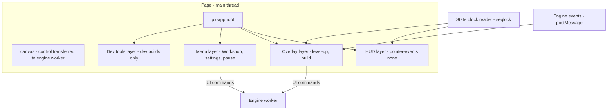

# UI: Real HTML/CSS

Prophet's UI is **real DOM, styled with modern CSS**, layered over the WebGPU canvas ([ADR-006](../DECISIONS.md#adr-006-real-htmlcss-ui)). It is written as class-based **custom elements** with no framework. A tiny signal store handles reactivity, and data flows from the engine through a **seqlocked shared-memory state block**.

Anything that is numerous and anchored in the world is drawn in WebGPU, never in the DOM. That covers health bars, damage numbers, tower ranges, blueprint ghosts and threat arrows ([03-rendering](03-rendering.md#world-space-ui)).

## Goals

- **Modern CSS:** flexbox, grid, container queries, `:has()`, cascade layers, native nesting, `oklch()`, View Transitions (in menus) and logical properties.
- **No DOM work that can hurt the frame rate** while the world renders underneath. Enforced by the [combat HUD rules](#combat-hud-rules).
- **One UI for every input device:** keyboard + mouse, gamepad (including Steam Deck) and touch, switching seamlessly.
- **Accessible and localizable** from day one.
- **Hot-reloadable** CSS and templates in development.

## Non-goals

- A virtual DOM, a diffing framework, or CSS-in-JS at runtime.
- DOM elements for world-anchored, high-count UI.
- Pixel-art styling of the HUD. The HUD is crisp and native-resolution; the world is pixel art ([game/03-art-audio](../game/03-art-audio.md#ui-look)).

## Game requirements served

| Need | Solution |
|---|---|
| Neon sci-fi HUD readable during hordes | Static-structure HUD, transform/opacity-only animation, tokens from the art bible |
| Level-up cards, build menu, assembly screen, Workshop | Custom elements + screen router + View Transitions (in menus) |
| Touch play on phones | DOM floating stick, thumb-zone buttons, bottom-sheet build menu, safe areas |
| Steam Deck / controller-only play | Spatial focus navigation, glyph switching, Deck layout |
| Co-op-ready commands | UI emits typed commands; the engine turns them into tick-stamped input commands ([09](09-determinism-coop.md#input-as-commands)) |

---

## Architecture



- The `<canvas>` sits at the bottom. Its control is transferred to the engine worker as an `OffscreenCanvas` ([01-overview](01-overview.md#runtime-topology)).
- `<px-app>` is the UI root. It hosts four layers, each with its own z-index and pointer rules:
  - **HUD:** passive. `pointer-events: none` everywhere except explicitly interactive widgets.
  - **Overlays:** level-up and build mode. They capture input while open.
  - **Menus:** full screens (Workshop, settings, results). While a menu is open, the world render freezes on a static frame.
  - **Dev tools:** perf overlay and inspectors, lazily imported in dev builds only ([10](10-tooling-testing.md#dev-tools)).
- A **router** keeps a screen stack. Background screens get `inert`, and the router restores focus when a screen closes.

### `UiElement` base class

Every component extends `UiElement`, a thin wrapper over `HTMLElement` that owns five things:
- template cloning
- adopted **constructable stylesheets**, shared across all instances
- signal bindings, with automatic disposal on disconnect
- focus metadata for gamepad navigation
- a `DEV` hot-reload hook

```js
// @ts-check
import { UiElement } from '../../engine/ui/ui-element.js';
import { hud } from '../state/hud-signals.js';

/** Horizontal bar; only transform changes per update (compositor-only). */
export class PxBar extends UiElement {
  static tag = 'px-bar';
  static styles = ['tokens', 'bar'];           // shared CSSStyleSheet objects
  static template = `<div class="track"><div class="fill"></div></div><span class="label"></span>`;

  #fill = /** @type {HTMLElement} */ (/** @type {unknown} */ (null));
  #label = /** @type {Text} */ (/** @type {unknown} */ (null));

  connected() {
    this.#fill = this.$('.fill');
    this.#label = this.$text('.label');
    const src = this.getAttribute('source') ?? 'hp';
    this.bind(hud.ratio(src), (r) => { this.#fill.style.transform = `scaleX(${r})`; });
    this.bind(hud.text(src),  (t) => { this.#label.data = t; });   // text node, no layout reads
  }
}
UiElement.define(PxBar);
```

### Signals

The store is roughly 150 lines of our own code. It has three primitives:
- `Signal`: a value plus its subscribers.
- `Computed`: a lazily recomputed derived value.
- `effect`: a side effect that re-runs when its inputs change.

All writes that happen inside one `requestAnimationFrame` are **batched**, so each binding runs at most once per frame, and only when its value actually changed (compared with `Object.is`, or with an epsilon for numbers). The state-block reader feeds the signals.

---

## State bridge

Engine → UI data travels over three channels:

| Channel | Carries | Mechanism | Rate |
|---|---|---|---|
| **State block** | Continuous values: HP, plating, energy, scrap balance and level progress, pending level-ups, Forge HP and shield, assault timer, power usage, run timer, hardpoint cooldowns | Fixed-layout struct in the shared heap, seqlocked | See [BUDGETS: UI](../BUDGETS.md#ui-constants) |
| **Engine events** | One-shot events: level-up banked, part found, assault incoming (with its composition), boss spawned, Shatter, run ended | `postMessage` with small typed objects | Immediate |
| **UI commands** | Choose card N, reroll, place blueprint at tile (x, y), cancel, recall, pause, settings changes | `postMessage` to the engine, which stamps them into tick commands ([09](09-determinism-coop.md#input-as-commands)) | On user action |

The state block's layout is **generated** from one schema file shared by the engine and the UI, so field offsets can never drift apart.

**The seqlock protocol:**

**Writer (engine):**
1. Increment `seq` to an odd value.
2. Write the fields.
3. Increment `seq` to an even value, using `Atomics.store`.

**Reader (UI):**
1. Read `seq1`.
2. Copy the fields into a local buffer.
3. Read `seq2`.
4. Accept the copy only if `seq1 === seq2` and both are even.
5. Otherwise, retry up to 3 times and then keep the last good snapshot.

```js
// @ts-check
/** Reads a torn-free snapshot of the HUD state block (main thread). */
export class StateBlockReader {
  #i32; #base; #words; #snap; #ok = false;
  /** @param {Int32Array} heapI32 @param {number} baseWord @param {number} words */
  constructor(heapI32, baseWord, words) {
    this.#i32 = heapI32; this.#base = baseWord; this.#words = words;
    this.#snap = new Int32Array(words);
  }
  /** @returns {Int32Array | null} snapshot, or null if no good snapshot yet */
  read() {
    const i32 = this.#i32, b = this.#base;
    for (let attempt = 0; attempt < 3; attempt++) {
      const s1 = Atomics.load(i32, b);
      if (s1 & 1) continue;                                  // writer in progress
      for (let w = 1; w < this.#words; w++) this.#snap[w] = i32[b + w];
      if (Atomics.load(i32, b) === s1) { this.#ok = true; return this.#snap; }
    }
    return this.#ok ? this.#snap : null;                     // keep last good snapshot
  }
}
```

In the `transfer` threading tier there is no shared memory. The engine instead posts a copy of the block at the same rate, and the reader API stays identical.

---

## Combat HUD rules

These rules keep the DOM from stealing frame time while the world renders underneath. On the main-thread-host fallback, where UI and sim share a thread, they are **mandatory**. Everywhere else they are the default.

1. **Static structure.**
   - Never insert or remove nodes during combat. Toggle with `hidden` or classes instead.
   - Pool toast and notification elements.
   - Keep node counts within [BUDGETS](../BUDGETS.md#ui-constants).
2. **Update only on change.**
   - Bindings compare values before writing.
   - Text goes to dedicated `Text` nodes (`.data`), never `innerHTML`.
3. **Compositor-only animation.**
   - Animate only `transform` and `opacity`.
   - Bars use `transform: scaleX()`, never `width`.
4. **Banned during combat:**
   - `backdrop-filter`
   - animated `filter` or `box-shadow`
   - `@property`-driven animations
   - animations of any layout property
   - `mix-blend-mode` on large areas

   These are fine in menus, because the world is frozen to a static frame while a menu is open.
5. **No forced synchronous layout.** Never read layout (`offsetWidth`, `getBoundingClientRect()`) in the update path. Measure once on resize.
6. **Containment.**
   - Widgets use `contain: layout paint style`.
   - Hidden screens use `content-visibility: hidden`.
   - Use `will-change: transform` only on the handful of bars that animate continuously.
7. **Fonts are preloaded** before a run starts. A font swap must never cause a reflow mid-combat.
8. **Long-task watchdog.** A `PerformanceObserver('longtask')` flags any main-thread task over the [budget](../BUDGETS.md#main-thread) in dev builds and in CI perf scenes.

**Why this matters:** the Gamepad API is available only on the main thread ([ADR-007](../DECISIONS.md#adr-007-runtime-topology-and-framedriver)), so main-thread jank turns directly into input latency.

---

## CSS architecture

- **Cascade layers:** `@layer reset, tokens, base, layout, components, screens, utilities, dev;`. Later layers win without specificity wars.
- **Design tokens** are custom properties generated from the art bible's palette ([game/03-art-audio](../game/03-art-audio.md#palette)): colours, spacing scale, radii, chamfer sizes, typography scale, glow levels and z-layers.
- **Colour:** tints and states are written with `oklch()` and `color-mix()`. Contrast is checked against [accessibility](#accessibility) targets.
- **Layout:** flexbox for components, grid for screens (the Workshop, the assembly screen), and container queries for adaptive panels.
- **State styling** uses `:has()`, for example `.card:has(:focus-visible)` or `.slot:has(.part[data-rarity="anomalous"])`.
- **Direction-agnostic:** logical properties throughout (`margin-inline`, `inset-block-start`), so RTL layouts come for free.
- **Motion:** respects `prefers-reduced-motion` plus an in-game override. `@property` animations and View Transitions are used **only in menus**.
- **Delivery:** stylesheets are constructable `CSSStyleSheet` objects, adopted by every element that needs them. Hot reload calls `replaceSync` on the shared sheet, and every instance updates at once.

```css
@layer tokens {
  :root {
    --c-night-900: #070B16;  --c-orange-500: #FF7A1A;  --c-cyan-400: #19E6FF;
    --c-bone-100: #F2E6D8;   --panel: color-mix(in oklch, var(--c-night-900) 82%, transparent);
    --chamfer: 10px;         --space: clamp(4px, 0.5rem, 8px);
  }
}
@layer components {
  .panel {
    background: var(--panel);
    color: var(--c-bone-100);
    padding: calc(var(--space) * 2);
    clip-path: polygon(var(--chamfer) 0, 100% 0, 100% calc(100% - var(--chamfer)),
                       calc(100% - var(--chamfer)) 100%, 0 100%, 0 var(--chamfer));
    & .title { color: var(--c-orange-500); text-transform: uppercase; letter-spacing: 0.08em; }
    &:has(.alert) { outline: 1px solid var(--c-orange-500); }
  }
  @container hud (max-width: 640px) { .panel .details { display: none; } }
}
```

### Screens and navigation

- **Router:** each screen is a custom element registered with the router. The router maintains the stack, sets `inert` on background screens, restores focus, and runs View Transitions between menus (as progressive enhancement).
- **Gamepad spatial navigation:** our own focus graph. Focusable elements register with the router. For a direction, the target is the nearest candidate in that direction, weighted by alignment. Groups (card rows, the build bar) can override this with explicit neighbours.
- **Steam Deck:** a dedicated 1280×800 layout variant, chosen by container and media queries. It passes the Deck Verified text-size and controller-only checks ([08](08-platforms.md#steam)).

---

## Input

Input is captured on the main thread and consumed by the engine as **tick-stamped commands**.

| Source | Capture | Transport |
|---|---|---|
| Keyboard, mouse, pointer, touch | DOM events on `<px-app>` and the canvas (passive listeners where possible) | Compact records in the **input ring** (shared memory): device, code, value, timestamp |
| Gamepad | `navigator.getGamepads()` polled once per rAF (main thread only) | A state snapshot into the input ring |
| UI actions | Custom elements | `postMessage` UI commands |

- **Action maps.** The engine turns raw input into actions: Move, Aim, Dash, Build, Recall, Overclock, Interact, Rotate camera, Zoom, Assembly and Pause. Each device has default bindings, and all of them are remappable.
- **Aim.** Auto-aim is the default. Mouse or right-stick aim overrides it. A cursor position is sent as screen coordinates, and the engine projects it into the world.
- **Touch:**
  - A **floating virtual stick** appears where the left thumb lands, in the left half of the screen, using pointer capture.
  - Dash, Recall and Build buttons sit in the right-thumb zone.
  - The **bottom-sheet** build menu lets the player drag a blueprint ghost; the engine raycasts the screen position to a grid tile.
  - Long-press shows information.
  - Targets are at least the [minimum size](../BUDGETS.md#ui-constants).
- **Glyph switching.** Prompts show keyboard, Xbox, PlayStation or touch glyphs, depending on the last device used.
- **Latency target:** [BUDGETS: latency](../BUDGETS.md#latency-targets).

---

## Accessibility

| Area | Measure |
|---|---|
| Semantics | Real `<button>`, `<input>` and `<dialog>` inside custom elements, a visible focus ring, ARIA labels on icon-only controls, and a live region for key events (assault incoming, Forge under attack) |
| Scale | Sizes are rem-based. UI scale is set from settings via the root font size ([range](../BUDGETS.md#ui-constants)). |
| Colour | Danger is never signalled by colour alone: shapes, icons and motion patterns come too. Colourblind palette variants exist, and HUD text meets WCAG AA contrast against its panel. |
| Motion and flashes | A reduced-motion mode disables screen shake, glitch transitions and parallax. A flash limiter applies ([BUDGETS](../BUDGETS.md#ui-constants)). |
| Hearing | Captions for important audio cues (sirens, boss roars, Breacher tunnelling), plus a visual pulse on off-screen threats |
| Motor | Hold-vs-toggle for every hold action, full remapping, a game-speed option, and auto-aim by default |

## Localization

- String tables are one JSON file per locale, keyed by ID.
- Formatting uses `Intl.PluralRules`, `Intl.NumberFormat` and `Intl.ListFormat`, with no dependencies.
- A **pseudo-locale** mode in dev builds expands strings by ~35 % and adds accents, to catch clipping.
- Fonts: the OFL font stacks cover Latin and Cyrillic at launch. CJK is a post-1.0 decision, because it adds several MB of font data.

---

## Thread ownership

| Resource | Owner | Others |
|---|---|---|
| DOM, CSS, custom elements, router | Main thread | — |
| Input ring (writer), gamepad polling | Main thread | Engine reads |
| State block (writer) | Engine worker | Main thread reads under the seqlock |
| UI commands | Main thread sends | Engine stamps and applies them at tick boundaries |

## Budgets

- Main-thread UI work and the longest task: [BUDGETS: main thread](../BUDGETS.md#main-thread).
- Node counts, refresh rate, block size, touch targets and UI scale: [BUDGETS: UI](../BUDGETS.md#ui-constants).
- Input to photon: [BUDGETS: latency](../BUDGETS.md#latency-targets).

## Fallbacks & failure modes

| Situation | Behaviour |
|---|---|
| No shared memory (`transfer` tier) | State block copies arrive via `postMessage`; input goes as batched messages every rAF |
| Main-thread host (no WebGPU in worker) | Combat HUD rules become mandatory; HUD refresh drops to 15 Hz if frame time is over budget |
| Seqlock read keeps failing | Keep the last good snapshot. Dev builds log how often it happens. |
| Font fails to load | Fall back to the system stack, then re-measure once |
| Engine worker crash | Error screen with "restart run from checkpoint" ([08](08-platforms.md#saves)) |
| View Transitions unsupported | Instant screen swap |

## Testing

- **Screenshot tests** (Playwright): every screen under the desktop, Steam Deck, phone-landscape and pseudo-locale profiles.
- **Interaction tests:** keyboard, mouse and touch are driven by Playwright. The gamepad is simulated with a `navigator.getGamepads` shim injected in test builds.
- **Performance test:** a synthetic HUD update at the maximum refresh rate for 10 minutes. It asserts main-thread time and long tasks against the budgets, and that the DOM node count never changes during combat.
- **Seqlock stress test:** a writer at 1 kHz and a reader under jitter; zero torn snapshots allowed.
- **Accessibility checks:** focus order, contrast tokens, and reduced-motion snapshots.

## Open questions

- Shadow DOM or light DOM for components? Shadow DOM encapsulates styles; light DOM is simpler to theme and slightly cheaper. We will benchmark both on mobile in M5.
- Should HUD bars move into WebGPU on `mobile` if the main-thread budget fails there? Our position: only if measurements force it.
- What is the minimum View Transitions support we rely on? Currently it is treated purely as progressive enhancement.
