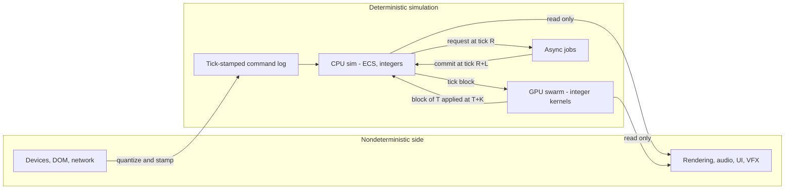
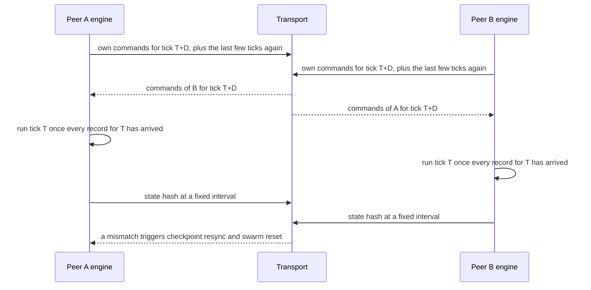

# Determinism & Co-op Readiness

SCRAPWAKE ships single-player, but its simulation is built so that **the same inputs always produce the same state**. It uses integer arithmetic, a stateless RNG, tick-stamped commands, and fixed commit ticks for everything asynchronous. That gives us replays, reproducible bug reports and hash-based regression tests today, and it keeps lockstep co-op possible later without a rewrite. [ADR-012](../DECISIONS.md#adr-012-integer-deterministic-simulation) stays **Proposed** until the M5 device-lab hash matrix proves that the simulation is deterministic across GPUs.



## Goals

1. **Replays.** A run is fully described by its header and its command log.
2. **Bug reproduction.** A reported run replays to the same state on a developer's machine.
3. **Regression tests.** CI replays a corpus of runs and compares state hashes ([10: CI](10-tooling-testing.md#continuous-integration)).
4. **Co-op readiness.** Single-player at launch (a user decision), with lockstep co-op kept possible.
5. **Mode independence.** Serial or chunk-parallel, any worker count, any threading tier: the results are the same ([02](02-core-ecs-jobs.md#threading-tiers)).

## Non-goals

- Netcode in v1. Only the architecture is co-op-ready.
- Rollback netcode. The GPU swarm can't be snapshotted and re-simulated within a frame.
- Determinism of rendering, audio, UI, particles, VFX and procedural animation.
- Replays across builds. A replay is tied to its build hash.
- A bit-identical resume from checkpoints ([ADR-019](../DECISIONS.md#adr-019-fodder-is-not-saved)).

## Game requirements served

| Game need | Mechanism |
|---|---|
| Daily Seed: every player gets the same district and the same run conditions | Seeded PCG and the stateless RNG |
| "Send us your run" bug reports | Replay = header + command log |
| Balance changes can't break things silently | Replay-hash CI and scripted bot runs |
| Co-op later, with Shatter as the co-op revive | Lockstep-capable sim, per-player command streams, banked level-ups ([ADR-023](../DECISIONS.md#adr-023-banked-level-ups-and-real-time-building)) |
| Hot reload keeps you where you were | Restart with the same seed and replay the command log ([10: dev server](10-tooling-testing.md#dev-server)) |

---

## Determinism levels

| Level | Guarantee | Enables | Status |
|---|---|---|---|
| **L0** | None | Nothing | Never acceptable for sim code |
| **L1** | Same device, same browser, same build | Local replays, bug reproduction on the same class of machine, CI regression hashes on a fixed runner (SwiftShader) | Required: the swarm against its reference from M2, full replays from M5 |
| **L2** | Across devices, browsers and GPUs | Shareable replays, lockstep co-op, and (later) server-side replay verification | **The target.** ADR-012 stays Proposed until the M5 hash matrix passes. |

What typically breaks each level:

| Breaks L1 (and therefore L2) | Breaks only L2 |
|---|---|
| Thread timing leaking into results: unsorted multi-writer output, job-completion order | Float math in sim code: `Math.sin` and friends are implementation-approximated in ECMAScript, and GPU float precision varies |
| Wall-clock time, `Math.random`, GC-dependent code (`WeakRef`, `FinalizationRegistry`) | Out-of-bounds GPU access, whose robust-access behavior is implementation-defined |
| Iterating in heap-address or pool-slot order | Results that depend on the subgroup size, which varies by GPU |
| Event or channel overflow: which records survive depends on timing | WGSL compiler or driver bugs, found by the lab matrix |
| Async results committed "when ready" | Locale-dependent operations (`localeCompare`, `Intl`) |

## Fixed-point formats

The values are in [BUDGETS: simulation constants](../BUDGETS.md#simulation-constants).

| Quantity | Format | Storage | Notes |
|---|---|---|---|
| Position | Q10 meters | `i32` | Sub-millimeter precision; every world grid is a shift away (below) |
| Velocity | Q10 meters per tick | `i32` (`i16` in the swarm) | Integration is a plain add |
| Altitude (flyers) | Q10 meters | `u16` in the swarm | |
| Angle | 16-bit binary angle | `u16`, `i32` in math | Wraps for free with `& 0xFFFF`; a facing index is just the angle's top bits |
| Sine, cosine | Sine table, Q14 output | `i32` table of 4,096 entries (the values fit in `i16`) | cos(*a*) = sin(*a* + a quarter turn) |
| Square root | Integer `isqrt` | `u32` in, `u16` out | Usually avoided: compare squared distances instead |
| HP and damage | Q8 | `i32` | Fractional damage (percentages, damage over time) without drift |
| Time | Ticks | `u32` | Never seconds or milliseconds in sim code |
| Chances | Q16, compared with 16 hash bits | `u16` | [BUDGETS](../BUDGETS.md#simulation-constants) |
| Multipliers | Q12 | `i32` | [BUDGETS](../BUDGETS.md#simulation-constants) |

**Grids are shifts.** With the current [world constants](../BUDGETS.md#world-constants), a coordinate in Q10 maps to a grid by a right shift, e.g. voxel `x >> 8`, base-field cell `x >> 10`, swarm bin and player-field cell `x >> 11`, voxel chunk `x >> 13`. `>>` rounds toward negative infinity, so cells never straddle zero. Grid sizes should stay powers of two; anything else needs a division.

**The sine table is baked data.** `Math.sin` is implementation-approximated, so a table computed at startup could differ between JS engines. The table is a **generated module**, written once by a generator script; a unit test pins its content hash, so a regenerated table can't change silently. The same values are uploaded to the GPU. The index is the angle's top bits (`angle >> 4` for the current table size).

### Overflow-safe arithmetic

**JavaScript:**
- Coerce every add or subtract with `| 0` (or `>>> 0` for `u32`) before comparing or storing it. A store into an `Int32Array` wraps like WGSL, but a comparison on an uncoerced sum does not.
- Multiply only with `Math.imul`. A plain `*` of two 32-bit values can exceed 2^53 and silently lose bits.
- Every product has a documented operand range, e.g. speed (Q10, below 2^10) × sine (Q14, at most 2^14) stays below 2^24. Dev builds assert the ranges inside the helpers.
- Products that don't fit use `mulShr`, which splits one operand into 16-bit halves (below).
- Division truncates toward zero in both languages, and `>>` floors. Pick one deliberately, and use it consistently.
- Integer division uses `Fixed.idiv` (`Fixed.imod` for remainders, `udiv` and `umod` for `u32`), with **WGSL semantics**: `a / 0 = a`, `a % 0 = 0` and `INT_MIN / -1 = INT_MIN`. Otherwise `idiv` is `(a / b) | 0`, which is exact for 32-bit operands. The sim lint bans a bare `/`, because `(a / b) | 0` yields 0 for `a / 0` and would diverge from the GPU. Zero divisors are still avoided by design; the helpers make an accidental one deterministic.
- Reduce precision before squaring distances. A district-sized delta in Q10 overflows 32 bits when squared; the same delta in Q5 (`d >> 5`) squared fits easily.

**WGSL:**
- `i32` and `u32` arithmetic wraps silently. That matches `Math.imul` and `| 0`, but only if JS coerces at exactly the same points. The simpler rule is to **document ranges so that wraps never happen at all**.
- Shift counts stay within 0–31. Both languages mask larger counts, but relying on that is fragile.
- Integer `/` and `%` need no helper: WGSL already defines the edge cases that `Fixed.idiv` reproduces.

```js
// @ts-check
import { SIN_TABLE_Q14 } from './sin-table.js';  // generated module; its content hash is pinned in a unit test

/** Fixed-point helpers. Bit-identical to fixed.wgsl; integers only. Never Math.sin at runtime. */
export class Fixed {
  /** @param {number} a  binary angle */
  static sinB(a) { return SIN_TABLE_Q14[(a >>> 4) & 4095]; }
  /** @param {number} a  binary angle */
  static cosB(a) { return SIN_TABLE_Q14[((a + 16384) >>> 4) & 4095]; }

  /** a / b truncated toward zero, with WGSL's edge cases: a / 0 = a, INT_MIN / -1 = INT_MIN. */
  static idiv(a, b) {
    if (b === 0) return a | 0;
    return (a / b) | 0;                             // sim-allow: exact truncating i32 division
  }

  /** (a * b) >> s without losing high bits. Requires |b| < 2^15 and 1 <= s <= 16. */
  static mulShr(a, b, s) {
    const hi = Math.imul(a >> 16, b) << (16 - s);   // |a >> 16| < 2^15, so exact
    const lo = Math.imul(a & 0xffff, b) >> s;       // below 2^31, so exact
    return (hi + lo) | 0;
  }

  /** floor(sqrt(n)) for a u32 n, bit by bit. */
  static isqrt(n) {
    let x = n >>> 0, r = 0, b = 0x40000000;
    while (b > x) b >>>= 2;
    while (b !== 0) {
      if (x >= r + b) { x = x - r - b; r = (r >>> 1) + b; } else { r >>>= 1; }
      b >>>= 2;
    }
    return r;
  }
}
```

```wgsl
fn mulShr(a: i32, b: i32, s: u32) -> i32 {   // same contract as Fixed.mulShr
  let hi = ((a >> 16u) * b) << (16u - s);
  let lo = ((a & 0xFFFF) * b) >> s;
  return hi + lo;
}

fn isqrt(n: u32) -> u32 {
  var x = n; var r = 0u; var b = 0x40000000u;
  while (b > x) { b >>= 2u; }
  while (b != 0u) {
    if (x >= r + b) { x -= r + b; r = (r >> 1u) + b; } else { r >>= 1u; }
    b >>= 2u;
  }
  return r;
}
```

## Rules for sim code

"Sim code" means the ECS systems in the `Input`, `PreSim`, `Sim` and `PostSim` stages ([02: scheduler](02-core-ecs-jobs.md#scheduler)), the job kernels whose results commit into the sim, and the WGSL swarm kernels up to the outbound copy ([05: pass chain](05-gpu-swarm.md#pass-chain)). The sim lint ([10: testing strategy](10-tooling-testing.md#testing-strategy)) enforces what it can; review covers the rest.

### JavaScript

1. **Integers only** in sim state and sim math. Component schemas reject `f32` unless the component is render-only ([02: ECS](02-core-ecs-jobs.md#ecs)).
2. No `Math.random`, `Date.now`, `performance.now` or `crypto.getRandomValues`. Randomness comes from the [hash RNG](#random-numbers); time is the tick counter.
3. No `Math.sin`, `cos`, `tan`, `atan2`, `pow`, `sqrt`, `exp`, `log` or `hypot`, and no `Math.round`, `floor` or `ceil` on fractional values. Use the fixed-point helpers. `Math.min`, `max`, `abs`, `sign`, `clz32` and `imul` on integers are fine.
4. Comparators define a **total order**: every tie is broken by a unique ID (entity handle, slot, tile). With a total order, neither the sort algorithm nor its stability matters.
5. `Map` and `Set` only with a deterministic insertion order. Never iterate a collection that was filled in job-completion or message-arrival order.
6. Never iterate in heap-address or pool-slot order. Iterate by logical keys: entity index, archetype ID and chunk sequence, voxel-chunk coordinates.
7. Nothing that depends on GC, locale or environment: no `WeakRef`, `FinalizationRegistry`, `localeCompare` or `Intl`.
8. Sim code never reads the performance tier, frame time, FPS, worker count or measured budgets. Those decide *where* work runs, never *what* it computes. Tier-dependent sim constants come from the run's sim profile ([below](#replays-and-hashes)).
9. Async results enter the sim only at their [commit tick](#async-results-at-fixed-ticks). Sim code never awaits a promise.

### WGSL sim kernels

1. `i32` and `u32` only: no `f32` or `f16` values, no float literals, no float textures or samplers.
2. Integer atomics only: `atomicAdd`, `atomicMin`, `atomicMax`, `atomicAnd` and `atomicOr` (plus `atomicSub` and `atomicXor`). The value *returned* by `atomicAdd` depends on execution order. Use it only to place records whose consumers are order-independent or re-sorted.
3. Every consumer of atomically placed data is order-independent: commutative integer sums, or min/max with an ID tie-break. When a key and an ID fit together in 32 bits, pack them and use one `atomicMin`; otherwise use two passes.
4. Subgroup operations only for order-independent integer reductions and scans (sum, min, max, and, or). Nothing whose result depends on the subgroup size, such as electing a lane.
5. No out-of-bounds access, no division by zero, and shift counts below 32. Dev builds bind a validation variant of each kernel that checks indices.
6. Results never depend on the dispatch or workgroup size. Partial results per workgroup are combined with commutative integer ops or in a fixed order.

### Excluded from determinism

Rendering, interpolation and the camera; audio; the DOM UI; particles, debris voxel particles and VFX; procedural animation; damage numbers and hit flashes. This code may **read** sim state, and may use floats freely, but it never writes sim state. The only way into the sim is a [command](#input-as-commands).

## Random numbers

- **Stateless.** `rand(seed, stream, tick, id)` hashes its inputs. There is no generator state to advance, share, save or race on, so chunk jobs and GPU invocations can draw in any order.
- **The hash** is a well-mixed 32-bit integer finalizer: `lowbias32`, with the constants from Wellons' hash-prospector (murmur3's `fmix32` is an equivalent fallback), chained over the inputs. Golden vectors are pinned in tests and checked in both JS and WGSL.
- **Streams.** Each system and purpose gets its own stream ID from the manifest: `LOOT_DROP`, `SPAWN_RING`, `LEVELUP_OFFER`, `PCG_LAYOUT` and so on. A stream is never reused for another purpose, so adding a random draw in one system never shifts another system's numbers. Several draws for the same (tick, id) use sub-streams.
- **Keys.** `id` is whatever uniquely names the draw: an entity handle, a swarm slot, a spawn-request index. PCG uses spatial keys (voxel-chunk coordinates, a prop index) in place of (tick, id).
- **Never stateful RNG in parallel code**, on the CPU or the GPU.
- **The run seed** is chosen once, outside the sim (the daily seed, or `crypto.getRandomValues` when the run is created), and stored in the replay header.

```js
// @ts-check
/** Stateless hash RNG. Bit-identical to rng.wgsl. */
export class Rng {
  /** lowbias32 finalizer: u32 in, u32 out. @param {number} x */
  static mix32(x) {
    x ^= x >>> 16; x = Math.imul(x, 0x7feb352d);
    x ^= x >>> 15; x = Math.imul(x, 0x846ca68b);
    x ^= x >>> 16;
    return x >>> 0;
  }
  /** Per-run, per-stream key; compute once. @param {number} seed @param {number} stream */
  static key(seed, stream) { return Rng.mix32(seed ^ Rng.mix32(stream)); }
  /** rand(seed, stream, tick, id) = Rng.u32(Rng.key(seed, stream), tick, id) */
  static u32(key, tick, id) { return Rng.mix32(Rng.mix32(key ^ tick) ^ id); }
  /** Uniform integer in [0, n) for n <= 65536, from the top 16 bits. */
  static below(h, n) { return ((h >>> 16) * n) >>> 16; }
  /** True with probability pQ16 / 65536. */
  static chance(h, pQ16) { return (h >>> 16) < pQ16; }
}
```

```wgsl
fn mix32(v: u32) -> u32 {
  var x = v;
  x ^= x >> 16u; x *= 0x7feb352du;
  x ^= x >> 15u; x *= 0x846ca68bu;
  x ^= x >> 16u;
  return x;
}
fn rngKey(seed: u32, stream: u32) -> u32 { return mix32(seed ^ mix32(stream)); }
fn rngU32(key: u32, tick: u32, id: u32) -> u32 { return mix32(mix32(key ^ tick) ^ id); }
fn rngBelow(h: u32, n: u32) -> u32 { return ((h >> 16u) * n) >> 16u; }
fn rngChance(h: u32, pQ16: u32) -> bool { return (h >> 16u) < pQ16; }
```

## Input as commands

The sim consumes only **commands**, each stamped with the tick it applies to. Everything a player does, and every engine event that changes sim results, becomes one.

**Input records.** Every tick, the engine emits one 8-byte record per player, even when nothing changed. Unchanged records compress to almost nothing.

| Bytes | Field | Type | Notes |
|---|---|---|---|
| 0–1 | Move x, y | 2 × `i8` | Quantized direction and magnitude, from stick or keys |
| 2–3 | Aim | `u16` | Binary angle, used when the aim-override flag is set |
| 4–5 | Buttons | `u16` | Bitmask: dash, build, recall, overclock, interact, fire override… |
| 6 | Flags | `u8` | Aim override active, input device class |
| 7 | UI commands | `u8` | Number of UI command records attached to this tick |

**UI command records** live beside the input records in the log (`engine/input/command-log.js`), in tick order:
- Each record is three `u32` words: a game-defined code and two arguments.
- A tick carries at most 255 of them. The count byte of word 1 belongs to the log, so it always matches the stored records.
- The log hash covers both streams.
- In the tech demo, the stress keys are UI commands (`game/data/ui-commands.js`), applied by `UiCommandSystem` in the Input stage.

**Quantization happens before stamping.** The engine maps raw input through the action maps ([07: input](07-ui.md#input)), projects the cursor into the world with render math (floats), and quantizes the result to `i8` and `u16`. The log stores only the quantized values, so float math never reaches the sim.

**UI and engine commands:**

| Command | Arguments | Source |
|---|---|---|
| Pick a level-up card | Card index within the offered hand (the hand itself comes from the RNG) | UI |
| Reroll, skip, banish | Card index | UI |
| Place a blueprint | Blueprint ID, tile x, tile y, rotation | UI (drag ghost, radial menu) |
| Cancel, sell, repair, upgrade | Tile x, tile y; for upgrades, the branch | UI |
| Equip or salvage a part | Offer index, slot | UI (assembly screen) |
| Pause, resume | — (single-player only; while paused, no ticks run) | UI |
| Swarm reset | None: the blocks of the *K* ticks before it are discarded. It is logged as the engine command `SWARM_RESET` (UI record codes with bit 31 set are the engine's). | Engine, after device loss ([05](05-gpu-swarm.md#resets-and-device-loss)) |

- Commands refer only to sim-stable identifiers: tile coordinates, offer indices, and entity handles (which are deterministic). Never DOM state or screen positions.
- Settings that don't affect the sim (volume, UI scale, graphics) never enter the log. The game-speed accessibility option changes how many ticks run per second, not what a tick does, so it doesn't enter the log either.
- **Stamping:** `targetTick = nextTick + inputDelay`. The input delay is 0 in single-player: input drained in this frame applies to the next tick that runs. In co-op it is the lockstep delay ([below](#co-op-model)).

## Async results at fixed ticks

Asynchronous jobs finish whenever their worker gets to them. The sim must not care.

- A sim-affecting job is **requested at a tick *R*** by a deterministic trigger, such as a wall-cost bucket change or a collapse check after an edit. Its result is **committed at tick *R + L***, where *L* is a fixed lag per job kind.
- If the result isn't ready when *R + L* is due, the sim **stalls**, exactly as for a late readback ([05](05-gpu-swarm.md#k-latency-and-stalls)). It never commits early and never commits late.
- Requests coalesce deterministically. While one solve of a field is in flight, a new trigger is queued and issued at the commit tick.
- The commit tick hides the threading tier: `shared`, `transfer` and `inline` commit on the same tick, and so produce the same simulation ([02](02-core-ecs-jobs.md#threading-tiers)).

| Job ([02: job system](02-core-ecs-jobs.md#job-system)) | Affects the sim? | Commit rule |
|---|---|---|
| Base and player flow-field solves | Yes: steering ([06: navigation](06-world.md#navigation)) | *R + L_field*. The double buffer swaps, and the GPU upload goes into that tick's block. |
| Structural connectivity and collapse | Yes: voxels and damage ([06](06-world.md#structural-collapse)) | *R + L_collapse*, within the [collapse budget](../BUDGETS.md#job-workers-asynchronous-work) |
| PCG during a run (voxel chunks materialized or regenerated) | Yes: voxels and collision | *R + L_pcg* |
| District generation at run start | Yes | Before tick 0. The generated world is hashed per seed. |
| Meshing | No: rendering only ([03](03-rendering.md#voxel-rendering)) | Whenever ready |
| Asset decode, audio preparation | No | Whenever ready |

The lags *L_field*, *L_collapse* and *L_pcg* are simulation constants in [BUDGETS](../BUDGETS.md#simulation-constants), and they are part of the [sim profile](../BUDGETS.md#sim-profiles). Each must cover its job's p99 duration plus queueing, or stalls become visible.

Collision data is not asynchronous. The engine worker is the voxel authority and applies voxel edits on their tick, and the collision grids the swarm uses are uploaded in that tick's block ([05](05-gpu-swarm.md#cpu-gpu-contract)).

## Replays and hashes

**A replay file:**

| Part | Contents |
|---|---|
| Build hash | Identity of the code and the cooked data ([10](10-tooling-testing.md)) |
| Sim profile | `high` or `std`: everything tier-dependent that changes results (district size, pool caps, ECS capacity, *ρ*, *K*, the swarm rate) |
| Run config | Mode, district, heat tier, seed |
| Players | Per player: Chassis, starting loadout, and the meta unlocks that shape the item pool |
| Command log | Per-tick input records plus UI and engine commands, run-length encoded |
| Hash stream | State hashes at a fixed tick interval, for verification |

- Size, e.g.: 8 bytes × 60 ticks × 1,200 s ≈ 0.55 MB raw per player for a 20-minute Cycle, and far less after run-length encoding.
- **Today's format** (`engine/app/replay.js`, version 1) is JSON, without run-length encoding. It holds:
  - `build`: for now, the manifest hash.
  - `heapProfile`, the swarm `seed`, *K*, and the swarm's full caps (the sim profile).
  - `hashEvery`, `ticks`, `taints` (swarm blocks that lost events to an overflow), the command log, and the hash stream as flat `[tick, hash]` pairs.

  The engine worker hashes every 60 ticks and exports a document on request (`window.__px.exportReplay()`). `Replay.run` plays it back headless with the JS reference swarm and reports the first divergent tick. `npm run replay -- file.json` wraps it for the command line.
- A replay plays only on its own build. When the sim changes on purpose, the CI corpus is re-recorded, and re-blessing the golden hashes is a reviewed change.

**State hashes:**
- xxhash32-style, built on `Math.imul` in JS and a WGSL kernel on the GPU, over the **canonical** sim state: live ECS columns in iteration order, the entity table, managed components through their `serialize` hook, the voxel delta log, the committed nav fields, director and economy state, and the swarm pools plus counters ([05: reference](05-gpu-swarm.md#reference-implementation)). Scratch memory, command pages, bins and render data are excluded.
- One hash per subsystem, combined into the tick hash, so a mismatch points at a subsystem straight away.
- The GPU hashes fixed-size blocks in parallel and combines the block hashes in block order, so the result doesn't depend on dispatch order.
- Debug and CI builds hash at a fixed interval, and co-op builds exchange hashes at a lower rate ([BUDGETS: state-hash interval](../BUDGETS.md#simulation-constants)). Release single-player builds don't hash.
- Taint flags (an event or channel overflow, a crashed in-place chunk job) are part of the hash stream. A tainted run is reported as non-reproducible, not as a desync.

**Desync tooling**, in the dev tools' desync diff viewer ([10: dev tools](10-tooling-testing.md#dev-tools)):
1. Compare the hash streams to find the first divergent tick and subsystem.
2. Re-run both sides to that tick, with per-subsystem hashes on every tick.
3. Dump the divergent subsystem and diff it: ECS columns by entity, swarm pools by slot.
4. For the swarm, drop down to a per-pass comparison with the JS reference.

**CI and the device lab:**
- CI replays a corpus of recorded runs (playtests and scripted bots) in headless Chromium with SwiftShader WebGPU. That is L1 ([10: CI](10-tooling-testing.md#continuous-integration)).
- In M5, the device lab replays the same corpus on every [reference device](../BUDGETS.md#reference-devices) and fills in a cross-GPU hash matrix. That is L2. The replay-hash quality gate is in [BUDGETS](../BUDGETS.md).

## Co-op model

SCRAPWAKE launches single-player and is co-op-ready by construction. The co-op game rules (shared or per-player scrap, revives through Shatter, level-ups without pausing) are in the [GDD](../game/01-gdd.md#co-op-rules).

**What readiness costs today:**
- Input arrives as per-player commands that carry a player index.
- Counters are per player (scrap collected), every PATCH has its own actor proxy, and pickups go to the nearest PATCH by (distance, player index) ([05](05-gpu-swarm.md#pass-chain)).
- There is no modal slow motion, and level-ups are banked ([ADR-023](../DECISIONS.md#adr-023-banked-level-ups-and-real-time-building)).
- Everything else on this page: the integer sim, the stateless RNG, fixed commit ticks.

### Plan A: lockstep (preferred)



- Every peer runs the full sim, CPU and GPU, from the same commands. Only commands travel: a few bytes per player per tick.
- **Session handshake.** The build hash and the **sim profile** must match. The `high` and `std` profiles differ in their caps and *ρ* ([BUDGETS: sim profiles](../BUDGETS.md#sim-profiles)), so a mixed session runs the lowest common profile, `std`.
- **Input delay *L_input*.** Commands are stamped `tick + L_input` so that they arrive before they're needed ([BUDGETS: simulation constants](../BUDGETS.md#simulation-constants)). Cosmetic prediction, a render-only extrapolation of the local PATCH from its pending commands, can hide part of the delay without touching the sim.
- **Tick gating.** A peer runs tick *T* only when it holds every peer's record for *T*. A late peer stalls everyone, the same rule as for K-latency.
- **Transport.** On the web, a WebRTC DataChannel, unordered and without retransmits. Every packet repeats the last few ticks of commands, so a single lost packet costs nothing. `RTCPeerConnection` lives on the main thread, which forwards commands into the engine's input path (moving the DataChannel into a worker is to be verified). In Electron, Steam Networking through the FFI shim ([ADR-021](../DECISIONS.md#adr-021-steam-via-a-thin-ffi-shim)). Both are future work.
- **Desync detection.** Peers exchange state hashes at a fixed interval. On a mismatch, the host sends a checkpoint (CPU state and voxel deltas, like a mid-run save) and every peer applies a swarm reset on an agreed tick ([05](05-gpu-swarm.md#resets-and-device-loss)). The same path handles device loss on any peer, and could handle late joins.
- **Requires L2.** Every peer's GPU runs the swarm, so lockstep is viable only if the M5 hash matrix passes.

### Plan B: host-authoritative with a capped swarm (fallback)

If cross-GPU bit-exactness fails (the revisit clause of [ADR-012](../DECISIONS.md#adr-012-integer-deterministic-simulation)), co-op switches to this model:
- The host simulates everything. Clients send the same input records to the host.
- Clients receive actor snapshots (PATCHes, towers, specialists, bosses, the Forge), quantized and delta-compressed at a fixed rate, plus coarse swarm state: e.g. quantized positions of the units near each client, and the density maps.
- Clients render approximations: a local visual swarm steered toward the snapshots, with hit feedback predicted locally and corrected by the host.
- The swarm is capped for co-op to bound snapshot size and bandwidth. The cap becomes a BUDGETS entry if Plan B is chosen.
- Determinism still pays off at L1: replays, bug reproduction and CI.

| | Plan A: lockstep | Plan B: host-authoritative |
|---|---|---|
| Bandwidth | Commands only | Snapshots |
| Swarm size | The full design load | Capped for co-op |
| Latency feel | Input delay *L_input* for everyone, softened by cosmetic prediction | None on the host; round-trip time plus prediction on clients |
| Requires | L2 | L1 |
| Host migration | Easy: every peer has the full state | Hard |
| Cheating | Every peer sees everything; fine for friends-only co-op | The host is trusted |

**Local co-op** needs none of this. One machine runs one sim with several input devices, and each player gets a command stream with its own player index.

**Decision gate:** M5 ([ROADMAP](../ROADMAP.md#milestones)). If the L2 matrix passes, Plan A; otherwise Plan B.

---

## Thread ownership

| Concern | Owner |
|---|---|
| Raw input capture, gamepad polling | Main thread ([07: input](07-ui.md#input)) |
| Action mapping, quantization, tick stamping, command log (record and playback) | Engine worker |
| Lockstep gating and hash exchange (future) | Engine worker; the network transport lives on the main thread |
| RNG | Any thread, because it is stateless |
| CPU state hashing | Engine worker; large arenas can fan out as job kernels |
| Swarm hashing | A GPU kernel; the result goes into the outbound block |
| Replay file I/O | Main thread, through the platform save APIs ([08: saves](08-platforms.md#saves)) |

## Budgets

- Tick rate, *K*, swarm rate, fixed-point formats, RNG and status timers: [BUDGETS: simulation constants](../BUDGETS.md#simulation-constants).
- Input to photon, which a lockstep input delay eats into: [BUDGETS: latency targets](../BUDGETS.md#latency-targets).
- Caps and world sizes that the sim profile fixes per run: [BUDGETS: entity caps](../BUDGETS.md#entity-caps) and [world constants](../BUDGETS.md#world-constants).
- Hashing runs only in debug, CI and co-op builds. When it is on, it must fit the [engine-worker budget](../BUDGETS.md#engine-worker-per-frame).
- The replay-hash quality gate: [BUDGETS](../BUDGETS.md).

## Fallbacks & failure modes

| Situation | Behavior |
|---|---|
| A replay from another build | Refused, and the build hash is shown. Dev builds can force a best-effort run, which is flagged as such. |
| Hash mismatch in CI | The build fails with a desync report: first divergent tick, subsystem, state diff |
| An async result is late at its commit tick | The sim stalls; it never commits early or late |
| A GPU readback is late | The sim stalls ([05](05-gpu-swarm.md#k-latency-and-stalls)) |
| Event or channel overflow | The run is tainted; dev builds assert |
| A crashed in-place chunk job | The run is tainted, and the system is forced serial ([02](02-core-ecs-jobs.md#fallbacks--failure-modes)) |
| Device loss | A swarm reset command, which replays reproduce |
| Co-op desync | Host checkpoint plus a synchronized swarm reset |
| A co-op peer stops sending | Everyone stalls; after a timeout the peer is dropped (the rules are in the [GDD](../game/01-gdd.md#co-op-rules)) |
| L2 fails in M5 | Co-op moves to Plan B; L1 keeps replays and CI |
| A banned API or a float in sim code | The sim lint fails CI ([10](10-tooling-testing.md#testing-strategy)) |

## Testing

- **Fixed-point helpers:** `isqrt` exhaustively over all 16-bit inputs and on sampled 32-bit inputs; `mulShr` against `BigInt` arithmetic; `idiv` edge cases (zero divisor, `INT_MIN / -1`) against WGSL; the sine-table module's pinned content hash; JS vs WGSL golden vectors for every helper (a compute shader runs the same inputs in headless Chromium).
- **RNG:** golden vectors in JS and WGSL; offline statistical sanity checks; independence between streams.
- **Two sims in one process:** two instances inside one Node process replay the same log, and their hashes must match on every tick. This is cheap, and it catches hidden global state.
- **Execution-mode equivalence:** serial vs chunk-parallel, any worker count, `shared` vs `transfer` vs `inline`, all with identical hashes ([02: testing](02-core-ecs-jobs.md#testing)).
- **Timing independence:** random job delays and readback delays change wall time, never hashes.
- **Replay corpus** in CI (L1), and the device-lab matrix in M5 (L2).
- **Lint** for banned APIs and float literals in sim code ([10](10-tooling-testing.md#testing-strategy)). Its banned list should grow to match the [rules above](#rules-for-sim-code).

## Open questions

- Values for the co-op input delay *L_input* and the commit lags *L_field*, *L_collapse* and *L_pcg* are now initial targets in [BUDGETS](../BUDGETS.md#simulation-constants); M5 validates them.
- Should the sine table interpolate between entries? Smoother turning, for one more multiply.
- Cross-tier co-op (`high` with `std`) runs the `std` profile. Is its lower density acceptable to `high` players, or should sessions be same-tier only? The district is the same, so only density differs.
- Late join: a checkpoint plus a swarm reset, or no late join in v1?
- What does hashing GPU state cost in release co-op builds, and what is the right interval?
- Server-side replay verification for Daily Seed leaderboards would need headless WebGPU on a server. Is it worth it?
- Does cosmetic prediction of the local PATCH feel right with dash-heavy movement under lockstep?
