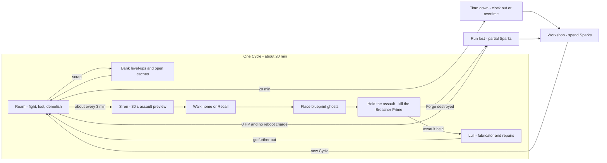

# SCRAPWAKE: Game Design Document

SCRAPWAKE is a Vampire Survivors-like roguelite with tower defence and base building. It is set in a destructible voxel cyberpunk city and rendered as stylized 3D pixel art. You play PATCH, a scrapped maintenance robot that rebuilds itself from parts. This document defines the rules. The [content catalog](02-content.md) lists parts, towers, enemies and districts with their starting numbers. Art and audio are in [03-art-audio](03-art-audio.md), and screens and input flows in [04-ux-flows](04-ux-flows.md).

Conventions:
- Engine and performance numbers live in [BUDGETS.md](../BUDGETS.md) and are linked, not restated. Terms follow the [GLOSSARY](../GLOSSARY.md).
- Every gameplay number here (HP, damage, costs, cooldowns, timings) is a **tuning starting point**. The M2′ loop prototype and the vertical slice validate them ([milestones](../ROADMAP.md#milestones)).
- *t* is minutes since the Cycle started. Formulas are written with real numbers for readability. The sim evaluates them as cooked integer tables in fixed-point ([ADR-012](../DECISIONS.md#adr-012-integer-deterministic-simulation)).
- Feature sections follow the game-doc template where it helps: **Fantasy · Rules · Numbers · UX per device · Exploits & counters · KPIs · Slice vs 1.0**.

---

## Vision

**Logline:** *"Rebuild yourself from scrap. Tear down the city. Hold the Forge."*

**Pitch.** A 20-minute run in one procedural district of the megacity Meridian:
- PATCH roams the streets, auto-firing into swarms of thousands, and bolts parts torn from caches and enemies onto its own body.
- Every few minutes a telegraphed Sweep assault converges on the Forge, PATCH's base, and the game turns into tower defence. You race home, draw walls and towers as blueprint ghosts, and personally kill the Breacher Prime that no tower can touch.
- The whole city is destructible, so it is also your quarry, your weapon and your wall.

| Topic | Target |
|---|---|
| Genre | Survivors-like action roguelite + real-time tower defence and base building |
| Audience | Players of Vampire Survivors, Brotato, Halls of Torment and Deep Rock Galactic: Survivor who want more agency; fans of Thronefall and Dome Keeper who want a bigger swarm. Core age 18–40; short-session PC, Steam Deck and mobile players. |
| Platforms | Steam (Windows, macOS, Linux / Steam Deck) via Electron; free web demo; iOS and Android at 1.0 ([ADR-004](../DECISIONS.md#adr-004-one-web-build-electron-for-desktop), [ADR-005](../DECISIONS.md#adr-005-mobile-shells)) |
| Session length | Standard Cycle 20 min plus optional overtime; Blitz 10 min; Endless; Daily Seed ([Modes](#modes)). Checkpoints make every run suspendable ([Save policy](#save-policy)). |
| Price | Premium, about $7–10 on Steam ([Business model](#business-model)) |

## Pillars

| # | Pillar | Means | Design test |
|---|---|---|---|
| 1 | **You are your build** | Parts, not stat sticks. Every hardpoint is visible and every swap is a readable trade-off. | Can a spectator guess the build from PATCH's silhouette? |
| 2 | **Everything breaks** | The city is a resource (scrap), a weapon (collapses, explosive props) and terrain (walls, chokepoints). Destruction has consequences for both sides. | Did the player reshape the map on purpose before an assault? |
| 3 | **Hold the Forge** | The base is the anchor. Every decision weighs the distance from it. | Is Forge-time 35–55 % ([KPIs](#kpis))? |
| 4 | **Readable chaos** | Orange/amber = you, cyan/white = the Sweep, magenta = anomalous, red = critical only and always with shape and motion. | Can a player name the most dangerous thing on screen within one second? |
| 5 | **One more cycle** | Short runs, instant restarts, meta progress every run, daily seeds. | ≥ 60 % of playtesters want another run. |

## Setting

**Meridian** is a megacity run by the **HALCYON** corporation. After Halcyon bought the city's public services, its "Clean Sweep" policy declared every unlicensed machine illegal. Automated swarms, **the Sweep**, now hunt them down and erase them.

**PATCH** was a municipal maintenance robot in the Rust Docks, scrapped in the first sweeps. It reboots as a legless husk beside a derelict public-works fabricator, the **Forge**. The Forge still draws power from an old grid line, and its small construction drones remember how to build.

| Element | Direction |
|---|---|
| Tone | **Gritty but with heart.** Rust, rain and dirty neon, but PATCH fixes things: its idle animation repairs a flickering lamp, and (a memory fragment reveals) the orange paint it wears was sprayed on by the kids of the block it used to maintain. |
| Protagonist voice | Silent. PATCH communicates in **bleeps** (pitch-varied chirps, captioned) and body language. No dialogue boxes. |
| Environmental storytelling | Halcyon **holo-ads** ("A CLEAN CITY IS A SAFE CITY"), resistance **graffiti** ("WE FIX WHAT THEY SWEEP"), **terminal logs** in Data Terminals (Sweep calibration memos, old maintenance tickets) and **memory fragments** that rebuild PATCH's past. |
| Signage | Neon signs use an invented glyph language, **Meridian script**, derived from circuit traces and maintenance pictograms. No pseudo-Asian lettering or "exotic East" set dressing: the city's identity comes from its own corporate and street cultures. Gameplay-critical text stays in the UI language. |
| Factions | Halcyon (cold cyan/white, clean geometry) versus salvage culture (warm orange/amber, patched and bolted). Rogue machines such as traders are neutral and rare. |
| Arc (1.0) | Rust Docks (awakening) → Neon Bazaar (rogue-machine community) → Glasswall (Halcyon's corporate face) → The Sump (the scrapyards where the Sweep dumps machines; PATCH's origin) → Halcyon Spire (the Sweep Nexus). |

Palette tokens and character direction: [palette](03-art-audio.md#palette), [characters](03-art-audio.md#characters).

---

## Core loop

**Fantasy.** A scavenger's rhythm: range out into a hostile city and grow stronger, hear the siren, race home, and hold the line in a fort you drew yourself.

| Scale | Loop |
|---|---|
| Moment (1–10 s) | Move, dash, let the hardpoints auto-fire. Grab scrap, smash props, dodge telegraphs, drop a building on a crowd. |
| Minute | Roam outward for richer loot → bank level-ups and open caches → siren → walk home or Recall → place blueprint ghosts → hold the assault and kill the Breacher Prime → shop in the lull → roam further out. |
| Run (Cycle) | About 20 min in one district: six assaults that grow in size and lanes, the Demolisher at 10:00, the Warden Titan at 20:00, then optional overtime. |
| Meta | Sparks → Workshop unlocks (item pool, Chassis, Forge starting upgrades, heat, districts) → next Cycle. |



**Rules.**
1. **Start.** PATCH reboots as a **husk** beside the Forge: a starting arm and a core, no legs, so it crawls and cannot dash. A legs cache is always placed a few tiles away, so the husk phase lasts ≤ 20 s.
2. **Roaming.** The director spawns fodder in a ring just outside the view, Vampire Survivors-style, and specialists at mid range ([Director and pacing](#director-and-pacing)).
3. **Distance pays.** Scrap drops are multiplied by *m(d) = 1 + d*, where *d* is the distance from the Forge divided by the district half-width (0 at the Forge, 1 at the edge). Cache rarity and elite chance also rise with *d*. Inside the **Yard** (the Forge's build radius), fodder drops ×0.5 outside assaults and no caches spawn. Because *d* is normalised, the smaller mobile district ([world constants](../BUDGETS.md#world-constants)) keeps the same pacing.
4. **Assaults.** A 30 s **siren** announces each assault with a **composition preview** (unit icons and counts), the **drop points**, and **predicted routes** sampled from the base field. On arrival, Sweep pods land at 1–3 drop points in the mid ring and their units converge on the Forge. Roaming spawns drop to 30 % while an assault is active.
5. **Breacher Prime.** Every assault has exactly one. It drills straight at the Forge and arrives about 75 s after landing. **Only PATCH can damage it**; towers can only slow or stun it, at half duration. On arrival it detonates a breach charge that ignores the shield (20 % of Forge max HP), then keeps drilling (5 % every 2 s) until PATCH kills it. It drops a Military cache.
6. **Forge shield.** When the first assault unit enters the Yard, the shield absorbs all damage to the Forge for 20 s, once per assault. Towers and walls are not shielded.
7. **Assault end.** An assault is **held** when all its units are dead, or 90 s after landing (survivors become roamers). A held assault steps up the Forge's **Grade** ([Balance math](#balance-math)), repairs the Forge by 10 % of its max HP, opens the **fabricator** until the next siren, and starts a 25 s lull with an auto-prompt for banked level-ups.
8. **Recall.** A 2 s rooted channel that teleports PATCH to the Forge. 60 s cooldown, refreshed by every siren. Damage does not interrupt it; Jammer fields block it.
9. **Shatter.** At 0 HP with a **reboot charge** left, PATCH shatters instead of dying:
   - A knockback pulse clears nearby fodder. Hardpoint parts and legs scatter 2–6 m, and the legs always land closest.
   - For the **8 s** window the husk is invulnerable and crawls faster than normal. Touching a part re-attaches it.
   - PATCH reboots with 40 % max HP + 10 % per recovered part (max 100 %). Forge drones carry unrecovered parts home; they re-attach when PATCH next enters the Yard.
   - Each Shatter costs one charge. It is also the co-op downed state ([Co-op rules](#co-op-rules)).
10. **Loss.** The run ends when PATCH hits 0 HP with no charge left (**Scrapped**) or the Forge is destroyed (**Forge lost**).
11. **Win and overtime.** Killing the Warden Titan **clears the Cycle** and banks the win. From then on, *Clock out* at the Forge (a 3 s interact) ends the run with full rewards. Staying means **overtime**: difficulty compounds every minute, and every minute survived pays Sparks. Dying in overtime still counts as a clear.

**Numbers.**

| Parameter | Starting value |
|---|---|
| Assault arrivals (siren 30 s earlier) | 3:00 · 6:00 · 8:30 · 13:00 · 15:30 · 18:00; bosses at 10:00 and 20:00 ([Pacing chart](#pacing-chart)) |
| Husk crawl / Shatter crawl | 1.5 m/s / 2.5 m/s |
| Yard (build radius) | 8 tiles, +2 per Perimeter rank (max 14) |
| Yard regeneration | PATCH regains 3 HP/s inside the Yard |
| Reboot charges | 1 at start (Workshop raises this to at most 3; Backup Kernel adds 1 in a run) |

**UX per device.** The siren, preview and Recall behave the same everywhere; Recall is a held button with a toggle option. See [HUD](04-ux-flows.md#hud).

**Exploits & counters.**

| Exploit | Counter |
|---|---|
| Turtling in the Yard | ×0.5 Yard drops and no caches there. After 60 s of idling outside assaults, Scrubber sweeps head for the Forge. Under-levelled builds die around 12:00. |
| Never going home | The Prime ignores the shield and only PATCH can hurt it. The fabricator and Yard regeneration exist only at the Forge. |
| Recall as a free escape | 60 s cooldown, rooted channel, blocked by Jammers. |
| Farming Shatters | Charges are finite; unrecovered parts stay out of action until PATCH walks back into the Yard. |

**KPIs.** Forge-time share, one-more-run rate, death-cause mix ([KPIs](#kpis)).

**Slice vs 1.0.** The slice has the full loop in Standard mode on Rust Docks. 1.0 adds Blitz, Endless, Daily Seed and four districts.

## Body as loadout

**Fantasy.** You are what you bolt on: a stilt-legged scrap bucket at minute one, a Halcyon-blue siege walker at minute twenty.

| Slot | Count | Holds | Changes silhouette |
|---|---|---|---|
| HEAD | 1 hardpoint | Sensors and head weapons | Yes |
| ARM L, ARM R | 2 hardpoints | Arm weapons; any arm part fits either arm | Yes |
| BACK | 1 hardpoint | Drones, launchers, mobility and support rigs | Yes |
| LEGS | 1 | Move speed, dash form and charges; no legs = husk | Yes |
| CORE | 1 | Overclock energy meter and burst | No (chest glow only) |
| CHIPS | 6 | Passives, levels 1–3 | No |
| Plating | Track, levels 0–5 | Armour and max HP, shown as armour pieces inside the silhouette | No |

The starting PATCH (Mender Chassis) has a Rivet Driver on ARM R, a Cracked Core, and no legs. Other Chassis: [Meta progression](#meta-progression).

**Rules.**
- **Auto-fire.** Each weapon fires on its own using its **targeting mode**: *Nearest*, *Strongest*, *First* (closest to the Forge along the base field), *Chain* (Arc parts only) or *Cursor* (manual aim). Modes are set per hardpoint on the Assembly screen, and the GPU resolves the target from the fire command's policy ([ADR-011](../DECISIONS.md#adr-011-two-tier-simulation)).
- **Manual aim override.** While held (or toggled on), Cursor-capable weapons (projectiles and beams) fire toward the pointer or right stick. Drones and homing weapons keep their own mode. Auto-aim resumes 1 s after release, and it is the default on every device.
- **Part levels 1–5** come from level-up cards or the fabricator. Damage multipliers are ×1.0 / 1.25 / 1.5 / 1.8 / 2.2, and levels 3 and 5 add a per-part perk ([parts](02-content.md#parts)).
- **Rarities:** Scrap ×1.0 → Salvaged ×1.15 → Military ×1.3 → **Halcyon** ×1.5 → **Anomalous** ×1.5.
  - *Halcyon* parts are stolen corp tech. They ignore Enforcer front shields. Their white-and-cyan panels visibly **creep** across PATCH as more are equipped, but PATCH's outline and core glow stay orange so team colour stays readable. Each one also makes PATCH 10 % more attractive to specialist targeting ("tracked").
  - *Anomalous* parts glow magenta and roll one quirk with an upside and a downside.
- **Swaps.** Taking a part from a cache or card shows a **stat diff** (DPS, range, HP, speed, tags) against the part it replaces. Confirming auto-salvages the old part into scrap, credited to the balance only. The same part at a higher rarity keeps its level; a different part starts at level 1. In single-player the swap card pauses, like a level-up.
- **Fusions.** A level-5 part + its matching chip (any level) + opening any **elite cache** = the cache offers the fusion as a guaranteed pick. The fused part replaces the base part, the chip stays, and the silhouette changes ([fusions](02-content.md#fusions)).
- **Core.** The energy meter (100) fills over time and from kills. **Overclock** spends a full meter on a short burst, e.g. Cracked Core: 5 s of +40 % fire rate and +20 % move speed.
- **Legs** set move speed and the dash: distance, charges, recharge, and special forms such as stomp or leap. A dash grants 0.25 s of invulnerability.
- **Plating** levels each give +15 max HP and +8 armour, with visible plates (shoulders → chest → shins → visor ridge → full kit).

**Numbers (PATCH base).**

| Stat | Value |
|---|---|
| Max HP | 100 (Chassis-dependent) |
| Armour | 0, +8 per Plating level |
| Move speed and dash | From legs (Scrap Stilts: 5.0 m/s; 4 m dash, 1 charge, 2.5 s recharge) |
| Pickup radius | 2.5 m |
| Crit | 5 % chance, ×1.5 damage |
| Contact damage taken | Summed per tick from the swarm's contact accumulators, then reduced by armour |

**UX per device.** Level-up and Assembly screens show a close-up paper doll. Stat diffs are icons plus signed numbers, never colour alone. KB/M: hover a hardpoint for details, click to set its mode. Gamepad: the D-pad cycles hardpoints. Touch: tap a hardpoint to open a bottom sheet. See [Assembly screen](04-ux-flows.md#assembly-screen).

**Exploits & counters.**
- *Swap-farming salvage:* caches are finite, and salvage feeds only the balance, never XP.
- *Stacking one damage type:* Enforcer shields (against projectiles), Armoured elites (against Kinetic) and Overcharged elites (against Arc) push builds toward diversity.
- *Sniping the Prime from safety:* its HP is sized to about 8 s of on-curve DPS, so PATCH must commit.

**KPIs.** Level-up pick rates, fusion rate ([KPIs](#kpis)).

**Slice vs 1.0.** Slice: 14 parts, 6 chips, 3 fusions, all five rarities. 1.0: 29 parts, 12 chips, 8 fusions ([Slice vs 1.0](#slice-vs-10)).

## Economy

**Fantasy.** Everything you pick up is both muscle and money ([ADR-022](../DECISIONS.md#adr-022-scrap-is-both-xp-and-currency)).

| Currency | Earned from | Spent on | Notes |
|---|---|---|---|
| **Scrap** | Kills (gems), player-caused demolition, caches, events | Towers, walls, upgrades, repairs, fabricator stock, rerolls | The *total collected* drives levels; the *balance* is the wallet |
| **Power** | Forge (10), Capacitor Bank ranks and Power Cells (+5 each), Generators (1.0, +8) | Towers (fixed draw per type) | A capacity, not a stockpile. No pylons or grid. |
| **Sparks** | End of run: time, assaults held, bosses, overtime | Workshop unlocks | Never earned or spent mid-run |

**Rules.**
- **One pickup, two counters.** Every gem adds its value to both the total (XP) and the balance. Salvage, sell refunds and Leech returns add to the balance only.
- **Gems** are GPU pickups that magnetise to PATCH. Past the [gem cap](../BUDGETS.md#entity-caps), the gems nearest PATCH merge into higher-value gems, so value is never lost. The economy uses GPU-side counters, which stay exact ([overflow policy](../engine/05-gpu-swarm.md#overflow-policy)).
- **Demolition scrap** has diminishing returns per Cycle: *yield = raw × H / (H + D)*, where *D* is the raw demolition value earned so far and *H* is the district's half-value constant (2,500 in Rust Docks). Only destruction caused by PATCH or its towers pays. Curve: [Balance math](#balance-math).
- **Grade and prices.** Every scrap price is *base × g²*. The Grade *g = 1 + t/10* steps up when an assault or boss fight ends, never mid-fight. Spending early is always cheaper, which discourages hoarding. Power Cells use their own geometric price.
- **Banked level-ups** ([ADR-023](../DECISIONS.md#adr-023-banked-level-ups-and-real-time-building)). A HUD badge counts pending levels. The player opens the bank at any time (single-player pauses while it is open), and it auto-opens during lulls (a setting, on by default). Each banked level rolls its cards from the seed when it is earned, so reopening never rerolls.
  - **Card types:** *new part*, *part upgrade* (includes Plating), *chip* (new, or +1 level), *tower blueprint*, *Forge upgrade*. Three cards per level (four with a Workshop unlock), at most two of one type. A blueprint is guaranteed within the first three level-ups, and empty hardpoints double the weight of new-part cards.
  - **Reroll, skip and banish** are Workshop unlocks with per-run charges. Skip pays 25 % of that level's requirement into the balance.
- **Fabricator.** Opens after each held assault and stays open until the next siren, usable only while PATCH is in the Yard. Four stock slots: two parts or chips (rarity rises per assault), one Forge service (repair, Power Cell; Backup Kernel in 1.0), one blueprint or Mk voucher. Rerolling costs 20 × g², rising with each reroll.

**Numbers.** Level curve, income, prices and Power: [Balance math](#balance-math).

**UX per device.** One HUD ring shows level progress; the number inside is the balance. Level-up flow: [level-up](04-ux-flows.md#level-up). Pickup sounds are pitch-stepped ([audio direction](03-art-audio.md#audio-direction)).

**Exploits & counters.**

| Exploit | Counter |
|---|---|
| Demolition farming for XP | Diminishing returns per Cycle; only player-caused destruction pays |
| Hoarding scrap for late purchases | Grade inflation after every assault |
| Letting Leeches steal, then killing them for a bonus | A Leech returns exactly what it stole, plus normal kill scrap |
| Sell/rebuy arbitrage | Selling refunds 50 % of the price paid |
| Level-up menu as a free pause | Equivalent to the pause menu in single-player; never pauses in co-op |

**KPIs.** Income versus curve, spend mix (towers / parts / repairs), unopened level-ups at run end ([KPIs](#kpis)).

**Slice vs 1.0.** Slice: Scrap, Power from the Forge and its upgrades, Sparks. 1.0 adds Generators and Harvesters.

## Base and towers

**Fantasy.** A scrapyard fortress you sketch in real time while drones weld it together around you.

| Forge role | Rule |
|---|---|
| Base core | 2,000 × g HP, +25 % per Reinforce rank. At 0 HP the run is lost. |
| Shield | 20 s per assault, +5 s per Shield Emitter rank |
| Power | 10 capacity |
| Shop | The fabricator, after each held assault |
| Respawn point | Unrecovered Shatter parts return here; downed co-op players reboot here |
| Drones | 2 build drones, +1 per Drone Dock rank |
| Foundation | Reinforced and indestructible; debris landing on it is cleared (anti-cheese) |

**Rules.**
- **Build grid.** Structures snap to build-grid tiles ([tile size](../BUDGETS.md#world-constants)) and can only be placed inside the Yard. Snap assistance: walls drag-paint as lines with automatic corners; *suggested spots* highlight tiles where the base field concentrates; invalid ghosts turn hatched red and name the reason (blocked, no Power, outside the Yard).
- **Blueprint ghosts.** Placing a ghost reserves its cost. Forge drones fly out and build it in real time; the game never slows down. Construction pauses when no drone is on site, and a ghost can be damaged (its HP is proportional to its progress). Cancelling refunds 100 % until it completes; selling refunds 50 % of the price paid.
- **Tiers.** Towers upgrade Mk I → Mk II (1.5 × base cost) → Mk III (3 × base cost). Mk III is a **branch choice** between two specialisations ([towers](02-content.md#towers)).
- **Power.** Each tower type has a fixed draw; walls draw nothing. A ghost needs free Power to be placed. If capacity drops (for example, a Generator dies), the most recently built towers **brown out** until the draw fits again.
- **Walls are real voxels.** They reshape the base field, so mazes and chokepoints work ([ADR-017](../DECISIONS.md#adr-017-25d-navigation-with-flow-fields)). Wall HP feeds the field's cost buckets, so a damaged wall starts attracting attackers ([navigation](../engine/06-world.md#navigation)).
- **Friendly consequences.** Collapses, Mortar terrain damage and Railgun bores hurt your own towers and walls too.
- **The Prime rule.** Towers never damage the Breacher Prime.
- **Targeting.** Each tower has a default mode (Nearest, Strongest, First, Chain) that the player can change. Flame Vents and Mortars hit ground units only.
- **Caps.** The structure count, with walls counted as segments, is capped per tier ([entity caps](../BUDGETS.md#entity-caps)). The build UI shows the count.
- **Structure HP scales with the Grade** (× g), so towers keep pace with enemy damage.

**Numbers.** Full stats and branches: [towers](02-content.md#towers).
- **Slice:** Rivet Turret (60 scrap, 2 Power; single target, hits flyers), Flame Vent (75, 2; cone and Burn, ground only), Arc Pylon (100, 3; chain, hits flyers), EMP Spire (110, 3; stun, slow, disables specialist abilities), Mortar (150, 4; AoE with **terrain damage**, ground only), Scrap Wall (8 per segment, 0).
- **1.0:** Laser Fence, Harvester, Repair Bay, Railgun (bores through buildings), Decoy, Drone Hangar, Generator (adds 8 Power).
- The *n*-th standing copy of a type costs *base × 1.15ⁿ × g²*. Build time with 2 drones is 1 s per wall segment and 3–8 s per tower; each extra drone cuts it by 20 %.

**UX per device.**
- KB/M: B opens build mode with a hotbar (1–6). Click to place, drag for wall lines, right-click to cancel.
- Gamepad: hold LB for a radial (RB repeats the last blueprint). The ghost follows a right-stick cursor with tile snap; A places, B cancels, X toggles wall-line mode.
- Touch: the build button opens a bottom sheet of blueprint cards. Drag a ghost into the world (a magnifier shows the tile), release, then confirm or cancel.

Ghosts, ranges and progress bars are world-space UI drawn in WebGPU ([world-space UI](../engine/03-rendering.md#world-space-ui)). Flow: [build mode](04-ux-flows.md#build-mode).

**Exploits & counters.**

| Exploit | Counter |
|---|---|
| Fully sealed maze | Walls are costly in the base field, not impassable. Past a detour threshold, units attack the cheapest wall. Breachers and Wasps ignore mazes. |
| Every tower at one chokepoint | Crawler Mines, Volatile elites, Snipers and multi-lane assaults punish clustering |
| Burying or undermining the Forge | Reinforced foundation; debris on its footprint is cleared |
| Forward bases outside the Yard | Not allowed. Turret Pack mini-turrets (temporary, no Power) are the only field structures. |

**KPIs.** Towers standing at 10:00; tower share of assault damage, target 60–75 % ([KPIs](#kpis)).

**Slice vs 1.0.** Slice: 6 structures; Forge upgrades Reinforce, Capacitor Bank, Shield Emitter, Drone Dock, Munitions, Perimeter, plus the Power Cell item. 1.0: 13 structures, plus Backup Kernel and Beacon Relay.

## Destruction

**Fantasy.** The city is your quarry, your weapon and your wall.

**Rules.**
- **What breaks:** everything above street level, including buildings, props, cranes, signage and your own walls.
- **What doesn't:** the street layer, the district boundary and the Forge foundation. The world has a single walkable layer, so craters are cosmetic damage stages, never holes ([ADR-014](../DECISIONS.md#adr-014-voxel-world-format-and-district-size), [edits and damage](../engine/06-world.md#edits-and-damage)).
- **Voxel damage.** Parts and towers tagged *Demolition*, and all explosions, deal full damage to voxels. Other weapons deal 10 %, so ordinary gunfire only chips facades.
- **Scrap.** Destroyed voxels drop scrap chunks according to their material ([materials](02-content.md#districts)), with diminishing returns ([Economy](#economy)). Destruction caused by the Sweep yields nothing.
- **Collapse.** A building falls when its structural graph loses its connection to the ground ([ADR-015](../DECISIONS.md#adr-015-structural-graphs-for-collapse), [structural collapse](../engine/06-world.md#structural-collapse)). Falling debris **crushes** whatever is underneath, as a share of max HP: fodder dies; specialists and elites take 25 %; bosses 10 %; structures, yours included, 30 %; PATCH 20 % (a dash avoids it). The Breacher Prime takes no damage and is stunned for 2 s.
- **Terrain change.** Rubble settles as solid voxels, so a collapse can seal an alley into a chokepoint or bury your own wall line. The flow fields re-solve ([navigation](../engine/06-world.md#navigation)).
- **Explosive props:** fuel tanks (big blast, then burning ground), transformers (an Arc discharge that Shocks fodder within 6 m) and neon signs (they fall as crush weapons and spark Burn). 1.0 adds gas mains and coolant tanks (Slow).
- **The Sweep breaks things too.** Breacher tunnels are wide enough to become new paths ([breach width](../BUDGETS.md#world-constants)), Crawler Mines crater walls, and bosses flatten whole blocks: the Demolisher leaves a permanent open lane. The map degrades over the run, so late assaults have more routes.

**Numbers.** Material HP and yields: [districts](02-content.md#districts).

**UX per device.** A collapse is telegraphed by creaking audio, dust falling from the facade and a growing shadow decal where the debris will land (shape and motion). The Structural Analyzer chip outlines load-bearing elements. Roof peel and x-ray silhouettes keep PATCH visible behind buildings ([occlusion handling](../engine/04-pixel-art-pipeline.md#occlusion-handling)).

**Exploits & counters.**
- *Razing the map to deny cover:* it also removes your chokepoints, and demolition yield decays.
- *Collapse-killing the Prime:* the Prime is only stunned.
- *Burying the Forge:* see the foundation rule.

**KPIs.** At least one player-caused collapse per 2 min; collapse kills are 5–15 % of all kills.

**Slice vs 1.0.** Slice: Rust Docks materials, fuel tanks, transformers, neon signs, collapses, Breacher tunnels, the Demolisher lane. 1.0: glass shatter (Glasswall), sludge (The Sump), nanite regrowth (Halcyon Spire), gas mains, coolant tanks.

## Enemies

**Fantasy.** The Sweep: a cold, tidy, relentless machine ecology that cleans the city of things like you.

**Rules.**
- **Colour and shape.** The Sweep is cyan/white with clean geometric silhouettes, and each role has its own outline shape: rings for fodder, shields for Enforcers, drill cones for Breachers, long barrels for Snipers. Red appears only on critical telegraphs, always together with a shape and a motion ([Accessibility](#accessibility)).
- **Two simulation tiers** ([ADR-011](../DECISIONS.md#adr-011-two-tier-simulation)):
  - **Fodder** (Mites, Scrubbers, Hover Wasps, Crawler Mines, Shepherds) are GPU **swarm units** with a fixed behaviour vocabulary: chase (player field), assault (base field), fly (direct steering), detonate, follow a leader. They are not saved in checkpoints.
  - **Specialists** (Enforcers, Breachers, Snipers, Carriers, Leeches, Jammers), **elites** and **bosses** are CPU **actors** with scripted behaviour.
- **Soft push.** Separation keeps the swarm spread out, but it **never body-blocks PATCH**. PATCH can always walk through a crowd, paying contact damage to do so.
- **Density.** On-screen design targets and technical ceilings are in [entity caps](../BUDGETS.md#entity-caps). The director budgets in threat points so the design reads the same on every tier ([tier density](#tier-density)).
- **Assault behaviour.** Assault units follow the base field to the Forge and attack whatever blocks them; they divert to PATCH only when it is within 6 m. Hover Wasps fly straight at towers. Snipers take rooftops and shoot towers, Generators first.
- **Telegraphs.** Every hit worth more than 10 % of PATCH's max HP has a telegraph of at least 0.4 s: a shape (line, cone, ring, circle), a motion (filling, contracting) and a directional audio cue.
- **Statuses.** A swarm unit can carry only a small, fixed set of statuses ([status budget](../BUDGETS.md#simulation-constants)). The game uses the engine's whole fixed vocabulary ([status effects](../engine/05-gpu-swarm.md#status-effects)); prose uses the short forms Burn, Shock, Slow and Stun:

| Status | Effect | Typical sources |
|---|---|---|
| Burning | Damage over time | Thermal parts, Flame Vent, fuel-tank fires, neon sparks |
| Shocked | Arc chains prefer Shocked units and bounce farther; small damage over time | Arc parts, Arc Pylon, transformers |
| Slowed | Moves slower (typically −40 %) | EMP Spire, Stasis Field, coolant tanks, a Shepherd's scattered pack |
| Stunned | No movement, contact damage or attacks; flyers sink | EMP Spire, Stormbreaker Fist, Rivet Storm pins |
| Marked | +20 % damage taken; "prefer marked" weapons target it first | Scanner Optic |
| Corroded | Ignores armour; small damage over time | Plasma Cutter (level 5), Sunderbeam |
| Magnetized | Pulled toward a magnet structure | Decoy, Harvester Magnet Mast (1.0) |
| Overheated | Detonates on death | Thermal Regulator (level 3) |

- **Elites** are specialists or promoted fodder with one modifier before 10:00 and two after. Their HP is sized to about 10 s of expected DPS. A roaming elite appears in the outer ring every 2–2.5 min from 4:30, never during assaults or boss fights, and later assaults bring elite escorts. Elites drop **elite caches**, the fusion trigger.
- **Bosses** have phases and destruction behaviour, and HP sized from time-to-kill targets ([Balance math](#balance-math)): the Demolisher (mid-boss), the Warden Titan (district boss), and in 1.0 the Hive Queen and the Sweep Nexus.

Catalog: [enemies](02-content.md#enemies), [bosses](02-content.md#bosses).

**Exploits & counters.**
- *Kiting circles at the edge:* spawns bias toward PATCH's heading, Wasps and Mites outpace kiting, and Carriers keep feeding Mites into the chase.
- *AFK auto-aim builds:* Snipers, Crawler Mines and the Prime demand movement and decisions.

**Slice vs 1.0.** Slice: 4 fodder types, 4 specialists plus the Prime, 3 elite modifiers, 2 bosses. 1.0: 5 fodder types, 6 specialists plus the Prime, 9 elite modifiers, 4 bosses.

## Director and pacing

The director is the CPU system that turns minute tables into spawns. It is deterministic (seeded hash RNG, [random numbers](../engine/09-determinism-coop.md#random-numbers)) and saved in checkpoints.

**Inputs.**
- The district's **minute table**: featured units and weights, spawn budget *B(t)*, alive band, specialist caps, elite schedule, events.
- PATCH state (HP %, level versus expected), Forge HP %, bank size, recent damage.
- The GPU's low-resolution **density and threat maps** ([CPU-GPU contract](../engine/05-gpu-swarm.md#cpu-gpu-contract)). They place spawns, measure local pressure on PATCH, and drive music intensity and off-screen threat arrows.

**Rules.**
1. **Budget.** Each second the director receives *B(t) × I* threat points (TP) for roaming spawns and spends them on the minute table's mix. It keeps the alive count inside a band: below the floor it spawns up to 2× faster, above the ceiling it pauses.
2. **Adaptive intensity** *I = 1.2 − 0.4 × S*, smoothed over about 10 s, so it stays between 0.8 and 1.2. Stress *S* (0–1) = 0.4 × PATCH's missing HP fraction + 0.3 × local density around PATCH (from the density map, relative to its ceiling) + 0.3 × the Forge's missing HP fraction. Intensity never changes an assault's composition, which is fixed and shown at siren time.
3. **Guaranteed lulls:**
   - 25 s at 30 % budget after every assault, 30 s after a boss;
   - 10 s with no spawns near PATCH after a Shatter;
   - a short lull when ≥ 3 level-ups are banked and no specialist is within 20 m, used for an auto-prompt.
4. **Placement.** Fodder spawns in a ring just outside the view, filling gaps in the density map to surround PATCH, with a 30 % bias toward its heading. Never inside solid voxels, never in the Yard outside assaults. Specialists arrive in Sweep pods at mid range, with a 1 s landing telegraph.
5. **Assault planning.** At siren time the director picks the drop points (one early, up to three late), rolls the composition from the assault budget, and traces predicted routes on the base field for the preview.
6. **Anti-camping.** After 60 s of PATCH idling in the Yard outside an assault, Scrubber sweeps head for the Forge.
7. **Events.** At most one is active; a new one starts every 2–3 min in the mid or outer ring ([events](02-content.md#events)).
8. **Music.** Threat level and phase choose the music stems ([audio constants](../BUDGETS.md#audio-constants)).

**Exploits & counters.** *Tanking damage to lower intensity:* the effect is capped at −20 %, the alive-band floor still applies, and assaults ignore intensity.

## Pacing chart

Standard Cycle on Rust Docks, single player. *B(t)* is the roaming budget in TP/s. The alive band is a percentage of the tier's design alive count ([entity caps](../BUDGETS.md#entity-caps)). Levels come from the level curve in [Balance math](#balance-math). Forge-time is the share of that minute PATCH spends in or near the Yard.

| Time | *B(t)* TP/s | Alive band | Featured / new units | Assault | Elites | Boss | Exp. level | Exp. towers + walls | Exp. Forge-time |
|---|---|---|---|---|---|---|---|---|---|
| 0:00 | 1.0 | 2 % | Mites, Scrubbers | — | — | — | 1 (legs by 0:20) | 0 | 60 % (husk start) |
| 1:00 | 1.8 | 4 % | + Hover Wasps | — | — | — | 2–3 | 1 + 2 | 25 % |
| 2:00 | 2.9 | 6 % | + Crawler Mines, first Enforcer | Siren A1 at 2:30 | — | — | 4–5 | 1 + 4 | 40 % |
| 3:00 | 4.2 | 8 % | — | **A1** (169 TP, 1 drop point, first Prime) | — | — | 6 | 2 + 6 | 85 % |
| 4:00 | 5.9 | 10 % | + Sniper | Lull, fabricator | First elite 4:30 (1 mod) | — | 7 | 2 + 6 | 30 % |
| 5:00 | 7.9 | 13 % | + Carrier | Siren A2 at 5:30 | — | — | 9 | 3 + 8 | 35 % |
| 6:00 | 10.2 | 16 % | + Breacher | **A2** (410 TP, 1–2 drop points) | — | — | 10 | 4 + 12 | 85 % |
| 7:00 | 13.0 | 20 % | — | — | Elite 7:00 | — | 11–12 | 4 + 12 | 25 % |
| 8:00 | 16.2 | 24 % | + Shepherds (1.0) | Siren 8:00, **A3** 8:30 (719 TP, 2 drop points) | — | — | 13 | 5 + 16 | 60 % |
| 9:00 | 19.9 | 28 % | — | Lull, fabricator | Elite 9:00 | Siren 9:30 | 14 | 5 + 16 | 50 % |
| 10:00 | 24.0 | 32 % | Demolisher escort | — | — | **Demolisher** marches in | 16 | 6 + 20 | 20 % (intercept) |
| 11:00 | 28.7 | 36 % | Elites now roll 2 modifiers | — | Elite 11:00 | Grade steps at boss end | 17–18 | 6 + 18 | 30 % |
| 12:00 | 33.9 | 40 % | + Leeches, Jammers (1.0) | Siren A4 at 12:30 | — | — | 19 | 7 + 22 | 30 % |
| 13:00 | 39.7 | 44 % | — | **A4** (1,587 TP, 2 drop points) | 1 escort | — | 20 | 7 + 24 | 85 % |
| 14:00 | 46.1 | 48 % | — | Lull, fabricator | Elite 14:00 | — | 22 | 8 + 26 | 30 % |
| 15:00 | 53.1 | 52 % | — | Siren 15:00, **A5** 15:30 (2,276 TP, 2–3 drop points) | 1 escort | — | 23 | 8 + 28 | 65 % |
| 16:00 | 60.8 | 56 % | — | Lull, fabricator | Elite 16:30 | — | 24 | 9 + 30 | 45 % |
| 17:00 | 69.3 | 62 % | — | Siren A6 at 17:30 | — | — | 26 | 9 + 32 | 30 % |
| 18:00 | 78.4 | 68 % | — | **A6** (3,136 TP, 3 drop points) | 2 escorts | — | 27–28 | 10 + 34 | 85 % |
| 19:00 | 88.3 | 74 % | — | Last fabricator visit | — | Siren 19:30 | 29 | 10 + 36 | 50 % |
| 20:00 | 99.0 | 80 % | Titan escort | — | — | **Warden Titan**: siege, then advance | 30–31 | 10 + 36 | 40 % |
| 20:00+ | ×1.10 per min | → 100 % | Everything | Every 2:00, +1 drop point every 4 min | Every 60 s | Titan dead = Cycle cleared | +1–2 per min | Rebuilding | — |

The expected Forge-time over 0:00–20:00 averages about 48 %, inside the 35–55 % target. Assault compositions: [content](02-content.md#enemies).

---

## Balance math

All formulas are **tuning starting points** for the M2′ prototype. The sim cooks them into integer tables at data-build time.

### Time curves

| Curve | Formula | 0:00 | 3:00 | 5:00 | 10:00 | 15:00 | 20:00 |
|---|---|---|---|---|---|---|---|
| Grade *g* | 1 + t/10 | 1.0 | 1.3 | 1.5 | 2.0 | 2.5 | 3.0 |
| Fodder HP scale | (1 + t/10)² | 1.00 | 1.69 | 2.25 | 4.00 | 6.25 | 9.00 |
| Enemy damage scale | 1 + t/10 | 1.0 | 1.3 | 1.5 | 2.0 | 2.5 | 3.0 |
| Expected PATCH DPS *DPS_exp* | 20 × (1 + t/10)² × (1 + t/20) | 20 | 39 | 56 | 120 | 219 | 360 |
| Roaming budget *B* (TP/s) | (1 + t/10)² × (1 + t/2) | 1.0 | 4.2 | 7.9 | 24 | 53 | 99 |
| Assault budget (TP) | 40 × *B*(arrival) | — | 169 | — | — | — | — |
| Cumulative scrap (expected) | Income model below | 0 | ~680 | ~1,600 | ~6,900 | ~19,800 | ~43,500 |
| Expected level | Level curve below | 1 | 6 | 9 | 16 | 23 | 30–31 |
| Power capacity (expected) | 10 + 5 per Capacitor Bank rank or Power Cell | 10 | 10 | 15 | 20 | 25 | 30 |

*DPS_exp* is the single-target DPS of an on-curve PATCH. Player power outgrows fodder HP by a factor of (1 + t/20), so PATCH mows individual fodder faster over time while the crowd grows.

**Survivability.** *EHP = (HP + shield) × (100 + armour) / 100*; damage taken is multiplied by 100 / (100 + armour). With the expected Plating (0 → 2 → 5), on-curve EHP goes 100 → 151 → 245 at 0:00 / 10:00 / 20:00, while six Scrubbers in contact deal 36 → 72 → 108 DPS. **Design rule:** being surrounded is lethal within 2–3 s at any point of the run, and escape is always possible because the swarm never body-blocks PATCH. Legs, shields and repairs raise the numbers for defensive builds.

### Damage and time-to-kill

*DPS per hardpoint = damage × rate × level multiplier × rarity multiplier × (1 + Σ chip bonuses) × (1 + crit chance × (crit multiplier − 1))*.

On-curve loadouts that match *DPS_exp*: at 3:00, Rivet Driver Lv2 (25) + Arc Welder Lv1 (17) ≈ 42. At 10:00, Rivet Driver Lv4 Salvaged (41) + Arc Welder Lv3 (25) + Missile Rack Lv2 Military (30), × 1.25 from chips ≈ 120. At 20:00, four weapons averaging base 20 × level 2.0 × rarity 1.3 × chips 1.55 ≈ 320, plus one fusion ≈ 360.

Fodder HP scales with (1 + t/10)². Specialists, elites and bosses get **HP = time-to-kill × DPS_exp(t)**, so they stay equally tough for an on-curve build:

| Target | HP | 3:00 | 10:00 | 20:00 |
|---|---|---|---|---|
| Mite | 6 × (1 + t/10)² | 10 | 24 | 54 |
| Scrubber | 20 × (1 + t/10)² | 34 | 80 | 180 |
| Enforcer | 4 s × *DPS_exp* | 155 | 480 | 1,440 |
| Breacher Prime | 8 s × *DPS_exp* | 311 | 960 | 2,880 |
| Elite (base) | 10 s × *DPS_exp* | 389 | 1,200 | 3,600 |
| Demolisher | 70 s × *DPS_exp*(10) | — | 8,400 | — |
| Warden Titan | 120 s × *DPS_exp*(20) | — | — | 43,200 |

During assaults, towers should deal 60–75 % of the damage and PATCH the rest, plus the Prime kill.

### Tier density

A proposal, validated in M2′ and M6:
- *ρ* (density factor) = the tier's on-screen design target ÷ the `high` target ([entity caps](../BUDGETS.md#entity-caps)), e.g. about 0.25 on `mobile`. It is part of the run's [sim profile](../BUDGETS.md#sim-profiles).
- Fodder count × *ρ*; per-unit HP and damage × 1/√*ρ*; per-unit scrap and TP cost × 1/*ρ*.
- Result: TP budgets, scrap income and threat are the same on every tier. Mobile gets fewer, tougher, richer fodder. AoE efficiency differs between tiers and must be checked.
- Co-op sessions use the lowest *ρ* among the peers.

### Level curve

*need(L) = 50 + 13·L + 4·L²* scrap to go from level L to L+1.

| Level L | 1 | 5 | 10 | 15 | 20 | 25 | 30 |
|---|---|---|---|---|---|---|---|
| need(L) | 67 | 215 | 580 | 1,145 | 1,910 | 2,875 | 4,040 |

Reaching L6 takes 665 scrap in total (expected at 3:00), L10 2,175 (6:00), L16 7,270 (10:00), L23 19,569 (15:00) and L30 41,325 (20:00).

**Income model.** Kill scrap is about 1 per TP spawned: the distance bonus, the Yard penalty and uncollected gems roughly cancel out. That gives about 60 × *B*(t) scrap per minute between assaults, plus each held assault's TP. Demolition adds 5–10 % and caches about 5 %.

### Prices

| Item | Price |
|---|---|
| Any scrap price | base × g², where g is frozen at the last assault or boss end |
| Tower, *n*-th standing copy of its type | base × 1.15ⁿ × g² |
| Mk II / Mk III upgrade | 1.5 × base × g² / 3 × base × g² |
| Wall segment | (8 + 1 per 10 standing segments) × g² |
| Power Cell | 150 × 1.8ᵏ for the *k*-th cell (150, 270, 486, 875, 1,575…); no Grade |
| Fabricator part | Scrap 60 · Salvaged 100 · Military 160 · Halcyon 250 · Anomalous 300, × g² |
| Fabricator chip / Plating level | 90 × g² / 80 × g² |
| Backup Kernel (1.0) | 400 × g², once per run |
| Repair | 0.25 × g scrap per HP (HP itself scales with g) |
| Salvage value | 20 × rarity tier (1–5) × level × g², balance only |
| Sell | 50 % of the price paid |

**Power.** *Power_cap = 10 + 5 × (Capacitor Bank ranks + Power Cells) + 8 × Generators*. Tower draw is fixed per type (Rivet Turret 2, Flame Vent 2, Arc Pylon 3, EMP Spire 3, Mortar 4, walls 0). The expected capacity path is 10 → 15 (5:00) → 20 (9:00) → 25 (13:00) → 30 (17:00), which supports 2 → 4 → 6 → 8 → 10 towers at an average draw of about 2.7.

### Demolition returns

*yield = raw × H / (H + D)*, so the cumulative yield is about *H × ln(1 + R/H)* for a raw total *R* (H = 2,500):

| Raw demolition value | 500 | 1,000 | 2,500 | 5,000 | 10,000 | 20,000 |
|---|---|---|---|---|---|---|
| Scrap paid | 456 | 841 | 1,733 | 2,747 | 4,024 | 5,493 |

An on-curve run demolishes about 40t + 12t² raw, worth roughly 2,900 scrap by 20:00 (about 7 % of income). A Wrecker (H × 1.5) that demolishes four times as much earns about 2.5× that, not 4×.

### Forge and overtime

*ForgeHP_max = 2,000 × g × (1 + 0.25 × Reinforce ranks)*; the shield lasts 20 s + 5 s per Shield Emitter rank, and each held assault repairs 10 %. Targets: an on-curve defence loses ≤ 15 % of the Forge's HP per assault; a completely undefended assault destroys an un-upgraded Forge within about 60 s after the shield drops; an unchecked Breacher Prime alone destroys a full Forge in about 30 s.

**Overtime.** Past 20:00, per minute *n* over: fodder HP ×1.08ⁿ, enemy damage ×1.05ⁿ, *B* ×1.10ⁿ. A strong build should last 8–12 extra minutes.

### Integer sketch

```js
// @ts-check
/** Economy curves in integer form (ADR-012). Ratios are Q8 (256 = 1.0); scrap is whole units. */
export class EconomyMath {
  /** g^2 = (1 + t / 10 min)^2 in Q8: fodder HP scale and price factor. @param {number} tSec */
  static gradeSqQ8(tSec) {
    const g = (((600 + tSec) << 8) / 600) | 0;                  // Grade g in Q8
    return Math.imul(g, g) >> 8;
  }
  /** Scrap from level L to L+1: 50 + 13L + 4L^2. @param {number} L */
  static levelNeed(L) { return (50 + Math.imul(13, L) + Math.imul(4, Math.imul(L, L))) | 0; }
  /** base * 1.15^n * g^2, rounded up. @param {number} base @param {number} n @param {number} gSqQ8 */
  static towerCost(base, n, gSqQ8) {
    let c = base | 0;
    for (let i = 0; i < n; i++) c = ((Math.imul(c, 115) + 99) / 100) | 0;
    return (Math.imul(c, gSqQ8) + 255) >> 8;
  }
  /** raw * H / (H + D); the caller carries the remainder. @param {number} raw @param {number} rawSoFar @param {number} halfValue */
  static demolitionYield(raw, rawSoFar, halfValue) {
    return (Math.imul(raw, halfValue) / (halfValue + rawSoFar)) | 0;
  }
}
```

---

## Meta progression

**Fantasy.** PATCH's garage grows from a tarp over a workbench into a rogue-machine workshop.

- **Workshop hub** between runs: spend Sparks, read memory fragments, pick the Chassis, district, heat and mode.
- **Sparks per run** = 3 × minutes survived + 6 × assaults held + 25 (Demolisher) + 60 (Warden Titan) + 4 × overtime minutes + event rewards (10 per Data Terminal), then × (1 + 0.1 × heat). A heat-0 clear pays about 180; a typical first run pays 30–50. A Daily Seed's first attempt pays ×1.5.

| Unlock | Examples | Cost | Slice / 1.0 |
|---|---|---|---|
| Item pool | Parts, chips and blueprints join the level-up and cache pools | 40–150 Sparks each | Slice (subset) |
| Chassis | Bulwark, Skitter, Wrecker | 300–500 Sparks, or an achievement | 1.0 |
| Forge starting upgrades | +1 drone, +2 Power, +5 s shield, +1 reboot charge (max 3), starting scrap | 100 / 250 / 500 Sparks per rank | Slice (2 ranks each) |
| Level-up tools | Reroll, skip, banish charges; a fourth card | 120–400 Sparks | Slice (reroll only) |
| Heat tiers | 10 tiers; each unlocked by clearing the previous one | Clears | 1.0 |
| Districts | Each unlocked by clearing the previous district | Clears | 1.0 |
| Modes | Blitz after 3 runs; Endless and Daily Seed after the first clear | — | 1.0 |
| Cosmetics | Paint schemes, bleep voice sets | Achievements, memory-fragment sets | 1.0 |

The full 1.0 meta costs about 10,000–12,000 Sparks, roughly 60–70 clears.

### Chassis

| Chassis | Fantasy | Max HP | Speed | Start | Passive | Unlock | Slice / 1.0 |
|---|---|---|---|---|---|---|---|
| **Mender** | Balanced maintenance bot | 100 | Legs | Husk, Rivet Driver | Repairs structures it stands next to (10 HP/s × g) | Default | Slice |
| **Bulwark** | Engineer | 120 | −10 % | Husk, Rivet Driver, Turret Pack | Towers −15 % cost, +2 Power, +1 build drone | 300 Sparks | 1.0 |
| **Skitter** | Fast and fragile | 70 | +15 % | Sprinter Legs (no husk phase), Nail Swarm | +1 dash charge, +25 % pickup radius | 400 Sparks | 1.0 |
| **Wrecker** | Destruction | 110 | −5 % | Husk, Drill Fist | Demolition H × 1.5, crush damage to enemies +50 %, +25 % voxel damage | Collapse 50 buildings (lifetime) | 1.0 |

Every Chassis starts with a Cracked Core. "Speed" modifies the move speed given by the legs.

### Heat

| Heat | Adds | Heat | Adds |
|---|---|---|---|
| 1 | Enemy HP +10 % | 6 | Assaults use one more drop point |
| 2 | Breacher Prime +20 % speed | 7 | One fewer starting reboot charge (min 0) |
| 3 | Forge shield −5 s | 8 | Snipers target PATCH at any range |
| 4 | Elites roll one extra modifier | 9 | Demolition H −30 % |
| 5 | Prices +15 % | 10 | Warden Titan gains a fourth phase |

**Lore and achievements.**
- **Memory fragments:** 8 per district (40 at 1.0), from Data Terminals, bosses and hidden graffiti caches. Each unlocks a lore entry (text plus a pixel vignette) at the Workshop terminal. A complete district set unlocks a cosmetic.
- **Achievements unlock content** (Steam via [ADR-021](../DECISIONS.md#adr-021-steam-via-a-thin-ffi-shim)). Examples: crushing 100 Sweep units with one collapse unlocks the Structural Analyzer; holding an assault with no towers unlocks the Tread Base; killing a Prime within 10 s of landing unlocks the Siege Visor.

## Controls

| Action | Keyboard and mouse | Gamepad | Touch |
|---|---|---|---|
| Move | WASD | Left stick | Floating stick on the left |
| Aim override | Hold left mouse (setting: always) | Right stick (twin-stick); auto-aim resumes 1 s after release | Auto-aim; optional twin-stick layout |
| Dash | Space | A | Dash button |
| Overclock | Q | RT | Overclock button (glows when full) |
| Recall (2 s channel) | F | D-pad down | Recall button |
| Build mode | B, or 1–6 to pick a blueprint | Hold LB for the radial; RB repeats the last blueprint | Build button → bottom sheet |
| Place / cancel ghost | Left / right click; drag for wall lines | A / B; X toggles wall lines | Drag the ghost, release, then confirm or cancel |
| Survey (ranges, assault routes) | Hold V | Hold LT | Automatic while the build sheet is open |
| Interact (hold to compare) | E | X | Context button |
| Level-up bank | Tab; 1–4 picks a card | Y | Tap the badge |
| Assembly | I | View | Body button |
| Rotate camera | Z / C | D-pad left / right | Two-finger twist |
| Zoom | Mouse wheel | D-pad up (cycles) | Pinch |
| Pause | Esc | Menu | Pause button |

- The camera yaw snaps in quarter turns, and zoom moves between fixed steps ([camera constants](../BUDGETS.md#pixel--camera-constants), [camera snapping](../engine/04-pixel-art-pipeline.md#camera-snapping)).
- Button glyphs follow the last-used device, and every binding can be remapped. Touch targets respect the minimum size in [UI constants](../BUDGETS.md#ui-constants).
- Input architecture: [input](../engine/07-ui.md#input). Screen flows: [screen map](04-ux-flows.md#screen-map).

## Modes

| Mode | Length | Rules | Unlock | Slice / 1.0 |
|---|---|---|---|---|
| **Standard** | 20 min + overtime | As in this document | Default | Slice |
| **Blitz** | 10 min | Every time curve is evaluated at 2t. Assaults at 1:30, 3:00, 4:15, 6:30, 7:45, 9:00; Demolisher 5:00; Titan 10:00; siren 20 s. Same level curve, so level-ups come twice as fast. | After 3 runs | 1.0 |
| **Endless** | Until death | No clocking out. Overtime scaling from 20:00; the Demolisher returns every 10 min and the Titan every 20 min, +50 % HP each time. | First clear | 1.0 |
| **Daily Seed** | 20 min | Same seed, district, Chassis and two modifiers for everyone. One ranked attempt per day, unlimited practice. | First clear | 1.0 |

## First-time user experience

Principles:
- No text walls. Beats trigger from context, not from time; the times below are typical.
- One prompt at a time, with glyphs for the last-used device. Every prompt can be dismissed.
- The first run uses a normal procedural seed with guaranteed placements (legs cache, fuel tank, Military cache) and a gentler director (intensity 0.8). Returning players can skip all of it in settings. Screen flow: [FTUE](04-ux-flows.md#ftue).

| Time | Beat | How it is taught |
|---|---|---|
| 0:00 | Boot | Black screen; PATCH's optic flickers on; one bleep. A one-line world-space readout: LOCOMOTION NOT FOUND. |
| 0:03 | Move as a husk | The move glyph sits under PATCH until the first input. |
| 0:05 | Auto-fire | Three slow Scrubbers approach and the Rivet Driver fires on its own. No prompt. |
| 0:08 | Legs | A pulsing orange beam marks the legs cache a few tiles away; a hold-to-open glyph; the paper doll shows an all-green stat diff; PATCH stands up by 0:20. |
| 0:30 | First level-up | Auto-opens at the first lull, which this early comes almost at once. A new ARM L part is the highlighted card. Afterwards the bank badge shows its button glyph. |
| 1:00 | Destruction pays | A rim-lit fuel tank sits beside a Mite cloud. Shooting it collapses a facade, and the scrap chunks fly to PATCH. |
| 1:40 | Home and build | The Forge pings (orange pulse, edge arrow). In the Yard, a Rivet Turret ghost waits on a suggested spot: one confirm and the drones build it. A dotted wall-line suggestion closes the nearest gap. |
| 2:30 | Siren | The camera pans to the drop point for 2 s. The preview shows the Prime with its "PATCH only" glyph, and the predicted route is drawn. |
| 3:00 | First assault | A light composition. Tower shots visibly ping off the Prime, which stays highlighted until PATCH hits it. |
| 3:45 | Fabricator | The assault is held; the fabricator opens with one free item. |
| 4:30 | Distance pays | A Military cache is visible down a street, with a ground ring labelled with its scrap multiplier. |
| 5:30 | Recall | Siren A2. If PATCH is beyond the mid ring, the Recall glyph pulses. |
| First 0 HP | Shatter | The first run grants one extra reboot charge. Parts are outlined, a radial timer shows the window, and the legs land nearest. |
| Run end | Results → Workshop | Results show the Sparks earned; the Workshop opens with one guaranteed affordable unlock. |

FTUE KPIs: ≥ 85 % of new players hold A1, ≥ 70 % start a second run, and the median first run lasts ≥ 8 min.

## Co-op rules

Co-op is designed now and ships later: local play first, then online. Single-player is the launch mode. Everything below is a proposal.

| Topic | Rule |
|---|---|
| Players | 2 local first (PC, Steam Deck); up to 4 online later |
| Model | Lockstep on the deterministic sim, with a host-authoritative, capped-swarm fallback ([co-op model](../engine/09-determinism-coop.md#co-op-model)). The session uses the lowest density factor *ρ* of its peers (the lowest common sim profile). |
| Shared | Forge, Yard, towers, Power, **one wallet** (scrap balance), **one team level** (scrap total), reboot charges (pooled: base + 1 per extra player) |
| Personal | Loadout, chips, Plating, Overclock meter, Recall cooldown, level-up bank: each player gets one pick per team level |
| Caches | Instanced: each player sees and opens their own roll |
| Gems | Magnetise to the nearest player; credited to the team |
| Building | Anyone can place ghosts, paid from the shared wallet. A "reserve" ping lets a player earmark scrap (1.0). |
| Level-ups | Never pause. A compact overlay lets the player keep moving while picking; auto-prompts fire per player when their local density is low. |
| Shatter as revive | A teammate can pick up your scattered parts and deliver them by touching your husk. Standing on the husk for 1.5 s re-attaches everything recovered. Each Shatter costs a pooled charge. |
| No charges left | The player becomes a Tinker drone that can build and repair but not fight. After the next held assault, they reboot at the Forge with 50 % HP. The run is lost when all players are down at once, or the Forge falls. |
| Scaling (N = 2–4) | Fodder count × (1 + 0.6(N−1)); specialists × (1 + 0.5(N−1)); elite and boss HP × (1 + 0.75(N−1)); a second Prime per assault at N ≥ 3; Forge HP × (1 + 0.25(N−1)); level curve × (1 + 0.5(N−1)); prices × (1 + 0.3(N−1)) |
| Camera, local | A shared camera zooms out to the far zoom level to fit everyone. A leash at the edge of the far view soft-blocks the leading player; Recall regroups. Dynamic split-screen is a stretch goal, gated on GPU budget. |
| Camera, online | Independent cameras |
| Pause | Local: either player can pause everyone. Online: no pause. |
| Friendly fire | None between players. Collapses and Mortar terrain damage still hurt structures. |

## Save policy

([ADR-019](../DECISIONS.md#adr-019-fodder-is-not-saved), platform details in [saves](../engine/08-platforms.md#saves).)

- **Meta and settings** are versioned JSON, saved at run end and on every Workshop change. They sync through Steam Cloud ([ADR-021](../DECISIONS.md#adr-021-steam-via-a-thin-ffi-shim)) and the Android cloud backup ([ADR-005](../DECISIONS.md#adr-005-mobile-shells)).
- **Mid-run checkpoints** are written after each held assault and on a fixed timer ([cadence](../BUDGETS.md#world-constants)), plus on Save & Quit and when a mobile app is backgrounded.
- **Saved:** PATCH (loadout, levels, HP, the bank with its pre-rolled cards, charges); towers and ghosts with build progress; the Forge (HP, Grade, upgrades, shield state); specialists, elites and bosses with their phase; the economy counters (total, balance, demolition *D*); the director (clock, intensity, event states, any rolled siren composition); the seed; voxel deltas; KPI stats.
- **Not saved:** fodder, projectiles, particles, debris. On resume the director respawns fodder at the district's spawn edges, and PATCH gets a 3 s reboot grace. Resume time: [load targets](../BUDGETS.md#download--load-targets).
- **Loose gems:** proposal: store them as merged gems per coarse cell (open question).
- **Integrity:** one rolling slot per profile. Resuming consumes the checkpoint, and the end of a run (Scrapped, Forge lost, clocked out) deletes it, so there is nothing to save-scum. Daily Seed runs can be resumed but never restarted for ranking.

## Accessibility

| Need | Features |
|---|---|
| Colour vision | Danger is coded by **shape and motion first**: hatching, chevrons, contracting rings and fill bars, with colour as a third channel. Orange versus red fails for deuteranopes, so critical red never carries meaning on its own. Player projectiles are round and orange; Sweep projectiles are diamond-shaped and cyan/white. A high-contrast option adds a white rim to every Sweep unit. |
| Photosensitivity | Flash limiter on by default ([UI constants](../BUDGETS.md#ui-constants)); no full-screen white flashes; bloom-pulse reduction |
| Motion | Screen-shake slider (0–100 %). Reduced motion turns off shake, camera bob and scanline animation, and replaces HUD tweens with fades. |
| Vision and reading | UI scale ([range](../BUDGETS.md#ui-constants)), text size, damage numbers off or merged, a Blackout visibility floor |
| Speed | Game speed 50 / 75 / 100 % in single-player. Such runs are flagged *Assisted*: they keep their Sparks but stay off leaderboards. |
| Motor | Auto-aim on by default; hold or toggle for Recall, aim override, build mode and interact; full remapping on KB/M and gamepad; a touch layout editor; no quick-time events |
| Hearing | Directional captions for gameplay audio cues (siren, Sniper charge, drilling, collapse creaks); PATCH's bleeps captioned with an emotion tag; visual off-screen threat arrows |
| Cognitive | Pause any time in single-player, banked level-ups, composition previews, a run log |

Implementation: [accessibility](../engine/07-ui.md#accessibility). Settings flow: [pause and settings](04-ux-flows.md#pause-and-settings).

## KPIs

| KPI | Target | Measured in |
|---|---|---|
| Forge-time share (time in the Yard or within 4 tiles of it) | 35–55 % of run time | M2′ prototype, slice playtests, telemetry |
| One-more-run rate | ≥ 60 % of testers choose another run | M2′ playtests |
| Run length | First 5 runs: median 8–12 min. After 10 runs: median ≥ 15 min, heat-0 clear rate 25–40 %. | Slice, Early Access |
| Death-cause mix | Scrapped vs Forge lost each 35–65 %; the Prime involved in ≤ 30 % of Forge losses; no enemy type > 30 % of killing blows | Telemetry |
| Level-up pick rates | Every card type 10–40 % when offered; no item above 70 % or below 5 %; median unopened level-ups at run end ≤ 1 | Telemetry |
| Fusion rate | ≥ 1 fusion in ≥ 50 % of runs that reach 15:00 | Telemetry |
| FTUE completion | ≥ 85 % hold A1; ≥ 70 % start a second run | Slice, demo |
| Building engagement | ≥ 3 towers by 10:00 in ≥ 90 % of runs; towers deal 60–75 % of assault damage | Telemetry |
| Destruction engagement | ≥ 1 player-caused collapse per 2 min; collapse kills 5–15 % of kills | Telemetry |
| Mobile retention | D1 ≥ 35 %, D7 ≥ 12 % (benchmarks to verify in M7) | Mobile soft launch |
| Demo → wishlist conversion | Target set from benchmark research (to verify in M7) | Web demo |

## Business model

The model is an open decision, due before M7.

| Platform | Model | Notes |
|---|---|---|
| Steam | Premium; Early Access → 1.0; about $7–10 | Early Access = the slice plus 1–2 districts, with a public roadmap |
| Web | Free demo as a wishlist funnel | Rust Docks, Mender, Standard capped at 10:00 (it ends on the Demolisher); a wishlist call-to-action on the results screen |
| Mobile | Premium, or free-to-play with optional ads | Digital goods through the store's billing ([ADR-005](../DECISIONS.md#adr-005-mobile-shells)) |

Principles: **never pay-to-win**. Nothing purchasable or ad-rewarded changes a run's stats. No loot boxes. Cosmetics are optional.

## Slice vs 1.0

Scope detail and engine gates: [content scope](../VERTICAL-SLICE.md#content-scope).

| Content | Vertical slice | 1.0 |
|---|---|---|
| Districts | 1 (Rust Docks) | 5 |
| Modes | Standard | Standard, Blitz, Endless, Daily Seed |
| Chassis | 1 (Mender) | 4 |
| Arm / head / back / legs / core parts | 4 / 2 / 3 / 3 / 2 (14) | 8 / 4 / 7 / 6 / 4 (29) |
| Rarities | 5 | 5 |
| Chips | 6 | 12 |
| Fusions | 3 | 8 |
| Structures (incl. wall) | 6 | 13 |
| Forge upgrades | 6 + Power Cell | 8 + Power Cell |
| Fodder types | 4 | 5 |
| Specialists | 4 + Breacher Prime | 6 + Breacher Prime |
| Elite modifiers | 3 | 9 |
| Bosses | 2 (Demolisher, Warden Titan) | 4, plus district variants |
| Events | 3 | 5 |
| Heat tiers | 0 | 10 |
| Memory fragments | 8 | 40 |
| Co-op | — | After 1.0 (local first) |

## Competitive landscape

This is a snapshot from **September 2026**. Review scores and prices come from Steam store pages and press coverage; re-verify them before any external use.

### Closest hybrids (action or survivors combined with base building / tower defence)

| Game | Steam | Price | Platforms, year | Takeaway for us |
|---|---|---|---|---|
| The Riftbreaker | 91 % | — | PC, PS5, Xbox; 2021 | The closest fantasy: a mech with base building, tower defence and hordes. But it is an RTS-paced sandbox, not a 20-minute roguelite. |
| Thronefall | 95 % | $12.99 | PC, Switch; 1.0 Oct 2024 | Minimal build-by-day, defend-by-night design with strict readability. Our assault telegraphs follow its example. |
| Dome Keeper | 93 % | $17.99 | PC 2022, Xbox 2025 | The roam-versus-defend tension we adopt: loot value grows with distance from home. |
| Rogue Tower | 82 % | $14.99 | PC; 2022 | Roguelite tower defence alone draws a smaller audience. |
| Cataclismo | 89 % | $29.99 | PC; 2025 | Brick-by-brick fort building and destruction proves physical destruction works as a tower-defence mechanic. |
| 9 Kings | 92 % | $19.99 | PC; 1.0 on 12 Nov 2026 | Players have an appetite for genre blends with kingdom defence. |
| Sineus Arena Survivors | 77 % | — | PC | Co-op survivors defending a stronghold. The middling reception shows the idea needs polish. |
| Orcs Must Die! Deathtrap | 73 % | — | PC, consoles; 2025 | Trap tower defence plus action; a big-budget entry with a mixed reception. |

### Survivors-like hits and what they teach

| Game | Price | Steam | Platforms and monetization | Why it worked |
|---|---|---|---|---|
| Vampire Survivors | $4.99 | 98 % | Every console; mobile free with optional reward ads, plus an ad-free Apple Arcade "+" version | Price, one-stick simplicity, streamer virality |
| Brotato | $4.99 | 97 % | Consoles and mobile; 10M+ sold | Short runs; characters that force different builds |
| Halls of Torment | $4.99 | Overwhelmingly Positive | PC 1.0 in 2024; premium mobile at $4.99 | Mood and polish. Premium mobile works. |
| Deep Rock Galactic: Survivor | $12.99 | 87 % | PC and Xbox Game Pass, 1.0 Sep 2025; mobile Nov 2025 as free-to-try, then one purchase, no ads | A strong IP; minable terrain as a mechanic |
| Megabonk | $9.99 | 94 % (~105k reviews) | PC, Sep 2025; ~1M sold in two weeks | 3D movement, meme humour, virality |
| Ball x Pit | $14.99 | 95 % | PC and every console, Oct 2025; 1M sold in under two months | A genre mash-up (brick-breaker × survivors) plus base building between runs |
| The Spell Brigade | — | — | Steam and PS5; 1.0 Apr 2026; 1M sold in Early Access | 1–4 player co-op sells |

**Market signal:** Steam made "Bullet Heaven" an official tag in May 2026. The genre is crowded, so a clear, visible hook is mandatory.

### Adjacent references

- **Robots built from parts:** Cogmind, Granvir, Mech Armada, Cats in the Shell (Early Access Q4 2026), and Clone Drone in the Danger Zone (96 %: voxel robots that lose limbs). Players love part-based robots, but no survivors-like owns "the body is the build".
- **Voxel destruction:** mostly first-person (Teardown, Voxile). Deliver At All Costs (74 %) is the notable isometric game with fully destructible surroundings.
- **Cyberpunk survivors-likes:** only small titles (Cy: Cyberpunk Survivors, Cyberpunk Neon Survivor). No hit owns the setting.

### Positioning

- **An unclaimed combination:** survivors combat, in-run base building and tower defence, and destructible voxel terrain. Riftbreaker, Thronefall and DRG: Survivor each cover only one piece.
- **An unclaimed fantasy:** a robot whose body *is* the build, visibly losing and re-collecting parts ([Shatter](#core-loop)) in the middle of horde combat.
- **Destruction as the economy:** demolition scrap, collapse kills, and Breachers tunnelling new routes.
- **Price:** the ~$7–10 target ([Business model](#business-model)) sits between the $4.99 classics and the $12.99–14.99 hybrids. Revisit at M7 using wishlist and demo data.
- **Mobile:** both proven models exist. Vampire Survivors is free with optional ads; DRG: Survivor and Halls of Torment are premium or try-then-buy.
- **Risks:**
  - Most hits earn heavily on consoles, which our web stack defers ([ROADMAP R18](../ROADMAP.md#risk-register)).
  - Co-op sells, as The Spell Brigade shows. That makes the co-op-ready architecture a strategic asset ([co-op rules](#co-op-rules)).

Sources:
- [gpuweb implementation status](https://github.com/gpuweb/gpuweb/wiki/Implementation-Status), for the platform context
- [PocketGamer.biz on Vampire Survivors' monetization](https://www.pocketgamer.biz/vampire-survivors-developer-takes-new-approach-to-monetisation/)
- [Gematsu on DRG: Survivor mobile](https://www.gematsu.com/2025/09/deep-rock-galactic-survivor-coming-to-ios-android-in-november)
- [The Spell Brigade 1.0](https://press.piratepr.com/co-op-wizard-survivors-like-the-spell-brigade-marches-onto-playstation-5-and-10-release-on-steam-on-29-april)
- [9 Kings release date](https://www.gamespress.com/en-US/9-kings-roguelite-deckbuilder-release-date-announcement)
- [Bullet Heaven tag](https://rogueliker.com/bullet-heaven-fest-steam-tags/)
- [Cats in the Shell](https://www.gematsu.com/2026/07/roguelike-mech-builder-cats-in-the-shell-announced-for-pc)
- Steam store pages for the remaining titles

## Open questions

- **Tier density:** do fewer, tougher mobile fodder feel right, and how much does AoE efficiency shift (M2′/M6)? Should Daily Seed leaderboards split by tier family?
- **Mobile Yard share:** the Yard is sized in tiles, so it covers a larger share of the smaller mobile district. Does Forge-time still land in 35–55 % on `mobile` (M6)?
- **Loose gems in checkpoints:** merged per cell, or dropped? To settle with [saves](../engine/08-platforms.md#saves).
- **Blitz:** does it keep the full level curve (about 30 levels in 10 min), or cap near 20?
- **Halcyon "tracked" drawback:** a fun trade-off or a frustration?
- **Co-op:** a shared wallet or personal wallets online; local split-screen versus the leash.
- **Overtime slope:** does 8–12 extra minutes for strong builds hold across Chassis?
- **Mobile business model:** premium or free-to-play (M7).
