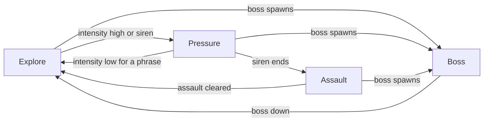

# SCRAPWAKE: Art & Audio Direction

The art bible and audio direction for SCRAPWAKE: palette, scale, lighting, characters, VFX, UI look, music, SFX and mix. Every asset, effect and screen follows it. This doc is the **single source for palette hex values**; every other number lives in [BUDGETS.md](../BUDGETS.md) and is linked, not restated ("e.g." marks an illustrative value). The rendering behind the look is in [engine/04-pixel-art-pipeline](../engine/04-pixel-art-pipeline.md) and [engine/03-rendering](../engine/03-rendering.md); screen flows are in [04-ux-flows](04-ux-flows.md); design and content are in the [GDD](01-gdd.md) and the [content catalogue](02-content.md). Spelling is British.

---

## Direction

**Gritty dystopian cyberpunk in stylised 3D pixel art: "neon in the rust".** Meridian is a rust-and-concrete megacity under permanent smog night. Two neon families fight over it: the warm sodium and amber of the old, broken, independent city, where PATCH belongs, and the cold cyan and white of Halcyon's corporate order. The screen will often be chaotic; it must always stay readable.

| Rule | In practice |
|---|---|
| **Orange is you, cyan is them** | Every gameplay colour belongs to one family ([colour language](#colour-language)); pillar 4 of the [GDD](01-gdd.md) |
| **Value before hue** | Gameplay objects are brighter and more saturated than the world. The environment stays in dark, desaturated rust, concrete and navy. |
| **Silhouette before detail** | Every actor reads as a solid shape at 1× zoom |
| **Danger = shape + motion + colour** | Never colour alone. Ember marks *critical* danger only, and always hatched and pulsing. |
| **Quiet near PATCH** | Friendly VFX thin out around PATCH, so its body and incoming threats stay visible |
| **Pixel honesty** | Integer scales only: no sub-pixel wobble, no mixed pixel sizes ([ADR-018](../DECISIONS.md#adr-018-pixel-exact-projection), [projection](../engine/04-pixel-art-pipeline.md#projection)) |
| **Grit is texture, not clutter** | Rust, grime and cracks live in micro-textures and props, never as noise on the gameplay plane |

## Palette

### Tokens

| Token | Hex | CSS variable | Role |
|---|---|---|---|
| Night 900 | `#070B16` | `--c-night-900` | Sky, deepest shadow, Sweep outlines, HUD panel base |
| Night 800 | `#0B1224` | `--c-night-800` | Shadow band, menu panel fill |
| Night 700 | `#13203B` | `--c-night-700` | Upper fog, far silhouettes, raised panels |
| Steel 700 | `#22385A` | `--c-steel-700` | Cold metal in shade, Sweep shells in shadow, dividers |
| Steel 500 | `#3E5F85` | `--c-steel-500` | Cold metal in light, rain, disabled UI (never text) |
| Concrete 600 | `#4A4E57` | `--c-concrete-600` | Concrete, asphalt, grey debris |
| Concrete 400 | `#8A8F99` | `--c-concrete-400` | Lit concrete, Scrap rarity, secondary text, stat losses |
| Rust 900 | `#3B1A0E` | `--c-rust-900` | Rust in shade, dirt, ground-level fog tint |
| Rust 700 | `#7A3416` | `--c-rust-700` | Rusted metal, brick, PATCH's industrial parts |
| Sodium orange | `#FF7A1A` | `--c-sodium-500` | **PATCH signature**: optic, player projectiles, street-lamp key light, player UI primary |
| Amber | `#FFB23F` | `--c-amber-400` | Scrap pickups, tower lights, UI numbers and accents, Salvaged rarity, stat gains |
| Ember | `#E8431C` | `--c-ember-600` | **Critical danger**, always with hatch + pulse + icon. Also Military rarity, in UI frames and loot beams only. |
| Halcyon cyan | `#19E6FF` | `--c-cyan-400` | **Sweep signature**: eyes, light strips, enemy fire, corp UI, Halcyon rarity |
| Electric blue | `#2F6BFF` | `--c-blue-500` | Shields, corp signage, cold ambient tint |
| Holo white | `#CFF6FF` | `--c-holo-100` | Lit Sweep shells, holograms, elite outlines, lightning cores |
| Magenta | `#FF2E88` | `--c-magenta-500` | **Anomalous only**: Anomalous rarity, anomaly zones and events |
| Bone text | `#F2E6D8` | `--c-bone-100` | UI body text, world text, damage numbers |

### CSS custom properties

The canonical file is `game/ui/palette.css`. It is parsed for its `--c-*: #RRGGBB;` declarations in three places:
- The DOM UI imports it ([CSS architecture](../engine/07-ui.md#css-architecture)).
- The renderer reads it at boot for its palette ([renderer v0](../engine/03-rendering.md#renderer-v0)).
- The asset cooker builds the colour-grading LUT and the MagicaVoxel master palette from it ([asset pipeline](../engine/10-tooling-testing.md#asset-pipeline)). The `--ui-*` aliases are UI-only; colourblind presets override aliases, never primitives.

```css
/* game/ui/palette.css: the only place palette hex values are written. */
:root {
  /* Environment */
  --c-night-900: #070B16;  --c-night-800: #0B1224;  --c-night-700: #13203B;
  --c-steel-700: #22385A;  --c-steel-500: #3E5F85;
  --c-concrete-600: #4A4E57;  --c-concrete-400: #8A8F99;
  --c-rust-900: #3B1A0E;  --c-rust-700: #7A3416;
  /* Player family */
  --c-sodium-500: #FF7A1A;  --c-amber-400: #FFB23F;  --c-ember-600: #E8431C;
  /* Halcyon family */
  --c-cyan-400: #19E6FF;  --c-blue-500: #2F6BFF;  --c-holo-100: #CFF6FF;
  /* Reserved */
  --c-magenta-500: #FF2E88;  --c-bone-100: #F2E6D8;

  /* UI aliases */
  --ui-panel: color-mix(in srgb, var(--c-night-900) 85%, transparent);   /* combat HUD */
  --ui-panel-menu: color-mix(in srgb, var(--c-night-800) 96%, transparent);
  --ui-line: color-mix(in srgb, var(--c-amber-400) 55%, transparent);
  --ui-text: var(--c-bone-100);      --ui-text-dim: var(--c-concrete-400);
  --ui-player: var(--c-sodium-500);  --ui-accent: var(--c-amber-400);
  --ui-corp: var(--c-cyan-400);      --ui-danger: var(--c-ember-600);
  --ui-anomalous: var(--c-magenta-500);
  --rarity-scrap: var(--c-concrete-400);   --rarity-salvaged: var(--c-amber-400);
  --rarity-military: var(--c-ember-600);   --rarity-halcyon: var(--c-cyan-400);
  --rarity-anomalous: var(--c-magenta-500);
}
/* Colourblind aid, protan/deutan: the player primary moves to Amber, away from Ember. */
:root[data-cvd="protan"], :root[data-cvd="deutan"] { --ui-player: var(--c-amber-400); }
```

### Colour language

| Family | Tokens | Means | Rules |
|---|---|---|---|
| **Player** | Sodium, Amber | PATCH, player structures and drones, friendly fire, scrap, player UI | PATCH's optic is the brightest orange cluster on screen. PATCH uses Sodium; towers and drones use Amber. |
| **Halcyon** | Cyan, Electric blue, Holo white | The Sweep, corp signage and broadcasts, enemy fire | Sweep projectiles are cyan/white diamonds; player projectiles are round and orange ([accessibility](01-gdd.md#accessibility)) |
| **Anomalous** | Magenta | Anomalous rarity, anomaly zones and events | Nothing else uses magenta, not even signage |
| **Critical danger** | Ember + Holo white hatch | Lethal telegraphs, primed mines, Forge critical, the Shatter countdown | Always shape (hatch, chevrons, icon) **and** motion (pulse), never a flat fill: orange vs red fails for deuteranopes |
| **Environment** | Night, Steel, Concrete, Rust | The city | Environment neon sits above head height, reads as text or logos, and is dimmer than gameplay emissives |
| **Neutral UI** | Bone, Concrete 400 | Text | Bone is the only warm white |

**Outlines** apply to actors only ([outlines](../engine/04-pixel-art-pipeline.md#outlines)). PATCH, towers and drones get Sodium, so team colour survives any lighting. Sweep specialists and bosses get Night 900, and elites get Holo white with a marching dash. The high-contrast option adds a Holo white rim to every Sweep unit ([accessibility](01-gdd.md#accessibility)).

### Rarity colours

Rarity is coded three ways: colour, frame shape and pip count. Parts also show their manufacturer in their silhouette ([PATCH](#patch)).

| Rarity | Colour | Pips | Frame | Extra cue |
|---|---|---|---|---|
| Scrap | Concrete 400 (grey) | 1 | Square | — |
| Salvaged | Amber | 2 | One chamfered corner | — |
| Military | Ember | 3 | Two chamfers + stencil chevrons | Static; never pulses, so it never reads as danger |
| Halcyon | Halcyon cyan | 4 | Rounded corporate pill | Faint scanline sheen |
| Anomalous | Magenta | 5 | Broken, offset frame | Glitch dropout (a static pattern under reduced motion) |

In the world, loot is a vertical light beam in the rarity colour, topped by the pip icon. Vertical beams never mean danger.

### Colourblind-safe checks

The table shows ΔE00 between key pairs, for normal vision and full-severity simulation (Machado 2009). A ΔE00 under ~20 is risky for sprites a few pixels wide. Recompute in M4 with the final LUT.

| Pair (meaning) | Normal | Protan | Deutan | Tritan | Verdict and mitigation |
|---|---|---|---|---|---|
| Sodium vs Cyan (you vs them) | 55 | 47 | 50 | 69 | Safe: the core pair holds for every deficiency |
| Sodium vs Ember (you vs critical danger) | 16 | 16 | 10 | 9 | **Unsafe.** Danger always adds hatch, pulse and icon, and the protan/deutan preset moves the player primary to Amber |
| Amber vs Ember | 32 | 28 | 18 | 22 | Workable with shape; the reason for the Amber shift |
| Magenta vs Ember (anomalous vs danger) | 27 | 37 | 19 | 7 | **Unsafe for tritans.** Anomalous always carries the broken frame and glitch pattern |
| Magenta vs Sodium (anomalous vs you) | 38 | 42 | 22 | 8 | Same mitigation |
| Cyan vs Magenta (Halcyon vs anomalous) | 81 | 33 | 32 | 76 | Safe; the lightness gap carries it |
| Amber vs Cyan (scrap vs enemy fire) | 48 | 44 | 49 | 56 | Hue-safe, but near-equal lightness under deutan and in greyscale. Shape decides: scrap is nut-and-cog chunks with a glint, Sweep shots are diamonds, player shots are round |
| Cyan vs Holo white | 15 | 9 | 13 | 13 | Within one family only; never carries a decision |

Text contrast is given as a WCAG 2.x ratio, on Night 900 / on the worst-case combat panel (85% Night 900 over a Holo white flash):

| Use | Colours |
|---|---|
| Any text | Bone 16.0 / 11.2, Holo white 17.1 / 12.0, Cyan 12.9 / 9.0, Amber 10.9 / 7.7, Sodium 7.5 / 5.3 |
| Large text (≥ 24 CSS px), icons, bars | Concrete 400 6.1 / 4.2 (also fine as small text on near-opaque menu panels), Magenta 5.6 / 3.9, Ember 4.9 / 3.4, Electric blue 4.4 / 3.1 |
| Never text | Steel 500 3.0 / 2.1 |

**Presets** ([settings](04-ux-flows.md#pause-and-settings)): protan and deutan move the player primary to Amber, in the CSS above and in a matching LUT variant; tritan thickens the anomalous glitch pattern and the danger hatch. Shape coding is always on.

Check every screen with the browser's vision-deficiency emulation and a greyscale debug view ([dev tools](../engine/10-tooling-testing.md#dev-tools)). In greyscale, allegiance, danger and pickups must still separate by shape and motion.

## Scale and proportions

All pixel constants are in [BUDGETS: pixel & camera constants](../BUDGETS.md#pixel--camera-constants). The current hypothesis ([ADR-018](../DECISIONS.md#adr-018-pixel-exact-projection)) uses one pixel density for everything, e.g. 8 px/m, where a character voxel is 1 px and a world voxel is 2×2 px.

**One pixel grid.** Characters, props, world faces, VFX and world text share one on-screen pixel size. Each world face carries a world-anchored micro-texture at character density: brick courses, concrete speckle, rust streaks spanning several voxels. Nothing is scaled by a non-integer factor, and close-ups render the same model at an integer multiple.

**PATCH** has chibi proportions, at the height set in [BUDGETS](../BUDGETS.md#pixel--camera-constants) (e.g. 20–22 px):

| Body zone | Share of height | Notes |
|---|---|---|
| Head (optic housing) | ~40% | The round optic is at least 5×5 px with a 1 px bright pupil, and reads at far zoom |
| Torso (Core, chips, hatch) | ~35% | A boxy utility cabinet; each chip is a 1 px LED on the chest plate |
| Legs | ~25% | Set by the LEGS part: ~15% (treads) to ~35% (spider legs) |
| Arms | Reach the ground from the shoulder | Needed for the husk crawl |

- **Silhouette rule.** Only HEAD, ARM L, ARM R, BACK and LEGS change the outline ([body as loadout](01-gdd.md#body-as-loadout)). CORE, chips and plating change surface and light only; plating may grow the outline by at most 1 px.
- **Socket envelopes.** An arm part may widen PATCH by up to 40% per side and a BACK part may raise it by up to 30%. A HEAD part must keep the optic visible from every facing. Only fusions may break the envelopes.

**Enemy size ladder** (P = PATCH height; the two extremes come from [BUDGETS](../BUDGETS.md#pixel--camera-constants)):

| Class | Height | Examples | Read |
|---|---|---|---|
| XS | BUDGETS minimum (e.g. 4 px) | Mites | A glint with legs; readable only as a swarm |
| S | ~0.35–0.5 P | Scrubbers, Crawler Mines, Leeches | Ground-hugging shapes |
| M | ~0.6–1.0 P | Hover Wasps (plus hover gap), Shepherds, Jammers | At or below PATCH, so PATCH stays the tallest figure in a fodder crowd |
| L | ~1.0–1.5 P | Enforcers, Snipers, Breachers | The specialists the eye picks out first |
| XL | ~1.5–2.0 P | Carriers, elite specialists | Mini-landmarks |
| Boss | BUDGETS boss range (e.g. 48–96 px) | Demolisher, Warden Titan, Hive Queen, Sweep Nexus | Screen events; roofs peel around them too |

**Towers** stand on the build grid ([BUDGETS: world constants](../BUDGETS.md#world-constants)). A one-tile tower is about as wide as PATCH and 1–2 P tall; a Mk III top piece may add up to 50%.

**World.**

- **Height cap.** Building height is capped by the district height ([BUDGETS: world constants](../BUDGETS.md#world-constants)). At default zoom a full-height block fills most of the screen, so kits near the play space favour 2–4 storeys and tall landmarks sit toward district edges.
- **Roof peel.** Roofs and upper floors near PATCH, the cursor and the Forge peel away with a dithered cut. Occluded PATCH, enemies and towers show x-ray silhouettes in their family colour ([occlusion handling](../engine/04-pixel-art-pipeline.md#occlusion-handling)).
- **Four-sided assets.** Camera yaw snaps to fixed quarter turns ([BUDGETS](../BUDGETS.md#pixel--camera-constants)), so every asset must read from all four sides: no front-only details, and signs on at least two faces of a building.
- **Props** (lamps, crates, signs) are authored at character density and break into debris as whole pieces. Structure is world voxels ([edits and damage](../engine/06-world.md#edits-and-damage)).

## Lighting mood

Perpetual smog night, with no day cycle. Every surface is split between a warm key and a cold fill, which gives even plain concrete the orange/blue look.

| Layer | Look | Tech |
|---|---|---|
| Key light | Low-angle, sodium-tinted directional "city glow"; it casts the one shadow map | [Lighting and shadows](../engine/03-rendering.md#lighting-and-shadows) |
| Ambient | Cold blue hemisphere (Steel and Electric blue above, Rust bounce below) | Lit toon band warm, shadow band cool ([shading and colour grading](../engine/04-pixel-art-pipeline.md#shading-and-color-grading)) |
| Local lights | Sodium street lamps (warm pools), neon in both families, fires, the Forge | Clustered lights, capped per tier ([BUDGETS: entity caps](../BUDGETS.md#entity-caps)) |
| Fog | Height gradient: warm rust and sodium haze at the ground, fading to Night 700 above; distance fog to Night 800 | Dithered, in post |
| Grade and bloom | One LUT per district; bloom from emissives only, blurred before the upscale | [Shading and colour grading](../engine/04-pixel-art-pipeline.md#shading-and-color-grading) |

**Neon signage** sits above head height and stays dimmer than gameplay emissives. **Warm** neon (Sodium, Amber) is the old city: independent shops, broken signs, irregular flicker, missing letters. **Cold** neon (Cyan, Blue, Holo white) is Halcyon: pristine billboards and wayfinding, synchronised pulses, the logo everywhere. **Magenta** appears only inside anomaly zones.

| Emitter | Colour | Casts light? |
|---|---|---|
| PATCH optic | Sodium | Yes: a small warm pool at PATCH's feet, so the player finds PATCH in any crowd |
| Tower lights, Forge drones, the Forge | Amber | The Forge: a big pulsing beacon visible from anywhere |
| Sweep eyes and light strips | Cyan | Fodder: no. Elites and bosses: yes. |
| Halcyon parts on PATCH | Keep their cyan strips | No |
| Anomalies / critical danger | Magenta / Ember + Holo white hatch | Sparingly / pulsing within the flash limiter |

Actors never shade below a minimum light level, so PATCH and the Sweep read even in unlit alleys.

**Districts** (layout and content in [districts](02-content.md#districts)):

| District | Mood and grade | Weather |
|---|---|---|
| Rust Docks | Sodium-heavy harbour: cranes, container stacks; warm grade | Harbour fog |
| Neon Bazaar | Dense signage in both families, stalls, cables overhead | Rain |
| Glasswall | Corporate glass towers, clean plazas; blue-white grade, so the only orange is PATCH | Clear, cold |
| The Sump | Flooded undercity, failing lamps, pipes; low-key grade | Rain, drips |
| Halcyon Spire | Sterile white arcology; cyan-white grade, maximum contrast for PATCH | Clear |

**Rain** is GPU streak particles (Steel 500, dithered), a specular band on wet upward faces, and puddle decals tinted by the nearest light cluster. There are no screen-space reflections. On `std`, rain density is the first thing to drop when the particle budget tightens.

## Characters

### PATCH

- **A boxy maintenance bot**: a squat utility-cabinet torso with a stencilled service hatch, grab handles and tool clips. PATCH is asymmetric; the Sweep is symmetric.
- **One big round orange optic** is PATCH's face and the player's anchor on screen. The iris dilates while charging, a shutter blinks, and it glitches when damaged and narrows to a pinhole during Overclock.
- **Mismatched parts from different manufacturers.** Every part shows where it came from:

| Manufacturer family | Look | Palette | Typical rarities |
|---|---|---|---|
| Rusted industrial | Heavy, riveted, hydraulic pistons, hazard chevrons, military stencils | Rust, Concrete, Amber stripes | Scrap, Salvaged, Military |
| Sleek corp (stolen) | Smooth white shells, bevels, light strips | Holo white, Steel, Cyan | Halcyon |
| Jury-rigged scrap | Welded plates, zip ties, taped cables, odd bolts | Concrete, Rust, Sodium sparks | Scrap, fusions |
| Anomalous | Fractured geometry, floating fragments | Magenta glow on dark steel | Anomalous |

- **Dangling cables.** One to three loose cables hang from sockets on springs. They are cheap to render and make PATCH feel alive and improvised.
- **Blue creeps in.** Halcyon parts keep their blue, so a late-run PATCH visibly carries stolen corp tech. Orange stays dominant: every stolen part gets a hand-painted orange claim slash, and cyan stays under ~40% of PATCH's emissive pixels.
- **Plating** is bolted on inside the silhouette: bare frame, then patched plates, then full plating with amber hazard trim.
- **Chassis looks** ([meta progression](01-gdd.md#meta-progression)) change paint and starting parts, never the body: Mender, the default (welding torch, amber cross decals); Bulwark (wide stance, riot plate, a turret pack on the back); Skitter (light frame, sprinter legs, antenna whips); Wrecker (hazard stripes, drill fist).
- **Visible progression**, from husk to full body:
  - **Husk:** torso, optic and one arm weapon, dragging itself along. Every run starts here (except with Skitter), and a Shatter returns PATCH to it.
  - **Walker:** standing on legs from the guaranteed cache ([FTUE](01-gdd.md#first-time-user-experience)).
  - **Built:** all four hardpoints filled, plating visible.
  - **Evolved:** fusion parts with unique silhouettes ([fusions](02-content.md#fusions)).

### The Sweep

Halcyon's machines are PATCH's opposite: sleek, uniform, sterile. Their white shells shade from Holo white to Steel, with cyan strips and eyes. Forms are pills, perfect circles and symmetric wedges. Every unit of a type is identical, and groups move in sync.

| Enemy | Tier | Primary shape | Motion | Tell |
|---|---|---|---|---|
| Mites | Fodder | Dot with legs | Skitter in streams | Single cyan eye |
| Scrubbers | Fodder | Disc with brushes | Smooth glide, spin | Strip brightens before a lunge |
| Hover Wasps | Fodder | Dart plus ground shadow | Bob, strafe | The shadow blob shows altitude |
| Crawler Mines | Fodder | Low dome | Creep, stop, pulse | Primed: Ember hatch ring and a fast pulse |
| Shepherds | Fodder | Tall stalk with a halo ring | Glide behind the pack | Halo pulses while buffing |
| Enforcers | Specialist | Upright block with a riot shield | March, shield up | Shield flashes Holo white on a block |
| Breachers | Specialist | Wedge with a drill nose | Grind, dust plume | Drill spin-up. The Prime Breacher adds a hex shield that visibly deflects tower fire, and a PATCH-only icon |
| Snipers | Specialist | Tall tripod with a long barrel | Still, then relocate | Cyan sight line that turns Ember and pulses just before the shot |
| Carriers | Specialist | Boxy hull with bay doors | Slow, heavy | Bay doors open before a drop |
| Leeches | Specialist | Small pod with a tether cable | Dart and latch | Tether line to the victim |
| Jammers | Specialist | Dish on legs | Plant and broadcast | Glitch ring; jammed towers show static |

- **Elites** are always actors, including promoted fodder ([enemies](01-gdd.md#enemies)), so they can carry the ID-buffer outline. It is Holo white with a marching dash pattern, one pattern per modifier, plus a modifier glyph above the unit ([enemies](02-content.md#enemies)). A modifier that is lethal on death uses the Ember critical treatment.
- **Telegraphs** have two levels: a cyan hatch means "dangerous, avoid it"; an Ember hatch with a fast pulse means "lethal". The hatch fills toward the moment of impact.
- **Bosses** ([bosses](02-content.md#bosses)) each own one iconic shape and one readable weak point: their brightest cyan light, ringed by a pulsing outline. The shapes are a wrecking-crane walker with a demolition ball, built to show off collapses (Demolisher); a riot warden with shield wings and a floodlight head (Warden Titan); a carrier mothership leaking Mites (Hive Queen); and a floating core in holographic rings (Sweep Nexus).

### Towers

Towers are salvage-built from the same scrap as PATCH: rust, concrete and welded plates, with Amber status lights and hazard stripes ([towers](02-content.md#towers)). Mk I is bare scrap and Mk II adds plates and a light. Mk III swaps the top piece per branch, so the branch reads from the silhouette.

| Tower | Silhouette | Range language |
|---|---|---|
| Rivet Turret | Squat twin barrels on a drum | Solid ring |
| Arc Pylon | Tall coil on a tripod | Ring, plus chain links to nearby pylons |
| Flame Vent | Floor grate, almost flush | Cone wedge |
| Mortar | Stubby tube on a turntable | Ring, plus a dashed inner minimum-range ring |
| EMP Spire | Antenna spire with a halo | Periodic pulse ring |
| Scrap Wall | Voxel wall segments with amber hazard trim | Footprint only |

1.0 towers follow the same grammar. Ranges are [world-space UI](../engine/03-rendering.md#world-space-ui): a 1 px Amber edge over a dithered fill. They show in build mode, on hover or selection, and while Survey is on ([build mode](04-ux-flows.md#build-mode)).

### Animation rules

- **Facings and pose clock.** Facings are quantised and poses step on a fixed clock ([BUDGETS](../BUDGETS.md#pixel--camera-constants), e.g. 16 facings at 12 fps). Movement is interpolated at display rate.
- **Procedural IK legs.** Two-bone IK plants feet on the voxel surface. The gait comes from the LEGS part (biped, quad, spider, treads, hover). There is no skeletal skinning.
- **Spring secondary motion.** Cables, antennas and loose plates hang on damped springs. Their output is sampled on the pose clock and snapped to whole character voxels, so nothing wobbles sub-pixel.
- **Swarm animation** is short GPU cycles (bob, leg tick, spin), phase-offset by unit ID so crowds never march in lockstep ([pass chain](../engine/05-gpu-swarm.md#pass-chain)).
- **Hitstop on big impacts** (boss hits, heavy hits on PATCH, collapses). The poses of the actors involved, and the camera, freeze for a few frames. This is presentation-only: the sim keeps ticking, for determinism and co-op.
- **Quantised screen shake.** A capped trauma model with offsets in whole internal pixels. It follows the shake setting and is off under reduced motion.
- **Shatter.** Parts pop off on springs to their sim positions and blink an orange optic ping until collected.

## VFX

| Effect | Look | Tech | Colour |
|---|---|---|---|
| Pixel sparks | 1 px points on short gravity arcs; white-hot core fading out | GPU particles | Source family |
| Voxel debris | Material-coloured cubes that bounce once, then shatter into 1 px bits | [Debris](../engine/06-world.md#debris) | Material |
| Smoke and fog | Ordered-dither puffs, never alpha-sorted | [Particles and transparency](../engine/03-rendering.md#particles-and-transparency) | Concrete, Night |
| Neon trails | 1–2 px trails behind projectiles | GPU line quads | Source family |
| Chain lightning | Jagged low-res polyline, snapped to internal pixels, re-jagged every pose frame | One dispatch per bounce ([pass chain](../engine/05-gpu-swarm.md#pass-chain)) | Holo white core; Amber halo (yours) or Cyan halo (theirs) |
| Shockwave rings | Expanding 1–2 px ring with dithered falloff | World-space pass | Source family |
| Holographic glitch | Scanline offsets, cyan/blue channel split, blocky dropout | Holo materials, corp UI | Halcyon only |
| Hit flash, damage numbers | One-frame flash; pixel-font numbers that pop, float and merge rapid hits | Spawned on the GPU, so feedback is instant ([ADR-011](../DECISIONS.md#adr-011-two-tier-simulation)) | Near-white flash; Bone numbers, crits larger with an Amber rim |
| Telegraphs | Hatched ground decals that fill toward impact | World-space UI | Cyan (avoid) or Ember (lethal) |
| Explosions | White core, then Sodium, then Rust smoke, plus a light pulse | Particles and a short-lived light | Source family |

- **Blend modes.** Emissives (sparks, trails, lightning, glows) are additive. Everything translucent (smoke, fog, ghosts, holograms, ranges) is dithered. Nothing is alpha-sorted.
- **Flash limiter.** Full-screen flashes are capped ([BUDGETS: UI constants](../BUDGETS.md#ui-constants)); any flash over the cap becomes a local light pulse.
- **Particle budget** ([BUDGETS: entity caps](../BUDGETS.md#entity-caps)). When it is full, drop ambient particles first, then cosmetic debris bits, then friendly sparks. Telegraphs and pickups are never dropped.
- **Friendly VFX yield.** Player and tower effects draw under enemy telegraphs, and the "own VFX opacity" setting thins them ([pause and settings](04-ux-flows.md#pause-and-settings)).
- **Reduced motion.** No glitch jitter, no shake, shorter trails. Telegraph pulses slow down but remain.

## UI look

**"Salvaged terminal meets corp hologram."** The player UI is PATCH's own diagnostic terminal: Amber and Sodium on dark translucent panels, with chamfered corners, hairline borders, corner ticks and faint static scanlines. Halcyon's broadcasts interrupt it (assault warnings, announcer cards, corp screens) in Cyan and Holo white, with rounded pill shapes, the fictional Halcyon wordmark, and glitch.

| | Player UI | Corp broadcast | Anomalous |
|---|---|---|---|
| Colour | Amber, Sodium on `--ui-panel` | Cyan, Holo white | Magenta |
| Shape | Chamfered rectangles (`clip-path`) | Pills, circles | Broken, offset frame |
| Combat motion | `transform` and `opacity` only | Stepped `transform` jitter, `opacity` flicker | Static |
| Menu motion | Adds a paused-frame blur and animated scanlines | Adds animated filters | Adds animated dropout |

```css
.panel {                          /* combat-safe: static structure, nothing animated here */
  --cut: calc(8px * var(--ui-scale, 1));
  background:
    repeating-linear-gradient(to bottom,
      color-mix(in srgb, var(--c-bone-100) 4%, transparent) 0 1px, transparent 1px 3px),
    var(--ui-panel);
  clip-path: polygon(var(--cut) 0, 100% 0, 100% calc(100% - var(--cut)),
                     calc(100% - var(--cut)) 100%, 0 100%, 0 var(--cut));
  color: var(--ui-text);
}
```

| Role | Font (OFL; licences to re-verify before M6) | Use |
|---|---|---|
| Display | Chakra Petch 600/700 | Titles, card names, big labels; uppercase with slight tracking |
| Body | Space Grotesk 400/500 | Descriptions, settings, Codex |
| Numbers and terminal | JetBrains Mono 500/700 | Timers, scrap, stat diffs, boot logs; monospaced, so counters never jitter |
| World text | A pixel bitmap font: our own Latin font, or an OFL candidate such as Silkscreen or Pixelify Sans (to verify) | In-world labels and damage numbers, drawn in WebGPU at k× after the upscale ([resolution and scaling](../engine/04-pixel-art-pipeline.md#resolution-and-scaling)) |

- **Fonts** are self-hosted WOFF2 subsets, counted in the web payload ([BUDGETS: download & load](../BUDGETS.md#download--load-targets)). Sizes are in `rem`, so they follow the UI scale ([BUDGETS: UI constants](../BUDGETS.md#ui-constants)).
- **Icons** are pixel-grid SVGs (`shape-rendering: crispEdges`) in one colour plus one accent, and must be recognisable in monochrome.
- **Performance.** The combat HUD obeys the [combat HUD rules](../engine/07-ui.md#combat-hud-rules): static structure, and only `transform` and `opacity` animate. No `backdrop-filter`, no animated `filter` or `box-shadow`, no `@property` animations. Richer effects are for menus only, where the paused world is a static frame.

## HUD wireframes

These layouts are indicative. Behaviour, update rates and per-device input are in [04-ux-flows](04-ux-flows.md#hud). Values are samples: `S:nnn` is a scrap cost and `P:n` a power cost ([towers](02-content.md#towers)).

### Desktop combat HUD

Vitals sit top-left, the clock and assault top-centre, and economy and minimap top-right. The level ring, drawn as `(( ))`, wraps the scrap balance. The Forge sits bottom-left, hardpoints bottom-centre and actions bottom-right. The centre stays clear for PATCH.

```text
+------------------------------------------------------------------------------------------+
| +--------------------------------+ +------------------------+ +------------------------+ |
| | (O) HP  [##########----] 142   | |        12:34           | | LV 14  (( 1,240 ))     | |
| |     PLT [#][#][#][ ][ ]        | | ASSAULT 2 IN 0:42      | | [TAB] LEVEL UP +2      | |
| |     EN  [#######-----] OC RDY  | | [Mite 60][Wasp 12]     | +------------------------+ |
| |     REBOOTS <> <>              | | [PRIME 1][ELITE 2]     |             +------------+ |
| +--------------------------------+ +------------------------+             | MINIMAP    | |
|                                                                           |  F   *  >  | |
| << edge threat arrow (WebGPU)                                             | (WebGPU)   | |
|                                                                           +------------+ |
|             world: PATCH, swarm, towers, ghosts, ranges, health bars,                    |
|             damage numbers - all world-space UI is drawn in WebGPU                       |
|                 > hold [E] OPEN CACHE      [SIREN] assault in 30 s <                     |
| +--------------------------+ +----------------------------+ +--------------------------+ |
| | FORGE [########----]     | | HEAD ARM-L ARM-R BACK      | | [SPACE] DASH x2          | |
| | SHIELD READY             | | [ok] [ok]  [JAM] [--]      | | [F] OVERCLOCK [R] RECALL | |
| | POWER 14/20              | | CORE [OC 60%]  LEGS [2]    | | [B] BUILD     [I] BODY   | |
| +--------------------------+ +----------------------------+ +--------------------------+ |
+------------------------------------------------------------------------------------------+
```

### Level-up screen

```text
+------------------------------------------------------------------------------------------+
| LEVEL UP   LV 14 > 15              2 more banked             [TAB] back, keep banked     |
|------------------------------------------------------------------------------------------|
| PATCH CLOSE-UP     | +--------------+ +--------------+ +--------------+ +--------------+ |
| (WebGPU)           | | MILITARY *** | | SALVAGED **  | | HALCYON **** | | BLUEPRINT    | |
|     .-----.        | | [icon]       | | [icon]       | | [icon]       | | [icon]       | |
|     | (O) |  HEAD  | | <part name>  | | <part name>  | | <chip name>  | | ARC PYLON    | |
| +--+-----+--+      | | PART  ARM R  | | UPGRADE BACK | | CHIP  4 of 6 | | TOWER  Mk I  | |
| |L |  #  | R|<new  | | DMG  +18% ^  | | Lv 2 > 3     | | EN regen ^   | | S:nnn  P:n   | |
| +--+-----+--+      | | RATE  -5% v  | | RANGE +10% ^ | |              | | chain range  | |
|     |_| |_|  LEGS  | | FUSION 1/2   | |              | | synergy: ARC | |              | |
| chip LEDs: oooo..  | +--------------+ +--------------+ +--------------+ +--------------+ |
| drag/[RS] rotate   |   focused card: stat diff vs what it replaces;                      |
|                    |   the close-up previews the part on PATCH                           |
|------------------------------------------------------------------------------------------|
| [1-4] or click: PICK   [R] REROLL x2   [X hold] BANISH x1   [BKSP] SKIP                  |
| pad: [LS] focus [A] pick [X] reroll [Y hold] banish [B] back                             |
+------------------------------------------------------------------------------------------+
```

### Build bar and radial menu

```text
DESKTOP BUILD BAR (bottom centre; the world keeps running)
+-----------------------------------------------------------------------------------------+
| BUILD   POWER [##########------] 14/20                          [B] or [ESC] exit       |
| +---------+ +---------+ +---------+ +---------+ +---------+ +---------+                 |
| |1 RIVET  | |2 ARC    | |3 FLAME  | |4 MORTAR | |5 EMP    | |6 WALL   | selected: ARC   |
| |S:nnn    | |S:nnn    | |S:nnn    | |S:nnn    | |S:nnn    | |S:nn/2m  | range: chain    |
| |P:n      | |P:n      | |P:n      | |P:n      | |P:n      | |P:n      | Mk I > II > III |
| +---------+ +---------+ +---------+ +---------+ +---------+ +---------+                 |
| [LMB] place  [drag] wall line  [Q] rotate  [SHIFT] keep placing  [RMB] cancel           |
+-----------------------------------------------------------------------------------------+

GAMEPAD RADIAL (hold LT, aim with RS, release to pick; release centred = cancel)
                              [ARC PYLON]
                  [RIVET]                     [FLAME]
              [WALL] ---- (  S:nnn  P:n  ) ---- [MORTAR]
                [UPGRADE]                     [EMP]
                              [REPAIR]
snap-cursor: [RS] steps tile by tile, [A] place, [X] wall line, [R3] rotate, [B] cancel
```

## Audio direction

Sound follows the same split as colour. PATCH and the old city sound analog, crunchy and improvised; Halcyon sounds clean, glassy and polite.

### Music

The style is darksynth, industrial and breakbeat: analog-style bass and arps, Meridian's machinery as the drum kit (clanks, pistons, chains), and chopped breakbeats under assaults. Each district has one track, in one tempo and key, split into aligned stems ([BUDGETS: audio constants](../BUDGETS.md#audio-constants)).

| Stem | Plays when | Adds |
|---|---|---|
| Explore | Default: low director intensity | Pads, arps, sparse industrial percussion |
| Pressure | Intensity rising, or the assault siren running | Drums, bass pulse, filtered break |
| Assault | Assault active | Full breakbeat, distorted bass, lead |
| Boss | A boss is alive | Its own arrangement, which replaces the others |



- **Intensity** comes from the director and the GPU density and threat maps ([director and pacing](01-gdd.md#director-and-pacing)).
- **Transitions** land on bar lines, and the assault stem hits on the siren's final blast.
- **District colour:** foghorn drones and chain percussion (Rust Docks); chopped vocal textures from licensed samples only (Neon Bazaar); glassy FM bells (Glasswall); dub delays and drips (The Sump); corporate muzak that mutates into darksynth (Halcyon Spire).

### Stingers, sirens and SFX

| Cue | Sound | Rule |
|---|---|---|
| Corp broadcast | Cheerful three-note Halcyon chime, slightly detuned | Precedes every announcer line |
| Assault siren | Two-tone city PA siren, panned from the assault's spawn side, in three phases: distant, closer and faster, final blast | Priority cue for the whole countdown ([pacing chart](01-gdd.md#pacing-chart)) |
| Composition layers | Layered over the siren: high whine for flyers, low drill growl for the Breacher, metallic choir hit for elites | Tells the player what is coming without reading |
| Forge shield down, Shatter | Klaxon and announcer; glitch sweep, then a servo heartbeat until PATCH is whole | Priority cues |
| Boss intro | Sub drop, announcer line, boss stem | Ducks everything else |

Per-type voice caps are in [BUDGETS: audio constants](../BUDGETS.md#audio-constants).

| SFX category | Character | Cap type |
|---|---|---|
| Weapons and hits | Crunchy, bit-crushed transients; metal on metal | Hits |
| PATCH | Servo whirs, hydraulic hisses, clunky footfalls per LEGS part; a part attaches with a ratchet and a power-up chirp | — |
| Electric | Arcs, buzzes, EMP thumps (Arc Pylon, chain lightning, EMP Spire) | Hits |
| Scrap pickups | Pitch-stepped combo ladder (below) | Pickups |
| Destruction | Layered: sub rumble, material crunch (concrete, metal, glass), debris patter | Explosions |
| Swarm bed | One looped skitter-and-hum bed; its level and filter follow local density, with no per-fodder voices | Bed only |
| UI | Player UI: relay clicks and terminal blips. Corp UI: glassy chimes. | UI |

- **Combo pitch ladder.** Each pickup inside a short window (e.g. 0.4 s) plays one step higher on a pentatonic scale in the current track's key. At the top it wraps with a sparkle layer, and a gap resets it. A burst over the pickup cap collapses into one voice at the highest step. Big merged gems play a chord.
- **Destruction scaling.** The rumble and patter layers scale with collapse size and debris counters ([destruction](01-gdd.md#destruction)).
- **Swarm sounds** come from GPU counters and density maps, never from per-unit events ([CPU-GPU contract](../engine/05-gpu-swarm.md#cpu-gpu-contract)).

### Voice and mix

**PATCH speaks only in bleeps.** A small sampler of synth bleeps carries mood through pitch contour: rising means curious, falling means hurt, fast chirps mean alarmed. Captions show intent, e.g. "PATCH: [alarmed bleeps]". Alternative bleep voice sets are 1.0 cosmetics.

**The corporate announcer**, "Halcyon Public Safety", is calm, polite and synthetic. It delivers assault warnings, district greetings, boss intros and cheerful threats.

**Announcer licensing.** A TTS voice needs a licence for commercial use and for redistributing the rendered audio, and no real person's voice is cloned without a written contract. If generative AI is used, store disclosures apply (Steam's AI content disclosure; to verify at M7). The fallback is a human VO actor processed through a vocoder and bit-crusher chain. Lines are subtitled in every UI language.

| Mix rule | Detail |
|---|---|
| Buses | Master → Music, SFX (combat, world, swarm bed), Voice (announcer, PATCH), UI, Ambience. Web Audio runs on the main thread, fed by the audio event ring ([runtime topology](../engine/01-overview.md#runtime-topology)). |
| Danger cues are always audible | Siren, Forge under attack, shield down, Shatter, and boss and Sniper telegraphs use reserved voices outside the per-type caps. They are never ducked or stolen, and they sit in the mid-range, so they survive small laptop and Steam Deck speakers, and mono. |
| Ducking | Boss intros and announcer lines duck music and SFX. Opening level-up or Assembly (a single-player pause) stops world SFX and low-passes the music. Big explosions briefly duck the swarm bed. |
| Voice stealing | Within the caps, the oldest and quietest voice goes first |
| Captions | Every priority cue has a caption, with a direction hint for off-screen sources, e.g. "[SIREN] <" ([pause and settings](04-ux-flows.md#pause-and-settings)) |
| Range and mono | Wide / Normal / Night presets. There is a mono option, and no information depends on panning alone. |

## Asset pipeline

These are notes for artists. The tooling is in [asset pipeline](../engine/10-tooling-testing.md#asset-pipeline), and prefab-kit assembly in [procedural generation](../engine/06-world.md#procedural-generation).

- **MagicaVoxel** is the only 3D tool: characters, parts, enemies, towers, props and prefab kits.
- **Palette-locked.** Every file starts from the master palette that the cooker exports from `palette.css`. Off-palette voxels fail the cook, with a report. Palette indices map to world materials and emissive flags.
- **Units.** Characters, parts and props use character voxels; prefab kits use world voxels ([BUDGETS: world constants](../BUDGETS.md#world-constants)). Kit pieces align to the build grid, so buildings and player structures share one lattice.
- **Orientation.** The pivot is at ground centre, and the front faces MagicaVoxel −Y; the cooker converts axes. Kit files carry a hidden `ref_patch` object for scale; the cooker strips hidden objects.
- **Sockets.** A socket is a one-voxel object named `@<socket>` (e.g. `@arm_l`, `@back`, `@muzzle`, `@cable_1`). Its position and rotation become the socket transform, and the marker is stripped. Each part declares the socket it attaches to, plus its own child sockets.
- **Structure.** Prefab-kit layers named `struct:pillar`, `struct:slab` and `struct:wall` feed the structural graph, and the cooker validates them ([ADR-015](../DECISIONS.md#adr-015-structural-graphs-for-collapse), [structural collapse](../engine/06-world.md#structural-collapse)).
- **Review.** Check each asset at 1× in the look-dev scene, at every zoom and yaw ([look-dev tests](../engine/04-pixel-art-pipeline.md#look-dev-tests)).

| Prefix | Content | Example |
|---|---|---|
| `chr_`, `prt_` | PATCH base pieces; parts, by hardpoint | `chr_patch-torso_a.vox`, `prt_arm_<part>.vox` |
| `enm_`, `bos_` | Sweep enemies, bosses | `enm_scrubber_a.vox`, `bos_warden-titan.vox` |
| `twr_` | Towers, per Mk and branch | `twr_arc-pylon_mk3b.vox` |
| `kit_`, `prp_` | Prefab-kit pieces per district; props | `kit_docks_wall-2x1_a.vox`, `prp_sodium-lamp_a.vox` |
| `mus_`, `sfx_`, `vo_` | Music stems, SFX, voice lines | `mus_docks_assault`, `sfx_pickup_scrap_03`, `vo_announcer_siren_01` |

- **Naming.** Lowercase only; `_` separates fields and `-` joins words. Variants are `_a`, `_b`; tiers are `_mk1` to `_mk3`, followed by the branch letter (`_mk3a`).
- **Audio.** Author at the engine sample rate ([BUDGETS: audio constants](../BUDGETS.md#audio-constants)). A track's stems share one length and one bar grid. The codec per platform is chosen in M1 (to verify: Opus in Safari).

## Readability KPIs

| Test | Target | Milestone |
|---|---|---|
| **Find PATCH**: testers locate PATCH in a design-load screenshot | Median ≤ 1 s | M4, M6 |
| **Name the threat**: testers pick the most dangerous thing on screen | ≥ 90% correct within 2 s | M6 |
| **Silhouettes**: testers identify each enemy from a solid silhouette at 1× | ≥ 90% | M4 |
| **Colour vision**: every gameplay signal survives protan, deutan, tritan and greyscale simulation | 100% of checklist | M4, M6 |
| **Flashes**: the flash limiter holds in a stress-scene capture | 0 violations | M6 |

## Slice vs 1.0

| Area | Vertical slice | 1.0 |
|---|---|---|
| Districts | Rust Docks kit and LUT | Adds Neon Bazaar, Glasswall, The Sump, Halcyon Spire |
| Towers | Rivet Turret, Arc Pylon, Flame Vent, Mortar, EMP Spire, Scrap Wall | Adds Laser Fence, Harvester, Repair Bay, Railgun, Decoy, Drone Hangar, Generator |
| PATCH | Base body, slice parts, Halcyon parts | Adds Anomalous parts, all fusions, all Chassis looks |
| Enemies, bosses | Per [VERTICAL-SLICE](../VERTICAL-SLICE.md#content-scope) | All Sweep types, elite modifiers, all four bosses |
| Audio | Rust Docks track with all stems; English announcer with captions | One track per district; subtitles in every UI language |

## Open questions

- **Ember does double duty.** The plan's palette has no dedicated red, so Ember covers both critical danger and Military rarity. This doc limits Military to static UI frames and loot beams. A separate alarm token would be cleaner; decide in M4 look-dev.
- **Pixel font.** Should we draw our own Latin font or adopt an OFL one? Which licensed bitmap font covers CJK?
- **Announcer.** Licensed TTS or a processed human VO actor? Which languages beyond English get voiced?
- **Rain on `std`.** Does wet shading fit the post-processing budget on the Steam Deck ([BUDGETS: GPU frame budgets](../BUDGETS.md#gpu-frame-budgets))?
- **Close-ups.** Is the integer-scaled in-game model good enough for the level-up and Assembly close-ups, or does PATCH need a dedicated close-up LOD?
