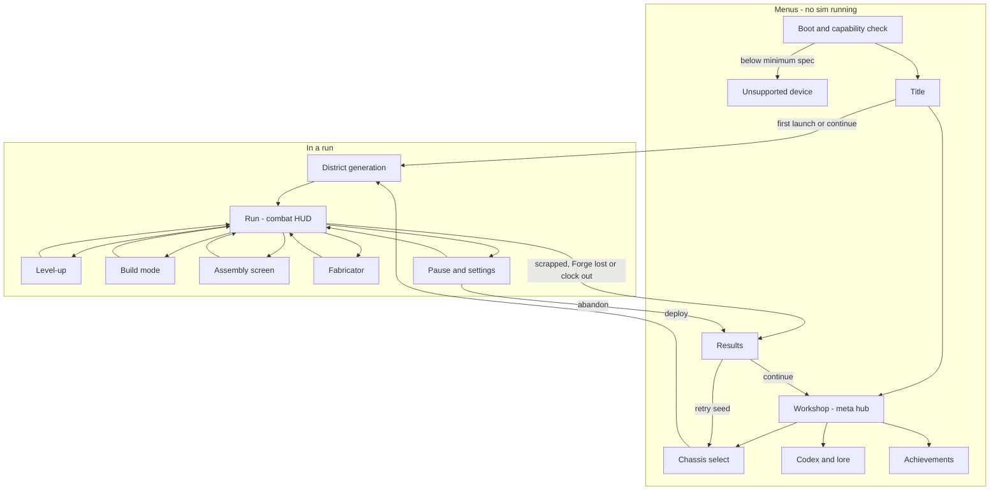
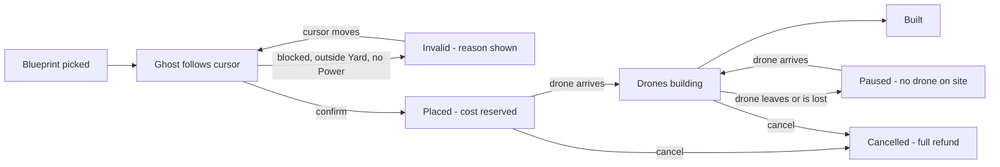

# SCRAPWAKE: UX Flows

This doc specifies every SCRAPWAKE screen and flow for keyboard and mouse (KB/M), gamepad and touch: the screen map, the first-time user experience (FTUE), the HUD, level-up, build mode, Assembly, the fabricator, pause and settings, and results.

- **Rules and tuning** live in the [GDD](01-gdd.md); the default bindings here mirror its controls table.
- **Look, palette and ASCII wireframes** are in [03-art-audio](03-art-audio.md#hud-wireframes).
- **UI architecture** (custom elements, state bridge, CSS rules, input plumbing) is in [engine/07-ui](../engine/07-ui.md).
- **Numbers** live in [BUDGETS.md](../BUDGETS.md); "e.g." marks an illustrative value.

Spelling is British.

---

## UX principles

1. **Banked, not modal.** Nothing interrupts combat except the player's own choice or a lull prompt ([ADR-023](../DECISIONS.md#adr-023-banked-level-ups-and-real-time-building)).
2. **No text walls.** Prompts are at most four words plus a glyph. Lore lives in the Codex.
3. **Every action on every device.** KB/M, gamepad and touch reach the same features. No mechanic is exclusive to one device.
4. **The world never slows for UI.** Build mode has no slow-mo; only single-player menus pause.
5. **Readable chaos.** The HUD hugs the edges and keeps the centre clear. World-anchored information is drawn in WebGPU ([ADR-006](../DECISIONS.md#adr-006-real-htmlcss-ui)).
6. **Destructive means hold.** Banish, salvage, sell and abandon need a hold-to-confirm with a fill ring.
7. **Back is always safe.** Esc, B and the back gesture close the top-most layer. They never end a run without a hold.

| Surface | Single-player | Co-op ([co-op rules](01-gdd.md#co-op-rules)) |
|---|---|---|
| Level-up | Full screen. Pauses the sim; the paused frame becomes the menu backdrop. | Never pauses. A compact overlay lets the player keep moving. |
| Swap card (Assembly install mode), Assembly, fabricator | Pause the sim, like a level-up ([body as loadout](01-gdd.md#body-as-loadout)) | Never pause |
| Pause menu | Pauses | Local co-op: pauses everyone. Online: no pause. |
| Build mode | Never pauses, no slow-mo | Same |

## Screen map



Settings and the read-only Codex are also reachable from the Title and from Pause.

| Screen | Purpose | Entry | Exit | Layout zones |
|---|---|---|---|---|
| Boot | Capability check, [tier detection](../engine/08-platforms.md#tier-detection), pipeline warm-up | App start | Title, Unsupported | Logo, one progress line |
| Unsupported | Explain the minimum spec ([ADR-020](../DECISIONS.md#adr-020-minimum-spec)) | A boot check fails | Quit; requirements and store links | Message, requirements list, links |
| Title | Start. The first input picks the glyph set. | Boot | Continue, New Cycle, Workshop, Codex, Achievements, Settings, Quit (desktop) | Logo centre, menu left, daily-seed card right |
| Workshop | Spend Sparks, read memory fragments ([meta progression](01-gdd.md#meta-progression)) | Title, Results | Chassis select, Codex, Achievements, Title | Tabs left, unlock grid centre, detail right, Sparks top, Deploy bottom right. PATCH stands on a workbench behind. |
| Chassis select | Pick Chassis, district, mode, heat and an optional seed | Workshop, Results (retry) | District generation; back | Chassis carousel with a PATCH close-up, options column right, Deploy bottom right |
| District generation | Generate the district and warm caches ([BUDGETS: job workers](../BUDGETS.md#job-workers-asynchronous-work)) | Chassis select, Title | Run | District name, seed, PATCH boot animation, progress bar |
| Run | Play | District generation, closing an overlay | Overlays, Results | [HUD](#hud) |
| Level-up | Resolve banked level-ups | Hotkey, badge, auto-open in a lull | Run | [Level-up](#level-up) |
| Build mode | Place ghosts; upgrade, repair and sell towers | Hotkey, radial, BUILD button | Run | [Build mode](#build-mode) |
| Assembly | Inspect the body, set targeting modes, install and salvage parts | Hotkey, BODY button, opening a part cache | Run | [Assembly screen](#assembly-screen) |
| Fabricator | Shop between a held assault and the next siren | Interact at the Forge while PATCH is in the Yard | Run | [Fabricator](#fabricator) |
| Pause and settings | Pause, settings, abandon | Pause input, focus loss, app suspend | Run, Results, Title | Menu left, settings tabs right |
| Results | Summary, Sparks, unlocks, stats, seed | Run ends, clock out, abandon | Workshop, Chassis select | [Results](#results) |
| Codex | Memory fragments (lore), enemy and part entries | Title, Workshop, Pause | Back | Category list left, entry right |
| Achievements | Progress and the content each unlocks | Title, Workshop | Back | Grid with progress bars |

## Default bindings

These mirror the GDD's controls table, adding Survey, Assembly, back and ghost rotation. Every action can be remapped, hold actions offer a toggle option ([pause and settings](#pause-and-settings)), and prompts show the glyphs of the last device used ([input glyph policy](#input-glyph-policy)).

| Action | KB/M | Gamepad (Xbox labels) | Touch |
|---|---|---|---|
| Move | WASD | LS | Floating stick, left half |
| Aim override | Hold RMB | RS; auto-aim resumes shortly after release | Off by default; optional drag on the right half |
| Dash | Space | RB | DASH, or a flick on the right half |
| Overclock | F | RT | OVERCLOCK (glows when full) |
| Recall | Hold R | Hold LB | Hold RECALL |
| Interact: open a cache, shop, Clock out | Hold E | Hold A | Context button |
| Level-up bank | Tab | Y | Level-up badge |
| Build mode | B, then 1–6 | Hold LT for the radial | BUILD opens the bottom sheet |
| Survey: ranges, routes, Yard | Hold V | L3 (toggle) | Automatic while the build sheet is open |
| Assembly | I | View | BODY |
| Rotate camera | Z / C | D-pad left / right | Two-finger twist, or corner buttons |
| Zoom | Mouse wheel | D-pad up / down | Pinch |
| Back, cancel | Esc; RMB in menus and build mode | B | CLOSE buttons, Android back |
| Pause | Esc (when nothing else is open) | Menu | Pause button, top right |

## Title and meta screens

| Screen | KB/M | Gamepad | Touch |
|---|---|---|---|
| Title | Any key or click starts. Then arrows, Tab + Enter, or click. | Any button starts. Then D-pad and A. | Tap to start, then tap items |
| Workshop | Click tabs and cards; hover for details | LB/RB switch tabs, D-pad moves focus, A buys, Y shows details | Tap tabs; tap a card for details, then BUY |
| Chassis select | Arrows or click to change the Chassis; the seed field accepts paste | LB/RB change the Chassis, D-pad picks options, A deploys; the seed uses the on-screen keyboard | Swipe the Chassis, tap options, DEPLOY |
| Codex, Achievements | Scroll, click | D-pad; LB/RB switch categories | Scroll, tap |

- **Workshop purchases** are single-press. The last purchase can be undone until the next Deploy.
- **District generation** takes no input and shows at most one line of flavour text.
- **Unsupported** lists the requirements with store and requirements links. It never loops a retry.

## FTUE

The first launch skips the Workshop and Chassis select. It goes straight into a Standard run with the default Mender Chassis, with guaranteed placements and a gentler director. The [GDD](01-gdd.md#first-time-user-experience) owns the beats and their typical timing; this section specifies their UI.

**Prompts.**

- At most four words plus a glyph, shown in the prompt rail or under PATCH, with a WebGPU marker on the target. On touch, the prompt rings the real on-screen button instead.
- One prompt at a time. Each can be dismissed and clears the moment the action is done. An ignored prompt escalates once (the marker pulses, then a beacon appears) and never becomes a modal.
- Learned beats are stored in the meta save and never prompted again. Returning players can turn hints off or reset them in settings.

| # | Beat | UI | Safety net |
|---|---|---|---|
| 1 | Boot | Black screen. The optic flickers on with one bleep, and a world-space readout says LOCOMOTION NOT FOUND. The HUD then boots panel by panel. | Skippable after the first run |
| 2 | Move as a husk | The move glyph sits under PATCH until the first input. On touch, a ghost thumb shows the stick zone. | Repeats if the player idles |
| 3 | Auto-fire | No prompt. The starting weapon fires on its own at the first slow Scrubbers. | Only a few Scrubbers |
| 4 | Legs | An Amber objective beam marks the legs cache, with a hold-to-open glyph. The swap card shows the diff, and PATCH stands up. | The cache is guaranteed a few tiles away |
| 5 | First level-up | Opens at once, this one time, with the new part card highlighted. Afterwards the badge shows its glyph, which teaches that later level-ups bank. | Three simple cards; tools stay hidden until unlocked |
| 6 | Destruction pays | A rim-lit fuel tank sits beside a Mite cloud. No prompt. | — |
| 7 | Home and build | The Forge pings with an edge arrow. A Rivet Turret ghost waits on a suggested spot (BUILD + glyph), and a dotted wall-line suggestion closes the nearest gap. | One confirm; cancelling refunds in full |
| 8 | Siren and first assault | A short camera pan to the drop point. The preview shows the Prime with its PATCH-only icon, and the route is drawn. RETURN TO FORGE shows with an edge arrow. Tower shots visibly ping off the Prime. | A light composition |
| 9 | Fabricator | The fabricator opens with one free item; SHOP + interact glyph at the Forge | — |
| 10 | Distance pays | A Military cache sits down a street, with a ground ring labelled with its scrap multiplier | — |
| 11 | Recall | At the next siren, if PATCH is far out, RECALL + glyph pulses, and a channel ring fills around PATCH | The Forge shield buys time |
| 12 | First Shatter | Parts are outlined, a radial timer shows the window, and arrows point at each part (COLLECT PARTS) | The first run grants one extra reboot charge |
| 13 | Run end | Results show the Sparks earned. The Workshop opens with one affordable unlock highlighted. | — |

## HUD

Layouts: [desktop](03-art-audio.md#desktop-combat-hud) and [mobile landscape](03-art-audio.md#mobile-landscape-combat-hud) wireframes.

| Element | Shows | Layer | Updates | Mobile |
|---|---|---|---|---|
| Vitals | HP bar with plating pips; reboot charges | DOM | State block | Compact |
| Energy, Overclock | Core meter; Overclock ready, charging or active | DOM | State block | A ring on the OVERCLOCK button |
| Level ring and scrap | A level-progress ring with the scrap balance inside ([economy](01-gdd.md#economy)) | DOM | State block | Same |
| Level-up badge | Number of banked level-ups | DOM | Event when earned; state block for the count | Button in the right thumb zone |
| Forge | HP; shield ready, absorbing (with its timer) or spent; Power used and capacity | DOM | State block; shield events arrive at once | HP and shield only; Power moves to the build sheet |
| Assault | Siren countdown and composition preview: unit icons with counts, the Prime, elites, flyers | DOM, plus drop markers and predicted routes in WebGPU | Event at siren start, then state block | Icons only |
| Clock, boss bar | Cycle time, boss markers, overtime; boss name, HP and phase ticks | DOM | State block | Same, thinner |
| Hardpoints | HEAD, ARM L, ARM R, BACK with targeting mode; CORE; LEGS with dash charges. States: active, jammed, leeched, empty, or awaiting recovery after a Shatter. | DOM | State block | Hidden (see Assembly) |
| Actions | Dash charges, Overclock, Recall cooldown, Build | DOM | State block | The on-screen buttons carry the same states |
| Prompt rail, captions | One contextual prompt; up to two caption lines | DOM | Events | Same |
| Minimap | Forge, Yard, PATCH, caches, drop points | DOM frame, WebGPU content | Every frame | Off by default |
| World-space UI | Health bars, damage numbers, ranges, ghosts and build progress, the Yard boundary, routes, edge threat arrows, the recall ring, interaction markers | WebGPU ([world-space UI](../engine/03-rendering.md#world-space-ui)) | Every frame | Same |

- **Update cadence.** The DOM reads the seqlocked state block ([state bridge](../engine/07-ui.md#state-bridge)) at the HUD refresh rate. One-off events arrive immediately via `postMessage` ([BUDGETS: UI constants](../BUDGETS.md#ui-constants), [latency targets](../BUDGETS.md#latency-targets)).
- **Static structure.** Fixed slot pools (a fixed set of composition icons, two caption lines) keep the combat HUD under its node cap ([BUDGETS: UI constants](../BUDGETS.md#ui-constants)). Only `transform` and `opacity` animate ([combat HUD rules](../engine/07-ui.md#combat-hud-rules)), and digits are monospaced so they never reflow.
- **Edge threat arrows.** Shape gives the type (a chevron for a group, an icon for a boss or the Prime, the Forge icon when the base is hit). Colour gives the family (cyan for enemies, Amber for objectives, Ember with a pulse for critical threats). Size gives the magnitude.
- **HUD states:**

| State | What changes |
|---|---|
| Siren | The assault panel slides in, with a caption |
| Assault | The Forge panel is emphasised |
| Boss | The boss bar appears |
| Shatter | Everything dims except the scattered parts, and collect arrows plus a window timer appear |
| Low HP | The HP bar gets an Ember hatch and pulse, within the flash limiter |

## Level-up

**Rules.**

- **Banking and auto-open.** Level-ups bank ([ADR-023](../DECISIONS.md#adr-023-banked-level-ups-and-real-time-building)) and the badge counts them. The player can open the bank at any time. It also auto-opens in lulls (a setting, on by default): for example after a held assault ([director and pacing](01-gdd.md#director-and-pacing)).
- **Offers are fixed at earn time.** Each level rolls its cards from the seed when it is earned ([random numbers](../engine/09-determinism-coop.md#random-numbers)), so reopening never rerolls and replays stay deterministic.
- **Cards.** Each level offers three cards, or four with a Workshop unlock ([economy](01-gdd.md#economy)). A card is a new part, a part upgrade, a chip, a tower blueprint or a Forge upgrade ([parts](02-content.md#parts), [chips](02-content.md#chips), [towers](02-content.md#towers)).
- **Card anatomy.** Rarity frame and pips; icon, name, type and target slot; stat diffs as icons with signed numbers (▲ gains in Amber, ▼ losses in Concrete 400, never colour alone); fusion progress; and, for blueprints, the scrap and Power cost.
- **Close-up.** The paper-doll close-up is the real PATCH model at an integer scale, rendered by the engine into a rect the DOM reserves. The focused card previews on it: the new part is ghosted onto its hardpoint while the replaced part fades, and a chip lights its LED.
- **Tools.** Reroll, skip and banish are Workshop unlocks with per-run charges ([meta progression](01-gdd.md#meta-progression)). Banish needs a hold.
- **Chaining.** After a pick, the next banked set slides in. Closing keeps the rest banked. In co-op the same cards appear in a compact overlay while PATCH keeps moving.
- **Input guard.** After an auto-open, input is ignored for a short time (e.g. 300 ms). Keys and buttons already held at open must be released first.

| Action | KB/M | Gamepad | Touch |
|---|---|---|---|
| Open | Tab | Y | Level-up badge |
| Focus a card | Hover, arrows | LS, D-pad | Tap (the card expands its diff) |
| Pick | Click, or 1–4 | A | PICK on the focused card |
| Reroll | R | X | REROLL |
| Banish | Hold X on the focused card | Hold Y | Long-press BANISH |
| Skip | Backspace | Focus SKIP, then A | SKIP |
| Rotate the close-up | Drag | RS | Drag |
| Close, keep banked | Tab, Esc, RMB | B | CLOSE |

## Build mode

Build mode runs in real time: PATCH keeps moving and fighting while ghosts are placed, and there is no slow-mo ([ADR-023](../DECISIONS.md#adr-023-banked-level-ups-and-real-time-building)). The mouse places ghosts, so weapons stay on auto-aim. Layouts are in [03-art-audio](03-art-audio.md#build-bar-and-radial-menu); rules and prices are in [base and towers](01-gdd.md#base-and-towers).

- **Grid and Yard.** Ghosts snap to the build grid ([BUDGETS: world constants](../BUDGETS.md#world-constants), e.g. 2×2 m tiles) and can only go inside the Yard, the Forge's build radius. The cursor is clamped to the Yard, and its boundary is drawn.
- **Snap assistance.** The ghost snaps to the nearest valid tile, and walls drag-paint as lines with automatic corners. Suggested spots highlight tiles where the base field concentrates, and directional towers face the nearest route by default.
- **Survey is always on in build mode.** It shows ranges, predicted routes, the Yard, Power, and the structure count against its cap ([BUDGETS: entity caps](../BUDGETS.md#entity-caps)).
- **Placement** reserves the cost, and Forge drones build the ghost in real time. Construction pauses while no drone is on site. A ghost can be damaged; its progress bar shows it.
- **Refunds.** Cancelling a ghost refunds in full until it completes. Selling a built tower refunds part of the price ([economy](01-gdd.md#economy)).
- **Invalid ghosts** turn grey and hatched, with a cross mark and a one-word reason: BLOCKED, YARD, POWER, SCRAP or CAP. They are never red, because red is reserved for danger.
- **Brown-out.** Over-capacity towers flicker their Amber status light and show a Power icon.
- **Tower card.** Selecting a tower opens a context card with its stats, targeting mode, Upgrade (Mk II, Mk III), Repair and Sell (hold). At Mk III, two branch cards appear side by side, each with stat diffs and a range preview on the ground.



| Action | KB/M | Gamepad | Touch |
|---|---|---|---|
| Enter | B, then 1–6 | Hold LT, pick with RS, release | BUILD opens the bottom sheet |
| Aim the ghost | Mouse, snapped to the grid | RS cursor with tile snap | Drag a card into the world; a magnifier shows the tile under the finger |
| Place | LMB; hold Shift to keep placing | A | Release, then OK |
| Wall line | Drag with LMB | X toggles wall-line mode; A sets both ends | Drag along the grid, then OK |
| Rotate | Q | R3 | ROTATE beside the ghost |
| Select a tower or ghost | Click | Cursor on it, then A; or the radial's UPGRADE or REPAIR slot | Tap |
| Cancel the current ghost | RMB | B | CANCEL beside the ghost |
| Exit | B, Esc | B with no ghost | Close the sheet |

## Assembly screen

The Assembly screen shows PATCH's body as its loadout ([body as loadout](01-gdd.md#body-as-loadout)).

- **Inspect mode** opens with I, View or BODY.
- **Install mode (the swap card)** opens when PATCH opens a part cache. It shows the part, the compatible hardpoints and the stat diff (DPS, range, HP, speed, tags) against the part it replaces.
- **Layout.** The rotatable PATCH close-up sits in the centre, with callout lines to each slot. HEAD, ARM L, ARM R and BACK are on the left, with weapon stats and targeting mode. CORE, LEGS, the plating track and the six chip sockets are on the right. The compare and fusion panels run along the bottom.

**Rules.**

- **Install.** Confirming salvages the old part automatically. The scrap it adds to the balance is shown before confirming.
- **Targeting modes.** Each hardpoint's mode is set here: Nearest, Strongest, First, Chain (Arc parts only) or Cursor.
- **Salvage** needs a hold. It is disabled on CORE and LEGS, which can only be swapped, so PATCH never strips itself back to a husk.
- **Fusion hints.** A level-5 part with its matching chip shows READY and "open an elite cache" ([fusions](02-content.md#fusions)). Known recipes show what is missing, and undiscovered ones show as silhouettes.

| Action | KB/M | Gamepad | Touch |
|---|---|---|---|
| Open | I; hold E on a part cache | View; hold A on a part cache | BODY; context button on a part cache |
| Focus a hardpoint or slot | Hover, click | D-pad cycles hardpoints; LB/RB switch columns | Tap (opens a bottom sheet) |
| Change targeting mode | Click the mode | X cycles it | Pick in the bottom sheet |
| Install | Click INSTALL | A | INSTALL |
| Salvage | Hold X | Hold Y | Long-press SALVAGE |
| Rotate the close-up | Drag | RS | Drag |
| Close | I, Esc | B | CLOSE |

## Fabricator

The fabricator is the Forge's shop ([economy](01-gdd.md#economy)).

**Availability.** It opens after each held assault and stays open until the next siren. It works only while PATCH is in the Yard, and it pauses in single-player like the other in-run menus.

**Layout.** It reuses the [level-up layout](03-art-audio.md#level-up-screen): four stock cards (two parts or chips, one Forge service, one blueprint or Mk voucher), REROLL with its current price, the balance, and the PATCH close-up.

| Action | KB/M | Gamepad | Touch |
|---|---|---|---|
| Open | Hold E at the Forge | Hold A at the Forge | SHOP context button |
| Buy | Click, or 1–4 | A | Tap, then BUY |
| Reroll the stock | R | X | REROLL |
| Close | Esc, RMB | B | CLOSE |

## Pause and settings

**Pause menu:** Resume, Settings, Codex (read-only), Abandon run (hold to confirm; goes to Results), Save & quit (writes a checkpoint; [save policy](01-gdd.md#save-policy)), and Quit to desktop (desktop builds only).

| Action | KB/M | Gamepad | Touch |
|---|---|---|---|
| Move focus, switch tab | Arrows or Tab; Q/E or click for tabs | D-pad; LB/RB for tabs | Tap |
| Change a value | Left/right arrows, click, drag sliders | D-pad left/right | Tap, drag sliders |
| Rebind an action | Click it, then press the new key | A, then press the new button | Touch layout editor |
| Reset a tab to defaults | Hold R | Hold Y | Long-press RESET |
| Back, resume | Esc | B, Menu | CLOSE, RESUME |

| Tab | Options (default first) | Notes |
|---|---|---|
| Graphics | Performance tier: Auto, `high`, `std`, `mobile` | The heap is sized per tier ([ADR-009](../DECISIONS.md#adr-009-fixed-size-shared-heap)), so a change applies after a restart (mid-run: after the run) |
| Graphics | Zoom: default, near, far. Display: borderless, windowed or fullscreen (desktop); resolution follows the window or display. Frame cap: tier target, battery mode (mobile), uncapped (`high` only). | The internal size comes from integer scaling ([resolution and scaling](../engine/04-pixel-art-pipeline.md#resolution-and-scaling)); zoom levels are in [BUDGETS: pixel & camera](../BUDGETS.md#pixel--camera-constants), frame targets in [BUDGETS: quality tiers](../BUDGETS.md#quality-tiers) |
| Accessibility | UI scale; text size; flash limiter (on); screen shake; reduced motion (follows the OS); colourblind aid (off, protan, deutan, tritan); high-contrast Sweep rim; visibility floor for dark events | Ranges and the limiter: [BUDGETS: UI constants](../BUDGETS.md#ui-constants). Presets: [colourblind-safe checks](03-art-audio.md#colourblind-safe-checks). Shape coding is always on. |
| Accessibility | Game speed (single-player only); auto-aim (on); hold or toggle for Recall, aim override, build mode and interact; own VFX opacity | Assisted-run policy: [accessibility](01-gdd.md#accessibility). Implementation: [accessibility](../engine/07-ui.md#accessibility). |
| Controls | Remap KB/M and gamepad; touch layout editor (move, resize, opacity, left-handed mirror); stick dead zones; glyph set (Auto or fixed) | Conflicts are highlighted, and reset is per device ([input](../engine/07-ui.md#input)) |
| Audio | Master, music, SFX, voice and UI volumes; captions (critical only, all, off); dynamic range (normal, wide, night); mono | Phones default to night range ([mix rules](03-art-audio.md#audio-direction)) |
| Language | UI language; subtitle size | Pixel-font coverage is an [open question](03-art-audio.md#open-questions) |
| Gameplay | Auto-open level-ups (on, prompt only, off); damage numbers (on, merged, off); always show tower ranges; minimap (desktop on, mobile off); tutorial hints (on, off, reset); pause on focus loss (on) | — |

| Platform | Specifics |
|---|---|
| Steam (Electron) | The overlay is optional ([ADR-021](../DECISIONS.md#adr-021-steam-via-a-thin-ffi-shim)). The pause menu shows the cloud-save state, and achievements go through the shim ([Steam](../engine/08-platforms.md#steam)). |
| Steam Deck | `std` tier by default, with Deck glyphs. Seed entry uses the Steam on-screen keyboard (to verify via the shim). Suspend behaves as on mobile. |
| Web | A fullscreen button. A background tab pauses the game (`visibilitychange`). The PWA install prompt shows in menus only ([web](../engine/08-platforms.md#web)). |
| [iOS](../engine/08-platforms.md#ios), [Android](../engine/08-platforms.md#android) | **Suspend:** pause, mute and write a checkpoint ([saves](../engine/08-platforms.md#saves)). **Resume:** the pause screen with RESUME and a 3-2-1 countdown, never straight into combat. Device loss is recovered underneath ([device loss](../engine/03-rendering.md#device-loss)); the resume target is in [BUDGETS: download & load](../BUDGETS.md#download--load-targets). **Android back** maps to back or pause via history entries (to verify in the TWA). |

## Results

**Entry.** A run ends in one of four ways ([core loop](01-gdd.md#core-loop)):

- **Scrapped:** PATCH hits 0 HP with no reboot charge.
- **Forge lost.**
- **Clock out:** after the Warden Titan falls, a held interact at the Forge ends the run with full rewards. Staying means overtime.
- **Abandon,** from the pause menu.

**Layout, top to bottom:**

1. **Outcome banner:** Cleared (clocked out, or scrapped in overtime), Scrapped, Forge lost or Abandoned, plus the district, mode, time and seed.
2. **Sparks earned:** an itemised count-up. Menus may animate freely.
3. **Unlocks:** revealed one at a time; skippable.
4. **Final build:** the close-up and the part list.
5. **Stats tabs:** damage by part and tower, kills by type, scrap collected and spent, structures built and lost, collapses, and time near the Forge ([KPIs](01-gdd.md#kpis)).
6. **Seed:** copy or share it. Phones use the share sheet; desktop copies to the clipboard.

**Buttons.** CONTINUE goes to the Workshop. RETRY SEED goes to Chassis select with the seed prefilled; Daily Seed retries are unranked practice.

| Action | KB/M | Gamepad | Touch |
|---|---|---|---|
| Skip the count-up and reveals | Click, Space | A | Tap |
| Switch stats tab | Click, Q/E | LB/RB | Tap tabs |
| Copy or share the seed | Click COPY | Y | SHARE |
| Continue / retry | Enter / R, or click | A / X | Tap |

## Touch specifics

**Orientation and safe areas.** Phones are landscape only; portrait shows a rotate prompt. The page uses `viewport-fit=cover`, and the HUD root is padded with `env(safe-area-inset-*)`. The world renders edge to edge, but no control sits inside an inset.

**Targets.** Every control meets the minimum touch target ([BUDGETS: UI constants](../BUDGETS.md#ui-constants), e.g. 48 CSS px). DASH is the largest button, and adjacent targets keep a gap.

**Thumb zones.**

| Zone | Controls |
|---|---|
| Bottom left | Floating stick |
| Bottom right | DASH, OVERCLOCK, BUILD, RECALL (hold), context button |
| Right middle | Level-up badge, BODY |
| Top | Read-only info |
| Top corners | Camera-rotate buttons; pause at top right |

**Floating stick.** It spawns where the thumb lands in the left half, and re-anchors if the thumb drifts past its radius. It is a DOM element moved with `transform` only.

**Gestures.** Pinch zooms between the zoom levels, and a two-finger twist rotates the camera. A flick on the right half dashes; an aim drag there is optional and off by default. A long-press is the hold action.

**Hygiene.** The game surface sets `touch-action: none` and `user-select: none`, blocks double-tap zoom, and uses pointer events.

**Haptics.** Android uses `navigator.vibrate`, and iOS goes through the host bridge (both to verify). A setting turns haptics off.

## Gamepad specifics

**Focus navigation model.** Spatial navigation works within focus scopes; the top-most layer traps focus, and each screen remembers its last focus. The focus ring is a 2 px Amber chamfer, static in combat. A confirms, B goes back, LB/RB switch tabs and LT/RT page. Menu pauses and View opens Assembly.

**Steam Deck (1280×800, 16:10).**

- The extra height gives the composition preview a full row.
- At default zoom the internal size follows [BUDGETS](../BUDGETS.md#pixel--camera-constants) (e.g. 427×267).
- The UI scale defaults above 100% for legibility (Deck Verified text-size criteria to verify), and touching the screen switches the glyphs to touch.

**Rumble.** Dual-rumble effects (browser support to verify) fire on dash, heavy hits, nearby collapses, the siren start and a Shatter. A setting scales them.

**Disconnect.** In single-player the game pauses and shows "Reconnect controller"; any device can resume.

## Mouse and keyboard specifics

- **Cursor.** Combat uses a hardware cursor with a custom pixel crosshair, for the lowest latency; holding RMB aims at it. Build mode uses a build reticle and menus use the system cursor. Pointer lock is never used.
- **Hover tooltips** appear in menus after a short delay. Combat has none, except in build mode.
- **Esc** closes the top-most layer, then opens Pause. RMB cancels in build mode and menus.
- **Keyboard-only menus** use arrows or Tab and Enter, with the same focus ring as the gamepad.
- **Layout-proof bindings.** Keys are bound by `KeyboardEvent.code` (physical position), so AZERTY and QWERTZ work. Glyphs show the layout's own labels via `navigator.keyboard.getLayoutMap()` where it exists (to verify in Safari and Firefox).
- **Focus loss** (Alt-Tab) pauses single-player (a setting).

## Input glyph policy

Prompts reference *actions*, never keys, so remapping updates every glyph.

- **Sets:** keyboard and mouse, Xbox, PlayStation, Nintendo (A/B positions swapped), Steam Deck, and touch (no glyphs; prompts ring the on-screen button).
- **Switching.** The last *meaningful* input wins: a key or button press, a stick past its dead zone, a mouse move beyond a few pixels, or a touch start. Drift and jitter never switch the set, and mixed input is fine.
- **Detection.** The pad family comes from `Gamepad.id` vendor IDs, cached at `gamepadconnected`; the string format differs per browser (to verify in M1). On Steam, the shim's controller type and Deck check win ([Steam](../engine/08-platforms.md#steam)). Settings can pin a set.

```js
// @ts-check
/** @typedef {'kbm' | 'xbox' | 'ps' | 'nintendo' | 'deck' | 'touch'} GlyphSet */

/** Main-thread UI (not sim code): the last meaningful input device picks the glyph set. */
export class GlyphPolicy {
  /** @type {GlyphSet} */ current = 'kbm';
  /** @type {GlyphSet | null} */ override = null;   // from settings; null = automatic
  #root;

  /** @param {HTMLElement} root  its data-glyphs attribute drives CSS and glyph sprites */
  constructor(root) { this.#root = root; }

  /**
   * Called only for meaningful input (press, stick past dead zone, real mouse move, touch).
   * @param {GlyphSet} set  for pads: the family cached at `gamepadconnected`
   */
  noteInput(set) {
    const shown = this.override ?? set;
    if (shown === this.current) return;
    this.current = shown;
    this.#root.dataset.glyphs = shown;          // one attribute write; CSS swaps sprites
  }

  /** Vendor-ID heuristics (formats differ per browser; to verify in M1).
   *  @param {string} id  Gamepad.id  @returns {GlyphSet} */
  static padFamily(id) {
    const s = id.toLowerCase();
    if (s.includes('054c')) return 'ps';        // Sony
    if (s.includes('057e')) return 'nintendo';  // Nintendo
    if (s.includes('28de')) return 'deck';      // Valve
    return 'xbox';
  }
}
```

## Exploits & counters

| Exploit | Counter |
|---|---|
| The level-up menu as a free pause | Same as the pause menu in single-player; never pauses in co-op ([economy](01-gdd.md#economy)) |
| Delaying a level-up to fish for better offers | Offers are rolled when the level is earned |
| Mis-picks when an auto-open catches a mashed key | Input guard: held inputs are ignored, plus a short delay |
| Ghost spam to seal a path instantly | Ghosts are not solid until built, placing one reserves its cost, and structures are capped ([base and towers](01-gdd.md#base-and-towers)) |
| Sell/rebuy arbitrage | Selling refunds only part of the price ([economy](01-gdd.md#economy)) |
| Suspend to dodge a lethal telegraph | Suspending changes nothing in the sim, and resume runs a countdown |

## KPIs

The core game KPIs, including FTUE completion, are in the [GDD](01-gdd.md#kpis). The UX KPIs:

| KPI | Target |
|---|---|
| First runs that attach legs within the GDD target | ≥ 90% |
| First runs that build a tower before the first assault | ≥ 70% |
| First runs with PATCH at the Forge when the Prime lands | ≥ 80% |
| Median time per level-up pick | ≤ 6 s |
| Invalid placement attempts per placed ghost | ≤ 0.3 |
| Touch mis-taps (taps that land just outside any target) | ≤ 3% |
| Players who pin a glyph set (a sign that detection fails) | ≤ 2% |
| Results screens followed by a new Deploy within 60 s | ≥ 60% |

## Slice vs 1.0

| Area | Vertical slice ([content scope](../VERTICAL-SLICE.md#content-scope)) | 1.0 |
|---|---|---|
| Screens | Boot, Title, a minimal Workshop, Chassis select (Mender, Rust Docks, Standard), Run HUD, level-up (reroll only), build mode, Assembly, fabricator, Pause with core settings, Results | Adds Codex, Achievements, the Daily Seed flow, heat selection, skip and banish, and full settings |
| Input | KB/M, gamepad (including Deck) and touch, with Xbox, PlayStation and keyboard glyphs | Adds Nintendo glyphs, the touch layout editor and the touch aim drag |
| FTUE | All thirteen beats | Adds Chassis-specific hints (e.g. Skitter has no husk phase) |
| Accessibility | UI scale, flash limiter, shake, reduced motion, captions, colourblind presets | Adds game speed and full remapping on every device |

## Open questions

- **Minimap on mobile.** Off by default, or replaced by a Forge compass?
- **Auto-open default.** On, or prompt only? Test in the M2′ prototype.
- **Swap-card decline.** When the player declines a part, does it stay in the cache or get salvaged? Settle with [body as loadout](01-gdd.md#body-as-loadout).
- **Portrait menus.** Should tablets support portrait menus?
- **Deck detection.** Is the Steam shim reliable in every launch mode, or do we need the `Gamepad.id` fallback?
- **Co-op compact overlay.** Does picking cards while the world keeps running need a short grace shield ([co-op rules](01-gdd.md#co-op-rules))?
