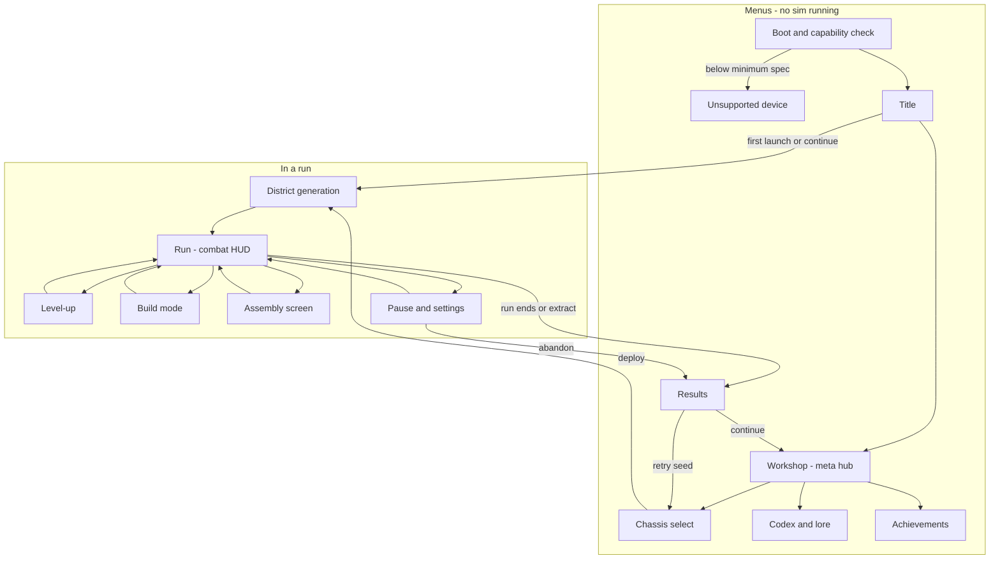
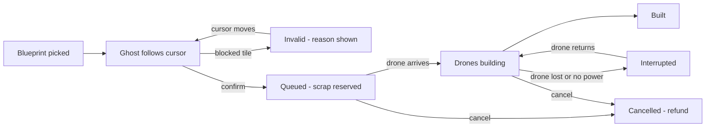

# SCRAPWAKE: UX Flows

This doc specifies every SCRAPWAKE screen and flow for three input devices: keyboard and mouse (KB/M), gamepad and touch. It covers the screen map, the first-time user experience, HUD, level-up, build mode, Assembly, pause and settings, and results.

Related docs:
- Game rules and tuning are in the [GDD](01-gdd.md).
- Look, palette and ASCII wireframes are in [03-art-audio](03-art-audio.md#hud-wireframes).
- The UI architecture (custom elements, state bridge, CSS rules, input plumbing) is in [engine/07-ui](../engine/07-ui.md).
- All numbers live in [BUDGETS.md](../BUDGETS.md); "e.g." marks an illustrative value.

Spelling is British.

---

## UX principles

1. **Banked, not modal.** Nothing interrupts combat except the player's own choice or a prompt during a lull ([ADR-023](../DECISIONS.md#adr-023-banked-level-ups-and-real-time-building)).
2. **No text walls.** Prompts are at most four words plus a glyph. Lore lives in the Codex.
3. **Every action on every device.** KB/M, gamepad and touch reach the same features; no mechanic is exclusive to one device.
4. **The world never slows for UI.** Build mode has no slow-mo. Only single-player menus pause.
5. **Readable chaos.** The HUD hugs the edges and keeps the centre clear. World-anchored information is drawn in WebGPU ([ADR-006](../DECISIONS.md#adr-006-real-htmlcss-ui)).
6. **Destructive means hold.** Banish, salvage, sell and abandon need a hold-to-confirm with a fill ring.
7. **Back is always safe.** Esc, B and the back gesture close the top-most layer. They never end a run without a hold.

| Surface | Single-player | Co-op ([co-op rules](01-gdd.md#co-op-rules)) |
|---|---|---|
| Level-up, Assembly, pause | Pauses the sim; the paused frame becomes the menu backdrop | World keeps running; a "not paused" banner shows |
| Build mode | Never pauses, no slow-mo | Same |
| Title, meta screens, Results | No sim running | Same |

## Screen map



Settings and the read-only Codex are also reachable from the Title and from Pause.

| Screen | Purpose | Entry | Exit | Layout zones |
|---|---|---|---|---|
| Boot | Capability check, [tier detection](../engine/08-platforms.md#tier-detection), pipeline warm-up | App start | Title, Unsupported | Logo, one progress line |
| Unsupported | Explain the minimum spec ([ADR-020](../DECISIONS.md#adr-020-minimum-spec)) | A boot check fails | Quit; requirements and store links | Message, requirements list, links |
| Title | Start; the first input picks the glyph set | Boot | Continue, New Cycle, Workshop, Codex, Achievements, Settings, Quit (desktop only) | Logo centre, menu left, daily-seed card right |
| Workshop | Spend Sparks on unlocks ([meta progression](01-gdd.md#meta-progression)) | Title, Results | Chassis select, Codex, Achievements, Title | Tabs left, unlock grid centre, detail right, Sparks top, Deploy bottom right; PATCH on a workbench behind |
| Chassis select | Pick Chassis, district, mode, heat tier and an optional seed | Workshop, Results (retry) | District generation; back | Chassis carousel with a PATCH close-up, options column right, Deploy bottom right |
| District generation | Generate the district and warm caches ([BUDGETS: job workers](../BUDGETS.md#job-workers-asynchronous-work)) | Chassis select, Title | Run | District name, seed, PATCH boot animation, progress bar |
| Run | Play | District generation, closing an overlay | Overlays, Results | [HUD](#hud) |
| Level-up | Resolve banked level-ups | Hotkey, badge, auto-open in a lull | Run | [Level-up](#level-up) |
| Build mode | Place ghosts; upgrade, repair and salvage towers | Hotkey, radial, BUILD button | Run | [Build mode](#build-mode) |
| Assembly | Inspect, compare, install and salvage parts | Hotkey, BODY button, part compare | Run | [Assembly screen](#assembly-screen) |
| Pause and settings | Pause, settings, abandon | Pause input, focus loss, app suspend | Run, Results, Title | Menu left, settings tabs right |
| Results | Summary, Sparks, unlocks, stats, seed | Run ends, extract, abandon | Workshop, Chassis select | [Results](#results) |
| Codex | Lore logs, enemy and part entries | Title, Workshop, Pause | Back | Category list left, entry right |
| Achievements | Progress and unlock state | Title, Workshop | Back | Grid with progress bars |

## Default bindings

Every action can be remapped ([pause and settings](#pause-and-settings)). Prompts show the glyphs of the last device used ([input glyph policy](#input-glyph-policy)).

| Action | KB/M | Gamepad (Xbox labels) | Touch |
|---|---|---|---|
| Move | WASD | LS | Floating stick, left zone |
| Aim override | Hold LMB to aim at the cursor (setting: always) | RS; auto-aim resumes on release | Auto-aim; optional twin-stick layout |
| Dash | Space | A | DASH |
| Overclock | Q | RT | OVERCLOCK |
| Interact (cache, part) | E; hold E to compare | X; hold X to compare | Context button above the arc |
| Level-up queue | Tab | Y | Level-up badge |
| Build mode | B, or 1–6 to pick a blueprint | Hold LB for the radial; RB repeats the last blueprint | BUILD opens the bottom sheet |
| Recall | F | D-pad down | RECALL |
| Survey: ranges and assault paths | Hold V | Hold LT | Automatic while the build sheet is open |
| Assembly | I | View | BODY |
| Rotate camera | Z / C | D-pad left / right | Two-finger twist |
| Zoom | Mouse wheel | D-pad up (cycles) | Pinch |
| Back, cancel | Esc, RMB | B | CLOSE buttons, Android back |
| Pause | Esc (when nothing else is open) | Menu | Pause button, top right |

## Title and meta screens

| Screen | KB/M | Gamepad | Touch |
|---|---|---|---|
| Title | Any key or click starts. Then arrows, or Tab + Enter, or click. | Any button starts. Then D-pad and A. | Tap to start, then tap items |
| Workshop | Click tabs and cards; hover for details | LB/RB switch tabs, D-pad moves focus, A buys, Y shows details | Tap tabs; tap a card for details, then BUY |
| Chassis select | Arrows or click to change Chassis; the seed field accepts paste | LB/RB change Chassis, D-pad picks options, A deploys; the seed uses the on-screen keyboard | Swipe Chassis, tap options, DEPLOY |
| Codex, Achievements | Scroll, click | D-pad; LB/RB switch categories | Scroll, tap |

- **Workshop purchases** are single-press. The last purchase can be undone until the next Deploy.
- **District generation** takes no input. It shows one line of flavour text at most, never a text wall.
- **Unsupported** lists the requirements and offers the store and requirements links. It never loops a retry.

## FTUE

The first launch skips the Workshop and Chassis select, and goes from the Title straight into a run with the default kit. The design intent and timing are in the [GDD](01-gdd.md#first-time-user-experience) and [pacing chart](01-gdd.md#pacing-chart); this section covers the UI beats.

**Prompts.**
- Each prompt is at most four words plus a glyph, shown in the prompt rail above the hardpoint strip, with a WebGPU marker on the target.
- One prompt shows at a time, and it clears the moment the action is done.
- An ignored prompt escalates once: the marker pulses, then a beacon appears. It never becomes a modal.
- On touch, the prompt rings the real on-screen button instead of showing a glyph.
- Each learned beat is stored in the meta save and never prompted again. Settings has "Tutorial hints: On / Off / Reset".

| # | Beat | Trigger | Prompt | Teaches | Safety net |
|---|---|---|---|---|---|
| 1 | Reboot as a husk | Run start | None: the optic flickers on and the HUD boots panel by panel, with terminal lines | The HUD is PATCH's terminal | Skippable after the first run |
| 2 | Crawl | Boot done | CRAWL + move glyph (ghost thumb on the stick zone) | Movement | The prompt repeats if the player idles |
| 3 | Find legs | Legs cache in view, with a beacon | ATTACH LEGS + interact glyph | Caches; parts change the body | The cache is guaranteed nearby, within the GDD time target |
| 4 | First weapon | Arm-part cache | None: auto-fire starts, with an "AUTO-FIRE ONLINE" terminal line | Weapons fire on their own | Only a few Mites nearby |
| 5 | First level-up | First level earned | The badge pulses; LEVEL UP + level-up glyph; auto-opens at the next lull | Level-ups are banked | Three simple cards; reroll, skip and banish stay hidden until unlocked |
| 6 | First blueprint | Enough scrap, near the Forge | A pre-placed Rivet Turret ghost; BUILD + build glyph | Ghosts, and drones building in real time | The spot is pre-validated; cancelling is free |
| 7 | First assault siren | First countdown | Siren and composition preview; RETURN TO FORGE, plus a Forge edge arrow | Assaults; the Forge matters | The first assault is small ([director and pacing](01-gdd.md#director-and-pacing)) |
| 8 | Recall | Siren while far from the Forge | RECALL + recall glyph; a channel ring around PATCH | Recall | The Forge shield buys time ([base and towers](01-gdd.md#base-and-towers)) |
| 9 | First Shatter | First time at 0 HP | COLLECT PARTS, with arrows to each part and a countdown ring | Shatter and reboot charges | Explained only when it happens |

## HUD

The layouts are wireframed in [03-art-audio](03-art-audio.md#desktop-combat-hud), with the mobile layout under [mobile landscape](03-art-audio.md#mobile-landscape-combat-hud).

| Element | Shows | Layer | Updates | Mobile |
|---|---|---|---|---|
| Vitals | HP bar with plating pips; reboot charges | DOM | State block | Compact |
| Energy, Overclock | Energy bar; Overclock ready, charging or active | DOM | State block | A ring on the OVERCLOCK button |
| Scrap and level | Scrap balance (currency); level bar (total collected) ([economy](01-gdd.md#economy)) | DOM | State block | Same |
| Level-up badge | Number of banked level-ups | DOM | Event when earned; state block for the count | Button in the right thumb zone |
| Forge | HP; shield state (up, absorbing with a timer, down, recharging); power used and capacity | DOM | State block; shield-down is an event | HP and shield only; power moves to the build sheet |
| Assault | Countdown and composition preview: icons with counts, Prime Breacher, elites, flyers | DOM, plus spawn-side edge markers in WebGPU | Event at siren start, then state block | Icons only |
| Clock, boss bar | Cycle time, boss markers, overtime; boss name, HP and phase ticks | DOM | State block | Same, thinner |
| Hardpoints | HEAD, ARM L, ARM R, BACK, CORE, LEGS: active, jammed, leeched or empty; dash charges | DOM | State block | Hidden (see Assembly) |
| Prompt rail, captions | One contextual prompt; up to two caption lines | DOM | Events | Same |
| Minimap | Forge, PATCH, caches, assault sides | DOM frame, WebGPU content | Every frame | Off by default |
| World-space UI | Health bars, damage numbers, ranges, ghosts, edge threat arrows, the recall ring, interaction markers | WebGPU ([world-space UI](../engine/03-rendering.md#world-space-ui)) | Every frame | Same |

- **Update cadence.** The DOM reads the seqlocked state block ([state bridge](../engine/07-ui.md#state-bridge)) at the HUD refresh rate. One-off events arrive at once via `postMessage` ([BUDGETS: UI constants](../BUDGETS.md#ui-constants), [latency targets](../BUDGETS.md#latency-targets)).
- **Static structure.** Fixed slot pools (a fixed set of composition icons, two caption lines) keep the combat HUD under its node cap ([BUDGETS: UI constants](../BUDGETS.md#ui-constants)). Only `transform` and `opacity` animate ([combat HUD rules](../engine/07-ui.md#combat-hud-rules)). Numbers use monospaced digits, so they never reflow.
- **Edge threat arrows.** Shape encodes the type: a chevron for a group, an icon for a boss or the Prime Breacher, the Forge icon when the base is hit. Colour encodes the family: cyan for enemies, Amber for objectives, Ember with a pulse for critical threats. Size encodes the magnitude.
- **HUD states:**

| State | What changes |
|---|---|
| Normal | Base layout |
| Siren | The assault panel slides in, with a caption |
| Assault | The Forge panel is emphasised |
| Boss | A boss bar appears |
| Shatter | Everything dims except PATCH's scattered parts; collect arrows and a countdown ring appear |
| Low HP | The HP bar gets an Ember hatch and pulse, within the flash limiter |

## Level-up

**Rules.**
- **Banking.** Level-ups bank ([ADR-023](../DECISIONS.md#adr-023-banked-level-ups-and-real-time-building)), and the badge shows the count.
- **Opening.** The player can open the queue at any time. In single-player this pauses the sim.
- **Auto-open.** The queue also opens by itself when the director reports a lull ([director and pacing](01-gdd.md#director-and-pacing)). The setting is On (default), Prompt only, or Off.
- **Deterministic offers.** Offers are rolled from the seeded RNG when a level is earned ([random numbers](../engine/09-determinism-coop.md#random-numbers)). Opening later cannot fish for better cards, and replays stay deterministic.
- **Cards.** Three cards are offered, or four with the meta unlock. A card is a part, a part upgrade, a chip, a tower blueprint or a Forge upgrade ([parts](02-content.md#parts), [chips](02-content.md#chips), [towers](02-content.md#towers)).
- **Card anatomy:**
  - rarity frame and pips, icon, name, type and target slot;
  - stat diffs against whatever it replaces (gains ▲ in Amber, losses ▼ in Concrete 400, never red);
  - fusion progress;
  - scrap and power cost, for blueprints.
- **Close-up.** The paper-doll close-up is the real PATCH model at an integer scale, rendered by the engine into a rect the DOM reserves. The focused card previews on it: a new part is ghosted onto its hardpoint while the replaced part fades, and a chip lights its LED.
- **Reroll, skip, banish.** These are meta unlocks with per-run charges ([meta progression](01-gdd.md#meta-progression)). Banish needs a hold.
- **Chaining.** After a pick, the next banked set slides in. Closing keeps the rest banked.
- **Input guard.** After an auto-open, input is ignored for a short time (e.g. 300 ms). Keys and buttons already held when the screen opened must be released before they count.

| Action | KB/M | Gamepad | Touch |
|---|---|---|---|
| Open | Tab | Y | Level-up badge |
| Focus a card | Hover, arrows | LS, D-pad | Tap: the card expands its diff |
| Pick | Click, or 1–4 | A | PICK on the focused card |
| Reroll | R | X | REROLL |
| Banish | Hold X on the focused card | Hold Y | Long-press BANISH |
| Skip | Backspace | Focus SKIP, then A | SKIP |
| Rotate the close-up | Drag | RS | Drag |
| Close, keep banked | Tab, Esc, RMB | B | CLOSE |

## Build mode

Build mode is real-time: PATCH keeps moving and fighting while ghosts are placed, and there is no slow-mo ([ADR-023](../DECISIONS.md#adr-023-banked-level-ups-and-real-time-building)). The layouts are in [03-art-audio](03-art-audio.md#build-bar-and-radial-menu). Rules and costs are in [base and towers](01-gdd.md#base-and-towers) and [economy](01-gdd.md#economy).

- **Grid.** Ghosts sit on the build grid ([BUDGETS: world constants](../BUDGETS.md#world-constants), e.g. 2×2 m tiles). Dithered grid lines draw only near the cursor.
- **Snap assistance:**
  - The ghost snaps to the nearest valid tile within a small radius.
  - Walls extend lines and close gaps.
  - Directional towers (Flame Vent) face the nearest assault path by default.
- **Survey is always on in build mode.** All tower ranges, the base-field assault paths and power usage are visible.
- **Placement** reserves the scrap and queues the ghost. Forge drones fly out and build in first-in, first-out order, in real time. If construction is interrupted, the ghost shows it and resumes later.
- **Cancel and refund.** A queued ghost refunds in full; a ghost under construction refunds partially.
- **Invalid placement.** The ghost turns grey and hatched, with a cross mark and a one-word reason: BLOCKED, RANGE, SCRAP, POWER or QUEUE. A dry "denied" click plays. Red is never used; that colour is reserved for danger.
- **Tower card.** Selecting a built tower opens a context card with stats and four actions: Upgrade, Repair, Salvage (hold) and Cancel (for queued ghosts).
- **Mk III branch.** At Mk III, two branch cards appear side by side, each with stat diffs and a range preview drawn on the ground.



| Action | KB/M | Gamepad | Touch |
|---|---|---|---|
| Enter | B, or 1–6 picks a blueprint | Hold LB, pick with RS, release | BUILD opens the bottom sheet |
| Aim the ghost | Mouse, snapped to the grid | Snap-cursor on RS, tile by tile, starting at PATCH | Drag a card out; the ghost floats above the finger |
| Rotate | R | X | ROTATE beside the ghost |
| Place | LMB; hold Shift to keep placing | A; the blueprint stays selected | Lift the finger, then OK |
| Wall line | Drag with LMB | Hold A and move the cursor | Drag along the grid, then OK |
| Select a tower or ghost | Click | Cursor on it, then A; or the radial's UPGRADE or REPAIR slot | Tap |
| Cancel the current ghost | RMB | B | CANCEL beside the ghost |
| Exit | B, Esc | B with no ghost selected | Close the sheet |

## Assembly screen

The Assembly screen shows PATCH's body as its loadout ([body as loadout](01-gdd.md#body-as-loadout)). It pauses the sim in single-player. It has two modes:
- **Inspect:** opened with I, View or BODY.
- **Install:** opened by *compare* on a found part. A plain interact installs the part straight from the in-world quick-swap card, without opening this screen.

**Layout.**
- **Centre:** the rotatable PATCH close-up, with callout lines to each slot.
- **Left column:** HEAD, ARM L, ARM R and BACK, with weapon stats.
- **Right column:** CORE, LEGS, the plating track and the six chip sockets.
- **Bottom:** a compare panel (installed vs candidate) and a fusion panel.

**Rules.**
- **Install mode** highlights the compatible hardpoints and shows the diff for each. Confirming salvages the old part automatically, and the scrap it gives is shown before confirming. Declining salvages the candidate instead.
- **Salvage** needs a hold. It is disabled on CORE and LEGS, which can only be swapped, so PATCH can never strip itself back to a husk.
- **Fusion hints:**
  - A max-level part with its matching chip shows "READY: open an elite cache" ([fusions](02-content.md#fusions)).
  - Known recipes that are not ready show what is missing.
  - Undiscovered recipes appear as silhouettes.

| Action | KB/M | Gamepad | Touch |
|---|---|---|---|
| Open | I; hold E on a part | View; hold X on a part | BODY; COMPARE on a part |
| Focus a slot | Hover, click | D-pad; LB/RB switch column | Tap |
| Install on the focused hardpoint | Click INSTALL | A | INSTALL |
| Salvage | Hold X | Hold Y | Long-press SALVAGE |
| Rotate the close-up | Drag | RS | Drag |
| Close | I, Esc | B | CLOSE |

## Pause and settings

**Pause menu:** Resume, Settings, Codex (read-only), Abandon run (hold; goes to Results), Quit to title (writes a checkpoint first, see [save policy](01-gdd.md#save-policy)), and Quit to desktop (desktop builds only).

| Action | KB/M | Gamepad | Touch |
|---|---|---|---|
| Move focus, switch tab | Arrows or Tab; Q/E or click for tabs | D-pad; LB/RB for tabs | Tap |
| Change a value | Left/right arrows, click, drag sliders | D-pad left/right | Tap, drag sliders |
| Rebind an action | Click it, then press the new key | A, then press the new button | Touch layout editor |
| Reset a tab to defaults | Hold R | Hold Y | Long-press RESET |
| Back, resume | Esc | B, Menu | CLOSE, RESUME |

| Tab | Options (default first) | Notes |
|---|---|---|
| Graphics | Performance tier: Auto, `high`, `std`, `mobile` | The heap is sized per tier ([ADR-009](../DECISIONS.md#adr-009-fixed-size-shared-heap)), so a change applies after a restart; mid-run, it applies after the run |
| Graphics | Zoom: default, near, far. Display: borderless, windowed, fullscreen (desktop); resolution follows the window or display. Frame cap: tier target, battery mode (mobile), uncapped (`high` only) | The internal size comes from integer scaling ([resolution and scaling](../engine/04-pixel-art-pipeline.md#resolution-and-scaling)); zoom levels are in [BUDGETS: pixel & camera](../BUDGETS.md#pixel--camera-constants), and frame targets in [BUDGETS: quality tiers](../BUDGETS.md#quality-tiers) |
| Accessibility | UI scale; flash limiter (on); screen shake; reduced motion (follows the OS); colourblind aid (off, protan, deutan, tritan) | Ranges and the limiter are in [BUDGETS: UI constants](../BUDGETS.md#ui-constants). Presets: [colourblind-safe checks](03-art-audio.md#colourblind-safe-checks). Shape coding is always on. |
| Accessibility | Game speed (single-player only); auto-aim: full, assist, off; own VFX opacity; hold or toggle per action | Rules and leaderboard policy: [accessibility](01-gdd.md#accessibility) and [accessibility](../engine/07-ui.md#accessibility) |
| Controls | Remap KB/M and gamepad; touch layout editor (move, resize, opacity, left-handed mirror); stick dead zones; glyph set: Auto or fixed | Conflicts are highlighted, and reset is per device ([input](../engine/07-ui.md#input)) |
| Audio | Master, music, SFX, voice, UI volumes; captions: critical only, all, off; dynamic range: normal, wide, night; mono | Phones default to night range ([mix rules](03-art-audio.md#audio-direction)) |
| Language | UI language; subtitle size | Pixel-font coverage is an [open question](03-art-audio.md#open-questions) |
| Gameplay | Auto-open level-ups: on, prompt only, off; damage numbers: on, crits only, off; always show tower ranges; minimap (desktop on, mobile off); tutorial hints: on, off, reset; pause on focus loss (on) | — |

| Platform | Specifics |
|---|---|
| Steam (Electron) | The overlay is optional ([ADR-021](../DECISIONS.md#adr-021-steam-via-a-thin-ffi-shim)). The pause menu shows the cloud-save state. Achievements go through the shim ([Steam](../engine/08-platforms.md#steam)). |
| Steam Deck | `std` tier by default and Deck glyphs. Seed entry uses the Steam on-screen keyboard (to verify via the shim). Suspend behaves like mobile. |
| Web | A fullscreen button. A tab going to the background pauses the game (`visibilitychange`). The PWA install prompt appears in menus only ([web](../engine/08-platforms.md#web)). |
| iOS, Android | **Suspend:** pause, mute, and write a checkpoint if one is due. **Resume:** the pause screen with a RESUME button and a 3-2-1 countdown; the game never drops straight back into combat. Device loss is recovered underneath ([device loss](../engine/03-rendering.md#device-loss)), and checkpoints follow [saves](../engine/08-platforms.md#saves). The resume target is in [BUDGETS: download & load](../BUDGETS.md#download--load-targets). On Android, the back gesture maps to back or pause, via history entries (to verify in the TWA) ([iOS](../engine/08-platforms.md#ios), [Android](../engine/08-platforms.md#android)). |

## Results

**Entry.** Results opens when the run ends: the Forge falls, or PATCH has no reboot charges left. It also opens on abandon. When the district boss falls, a non-pausing card offers EXTRACT (go to Results) or keep going into overtime ([core loop](01-gdd.md#core-loop)).

**Layout, top to bottom:**
1. **Outcome banner:** Forge held, Forge lost, out of reboots, extracted, or abandoned. Also the district, mode, time and seed.
2. **Sparks earned:** an itemised count-up (menus may animate freely).
3. **Unlocks:** revealed one at a time; skippable.
4. **Final build:** the close-up and the part list.
5. **Stats tabs:** damage by part and tower, kills by type, scrap collected and spent, structures built and lost, buildings collapsed, time near the Forge ([KPIs](01-gdd.md#kpis)).
6. **Seed:** copy the code, or share it (the share sheet on mobile, the clipboard on desktop).

**Buttons:**
- CONTINUE goes to the Workshop.
- RETRY SEED goes to Chassis select with the seed prefilled. Daily Seed runs have no retry.

| Action | KB/M | Gamepad | Touch |
|---|---|---|---|
| Skip the count-up and reveals | Click, Space | A | Tap |
| Switch stats tab | Click, Q/E | LB/RB | Tap tabs |
| Copy or share the seed | Click COPY | Y | SHARE |
| Continue / retry | Enter / R, or click | A / X | Tap |

## Touch specifics

**Orientation and safe areas.**
- Phones are landscape only; portrait shows a rotate prompt.
- The page uses `viewport-fit=cover`, and the HUD root is padded with `env(safe-area-inset-*)`.
- The world renders edge to edge, but no control sits inside an inset.

**Targets.** Every control meets the minimum touch target ([BUDGETS: UI constants](../BUDGETS.md#ui-constants), e.g. 48 CSS px). DASH is the largest button. Adjacent targets keep a gap between them.

**Thumb zones.**

| Zone | Controls |
|---|---|
| Bottom left | Floating stick |
| Bottom right | DASH, OVERCLOCK, BUILD, RECALL, context button |
| Right middle | Level-up badge, BODY |
| Top | Read-only info |
| Top-right corner | Pause |

**Floating stick.** It spawns where the thumb lands inside the left zone and re-anchors if the thumb drifts past its radius. It is a DOM element moved with `transform` only.

**Gestures.**
- Pinch snaps between the zoom levels, and a two-finger twist rotates the camera.
- Long-press is the hold action.
- In combat there are no swipes except on the build sheet.

**Hygiene.** The game surface sets `touch-action: none` and `user-select: none`, blocks double-tap zoom, and uses pointer events.

**Haptics.** Android uses `navigator.vibrate` and iOS goes through the host bridge (both to verify). A setting turns haptics off.

## Gamepad specifics

**Focus navigation model.**
- Spatial navigation works within focus scopes, and the top-most layer traps focus.
- Each screen remembers its last focus.
- The focus ring is a 2 px Amber chamfer, static in combat.
- A confirms and B goes back. LB/RB switch tabs and LT/RT page. Menu pauses and View opens Assembly.

**Steam Deck (1280×800, 16:10).**
- The extra height gives the composition preview a full row.
- At default zoom the internal size follows [BUDGETS](../BUDGETS.md#pixel--camera-constants) (e.g. 427×267).
- The UI scale defaults above 100% for legibility (Deck Verified text-size criteria to verify).
- Touching the screen switches the glyph set to touch.

**Rumble.** Dual-rumble effects (browser support to verify) play for dash, heavy hits, nearby collapses, the siren start and a Shatter. A setting scales the intensity.

**Disconnect.** In single-player the game pauses with "Reconnect controller". Any device can resume.

## Mouse and keyboard specifics

- **Cursor.**
  - In combat: a hardware cursor with a custom pixel crosshair, for the lowest latency.
  - In build mode: a build reticle.
  - In menus: the system cursor.
- **Pointer lock** is never used.
- **Hover tooltips** appear in menus after a short delay. Combat has none, except in build mode.
- **Esc** closes the top-most layer, and opens Pause when nothing else is open. RMB is cancel in build mode and menus.
- **Keyboard-only menus** use arrows or Tab and Enter, with the same focus ring as the gamepad.
- **Bindings** use `KeyboardEvent.code` (physical keys), so AZERTY and QWERTZ work. Glyphs show the layout's labels via `navigator.keyboard.getLayoutMap()` where available (to verify in Safari and Firefox).
- **Focus loss** (Alt-Tab) pauses a single-player game (setting).

## Input glyph policy

Prompts reference *actions*, never keys, so remapping updates every glyph.

**Glyph sets:**
- keyboard and mouse;
- Xbox;
- PlayStation;
- Nintendo, which swaps the A/B positions;
- Steam Deck;
- touch, which shows no glyphs and instead rings the on-screen button.

**Switching.** The last *meaningful* input wins: a key or button press, a stick past its dead zone, a mouse move beyond a few pixels, or a touch start. Stick drift and mouse jitter never switch sets. Mixed input, such as a gamepad plus the mouse, is fine; prompts follow the last one used.

**Detection.**
- The pad family comes from `Gamepad.id` vendor IDs, cached when `gamepadconnected` fires. Formats differ per browser (to verify in M1).
- On Steam, the shim's controller type and Deck check take precedence ([Steam](../engine/08-platforms.md#steam)).
- Settings can pin a glyph set.

```js
// @ts-check
/** @typedef {'kbm' | 'xbox' | 'ps' | 'nintendo' | 'deck' | 'touch'} GlyphSet */

/** Main-thread UI (not sim code): the last meaningful input device picks the glyph set. */
export class GlyphPolicy {
  /** @type {GlyphSet} */ current = 'kbm';
  /** @type {GlyphSet | null} */ override = null;   // from settings; null = automatic
  #root;

  /** @param {HTMLElement} root  its data-glyphs attribute drives CSS and glyph sprites */
  constructor(root) { this.#root = root; }

  /**
   * Called only for meaningful input (press, stick past dead zone, real mouse move, touch).
   * @param {GlyphSet} set  for pads: the family cached at `gamepadconnected`
   */
  noteInput(set) {
    const shown = this.override ?? set;
    if (shown === this.current) return;
    this.current = shown;
    this.#root.dataset.glyphs = shown;          // one attribute write; CSS swaps sprites
  }

  /** Vendor-ID heuristics (formats differ per browser; to verify in M1).
   *  @param {string} id  Gamepad.id  @returns {GlyphSet} */
  static padFamily(id) {
    const s = id.toLowerCase();
    if (s.includes('054c')) return 'ps';        // Sony
    if (s.includes('057e')) return 'nintendo';  // Nintendo
    if (s.includes('28de')) return 'deck';      // Valve
    return 'xbox';
  }
}
```

## Exploits & counters

| Exploit | Counter |
|---|---|
| Using the single-player menu pause to study the fight | Allowed as an accessibility feature. Co-op does not pause. |
| Delaying a level-up to fish for better offers | Offers are rolled when the level is earned |
| Mis-picks when auto-open catches a mashed dash or hotbar key | Input guard: held inputs are ignored, plus a short delay |
| Ghost spam to wall off a path instantly | Ghosts are not solid until built, scrap is reserved at placement, and the queue is capped ([base and towers](01-gdd.md#base-and-towers)) |
| Cancel and re-place to move a half-built tower for free | Only a queued ghost refunds in full ([economy](01-gdd.md#economy)) |
| Pausing to dodge a lethal telegraph | Pausing changes nothing in the sim. Resume after a suspend uses a countdown. |

## KPIs

Core game KPIs are in the [GDD](01-gdd.md#kpis). The UX KPIs are:

| KPI | Target |
|---|---|
| First runs that attach legs within the GDD target | ≥ 90% |
| First runs that build a tower before the first assault | ≥ 70% |
| First runs with PATCH at the Forge when the first assault hits | ≥ 80% |
| Median time per level-up pick | ≤ 6 s |
| Invalid placement attempts per placed ghost | ≤ 0.3 |
| Touch mis-taps (taps that land just outside any target) | ≤ 3% |
| Players who pin a glyph set (a sign that detection fails) | ≤ 2% |
| Results screens followed by a new Deploy within 60 s | ≥ 60% |

## Slice vs 1.0

| Area | Vertical slice ([content scope](../VERTICAL-SLICE.md#content-scope)) | 1.0 |
|---|---|---|
| Screens | Boot, Title, a minimal Workshop, Chassis select, Run HUD, Level-up, Build mode, Assembly, Pause with core settings, Results | Adds Codex, Achievements, the Daily Seed flow and full settings |
| Input | KB/M, gamepad (including Deck), touch, with Xbox, PlayStation and keyboard glyphs | Adds Nintendo glyphs, the touch layout editor and the twin-stick touch layout |
| FTUE | All nine beats | Adds Chassis-specific hints |
| Accessibility | UI scale, flash limiter, shake, reduced motion, captions, colourblind presets | Adds game speed and full remapping on every device |

## Open questions

- **Minimap on mobile.** Should it be off by default, or replaced by a Forge compass?
- **Auto-open default.** Is "On" right, or should it be "Prompt only"? Test in the M2′ prototype.
- **Twin-stick touch.** Does anyone want it, or is auto-aim enough?
- **Portrait menus.** Should tablets support portrait menus?
- **Deck detection.** Is the Steam shim reliable in every launch mode, or do we need the `Gamepad.id` fallback?
- **Co-op level-ups.** A co-op player choosing cards while the world runs may need a short grace shield ([co-op rules](01-gdd.md#co-op-rules)).
